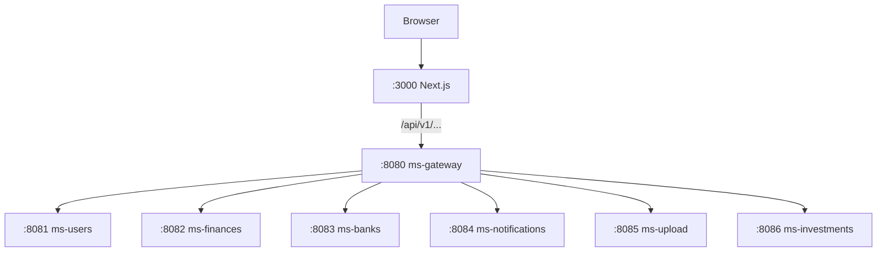
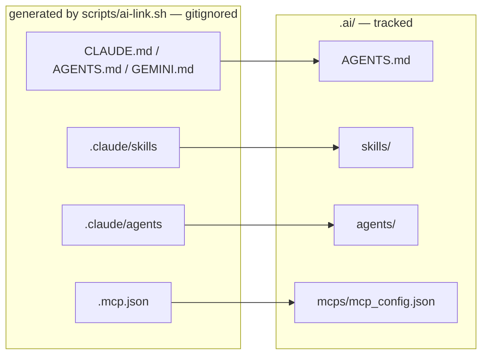

# Architecture

System shape only. Patterns: `.ai/references/APP_STRUCTURE.md`. Per-service: `back/<svc>/.ai/AGENTS.md`.

## Polyrepo topology

Every backend service folder and the frontend folder is its **own standalone git repository**, gitignored by parent.
Branching, committing and CI happen per repo. The parent tracks `docs/`, `.ai/`, `infra/`, `scripts/`, `docker-compose*.yml`, `.env.example`.
`back/financial-app-parent` is the Maven BOM plus commons aggregator (Spring Boot 3.4.2, Spring Cloud 2024.0.1, Java 21). Services inherit managed versions from it. Must be `mvn install`-ed before service builds.

| Module | Contents | Consumed by |
|---|---|---|
| `commons-core` | `ApiResponse` envelope, `ErrorCategory`, `ErrorCode`, `DomainException` base, shared zero-behavior VOs (`IvaTreatment`, `PageResult<T>`) | all 7 services |
| `commons-web` | `ApiExceptionHandler`, `ErrorCategoryHttpMapper`, `CommonErrorCode`, `@ApiErrorCodes`, OpenAPI auto-config | the 6 servlet services |
| `commons-messaging` | CloudEvents Kafka plumbing — outbox ports and VOs, `OutboxRelay`, `IdempotentEventProcessor`, `CloudEventSerde`, DLQ handler | event-driven services |

Shared modules use the same DDD layering, minus layers that cannot apply to a library (no
`web/`, no `application/`). A zero-behavior type needed identically by two or more contexts
with no natural owner lives here; behavior stays in each service.

## Services

| Service | Port | Schema | Domain |
|---|---|---|---|
| ms-gateway | 8080 | — | Spring Cloud Gateway (WebFlux): JWT cookie auth, rate limit, CORS, dashboard/investments BFF aggregation |
| ms-users | 8081 | `users` | Auth: register/login/refresh/logout, JWT, bcrypt |
| ms-finances | 8082 | `finances` | Transactions (account-to-account), categories, ranged summaries, outbox → Kafka |
| ms-banks | 8083 | `banks` | Banks, accounts (CBU), cards, card installments, loans, upcoming payments |
| ms-notifications | 8084 | `notifications` | In-app + email notifications, SSE stream, preferences |
| ms-upload | 8085 | `upload` | Bank statement upload/parse/import, MinIO storage |
| ms-investments | 8086 | `investments` | Holdings, IOL price feed, price history, portfolio P&L |
| front/financial-app | 3000 | — | Next.js 15 / React 19 / TS / Tailwind 4 / shadcn |
| back/financial-app-parent | — | — | Maven BOM + commons modules (not a runtime service) |

## Runtime topology

All `/api/v1/...` traffic enters through the gateway, which validates the JWT cookie,
injects `X-User-Id`, and routes to the owning service. Auth, cookie and CSRF mechanics:
`.ai/references/APP_STRUCTURE.md` § Auth, cookies and CSRF.



It aggregates dashboard data from ms-finances/ms-investments, proxies Swagger docs, and routes SSE streams without timeout.

## Data stores

One PostgreSQL instance, one schema per service (`users`, `finances`, `banks`,
`notifications`, `upload`, `investments`), managed by Flyway with `ddl-auto: validate`. A
service never reads another's schema; cross-service data moves over HTTP or Kafka.

**Kafka** carries async domain events — listeners connect at `kafka:9092` internally,
`localhost:9093` in local dev. Producers publish through the outbox and consumers update
state asynchronously, so balances are eventually consistent with transaction recording.
**MinIO** stores uploaded files such as bank statements.

## Repo layout

```
financial-app/                  parent repo
├── .ai/                        canonical agent context (tracked)
├── back/                       financial-app-parent/ + the 7 ms-* repos, each with .ai/
├── front/financial-app/        Next.js app
├── docs/                       human-readable docs, specs, reports
├── infra/                      traefik/, postgres/, monitoring/
├── scripts/                    dev.sh, deploy.sh, ai-link.sh, github/
├── docker-compose.yml          + .override.yml (dev), .prod.yml
└── .env.example
```

## AI context layer

`.ai/` is the single canonical home for all agent-facing context and is tracked by git.
`.claude/`, root `CLAUDE.md` / `AGENTS.md` / `GEMINI.md` and `.mcp.json` are **generated
symlinks** into `.ai/` — gitignored, produced by `scripts/ai-link.sh`. Run it once after
cloning and again whenever an entry point is added. Never edit a generated path; edit the
`.ai/` file it points at.

Context is two-level. The parent `.ai/` holds rules, architecture and cross-service routing;
each service repo holds its own `.ai/AGENTS.md` plus lazy references, tracked by that repo.
`scripts/ai-link.sh` generates the three entry-point symlinks in all ten repos. A service repo
never copies a global rule — it points at the parent, and the parent workspace is required.

Four references load every session via `@import`; everything else loads on demand, and skills
load when their `description` matches the task. Gemini CLI has no skills or agents discovery —
it receives context solely through root `GEMINI.md`.

Human-readable material (diagrams, rationale, onboarding) lives in `docs/`; `.ai/` is written for
token density. A fact belongs to exactly one of the two, never both.


