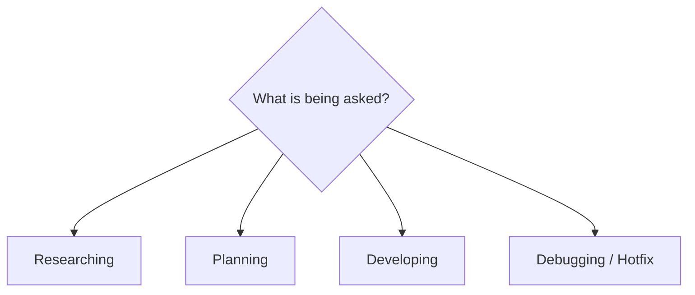

# Workflow

Classify the request as one mode, then follow that mode's numbered steps in order. When a
request spans modes, finish one before starting the next — do not interleave.

**Loading references** appears as step 2 in every mode and always means: the affected repo's
own `README.md`, `.ai/services/<service>.md` for every service touched, and the `.ai/`
references the topic needs. `RULES.md` and `ARCHITECTURE.md` are already loaded.

## Researching

1. Invoke the brainstorming skill before anything else.
2. Load references.
3. Dispatch explore agents across the relevant code areas — read the code, do not assume it
   matches the specs.
4. Read `docs/specs/IDEAS.md` for known bugs, gaps and tech debt touching this area. Never
   silently reintroduce a fixed bug or ignore a known one.
5. Write the spec per `.ai/references/REPORTS_STRUCTURE.md`.
6. Review the spec against the code it describes before handing it over.

## Planning

1. Invoke the planning skill and read the spec.
2. Load references.
3. Use explore agents to find the exact edits required — file and line, not "somewhere in".
4. Surface problems, contradictions and suggested changes to the user **before** writing the
   plan, not inside it.
5. Read `docs/specs/IDEAS.md`.
6. Write the plan per `.ai/references/REPORTS_STRUCTURE.md`, with goals per
   `.ai/references/GOALS_STRUCTURE.md`.
7. Review the plan: every task independently verifiable, every cited line range checked
   against the file.

**Hard requirement.** Every commit message the implementation will make is written into the
plan, following `RULES.md` R14, so the user can edit them before work starts.

## Developing

1. Read the spec.
2. Load references.
3. Branch `<type>/<Name>` from `master` unless told otherwise — `chore` for routine work,
   `feature` for new capability, `hotfix` for defects.
4. Run the tasks in plan order. Steps 5–7 may run between tasks when the change is heavy;
   otherwise once at the end.
5. Compile the modified services.
6. Run all tests with `mvn verify`, per `RULES.md` R16. Never suppress a failure to reach
   green — `RULES.md` R17.
7. Run a context review agent over the whole change, not task by task.
8. Ask the user: merge to `develop`, or open a pull request. Never decide this alone, and
   never `git push` — `RULES.md` R11.
9. Update the service reference and that repo's `README.md` (`RULES.md` R18), then write the
   development report per `.ai/references/REPORTS_STRUCTURE.md`.

**Polyrepo.** One branch per affected repo, created independently — never one branch
spanning repos. Each commit goes in the repo that owns the changed files; parent-repo paths
(`docs/`, `.ai/`, `infra/`, `scripts/`, `docker-compose*`) commit to the parent.

## Debugging / Hotfix

1. Reproduce the failure and capture the exact output. Quote it verbatim; do not paraphrase
   an error.
2. Invoke the systematic-debugging skill.
3. Establish root cause before proposing any fix. A change that makes the symptom disappear
   without an explanation is not a fix.
4. Branch `hotfix/<Name>`.
5. Write the failing test first, and confirm it fails for the expected reason.
6. Fix, then verify per `RULES.md` R16–R17 — never `@Disabled`, skip or tag-exclude.
7. Report: root cause, the fix, and the test that now covers it.
