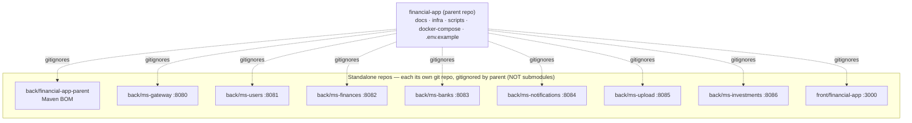

# financial-app

A personal finance platform built for the Argentine market. It tracks transactions, loans, card instalments, bank accounts, and investment holdings. The backend is a set of Java microservices (Spring Boot 3 / Spring Cloud Gateway) communicating over Kafka, backed by a single PostgreSQL instance with per-service schemas and MinIO for file storage. The frontend is a Next.js 15 application that talks exclusively through the gateway.

---

## Polyrepo topology

This repository is the **parent** — it holds orchestration artefacts only (`docs/`, `infra/`, `scripts/`, `docker-compose*`, `.env.example`). Every microservice folder and the frontend folder is its **own standalone git repository**, gitignored by the parent. These are **not** git submodules; the parent does not track service commits.



---

## Repository layout (assembled workspace)

```
financial-app/                          ← parent repo (this one)
├── .env.example                        ← canonical env-var reference
├── docker-compose.yml                  ← canonical PRODUCTION stack (+ always-on monitoring)
├── docker-compose.override.yml         ← dev-only host-port overlay (auto-loaded)
├── scripts/
│   ├── dev.sh                          ← all day-to-day orchestration
│   ├── deploy.sh
│   └── github/                         ← CI/CD ops: apply-rulesets, release, promote, fetch-failure-logs
├── infra/
│   └── postgres/init/                  ← one-time schema bootstrap SQL
├── .ai/                                ← agent context, canonical (scripts/ai-link.sh)
│   ├── AGENTS.md                       ← entry point + reference index
│   ├── references/                     ← RULES, ARCHITECTURE, WORKFLOW, TECH_STACK, …
│   └── skills/                         ← ddd, solid
├── docs/
│   ├── GETTING-STARTED.md
│   └── specs/
│       ├── IDEAS.md                    ← known bugs, gaps, tech debt
│       └── services/
│           ├── ms-gateway.md
│           ├── ms-users.md
│           ├── ms-finances.md
│           ├── ms-banks.md
│           ├── ms-notifications.md
│           ├── ms-upload.md
│           ├── ms-investments.md
│           └── frontend.md
├── back/
│   ├── financial-app-parent/           ← Maven BOM (standalone repo)
│   ├── ms-gateway/                     ← standalone repo
│   ├── ms-users/                       ← standalone repo
│   ├── ms-finances/                    ← standalone repo
│   ├── ms-banks/                       ← standalone repo
│   ├── ms-notifications/               ← standalone repo
│   ├── ms-upload/                      ← standalone repo
│   └── ms-investments/                 ← standalone repo
└── front/
    └── financial-app/                  ← standalone repo (Next.js)
```

---

## Services

| Service | Port | Purpose | Spec |
|---|---|---|---|
| ms-gateway | 8080 | Single entry point — JWT cookie validation, rate limiting, dashboard aggregation, Swagger proxy | [docs/specs/services/ms-gateway.md](docs/specs/services/ms-gateway.md) |
| ms-users | 8081 | Auth — register, login, JWT issuance, HttpOnly cookie management | [docs/specs/services/ms-users.md](docs/specs/services/ms-users.md) |
| ms-finances | 8082 | Transactions, categories, loans, card instalments, Kafka payment-due events | [docs/specs/services/ms-finances.md](docs/specs/services/ms-finances.md) |
| ms-banks | 8083 | Banks and bank accounts, balances | [docs/specs/services/ms-banks.md](docs/specs/services/ms-banks.md) |
| ms-notifications | 8084 | Notification hub — Kafka consumers, SSE stream, email, preferences | [docs/specs/services/ms-notifications.md](docs/specs/services/ms-notifications.md) |
| ms-upload | 8085 | Statement upload — MinIO storage, PDF/CSV parse, preview/confirm | [docs/specs/services/ms-upload.md](docs/specs/services/ms-upload.md) |
| ms-investments | 8086 | Holdings CRUD, IOL live price feed, portfolio P&L, price history | [docs/specs/services/ms-investments.md](docs/specs/services/ms-investments.md) |
| frontend | 3000 | Next.js 15 app — dashboard, transactions, loans, investments pages | [docs/specs/services/frontend.md](docs/specs/services/frontend.md) |

`back/financial-app-parent` is the Maven BOM (Spring Boot 3.4.2, Spring Cloud 2024.0.1, Java 21) — it is infrastructure, not a runtime service.

---

## Quick start

Full setup instructions, repo clone commands, and first-run walkthrough are in **[docs/GETTING-STARTED.md](docs/GETTING-STARTED.md)**.

Short path once all repos are cloned:

```bash
cp .env.example .env
# Edit .env — set POSTGRES_PASSWORD, JWT_SECRET, INTERNAL_AUTH_TOKEN at minimum

./scripts/dev.sh local-all --front
```

That command starts PostgreSQL, Kafka, MinIO, all backend services (Maven hot-reload), and the Next.js dev server.

### Key `dev.sh` commands

| Command | What it does |
|---|---|
| `./scripts/dev.sh local-all` | Start infra + all backend services in the background |
| `./scripts/dev.sh local-all --front` | Same, plus the Next.js dev server |
| `./scripts/dev.sh local-all <svc> [<svc>…]` | Start infra + a specific subset of services |
| `./scripts/dev.sh local <service>` | Start infra + one service in the foreground (hot-reload) |
| `./scripts/dev.sh front` | Start infra + the Next.js dev server |
| `./scripts/dev.sh stop-all` | Stop all locally running Maven service processes |
| `./scripts/dev.sh logs-local [service]` | Tail the local log file for a service |
| `./scripts/dev.sh up` | Docker: build + start everything (ports exposed) |
| `./scripts/dev.sh prod` | Docker: build + start everything (ports hidden) |
| `./scripts/dev.sh down` | Stop and remove Docker containers |
| `./scripts/dev.sh build [service]` | Build a specific Docker image |
| `./scripts/dev.sh logs [service]` | Tail Docker container logs |
| `./scripts/dev.sh help` | Full built-in reference |

---

## Ports and Swagger

| Service | Port | Swagger UI |
|---|---|---|
| ms-gateway | 8080 | http://localhost:8080/swagger-ui.html **(aggregated)** |
| ms-users | 8081 | http://localhost:8081/swagger-ui.html |
| ms-finances | 8082 | http://localhost:8082/swagger-ui.html |
| ms-banks | 8083 | http://localhost:8083/swagger-ui.html |
| ms-notifications | 8084 | http://localhost:8084/swagger-ui.html |
| ms-upload | 8085 | http://localhost:8085/swagger-ui.html |
| ms-investments | 8086 | http://localhost:8086/swagger-ui.html |
| frontend | 3000 | http://localhost:3000 |

The gateway aggregates all per-service Swagger docs at a single URL — use `:8080/swagger-ui.html` when all services are running.

---

## Production launch (single VM)

Monitoring (Prometheus/Grafana/Loki/Promtail) is part of the stack and starts automatically.

```bash
# 1. Fill in .env (copy from .env.example), including:
#    KAFKA_CLUSTER_ID, GRAFANA_ADMIN_PASSWORD, DOMAIN_NAME
# 2. Launch the whole stack (explicit -f bypasses the dev override):
docker compose -f docker-compose.yml --profile app up -d
```

Externally reachable:
- App:      `https://${DOMAIN_NAME}`
- API:      `https://${DOMAIN_NAME}/api`
- Swagger:  `https://${DOMAIN_NAME}/swagger-ui.html` (HTTP basic-auth, enforced by the edge
            stack: `homelab-infra/stacks/edge/dynamic/swagger-auth.yml`)
- Grafana:  `https://${DOMAIN_NAME}/grafana` (login via `GRAFANA_ADMIN_PASSWORD`)

Internal-only (no host ports in prod): Postgres, Kafka, MinIO, Prometheus, Loki.

Dev mode (exposes per-service host ports 8081–8086, plus 9090/3001/3100).
One-time prerequisite: `grafana` joins the external `edge` network, so create it once per
machine before the first `up`:

```bash
docker network create edge     # once per machine; harmless if it already exists
docker compose --profile app up -d
```

---

### CI/CD

Reusable GitHub Actions workflows for all service repos live in `.github/workflows/`.
Branch rulesets in `.github/rulesets/` (apply with `scripts/github/apply-rulesets.sh`).
Promote + release (interactive, parallel, parent-first): `scripts/github/release-manager.sh`
(`promote` = develop→master PR + wait + merge; `release` = dispatch vX.Y.Z). Run with no args for the menu.
Failing-run logs: `scripts/github/fetch-failure-logs.sh` (downloads to `/tmp/ci-logs/`).
See `.ai/references/PIPELINE.md`.

## Documentation

| Document | Description |
|---|---|
| [.ai/AGENTS.md](.ai/AGENTS.md) | Entry point and reference index — start here |
| [.ai/references/ARCHITECTURE.md](.ai/references/ARCHITECTURE.md) | Polyrepo topology, runtime flow, data stores, AI context layer |
| [.ai/references/RULES.md](.ai/references/RULES.md) | Coding conventions and DDD rules (R1–R18) |
| [.ai/references/WORKFLOW.md](.ai/references/WORKFLOW.md) | The four workflow modes, branching, commits |
| [.ai/references/DEPLOYMENT.md](.ai/references/DEPLOYMENT.md) | Docker and production deployment reference |
| [.ai/references/APP_STRUCTURE.md](.ai/references/APP_STRUCTURE.md) | Envelope, exception hierarchy, auth, persistence patterns |
| [docs/GETTING-STARTED.md](docs/GETTING-STARTED.md) | Full setup guide — cloning all repos, env config, first run |
