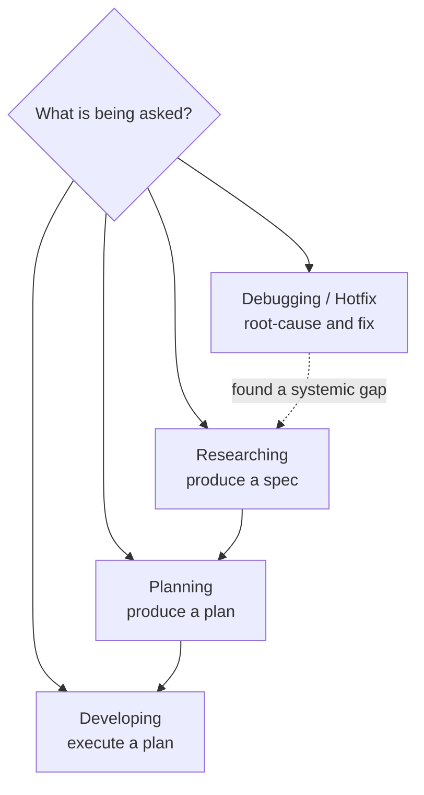
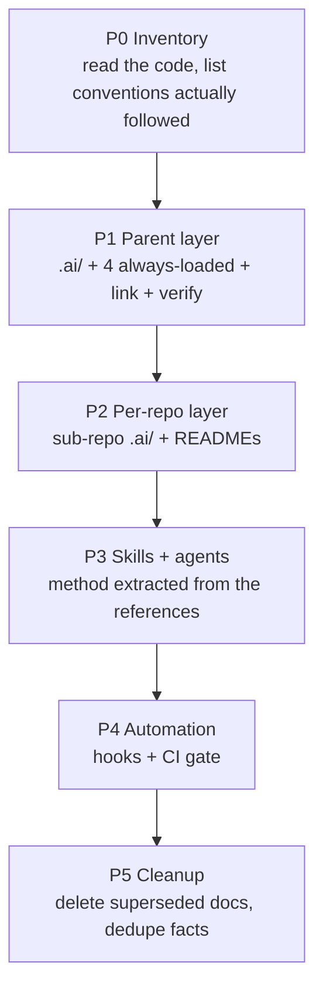

# AI Baseline — Portable Scaffolding for an Agent Context Layer

A stack-agnostic blueprint for the `.ai/` context layer proven in `financial-app`. Copy this
one file into any project, hand it to a capable model with the prompt in § 14, and it produces
the same governance layer adapted to that project's stack.

This document is **the definition**, not a description of one repo. Everything
`financial-app`-specific appears only as a worked example, marked `ex:`.

---

## Contents

| § | Section |
|---|---|
| 1 | Why this exists — the problem it solves |
| 2 | Invariants — the nine non-negotiable design decisions |
| 3 | Directory scaffolding |
| 4 | File contracts — purpose, cap, template per file |
| 5 | RULES definition — universal tier, conditional tier, stack-local slots |
| 6 | WORKFLOW definition — the four modes |
| 7 | GOALS definition |
| 8 | REPORTS definition |
| 9 | Skills and agents |
| 10 | Automation — link, verify, hooks, CI |
| 11 | Bootstrapping order |
| 12 | Adaptation matrix — what changes per project type |
| 13 | Anti-patterns |
| 14 | **The build prompt** — give this to the AI |
| 15 | Acceptance checklist |

---

## 1. Why this exists

Every AI tool wants its own context file (`CLAUDE.md`, `AGENTS.md`, `GEMINI.md`, `.cursorrules`,
`.github/copilot-instructions.md`). Copying content into each produces drift: three files with
three versions of the same rule, and no way to tell which one the model actually read.

Second failure: a single 2000-line context file. Everything loads every session, the token
budget is gone before work starts, and the model can't tell a hard rule from background trivia.

The baseline fixes both:

- **One canonical home** (`.ai/`), tracked by git. Every tool entry point is a **generated
  symlink** into it. Content exists once; drift is structurally impossible.
- **Two loading tiers.** Exactly four always-loaded files under a hard line cap; everything
  else loads on a named trigger.
- **Executable gates.** The structure is verified by a script, not by good intentions.

```mermaid
flowchart LR
    subgraph canonical [".ai/ — tracked by git"]
        A[AGENTS.md<br/>entry point]
        R[references/]
        S[skills/]
        G[agents/]
        M[mcps/]
        H[hooks/]
    end
    subgraph generated ["generated — gitignored"]
        C1[CLAUDE.md]
        C2[AGENTS.md]
        C3[GEMINI.md]
        CS[.claude/skills]
        CA[.claude/agents]
        CH[.claude/hooks]
        MJ[.mcp.json]
    end
    C1 --> A
    C2 --> A
    C3 --> A
    CS --> S
    CA --> G
    CH --> H
    MJ --> M
    A -.->|@import x4| R
```

---

## 2. Invariants

Nine decisions that make the layer work. Change these and you have a different system, not a
variant of this one.

**I1 — One canonical home, generated entry points.**
`.ai/` is tracked. Root `CLAUDE.md` / `AGENTS.md` / `GEMINI.md` / `.mcp.json` / `.claude/*` are
symlinks produced by `scripts/ai-link.sh` and gitignored. Never edit a generated path; edit the
`.ai/` file it points at. Supporting a new tool = one line in the link table, never a content fork.

**I2 — Two loading tiers, hard caps.**
Exactly four files load every session via `@import`: rules, architecture, workflow, tech stack.
Everything else has a *Read when* trigger. Caps are enforced (§ 4); a file at its cap forces a
decision instead of silent bloat.

**I3 — One fact, one home.**
A fact lives in exactly one file. `.ai/` is written for token density (tables, fragments, no
prose warm-up). `docs/` is written for humans (rationale, onboarding, diagrams). Never both.
Cross-reference by path.

**I4 — Rules have stable ids.**
`R1`…`Rn`. Reviews, reports and commit discussions cite the id (`violates R14`) instead of
restating the rule. Ids are never renumbered or reused — retiring a rule leaves a tombstone.

**I5 — Two-level context in a multi-repo project.**
The parent holds global rules, system architecture, cross-service routing. Each sub-repo holds
its own `.ai/AGENTS.md` + lazy references, tracked by that repo. A sub-repo **never copies a
global rule** — it points at the parent and declares the parent workspace required.

**I6 — Skills carry method, references carry facts.**
A reference answers *what is true here*. A skill answers *how to do this kind of work*. Skills
have YAML frontmatter with a `description` written as a trigger sentence, so they auto-load on
relevance.

**I7 — Every mode names its own steps.**
Requests are classified into a fixed small set of modes (§ 6), each a numbered procedure. Modes
are never interleaved in one pass.

**I8 — Goals are observable, verified, and traced.**
A goal is an end state with a verification clause, not a task. The report restates every goal
verbatim with `met` / `not-met` / `partial` and **pasted evidence**. No evidence = not met.

**I9 — Structure is verified by script.**
`scripts/ai-verify.sh` checks caps, dangling links, import count, duplicate rule ids, and
per-repo completeness. Wired into a pre-commit hook and CI. Unverified conventions decay.

---

## 3. Directory scaffolding

```
<project-root>/
├── .ai/                              CANONICAL — tracked
│   ├── AGENTS.md                     entry point; @imports the always-loaded four
│   ├── references/
│   │   ├── RULES.md                  ALWAYS  — R1..Rn, id'd
│   │   ├── ARCHITECTURE.md           ALWAYS  — system shape, topology, data stores
│   │   ├── WORKFLOW.md               ALWAYS  — the modes, numbered
│   │   ├── TECH_STACK.md             ALWAYS  — versions + build/dependency order
│   │   ├── APP_STRUCTURE.md          lazy    — code patterns: controller, error, repo, auth
│   │   ├── PIPELINE.md               lazy    — CI, branch protection, release
│   │   ├── DEPLOYMENT.md             lazy    — compose, env vars, ports, hosts
│   │   ├── SCRIPTS.md                lazy    — index of scripts/, not a manual
│   │   ├── REPORTS_STRUCTURE.md      lazy    — spec / plan / report templates
│   │   └── GOALS_STRUCTURE.md        lazy    — how to write goals
│   ├── services/                     multi-repo only
│   │   ├── MAP.md                    who owns what; what crosses between repos
│   │   └── EXTERNAL.md               third-party contracts
│   ├── skills/<name>/SKILL.md        method, with trigger-sentence frontmatter
│   ├── agents/<name>.md              subagent role definitions
│   ├── hooks/*.sh                    pre-commit / post-commit automation
│   └── mcps/mcp_config.json          MCP servers
├── scripts/
│   ├── ai-link.sh                    generate/refresh symlinks; --check to verify
│   └── ai-verify.sh                  structural gates
├── docs/                             HUMAN-readable — TRACKED, see the gitignore note below
│   ├── GETTING-STARTED.md            onboarding entry
│   ├── specs/IDEAS.md                known bugs, gaps, tech debt — read before planning
│   ├── specs/                        specs and plans
│   └── reports/                      development reports
├── CLAUDE.md  AGENTS.md  GEMINI.md   → symlinks to .ai/AGENTS.md      (gitignored)
├── .mcp.json                         → symlink to .ai/mcps/...        (gitignored)
└── .claude/{skills,agents,hooks}     → symlinks into .ai/             (gitignored)
```

Per sub-repo (multi-repo projects), tracked by that repo:

```
<sub-repo>/
├── .ai/
│   ├── AGENTS.md                     repo-local load-bearing facts + Read-when table
│   └── references/<3-4 files>        the repo's own domain/API/events/routes
├── CLAUDE.md AGENTS.md GEMINI.md     → symlinks to .ai/AGENTS.md      (gitignored)
└── README.md                         human quick-start for someone cloning only this repo
```

`.gitignore` additions — **only the generated paths**:

```
/CLAUDE.md
/AGENTS.md
/GEMINI.md
/.mcp.json
/.claude/
```

**Never ignore `docs/specs/IDEAS.md`, `docs/specs/` or `docs/reports/`.** Two mechanisms depend
on them surviving a clone: deferred work is routed to `IDEAS.md` precisely so it outlives the
session (§ 13), and § 8.3 reports are the audit record. A project that ignores `docs/specs/`
wholesale — a common habit when the directory also collects scratch plans — silently deletes
both. If scratch plans must stay untracked, ignore a dedicated subdirectory
(`docs/specs/scratch/`) and force-track the two that matter:

```
docs/specs/scratch/
!docs/specs/IDEAS.md
```

`ai-verify.sh` gate *IDEAS reachable* (§ 10.2) fails when `IDEAS.md` is ignored or absent.

### 3.1 Migration-only artifacts

If the layer is being retrofitted onto an existing project rather than started clean, P0–P2
produce a coverage matrix — one row per fact moved out of the old docs, marked verified or not —
kept at `.ai/_migration-coverage.md`. It is scaffolding, not part of the layer: the P2-G6 gate
(§ 10.2) fails while any row is unverified, and **P5 deletes the file and the gate together**.
A greenfield project never creates either. Do not copy the gate without the file, or
`ai-verify.sh` fails on a file the blueprint never told you to write.

---

## 4. File contracts

Caps are lines, enforced by `ai-verify.sh`. Tune to project size; keep them *tight enough to
hurt* — the pain is the mechanism.

| File | Tier | Cap | Answers |
|---|---|---|---|
| `.ai/AGENTS.md` | always | 120 | Where am I, what loads, what do I read when, what must I never do |
| `references/RULES.md` | always | 150 | The id'd rules |
| `references/ARCHITECTURE.md` | always | 120 | System shape, components, ports, data stores, repo layout |
| `references/WORKFLOW.md` | always | 100 | The modes and their steps |
| `references/TECH_STACK.md` | always | 60 | Versions, build order, cross-repo build constraints |
| `references/APP_STRUCTURE.md` | lazy | 250 | Code-level patterns to copy |
| `references/PIPELINE.md` | lazy | 100 | CI/release mechanics |
| `references/DEPLOYMENT.md` | lazy | 160 | Runtime/env/ports |
| `references/SCRIPTS.md` | lazy | 100 | Script index |
| `references/REPORTS_STRUCTURE.md` | lazy | 100 | Output templates |
| `references/GOALS_STRUCTURE.md` | lazy | 60 | Goal form and constraints |
| `services/MAP.md` | lazy | 40 | Ownership + cross-repo traffic |
| `services/EXTERNAL.md` | lazy | 80 | Third-party contracts |
| `<sub-repo>/.ai/AGENTS.md` | always in that repo | 70 | Repo-local facts, Read-when, pointer to parent rules |
| `<sub-repo>/.ai/references/*.md` | lazy | per 4.0 | That repo's domain / API / events |

### 4.0 Sub-repo reference caps

Cap each file by name, not as a range — `ai-verify.sh` needs a number per path. The default set,
which covers a backend service, a frontend and a shared library:

| File | Cap | Answers |
|---|---|---|
| `DOMAIN.md` | 180 | aggregates, invariants, the repo's own vocabulary |
| `API.md` | 120 | this repo's endpoints and their contracts |
| `EVENTS.md` | 60 | what it publishes and consumes |
| `ROUTES.md` *(frontend)* | 120 | route tree, layouts, guards |
| `API_CLIENT.md` *(frontend)* | 100 | fetch layer, auth headers, error handling |
| `UI_STATE.md` *(frontend)* | 80 | store/query conventions |
| `COMMONS.md` *(shared lib)* | 120 | what the shared module exposes |

Three to four files per repo. A repo needing a fifth is usually two repos, or the fifth belongs
in a skill.

### 4.1 `.ai/AGENTS.md` template

```markdown
# <project>

<Two or three sentences: what the system is, the stack in one breath, the repo model.>

This file is the entry point for every AI tool. Root `CLAUDE.md`, `AGENTS.md` and
`GEMINI.md` are generated symlinks to it (`scripts/ai-link.sh`).

## Always loaded
@.ai/references/RULES.md
@.ai/references/ARCHITECTURE.md
@.ai/references/WORKFLOW.md
@.ai/references/TECH_STACK.md

These are resident every session. Everything below loads on demand — read it when its
trigger fires, not before.

## Read when
| File | Read when |
|---|---|
| `.ai/references/APP_STRUCTURE.md` | before writing <the patterns it covers> |
| ... | ... |

## Components            <!-- the smallest orientation table: name → port/path/role -->

> **Before reading or editing any file under `<sub-repo>/`, first read
> `<sub-repo>/.ai/AGENTS.md`.** It carries repo-local facts nothing else duplicates.

## Skills and agents     <!-- name → "use for", one line each -->

## Mode
Classify the request as **Researching**, **Planning**, **Developing** or
**Debugging / Hotfix**, then follow that mode's steps in `WORKFLOW.md`. Do not mix modes.

## Non-negotiables
`Rxx` <one clause each — the 3-5 rules whose violation is unrecoverable>.
Full text in `RULES.md`, already loaded. Cite rules by id.

## Elsewhere
Human-readable material lives in `docs/`; start at `docs/GETTING-STARTED.md`.
Known bugs, gaps and tech debt: `docs/specs/IDEAS.md`. Read it before planning anything in
an area you have not touched recently.
```

The `Non-negotiables` block is deliberate redundancy — the only place I3 is relaxed. The rules
whose violation cannot be undone (push, commit, destructive change) are restated at the entry
point because a model that skims must still hit them.

### 4.2 Rule entry format

```markdown
### R<n> — <imperative one-line title>
<Two to four lines: the rule, and the reason only if the reason changes how it's applied.>
✗ <counter-example>  ✓ <example>
```

Deep rules delegate instead of expanding: *"Full definition in the `ddd` skill"*. Keeps
`RULES.md` under cap while the method stays loadable on demand.

---

## 5. RULES definition

Three classes, not two. **Tier A** holds regardless of language, paradigm or domain — copy
verbatim. **Tier B** is sound only in a statically typed, object-or-record-oriented codebase with
an HTTP surface; keep it when that describes the project, and swap it per § 12 when it doesn't.
**Stack-local slots** (§ 5.2) are placeholders filled from the project's actual code.

Number the final set `R1..Rn` in the project's own order. The `Rc` prefix here exists only so
this document can reference a rule without implying its number in your project.

### 5.1a Tier A — universal

| Id | Rule | Essence |
|---|---|---|
| Rc4 | One behavior, one implementation | Needed twice → extract to one shared home. Never copy, never write a drifting second variant. |
| Rc7 | Naming conventions | A table, one row per kind of artifact, with a real example from this codebase. No abbreviations. |
| Rc8 | One language for identifiers | Pick English (usual choice) and hold it in code, tests, migrations, endpoints — even when the product language differs. |
| Rc9 | Comments only on request | Never above a declaration. Never restating code. Contract-level doc on a public boundary when asked. |
| Rc11 | **Never push to the remote** | Stage, commit locally, stop, report. The human controls all pushes. |
| Rc12 | **No co-author trailer** | Commit messages carry no `Co-Authored-By`, ever. |
| Rc13 | **Commit only when asked, on a branch off the base** | Prepare and wait. `<type>/<name>` branched from the base branch; one branch per repo in a polyrepo, never one spanning repos. |
| Rc14 | Conventional commit, subject ≤ 50 chars | `<type>(<scope>): <subject>`, imperative, no trailing period. Body only when the *why* isn't in the diff. |
| Rc15 | **Ask before destructive changes** | Explain, ask, wait: dropping a column/table, removing a consumed field or endpoint, force-push, anything hard to reverse. Per-prompt approval over blanket permission. |
| Rc16 | The full gate is the gate | `<verify command>`, not the fast subset. Must pass on a bare runner with no local infra — use in-memory/embedded/fake doubles. Coverage thresholds enforced per PR. |
| Rc17 | Never suppress a test to reach green | No disable/skip/tag-exclude/warning-suppression to pass a build. Fix the root cause. |
| Rc18 | Update the reference and the README after implementing | The reference is the design record a model reads; the README is the quick-start for a human who clones only this repo. Both, every time. |

Rc11–Rc13, Rc15 are the ones that go in `Non-negotiables`.

### 5.1b Tier B — typed, object-oriented, HTTP-serving projects

Each row states what it assumes. When the assumption fails, § 12 names the replacement; deleting
the row and leaving the slot empty is not an option — that convention still exists in the
project, undocumented.

| Id | Rule | Essence | Assumes |
|---|---|---|---|
| Rc1 | Architecture discipline, always | Every change respects the project's layering/dependency rule. Full definition delegated to a skill. | the project *has* an enforced layering — DDD, hexagonal, clean, or a lint-enforced module graph |
| Rc2 | Class/module design principles as applied *here* | SOLID (or the local equivalent) as this codebase applies it, not as textbooks state it. Delegated to a skill. | class- or module-oriented code |
| Rc3 | Reify concepts, never pass bare primitives | A concept becomes a type the moment it has a rule attached. `ex:` a `String` that must be 22 digits is a `Cbu`. | a type system able to carry the distinction |
| Rc5 | Types are rich and self-validating | Validate in the constructor; expose behavior not getters; no `VO`/`Value`/`Dto` noise suffix; no factory that only delegates. | constructors/factories can reject invalid state |
| Rc6 | No method-per-enum-state | Branch on the value. A predicate per state means every new state edits every existing type. | closed sum types / enums |
| Rc10 | One response/error shape | Every response, success and error, uses the single envelope. Shape defined once in the shared module. | an HTTP or RPC surface |

For a data/ML, scripting or CLI project, Tier B usually collapses to two rules — a pipeline-stage
boundary rule replacing Rc1, and a schema-contract rule replacing Rc10.

### 5.2 Stack-local slots

Fill each from the project. If a slot has no answer, the project has an undecided convention —
that's a finding, not a reason to skip the slot.

| Slot | Fill with |
|---|---|
| Layering | the actual layers + the dependency direction + the mechanical enforcement (`ex:` ArchUnit `LayeredArchitectureTest`) |
| Verify command | `ex: mvn verify` · `npm run verify` · `cargo test --all` · `pytest && mypy && ruff` |
| Envelope | the response/error shape and where it's defined |
| Naming table | one row per artifact kind in this stack |
| Migration naming | `ex: V<n>__<snake_case>.sql` |
| Branch model | base branch, integration branch, branch-name grammar |
| Coverage floor | number + where it's configured |

---

## 6. WORKFLOW definition

Four modes. Classify first, then follow the numbered steps in order. When a request spans
modes, finish one before starting the next — never interleave.



**"Load references"** is step 2 of every mode and always means the same thing: the affected
repo's own `README.md`, the per-component reference for everything touched, and the lazy `.ai/`
references the topic needs. The always-loaded four are already in context.

### Researching → a spec

1. Invoke the brainstorming skill before anything else.
2. Load references.
3. Dispatch explore agents across the relevant code. **Read the code; do not assume it matches
   the specs.**
4. Read `docs/specs/IDEAS.md` for known bugs and debt in this area. Never silently reintroduce
   a fixed bug or ignore a known one.
5. Write the spec per `REPORTS_STRUCTURE.md`.
6. Review the spec against the code it describes before handing it over.

### Planning → a plan

1. Invoke the planning skill and read the spec.
2. Load references.
3. Use explore agents to find the exact edits: file and line, not "somewhere in".
4. Surface problems, contradictions and suggested changes **to the user before writing the
   plan**, not buried inside it.
5. Read `docs/specs/IDEAS.md`.
6. Write the plan per `REPORTS_STRUCTURE.md`, goals per `GOALS_STRUCTURE.md`.
7. Review: every task independently verifiable, every cited line range checked against the file.

**Hard requirement.** Every commit message the implementation will make is written into the
plan (per Rc14) so the human can edit them before work starts.

### Developing → code + a report

1. Read the spec/plan.
2. Load references.
3. Branch `<type>/<name>` from the base branch.
4. Run the tasks in plan order.
5. Build the modified components.
6. Run the full gate (Rc16). Never suppress a failure (Rc17).
7. Run a review agent over the **whole change**, not task by task.
8. Ask the human how to integrate — merge or PR. Never decide alone, never push (Rc11).
9. Update the reference and README (Rc18), then write the development report.

### Debugging / Hotfix

1. Reproduce and capture the exact output. **Quote it verbatim; never paraphrase an error.**
2. Invoke the systematic-debugging skill.
3. Establish root cause before proposing any fix. A change that makes the symptom disappear
   without an explanation is not a fix.
4. Branch `hotfix/<name>`.
5. Write the failing test first; confirm it fails **for the expected reason**.
6. Fix, then verify per Rc16–Rc17.
7. Report: root cause, the fix, the test that now covers it.

---

## 7. GOALS definition

### A goal is not a task

A task is an action taken. A goal is an **observable end state that holds after the tasks run**.
If a reader cannot check it without reading the diff, it is a task wearing a goal's clothes.

- Task: *Add `BudgetRepository`.*
- Goal: *A user can set a monthly cap per category, and the API rejects an over-cap write.*

This matters because every task can be completed while the thing the user asked for still
doesn't work. Goals get checked at the end; tasks are only how you get there.

### Form

```
G<n>. <observable outcome> — Verified by: <command, endpoint, log line or screen>
```

No goal ships without a verification clause. If you cannot name the thing that proves it, it is
not yet a goal — sharpen it until you can.

```
G3. Over-cap writes are rejected with 409 and code BUDGET_EXCEEDED
    — Verified by: <verify command> (BudgetLimitIT), and
      POST /api/v1/finances/transactions over an existing cap returns 409
```

### Constraints

- **3–8 goals per plan.** Fewer → the plan doesn't say what it's for. More → it's two plans.
- **Each independently verifiable.** Verifying one must not require another to have passed.
- **Many-to-many onto tasks — never one goal per task.** One-per-task is a restatement of the
  task list and adds nothing. A real goal spans several tasks; a task often serves several goals.
- **An explicit `Non-goals` list bounds scope.** Name what a reader would reasonably expect and
  is not getting, and why. This is what stops mid-execution scope creep.

### Traceability

The plan states goals. The report restates each **verbatim** with `met` / `not-met` / `partial`
plus pasted evidence — actual output, not a claim. A goal reported `met` with no evidence is not
met. `partial` is legitimate and must say which part is missing and where it was routed (usually
`docs/specs/IDEAS.md`). Silently downgrading a goal to make a report look green is the exact
failure this section exists to prevent.

---

## 8. REPORTS definition

Three output shapes. The first is a reply; the others are files. **Every spec and every plan
carries at least one diagram** — tree, Mermaid flowchart, or ER. A document describing structure
without showing it is incomplete.

### 8.1 Standard reply (the default — most work lands here)

Three short paragraphs, no file: what the issue was · what changed · the result.

### 8.2 Spec / plan → `docs/specs/`

```markdown
# <name>
## Branches and repositories involved     <!-- every repo + its branch -->
## Objective
## Connection to related specs or plans   <!-- link them; an unlinked spec usually duplicates one -->
## Diagrams
## What will be done
## Problems to consider                   <!-- risks, contradictions found in code, decisions needed -->
## Goals                                  <!-- per GOALS_STRUCTURE, incl. Non-goals -->
## Content references needed to implement <!-- exact files an implementer must read -->
```

### 8.3 Development report → `docs/reports/<from_branch>_<type>_<date>_<name>.md`

```markdown
# <name>
## Branches and repositories involved
## Objective
## Connection to plans or specs
## Diagrams
## Goals                                  <!-- verbatim + met/not-met/partial -->
## What was done
## Problems found
## Files and commits touched              <!-- table: Repo | Branch | Commit -->
## Verification evidence                  <!-- PASTED output. Never summarised. -->
## Contract changes                       <!-- endpoints, DTO fields, event schemas, migrations -->
## Follow-ups and deferred work           <!-- routed into docs/specs/IDEAS.md -->
## Results
## Other references
```

An empty `Contract changes` section is a meaningful statement — nothing downstream broke. Leave
the heading in place. The last four sections are what make a report auditable rather than
narrative: a report without evidence and contract changes is a story about work, not a record
of it.

---

## 9. Skills and agents

### 9.1 Skill file

```markdown
---
name: <kebab-case>
description: Use when <trigger phrased as the situation, not the topic> - <what it defines>.
---

## 1. <The rule that constrains everything else>
## 2. <Responsibilities / structure>
## 3. <Naming and placement>
## 4. <Worked example>
## 5. <How it is enforced mechanically>
```

The `description` is the whole retrieval mechanism — write it as the *situation* a model finds
itself in ("Use when designing, reviewing or refactoring any backend service in this repo"), not
as a topic label ("DDD guide"). Topic labels don't fire.

### 9.2 The skill set worth having

| Skill | Covers | Portable? |
|---|---|---|
| architecture (`ex: ddd`) | layers, dependency rule, port/adapter naming, where each class goes | pattern yes, content no |
| design principles (`ex: solid`) | splitting a growing class, placing a new responsibility | mostly yes |
| api (`ex: rest-api`) | endpoint shape, error codes, pagination, response envelope | pattern yes |
| testing (`ex: testing-spring`) | unit vs slice vs integration, doubles, what must not be mocked | pattern yes |
| async/messaging (`ex: event-driven`) | outbox, event envelope, idempotent consumption, DLQ | only if applicable |
| frontend (`ex: frontend-component`) | component/state/data-fetch conventions | only if applicable |

### 9.3 Agents

`.ai/agents/<name>.md` — role, core mandates, verification commands, output format. The three
that pay for themselves:

- **architecture-inspector** — audits layer purity and dependency direction mechanically.
- **security-reviewer** — authz, input validation, secret handling, injection surface.
- **migration-specialist** — schema/contract change safety and reversibility.

---

## 10. Automation

### 10.1 `scripts/ai-link.sh`

Single source of link truth. A table of `target|link` pairs; each is created as a **relative**
symlink. `--check` verifies without writing and exits non-zero on mismatch.

```bash
LINKS=(
  ".ai/AGENTS.md|CLAUDE.md"
  ".ai/AGENTS.md|AGENTS.md"
  ".ai/AGENTS.md|GEMINI.md"
  ".ai/mcps/mcp_config.json|.mcp.json"
  ".ai/skills|.claude/skills"
  ".ai/agents|.claude/agents"
  ".ai/hooks|.claude/hooks"
)
# then, for a polyrepo, the same three entry points inside every sub-repo
```

Rules: relative links (`realpath --relative-to`) so worktrees and containers survive; skip with
a printed `skip` line when the target is absent rather than dangling; idempotent (`ln -sfn`);
run once after cloning and again whenever an entry point is added.

**`.ai/hooks` is two different things and the script must handle both.** The `.claude/hooks`
symlink above serves the *agent tool's* hooks. Git's hooks are not symlinked at all — git reads
`.git/hooks/`, which is untracked, so a linked `.ai/hooks/pre-commit-verify.sh` never runs on
commit. The same script must therefore also do:

```bash
git config core.hooksPath .ai/hooks    # git now runs .ai/hooks/pre-commit directly
```

and the hook file must be named exactly `pre-commit` (no `.sh`, executable bit set) to fire.
`--check` verifies `core.hooksPath` equals `.ai/hooks` and exits non-zero otherwise — without
that check the hook gate is a claim in a document, not a mechanism. `core.hooksPath` is
per-clone local config: every clone runs `ai-link.sh` once, and CI must run the gate as a job
because it will not inherit the hook.

Auto-loading a context filename is a convention each tool implements, not a guarantee. New tool
= new `LINKS` row. A tool with no auto-load convention needs a manual paste — never a content fork.

### 10.2 `scripts/ai-verify.sh`

The gates, executable. Each check prints `ok` / `FAIL` and the script exits non-zero if any failed.

| Gate | Checks | Scope |
|---|---|---|
| Line caps | every capped file exists and is within cap (§ 4, § 4.0) | parent + repos |
| Stale paths | no reference to a path deleted in a restructure | parent + repos |
| Links | `ai-link.sh --check` passes; each entry point resolves to `.ai/AGENTS.md`; `.mcp.json` resolves to a real file; `core.hooksPath` is `.ai/hooks` | parent |
| Entry coherence | `AGENTS.md` declares **exactly four** `@`-imports, and every `@`-path and every relative markdown link in `.ai/**` resolves | parent + repos |
| Rule ids | no rule id defined twice anywhere in `.ai/` | parent |
| IDEAS reachable | `docs/specs/IDEAS.md` exists and is **not** git-ignored (`git check-ignore -q` must fail) | parent |
| Per-repo completeness | every sub-repo has `.ai/AGENTS.md`, its declared references, a `README.md`, and its entry-point links, all untracked where they must be | repos |
| Skill format | every `skills/*/SKILL.md` has YAML frontmatter with `name` + `description`, and the count matches what `AGENTS.md` advertises | parent |
| Agent format | every `agents/*.md` present and non-empty; count matches | parent |
| MCP config | `mcps/mcp_config.json` parses as JSON | parent |
| Hook executability | every `hooks/*` is executable — a non-executable hook fails silently, which is worse than none | parent |
| Migration coverage | *retrofit only* — `.ai/_migration-coverage.md` has zero unverified rows; deleted with the file at P5 (§ 3.1) | parent |

The bottom five are the ones that get left out and are exactly what stops `skills/`, `agents/`
and `mcps/` from rotting: nothing else ever reads those files closely enough to notice a broken
one, because a skill that fails to load fails silently.

`ex:` implementation of the two load-bearing checks:

```bash
check_cap() { local f=$1 cap=$2 n; n=$(wc -l < "$f")
  (( n <= cap )) && pass "$f $n/$cap" || bad "$f $n exceeds $cap"; }

# no rule id defined twice
grep -rhoE '^### R[0-9]+' .ai/ | sort | uniq -d
```

### 10.3 Hooks and CI

- `.ai/hooks/pre-commit` → runs `ai-verify.sh`; blocks the commit on failure.
- `.ai/hooks/post-commit` → warns when code changed but no `.ai/` reference or `README.md` did
  (Rc18 in mechanical form).
- CI job: `scripts/ai-link.sh --check && scripts/ai-verify.sh`. Cheap, and it's the only thing
  that stops the layer rotting once a human stops watching.

**Filenames are load-bearing.** Git runs `<hooksPath>/pre-commit` and nothing else — a file
called `pre-commit-verify.sh` is documentation, not a hook, no matter how correct its contents.
Either name the files exactly `pre-commit` / `post-commit`, or keep descriptive names and add
two-line dispatchers with the exact names that `exec` them. Both must be executable.

**Neither is real until you have seen it fail.** Break a line cap on purpose; the commit must be
rejected and the CI job must go red. Until both have been observed, the layer has documented
gates and no enforcement — the most common end state for this baseline, because everything else
is green while nothing is actually being checked.

---

## 11. Bootstrapping order

Sequential — each stage's output is the next stage's input. Do not parallelize P1/P2.



| Stage | Output | Done when |
|---|---|---|
| P0 | a written inventory of conventions **observed in the code**, and the contradictions between them | every stack-local slot in § 5.2 has a filled value or an explicit "undecided" |
| P1 | `.ai/AGENTS.md` + the four always-loaded + `ai-link.sh` + `ai-verify.sh` | `ai-verify.sh` green; all caps met |
| P2 | each sub-repo's `.ai/` + `README.md` | per-repo gate green; no global rule duplicated in a sub-repo |
| P3 | skills + agents | each skill's description is a trigger sentence; each cites its mechanical enforcement |
| P4 | hooks + CI job | `core.hooksPath` set and verified; a deliberately broken cap **observed** failing both the commit and the CI job |
| P5 | superseded docs deleted, `docs/specs/IDEAS.md` seeded (and tracked) with everything found and not fixed, migration-coverage file and its gate removed (§ 3.1) | zero facts living in two places |

P0 is the stage people skip and the reason baselines fail. **Rules must be derived from what the
code does, then reconciled with what it should do.** A rule set invented from the README
describes a project that doesn't exist, and the model will contradict the codebase all day
citing your rules.

---

## 12. Adaptation matrix

| Project shape | Changes |
|---|---|
| **Monorepo, single service** | Drop `.ai/services/`. Drop I5/two-level context. `ARCHITECTURE.md` becomes module map. `ai-link.sh` has no repo loop. |
| **Monorepo, many packages** | Keep two-level, but per-package `.ai/` is tracked by the *same* repo. `services/MAP.md` becomes `packages/MAP.md`. |
| **Polyrepo (this baseline)** | As written. Sub-repos gitignored by parent; parent workspace declared required. |
| **Library, no runtime** | `DEPLOYMENT.md` → `RELEASE.md` (versioning, semver policy, breaking-change rules). `ARCHITECTURE.md` becomes public API surface. |
| **Frontend-only** | Replace layering skill with component/state/data-fetch skill. Replace `APP_STRUCTURE.md` patterns with route/component/store conventions. Gate = typecheck + lint + test + build. |
| **Data / ML** | Add `references/DATA.md` (sources, schemas, lineage) and `EXPERIMENTS.md`. Gate includes reproducibility: pinned seed, pinned data version. |
| **Non-git-hosted / no CI** | Keep `ai-verify.sh` as a manual pre-flight; document it in `SCRIPTS.md` and call it in the workflow's step 5. |

Every row above changes Tier B (§ 5.1b) and nothing else. Constant across all shapes: I1–I4,
I6–I9, the four always-loaded files, **Tier A of the rule set (§ 5.1a)**, the four modes, the
goal form, the report templates.

---

## 13. Anti-patterns

| Anti-pattern | Why it kills the layer |
|---|---|
| Copying content into `CLAUDE.md` *and* `AGENTS.md` | Guaranteed drift. Symlink or nothing (I1). |
| Editing a generated symlink path | The edit lands in the canonical file by luck or is lost. Never touch generated paths. |
| One 2000-line context file | Token budget gone; hard rules indistinguishable from trivia. |
| No caps, or caps never enforced | Every file grows to fill the context. Caps only work when a script fails. |
| Rules invented from the README | Model contradicts the codebase while citing your rules. Do P0. |
| Renumbering rule ids | Every historic report and review comment becomes a lie. |
| Skill `description` written as a topic | Never fires. Write the *situation*. |
| Sub-repo copies a global rule | Two versions of one rule, and the sub-repo's copy is always the stale one. |
| One goal per task | The goals section becomes a restatement of the task list and verifies nothing. |
| `met` with no pasted evidence | The single most common way a report lies. Evidence or `not-met`. |
| Facts in both `.ai/` and `docs/` | They diverge within a month. One fact, one home (I3). |
| Deferred work only in the chat | It dies with the session. Route it to `docs/specs/IDEAS.md`. |
| `docs/specs/` git-ignored | `IDEAS.md` and every report vanish on clone — the backlog dies exactly as if it had stayed in the chat. Ignore a scratch subdirectory instead (§ 3). |
| Hook file not named `pre-commit` | Git runs one filename. `pre-commit-verify.sh` is a document that looks like a gate; nothing ever executes it. |
| Gates written but never seen failing | Green output proves the script ran, not that it can fail. Break a cap on purpose once. |
| Copying Tier B rules into a project whose assumptions fail | The model cites a rule the codebase cannot satisfy, and starts inventing shapes to comply. |

---

## 14. The build prompt

Copy everything in the block below into a fresh session of a capable coding agent, in the target
project's root, with this file present. It assumes nothing else.

````text
You are setting up the AI context layer for this project, following the blueprint in
docs/AI_BASELINE.md. Read that file completely before doing anything else — it is the
specification and it overrides your defaults on every point it covers.

CONTEXT YOU MUST ESTABLISH FIRST (stage P0 — do not skip, do not shortcut):
Do not write a single .ai/ file until P0 is done and I have approved its output.

1. Determine the repo model: single repo, monorepo with packages, or polyrepo with
   gitignored sub-repos. Check .gitignore and look for nested .git directories.
2. Read the build files (pom.xml / package.json / Cargo.toml / pyproject.toml / go.mod),
   the CI workflows, the compose/deploy files, and the existing README(s). Extract exact
   versions and the real build/dependency order.
3. Read enough source to answer, FROM THE CODE and not from documentation:
   - What are the actual layers or module boundaries, and which direction do dependencies
     run? Is that enforced mechanically anywhere (an architecture test, a lint rule, a
     dependency-cruiser config)?
   - What is the naming convention per artifact kind? Produce the table of § 5.1a Rc7 with a
     real example per row taken from this codebase.
   - Which of the § 5.1b Tier B assumptions actually hold here? Name the replacement rule for
     each that does not, per § 12.
   - What is the single response/error shape, if any, and where is it defined?
   - What is the full verification command, and does it pass with no local infrastructure?
   - What is the coverage floor and where is it configured?
   - What is the branch model and the commit-message convention actually used (read
     `git log --oneline -50`)?
   - Migration/versioning naming, if the project has any.
4. Check `git check-ignore -v docs/specs docs/reports`. If either is ignored, STOP and tell me
   before writing anything there — every spec, report and the IDEAS backlog would be untracked
   and would not survive a clone (§ 3).
5. Write the P0 inventory to docs/specs/<date>-ai-baseline-inventory.md:
   (a) every stack-local slot from § 5.2 with its filled value, or the explicit word
   "undecided"; (b) every contradiction you found between two parts of the codebase, or
   between the code and the existing docs. Do not resolve contradictions yourself — list
   them and ask me.
6. STOP. Present the inventory and the contradictions. Wait for my answers.

THEN BUILD, STAGE BY STAGE (P1 → P5 per § 11), stopping after each stage for review:

P1 — Parent layer. Create .ai/ per § 3. Write .ai/AGENTS.md from the § 4.1 template and the
four always-loaded references. RULES.md = all of Tier A (§ 5.1a) verbatim, plus each Tier B
rule (§ 5.1b) whose assumption I confirmed in P0 — replacements per § 12 for the rest — with
every stack-local slot filled from the approved P0 inventory, ids R1..Rn in the § 4.2 format.
Do not carry a Tier B rule whose assumption fails; do not leave its slot empty either.
ARCHITECTURE.md,
WORKFLOW.md (the four modes of § 6, verbatim in structure, with this project's commands),
TECH_STACK.md. Write scripts/ai-link.sh and scripts/ai-verify.sh per § 10, add the generated
paths to .gitignore, run both, and show me the output. Every cap in § 4 must pass.

P2 — Per-repo/per-package layer. For each sub-repo or package: .ai/AGENTS.md (≤70 lines:
purpose, package tree, "load-bearing facts" — the non-obvious things that have bitten
someone, a Read-when table, and a pointer to the parent's rules with NO duplication), its
3-4 lazy references, and a README.md that is a human quick-start for someone who clones
only that repo. Extend ai-link.sh's repo loop and ai-verify.sh's per-repo gate.

P3 — Skills and agents. Per § 9. Extract method from the references you just wrote — the
skill says HOW, the reference says WHAT IS TRUE. Every skill description is a trigger
sentence describing a situation. Every skill names how it is enforced mechanically, or says
explicitly that it is not.

P4 — Automation. Hooks + a CI job running `scripts/ai-link.sh --check && scripts/ai-verify.sh`.
Set `core.hooksPath` to `.ai/hooks` from ai-link.sh and verify it in --check. Name the hook
files exactly `pre-commit` / `post-commit` and chmod +x them — any other name never runs (§ 10.3).
Prove it works: deliberately break a line cap, paste the rejected commit and the red CI job,
then revert. A P4 with no pasted failure output is not done.

P5 — Cleanup. Delete or fold in every doc superseded by .ai/. Delete the migration-coverage
file and its gate (§ 3.1). Enforce § 2 I3: zero facts in two places. Seed docs/specs/IDEAS.md
with everything you found and did not fix, one entry per item, each with a location, and
confirm it is tracked by git.

HARD CONSTRAINTS on your own conduct while doing this:
- Never `git push`. Never add a Co-Authored-By trailer. Do not commit until I ask; when I do,
  branch `<type>/<name>` from the base branch and use conventional commits with a subject
  ≤ 50 chars.
- Explain and wait for my approval before any destructive change, including deleting a doc.
- Derive rules from the code, not from what a well-run project ought to look like. When the
  code and the docs disagree, the code is the fact and the disagreement is a finding.
- Every claim you make about this codebase must be traceable to a file you read. If you did
  not verify it, mark it "unverified" and list it as a question.
- No comment above any declaration you write. No prose warm-up in .ai/ files — tables and
  fragments, written for token density.
- Do not claim a stage is done without pasting the actual command output that proves it.

FINISH by writing a development report to docs/reports/ per § 8.3, with the goals restated
verbatim, each marked met / not-met / partial, and the pasted ai-verify.sh output as evidence.
````

---

## 15. Acceptance checklist

The layer is done when every line is true.

- [ ] `.ai/` tracked; every tool entry point is a gitignored relative symlink into it
- [ ] Exactly four `@`-imports in `.ai/AGENTS.md`, all resolving; the verify gate asserts four
- [ ] Every capped file within cap, parent and sub-repos (§ 4, § 4.0)
- [ ] Every rule has a unique id; no id defined twice anywhere in `.ai/`
- [ ] Every Tier B rule kept is one whose assumption holds here; every one dropped has a
      named replacement, not an empty slot
- [ ] Non-negotiables restated at the entry point (the only permitted duplication)
- [ ] Every lazy reference has a *Read when* trigger in a table
- [ ] Every skill description is a trigger sentence, not a topic label
- [ ] Skills, agents, MCP config and hook executability are each covered by a gate
- [ ] No sub-repo duplicates a global rule; each declares the parent workspace required
- [ ] `git config core.hooksPath` is `.ai/hooks`, `ai-link.sh --check` asserts it, and the hook
      files are named exactly `pre-commit` / `post-commit` and are executable
- [ ] `ai-link.sh --check` and `ai-verify.sh` both green; both run in a hook and in CI
- [ ] A deliberately broken cap was **observed** failing the pre-commit hook and the CI job,
      with the output pasted into the P4 report
- [ ] Zero facts present in both `.ai/` and `docs/`
- [ ] `docs/specs/IDEAS.md` exists, holds every known gap with a location, and
      `git check-ignore -q docs/specs/IDEAS.md` exits non-zero (it is tracked)
- [ ] Migration-coverage file and its gate deleted (retrofit projects only)
- [ ] A fresh session, given only the entry point, can name the base branch, the verify
      command, the four modes, and the four non-negotiables without reading anything else
