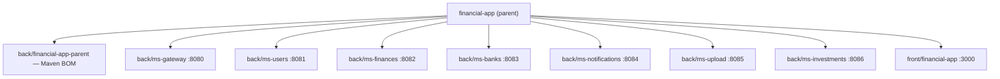

# Getting Started — financial-app

Welcome to the project. This guide gets you from zero to a running local stack in one sitting.
For deep architectural reference see [`docs/specs/00-master.md`](specs/00-master.md).

---

## 1. How the polyrepo is structured

The **parent repo** (this one) contains only orchestration artefacts — it does _not_ contain any
service source code:

| What lives here | Examples |
|---|---|
| Docker Compose files | `docker-compose.yml` (prod canonical + monitoring), `docker-compose.override.yml` (dev host-port overlay) |
| Dev/deploy scripts | `scripts/dev.sh`, `scripts/deploy.sh` |
| Infrastructure config | `infra/postgres/init/`, `infra/kafka/` |
| Documentation | `docs/` |
| Environment template | `.env.example` |

Every microservice and the frontend is a **separate git repository** that must be cloned
into its designated slot inside this parent tree. The parent `.gitignore` marks those slots
so they are never accidentally committed here.

---

## 2. Assemble the polyrepo

Clone the parent first, then clone each service repo into its slot.

### Repo map

| Repo (GitHub) | Clone into |
|---|---|
| `git@github.com:Sergio-Smirnoff/financial-app-back-financial-app-parent.git` | `back/financial-app-parent/` |
| `git@github.com:Sergio-Smirnoff/financial-app-back-ms-gateway.git` | `back/ms-gateway/` |
| `git@github.com:Sergio-Smirnoff/financial-app-back-ms-users.git` | `back/ms-users/` |
| `git@github.com:Sergio-Smirnoff/financial-app-back-ms-finances.git` | `back/ms-finances/` |
| `git@github.com:Sergio-Smirnoff/financial-app-back-ms-banks.git` | `back/ms-banks/` |
| `git@github.com:Sergio-Smirnoff/financial-app-back-ms-notifications.git` | `back/ms-notifications/` |
| `git@github.com:Sergio-Smirnoff/financial-app-back-ms-upload.git` | `back/ms-upload/` |
| `git@github.com:Sergio-Smirnoff/financial-app-back-ms-investments.git` | `back/ms-investments/` |
| `git@github.com:Sergio-Smirnoff/financial-app-front-financial-app.git` | `front/financial-app/` |

### Expected folder tree after assembly

```
financial-app/                          ← parent repo (this one)
├── .env.example
├── .env                                ← you create this (see Section 4)
├── docker-compose.yml
├── docker-compose.override.yml
├── scripts/
│   ├── dev.sh
│   └── deploy.sh
├── infra/
│   └── postgres/init/
├── docs/
│   └── specs/00-master.md
├── back/
│   ├── financial-app-parent/           ← Maven BOM repo
│   ├── ms-gateway/                     ← :8080
│   ├── ms-users/                       ← :8081
│   ├── ms-finances/                    ← :8082
│   ├── ms-banks/                       ← :8083
│   ├── ms-notifications/               ← :8084
│   ├── ms-upload/                      ← :8085
│   └── ms-investments/                 ← :8086
└── front/
    └── financial-app/                  ← :3000  (Next.js)
```



---

## 3. Scripts to know

### `scripts/dev.sh` command reference

All day-to-day orchestration goes through this single script. Run
`./scripts/dev.sh help` at any time for the full built-in reference.

| Command | What it does |
|---|---|
| `./scripts/dev.sh local-all` | Start infra + all default backend services in the background (Maven, hot-reload) |
| `./scripts/dev.sh local-all --front` | Same, plus the Next.js dev server |
| `./scripts/dev.sh local-all <svc> [<svc>…]` | Start infra + a specific subset of services, e.g. `service-finances service-investments gateway` |
| `./scripts/dev.sh local <service>` | Start infra + one service in the foreground |
| `./scripts/dev.sh front` | Start infra + the Next.js dev server |
| `./scripts/dev.sh up` | Docker: build + start everything (microservice ports exposed — dev mode) |
| `./scripts/dev.sh prod` | Docker: build + start everything (ports hidden — production mode) |
| `./scripts/dev.sh down` | Stop and remove Docker containers |
| `./scripts/dev.sh stop-all` | Stop all locally running Maven service processes |
| `./scripts/dev.sh logs-local [service]` | Tail the local log file for a service |
| `./scripts/dev.sh build [service]` | Build a specific Docker image |
| `./scripts/dev.sh logs [service]` | Tail Docker container logs |

### Service name tokens (used with `local` / `local-all`)

`gateway`, `service-users`, `service-finances`, `service-banks`,
`service-notifications`, `service-upload`, `service-investments`, `frontend`

### `.env` setup

Copy the template and fill in your values:

```bash
cp .env.example .env
```

Key variable groups you must review before first run:

| Group | Key variables | Notes |
|---|---|---|
| PostgreSQL | `POSTGRES_USER`, `POSTGRES_PASSWORD` | Default `changeme` — change for any shared environment |
| JWT | `JWT_SECRET` | Must be the same value across all services |
| Inter-service auth | `INTERNAL_AUTH_TOKEN` | Required by ms-investments and other services; startup fails without it |
| Kafka | `KAFKA_BOOTSTRAP_SERVERS` | `dev.sh` overrides this automatically for local Maven runs |
| IOL credentials | `IOL_USERNAME`, `IOL_PASSWORD` | Needed only if working on ms-investments price feeds |

### Port map

| Service | Port | Swagger UI |
|---|---|---|
| ms-gateway | 8080 | http://localhost:8080/swagger-ui.html (aggregated) |
| ms-users | 8081 | http://localhost:8081/swagger-ui.html |
| ms-finances | 8082 | http://localhost:8082/swagger-ui.html |
| ms-banks | 8083 | http://localhost:8083/swagger-ui.html |
| ms-notifications | 8084 | http://localhost:8084/swagger-ui.html |
| ms-upload | 8085 | http://localhost:8085/swagger-ui.html |
| ms-investments | 8086 | http://localhost:8086/swagger-ui.html |
| frontend (Next.js) | 3000 | http://localhost:3000 |

---

## 4. First run — step by step

1. **Clone the parent repo**

   ```bash
   git clone git@github.com:Sergio-Smirnoff/financial-app.git
   cd financial-app
   ```

2. **Clone each service repo into its slot**

   ```bash
   git clone git@github.com:Sergio-Smirnoff/financial-app-back-financial-app-parent.git back/financial-app-parent
   git clone git@github.com:Sergio-Smirnoff/financial-app-back-ms-gateway.git           back/ms-gateway
   git clone git@github.com:Sergio-Smirnoff/financial-app-back-ms-users.git             back/ms-users
   git clone git@github.com:Sergio-Smirnoff/financial-app-back-ms-finances.git          back/ms-finances
   git clone git@github.com:Sergio-Smirnoff/financial-app-back-ms-banks.git             back/ms-banks
   git clone git@github.com:Sergio-Smirnoff/financial-app-back-ms-notifications.git     back/ms-notifications
   git clone git@github.com:Sergio-Smirnoff/financial-app-back-ms-upload.git            back/ms-upload
   git clone git@github.com:Sergio-Smirnoff/financial-app-back-ms-investments.git       back/ms-investments
   git clone git@github.com:Sergio-Smirnoff/financial-app-front-financial-app.git       front/financial-app
   ```

3. **Set up your `.env`**

   ```bash
   cp .env.example .env
   # Open .env and set POSTGRES_PASSWORD, JWT_SECRET, and INTERNAL_AUTH_TOKEN at minimum
   ```

4. **Install frontend dependencies** (only needed once, or after `package.json` changes)

   ```bash
   cd front/financial-app && npm install && cd ../..
   ```

5. **Start the full stack**

   ```bash
   ./scripts/dev.sh local-all --front
   ```

   The script starts PostgreSQL, Kafka, MinIO, all backend services (Maven, hot-reload), and
   the Next.js dev server. The first Maven build takes a few minutes; subsequent starts are faster.

6. **Verify**

   - App: http://localhost:3000
   - Aggregated Swagger: http://localhost:8080/swagger-ui.html
   - Register a user at `/register`, then log in.

---

## 5. Day-to-day tips

- **Work on one service only?** Use `./scripts/dev.sh local <service>` instead of `local-all` — it
  starts infra and only that service in the foreground with hot-reload.
- **Check what is running:** `./scripts/dev.sh logs-local` (no service arg) lists available log
  files; pass a service name to tail it.
- **Stop everything:** `./scripts/dev.sh stop-all` stops Maven processes; `./scripts/dev.sh down`
  tears down Docker infra.
- **Branch workflow:** branch from `master` for each change, develop, then merge into `develop`
  when working. Never commit directly to `master`.
- **Each service is its own repo:** commits, branches, and PRs live inside `back/<service>/` or
  `front/financial-app/` — not in the parent.

---

## 6. Deep reference

Full architecture, domain models, ADRs, and service contracts are in
[`docs/specs/00-master.md`](specs/00-master.md).
