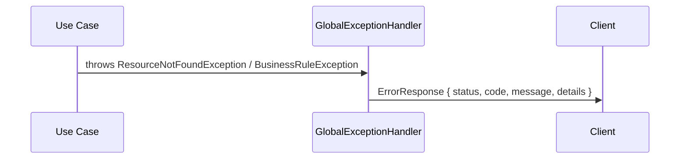
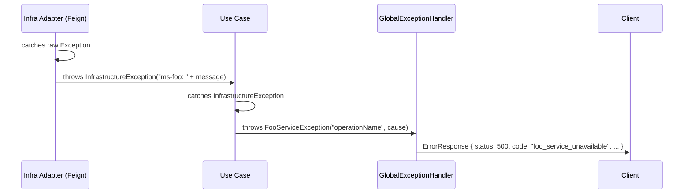
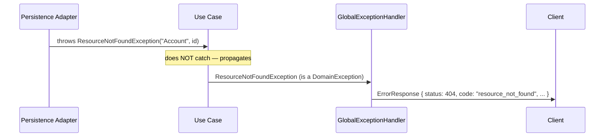

# Exception Handling Pattern

Reference implementation: `back/ms-banks`

---

## Overview

Every failure in a microservice maps to a single `DomainError` enum entry that owns the HTTP status and a stable, machine-readable code string. All domain exceptions extend an abstract `DomainException` carrying that enum entry plus optional key/value details. A single `GlobalExceptionHandler` serialises every error into a uniform `ErrorResponse` shape — no other error shape is returned by any endpoint.

---

## Exception Hierarchy

```
DomainException (abstract)
├── ResourceNotFoundException          — resource absent (404)
├── ResourceAlreadyExistsException     — duplicate resource (409)
├── ResourceConflictException          — mutation blocked by dependents (409)
├── InfrastructureException            — bridge: infra throws this; use case catches it (500)
├── FinancesServiceException           — domain concept; use case throws after catching InfrastructureException (500)
├── InvestmentsServiceException        — domain concept; use case throws after catching InfrastructureException (500)
└── <module>/
    └── <BusinessRuleException>        — e.g. AccountInsufficientFundsException (422)
```

`InfrastructureException` lives in `domain/exception/` — NOT in the infrastructure layer. It is the bridge type that lets an infrastructure adapter signal a failure without importing typed domain service exceptions. Use cases catch `InfrastructureException` and re-throw as a specific typed domain exception (`FinancesServiceException`, `InvestmentsServiceException`, etc.).

---

## Exception Flows

### Flow A — Domain exception (use case throws directly)

A use case detects a domain-level failure and throws a typed exception directly. The handler translates it.



```
Use Case
  → throws ResourceNotFoundException("Account", cbu)
      or throws AccountInsufficientFundsException(cbu, available, requested)
    → GlobalExceptionHandler.handleDomain(DomainException ex)
      → ErrorResponse { status: 404/422, code: "resource_not_found"/"account_insufficient_funds", ... }
```

### Flow B — External service failure (Feign client)

The infrastructure adapter catches raw exceptions and wraps them as `InfrastructureException`. The use case catches `InfrastructureException` and re-throws as a named domain service exception. The handler sees only `DomainException`.



```
Infrastructure adapter (Feign client)
  → catches Exception e
  → throws new InfrastructureException("ms-finances: " + e.getMessage())
    → Use case
      → catches InfrastructureException e
      → throws new FinancesServiceException("getRecentTransactions", e.getMessage())
        → GlobalExceptionHandler.handleDomain(DomainException ex)
          → ErrorResponse { status: 500, code: "finances_service_unavailable", ... }
```

### Flow C — Persistence lookup failure

A persistence adapter implementing a domain repository port throws `ResourceNotFoundException` directly. The use case does NOT catch it — it propagates naturally to the handler.



```
Persistence adapter (implements domain repository port)
  → throws new ResourceNotFoundException("Account", cbu)
    → Use case (does NOT catch — propagates)
      → GlobalExceptionHandler.handleDomain(DomainException ex)
        → ErrorResponse { status: 404, code: "resource_not_found", ... }
```

Persistence adapters CAN throw `ResourceNotFoundException` directly because they implement domain repository contracts and therefore belong conceptually to the domain boundary.

---

## DDD Rules

1. **Infra layer NEVER imports typed domain service exceptions** (`FinancesServiceException`, `InvestmentsServiceException`, etc.). These are domain concepts.
2. **Infra layer CAN import `InfrastructureException`** — it lives in `domain/exception/` and is the designated bridge type.
3. **Use cases catch `InfrastructureException` and re-throw as a typed domain service exception**. They do NOT re-throw `InfrastructureException` raw.
4. **Catch order matters**: `catch (InfrastructureException e)` MUST come before `catch (DomainException e)` because `InfrastructureException extends DomainException`. Reversing the order causes `InfrastructureException` to be silently consumed by the `DomainException` catch before the typed mapping executes.
5. **Persistence adapters implementing domain repository ports** CAN throw `ResourceNotFoundException` directly — they are implementing the domain contract.
6. **Use cases do NOT catch `DomainException` unless they intend to re-throw** (as in Flow B, where they catch `InfrastructureException` specifically and re-raise after the `DomainException` re-throw guard).

> **Warning:** If `InfrastructureException` escapes to the handler unwrapped (DDD Rule violation), it will return `500 internal_error` instead of the expected `500 foo_service_unavailable`. Monitor for `internal_error` codes in production as a signal that an adapter exception mapping is missing.

---

## File Structure

For any microservice `ms-foo`:

```
src/main/java/com/financialapp/foo/
  domain/exception/
    DomainError.java                          ← enum: HTTP status + code string per failure
    DomainException.java                      ← abstract base class
    ResourceNotFoundException.java            ← generic (404)
    ResourceAlreadyExistsException.java       ← generic (409)
    ResourceConflictException.java            ← generic conflict (409)
    InfrastructureException.java              ← bridge type: infra throws, use case catches
    FinancesServiceException.java             ← typed domain service exception (domain/exception/, NOT infra/)
    InvestmentsServiceException.java          ← typed domain service exception (domain/exception/, NOT infra/)
    account/
      AccountInsufficientFundsException.java  ← business rule
      AccountCurrencyMismatchException.java
      AccountInvestmentRestrictionException.java
      AccountInvalidTypeException.java
      InvalidDateRangeException.java
    card/
      CardExpiredException.java
      CardInstallmentAlreadyPaidException.java
      ...
    loan/
      LoanAlreadyClosedException.java
      LoanAccountMismatchException.java
      ...
  web/
    dto/response/
      ErrorResponse.java                      ← error response DTO
    error/
      GlobalExceptionHandler.java             ← @RestControllerAdvice dispatcher
  infrastructure/
    client/
      adapter/
        FinancesClientAdapter.java            ← Feign adapter; throws InfrastructureException only
        InvestmentsClientAdapter.java         ← Feign adapter; throws InfrastructureException only
```

Key layout rules:
- `FinancesServiceException` and `InvestmentsServiceException` are in `domain/exception/`, NOT `infrastructure/exception/`.
- `InfrastructureException` is in `domain/exception/` — despite its name it is a domain bridge type.
- There is no `infrastructure/exception/` package — infra adapters import `InfrastructureException` from the domain layer.

---

## DomainError Enum

The enum is the single source of truth for HTTP status and code string per failure. No HTTP concerns belong at throw sites.

```java
// back/ms-banks — com.financialapp.banks.domain.exception.DomainError
public enum DomainError {

    // Generic
    RESOURCE_NOT_FOUND(HttpStatus.NOT_FOUND, "resource_not_found"),
    RESOURCE_ALREADY_EXISTS(HttpStatus.CONFLICT, "resource_already_exists"),

    // Conflict: resource has dependencies preventing deletion
    BANK_HAS_ACTIVE_ACCOUNTS(HttpStatus.CONFLICT, "bank_has_active_accounts"),
    ACCOUNT_NOT_DELETABLE(HttpStatus.CONFLICT, "account_not_deletable"),
    CARD_NOT_DELETABLE(HttpStatus.CONFLICT, "card_not_deletable"),

    // Account business rules
    ACCOUNT_INSUFFICIENT_FUNDS(HttpStatus.UNPROCESSABLE_ENTITY, "account_insufficient_funds"),
    ACCOUNT_CURRENCY_MISMATCH(HttpStatus.UNPROCESSABLE_ENTITY, "account_currency_mismatch"),
    ACCOUNT_INVESTMENT_RESTRICTION(HttpStatus.UNPROCESSABLE_ENTITY, "account_investment_restriction"),
    ACCOUNT_INVALID_TYPE(HttpStatus.UNPROCESSABLE_ENTITY, "account_invalid_type"),

    // Card business rules
    CARD_EXPIRED(HttpStatus.UNPROCESSABLE_ENTITY, "card_expired"),
    CARD_INSTALLMENT_ALREADY_PAID(HttpStatus.CONFLICT, "card_installment_already_paid"),
    CARD_INSTALLMENT_MISMATCH(HttpStatus.UNPROCESSABLE_ENTITY, "card_installment_mismatch"),
    CARD_INSTALLMENT_NOT_SUPPORTED(HttpStatus.UNPROCESSABLE_ENTITY, "card_installment_not_supported"),
    CARD_INVALID_TYPE(HttpStatus.UNPROCESSABLE_ENTITY, "card_invalid_type"),

    // Loan business rules
    LOAN_ALREADY_CLOSED(HttpStatus.CONFLICT, "loan_already_closed"),
    LOAN_ACCOUNT_MISMATCH(HttpStatus.UNPROCESSABLE_ENTITY, "loan_account_mismatch"),
    LOAN_INSTALLMENT_ALREADY_PAID(HttpStatus.CONFLICT, "loan_installment_already_paid"),
    LOAN_INSTALLMENT_MISMATCH(HttpStatus.UNPROCESSABLE_ENTITY, "loan_installment_mismatch"),

    // Request validation
    INVALID_DATE_RANGE(HttpStatus.BAD_REQUEST, "invalid_date_range"),

    // Infrastructure
    FINANCES_SERVICE_UNAVAILABLE(HttpStatus.INTERNAL_SERVER_ERROR, "finances_service_unavailable"),
    INVESTMENTS_SERVICE_UNAVAILABLE(HttpStatus.INTERNAL_SERVER_ERROR, "investments_service_unavailable"),
    INTERNAL_ERROR(HttpStatus.INTERNAL_SERVER_ERROR, "internal_error");

    private final HttpStatus httpStatus;
    private final String code;

    DomainError(HttpStatus httpStatus, String code) {
        this.httpStatus = httpStatus;
        this.code = code;
    }

    public HttpStatus getHttpStatus() { return httpStatus; }
    public String getCode() { return code; }
}
```

---

## Error Response Contract

Every error from any endpoint returns this JSON shape:

```json
{
  "status": 404,
  "code": "resource_not_found",
  "message": "Account 'CBU1234567890' not found",
  "details": {
    "resourceType": "Account",
    "identifier": "CBU1234567890"
  }
}
```

| Field | Type | Description |
|---|---|---|
| `status` | integer | Mirrors the HTTP status code |
| `code` | string | Stable machine-readable string from `DomainError`; clients can `switch` on this |
| `message` | string | Human-readable; may be shown in UI |
| `details` | object or null | Optional; omitted when not useful; values are primitives/strings only — never nested objects |

`ErrorResponse` uses `@JsonInclude(NON_NULL)` so `details` is absent from the JSON when null.

```java
// back/ms-banks — com.financialapp.banks.web.dto.response.ErrorResponse
@Getter
@Builder
@JsonInclude(JsonInclude.Include.NON_NULL)
public class ErrorResponse {
    private final int status;
    private final String code;
    private final String message;
    private final Map<String, Object> details;
}
```

---

## Real Code Examples from ms-banks

### FinancesClientAdapter — correct adapter pattern

The adapter catches all raw exceptions and wraps them as `InfrastructureException`. It never imports `FinancesServiceException`.

```java
// back/ms-banks — infrastructure/client/adapter/FinancesClientAdapter.java
@Component
@RequiredArgsConstructor
@Slf4j
public class FinancesClientAdapter implements FinancesPort {

    private final FinancesFeignClient client;

    private List<TransactionSummary> fetchAndMap(String accountCbu, Integer limit,
                                                  LocalDate from, LocalDate to) {
        try {
            var response = client.getTransactions(accountCbu, limit, from, to);
            if (response == null || response.getData() == null) return List.of();
            return response.getData().stream()
                    .map(d -> new TransactionSummary(   // map all DTO fields explicitly
                            d.transactionId(), d.accountCbu(),
                            new Money(d.amount(), Currency.getInstance(d.currency())),
                            d.description(), d.category(), d.subcategory(), d.date()))
                    .toList();
        } catch (Exception e) {
            log.error("ms-finances call failed [fetchTransactions] for accountCbu={}: {}",
                      accountCbu, e.getMessage(), e);
            throw new InfrastructureException("ms-finances: " + e.getMessage());
        }
    }
}
```

### GetAccountTransactionsUseCaseImpl — correct use case catch pattern

The use case catches `InfrastructureException` and maps it to the typed domain service exception.

```java
// back/ms-banks — application/account/impl/GetAccountTransactionsUseCaseImpl.java
@Service
@RequiredArgsConstructor
public class GetAccountTransactionsUseCaseImpl implements GetAccountTransactionsUseCase {

    private final FinancesPort financesPort;

    @Override
    public List<TransactionSummary> getRecent(String accountCbu, int limit) {
        try {
            return financesPort.getRecentTransactions(accountCbu, limit);
        } catch (InfrastructureException e) {
            throw new FinancesServiceException("getRecentTransactions", e.getMessage());
        }
    }
}
```

### DeleteAccountUseCaseImpl — catch order for InfrastructureException vs DomainException

When a use case may throw both `InfrastructureException` (to map) and `DomainException` (to re-raise), `InfrastructureException` catch MUST come first because it extends `DomainException`.

```java
// back/ms-banks — application/account/impl/DeleteAccountUseCaseImpl.java
@Override
@Transactional
public void execute(DeleteAccountCommand command) {
    Account account = accountRepository.findByCbuAndBankName(command.cbu(), command.bankName())
            .orElseThrow(() -> new ResourceNotFoundException("Account", command.cbu()));

    if (account instanceof InvestmentAccount) {
        try {
            int holdings = investmentsPort.countHoldings(account.cbu());
            if (holdings > 0) {
                throw new ResourceConflictException(
                    DomainError.ACCOUNT_NOT_DELETABLE,
                    "Cannot delete account '" + command.cbu() + "': investment account has active holdings",
                    Map.of("cbu", command.cbu(), "reason", "active holdings"));
            }
        } catch (InfrastructureException e) {                // ← MUST come first
            throw new InvestmentsServiceException("checkHoldings", e.getMessage());
        } catch (DomainException e) {                        // ← re-raise ResourceConflictException
            throw e;
        }
    }
    // ...
}
```

If the two catch blocks were reversed, `InfrastructureException` (a `DomainException` subtype) would be caught by `catch (DomainException e)` and re-thrown unwrapped, bypassing the `InvestmentsServiceException` mapping entirely.

### AccountControllerIT — IT test pattern for 500 codes

```java
// back/ms-banks — test/web/controller/AccountControllerIT.java
@SpringBootTest
@AutoConfigureMockMvc
@ActiveProfiles("test")
@Transactional
class AccountControllerIT {

    @Autowired MockMvc mockMvc;
    @Autowired ObjectMapper objectMapper;
    @MockBean GetAccountTransactionsUseCase getTransactionsUseCase;

    @Test
    void getTransactions_serviceUnavailable_returns500WithCode() throws Exception {
        when(getTransactionsUseCase.getRecent(eq("CBU1"), eq(5)))
                .thenThrow(new FinancesServiceException("fetchTransactions", "connection refused"));

        mockMvc.perform(get("/api/v1/banks/accounts/CBU1/transactions")
                        .header("X-User-Id", "1")
                        .header("X-Internal-Token", "test-token"))
                .andExpect(status().isInternalServerError())
                .andExpect(jsonPath("$.code").value("finances_service_unavailable"));
    }
}
```

Required headers on every test request: `X-User-Id: 1`, `X-Internal-Token: test-token`.

---

## GlobalExceptionHandler

Dispatches on exception type. All domain exceptions — including `InfrastructureException`, `FinancesServiceException`, etc. — are caught by the single `DomainException` handler because they all extend it.

```java
// back/ms-banks — web/error/GlobalExceptionHandler.java
@Slf4j
@RestControllerAdvice
public class GlobalExceptionHandler {

    private static final Map<String, String> CONSTRAINT_MESSAGES = Map.of(
        "uq_accounts_bank_name", "An account with this name already exists in the selected bank",
        "uq_banks_user_name", "A bank with this name already exists for your user",
        "uq_cards_account_brand_type_last4", "This card is already registered for this account"
    );

    @ExceptionHandler(DomainException.class)
    public ResponseEntity<ErrorResponse> handleDomain(DomainException ex) {
        log.warn("Domain error [{}]: {}", ex.getError().getCode(), ex.getMessage());
        ErrorResponse body = ErrorResponse.builder()
            .status(ex.getError().getHttpStatus().value())
            .code(ex.getError().getCode())
            .message(ex.getMessage())
            .details(ex.getDetails())
            .build();
        return ResponseEntity.status(ex.getError().getHttpStatus()).body(body);
    }

    @ExceptionHandler(MethodArgumentNotValidException.class)
    public ResponseEntity<ErrorResponse> handleValidation(MethodArgumentNotValidException ex) { ... }

    @ExceptionHandler(DataIntegrityViolationException.class)
    public ResponseEntity<ErrorResponse> handleDataIntegrity(DataIntegrityViolationException ex) { ... }

    @ExceptionHandler(Exception.class)
    public ResponseEntity<ErrorResponse> handleGeneric(Exception ex) { ... }
}
```

---

## Adding a New External Service Adapter

Follow these steps when wiring up a new Feign client to an external microservice (e.g. `ms-baz`):

**1. Add a `DomainError` entry**

```java
BAZ_SERVICE_UNAVAILABLE(HttpStatus.INTERNAL_SERVER_ERROR, "baz_service_unavailable"),
```

**2. Create the typed service exception in `domain/exception/`**

```java
// domain/exception/BazServiceException.java
public class BazServiceException extends DomainException {
    public BazServiceException(String operation, String cause) {
        super(DomainError.BAZ_SERVICE_UNAVAILABLE,
              "ms-baz unavailable during operation '" + operation + "'",
              Map.of("operation", operation, "cause", cause != null ? cause : "unknown"));
    }
}
```

**3. Write the infrastructure adapter — throw `InfrastructureException` only**

```java
// infrastructure/client/adapter/BazClientAdapter.java
@Override
public SomeResult callBaz(String param) {
    try {
        return client.callBaz(param);
    } catch (Exception e) {
        log.error("ms-baz call failed [callBaz]: {}", e.getMessage(), e);
        throw new InfrastructureException("ms-baz: " + e.getMessage());
    }
}
```

**4. Map `InfrastructureException` to `BazServiceException` in the use case**

```java
try {
    return bazPort.callBaz(param);
} catch (InfrastructureException e) {
    throw new BazServiceException("callBaz", e.getMessage());
}
```

**5. Write the IT test**

```java
@Test
void someEndpoint_bazUnavailable_returns500WithCode() throws Exception {
    when(someUseCase.execute(any()))
        .thenThrow(new BazServiceException("callBaz", "connection refused"));

    mockMvc.perform(get("/api/v1/foo/endpoint")
            .header("X-User-Id", "1")
            .header("X-Internal-Token", "test-token"))
        .andExpect(status().isInternalServerError())
        .andExpect(jsonPath("$.code").value("baz_service_unavailable"));
}
```

---

## Exception Selection Guide

```
Is the resource simply absent (lookup returned nothing)?
  → ResourceNotFoundException("EntityType", identifier)
     — Flow C: persistence adapter throws directly; use case does NOT catch

Does a unique constraint prevent creation?
  → ResourceAlreadyExistsException("EntityType", identifier)

Is a delete or mutation blocked by dependent data?
  → ResourceConflictException(DomainError.FOO_HAS_ACTIVE_BARS, message, details)

Is it a domain rule violation on the entity itself (invalid state, constraint)?
  → Typed exception from domain/exception/<module>/
     e.g. AccountInsufficientFundsException, CardExpiredException

Did an infrastructure/Feign call fail?
  Inside the adapter:
    → throw new InfrastructureException("ms-foo: " + e.getMessage())
  Inside the use case (catches InfrastructureException):
    → throw new FooServiceException("operationName", e.getMessage())
  NEVER: adapter throws FooServiceException directly
  NEVER: use case re-throws InfrastructureException unwrapped

Did @Valid fail on a request body?
  → No action needed — GlobalExceptionHandler catches MethodArgumentNotValidException automatically
     Returns: { status: 400, code: "validation_error", details: { fields: [...] } }

Did a DB unique constraint fire (DataIntegrityViolationException)?
  → No action needed — GlobalExceptionHandler.handleDataIntegrity catches it automatically
  → Returns 409 database_conflict with the constraint name in details
  → To return a friendlier message, add the constraint name to CONSTRAINT_MESSAGES in GlobalExceptionHandler

Is it an unexpected runtime failure with no domain meaning?
  → Do not throw — let it bubble to GlobalExceptionHandler.handleGeneric
     Returns: { status: 500, code: "internal_error" }
```
