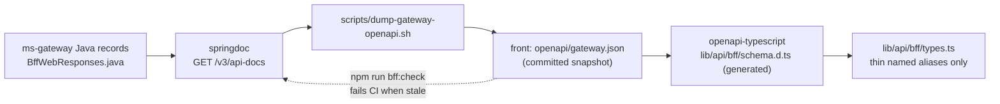

# Wave 3.5 · Plan 01 — Generated BFF types and drift gate

## Branches and repositories involved

- Parent repo: `chore/wave35-seed-and-capture`
- `front/financial-app`: `chore/wave35-bff-types-generated`

## Objective

Make `ms-gateway`'s Java records the mechanical source of truth for the frontend's BFF types, replacing hand-written interfaces with types generated from OpenAPI 3 spec snapshots, and enforcing a CI gate to prevent contract drift.

## Connection to plans or specs

- Implements: [docs/superpowers/plans/2026-08-10-wave35-01-generated-types.md](file:///home/ssmirnoff/Documents/proyects/financial-app/docs/superpowers/plans/2026-08-10-wave35-01-generated-types.md)
- Spec: [docs/specs/2026-08-10-wave3.5-bff-reconciliation.md](file:///home/ssmirnoff/Documents/proyects/financial-app/docs/specs/2026-08-10-wave3.5-bff-reconciliation.md)

## Diagrams



## Goals

- **G1**: Front BFF types are generated from the gateway, and drift fails a command — `met`.

## What was done

1. Created `scripts/dump-gateway-openapi.sh` in the parent repository to pull `/v3/api-docs` from `ms-gateway` into `front/financial-app/openapi/gateway.json` with sorted keys (`jq -S`). Verified all 9 `*BffResponse` schemas are present and confirmed zero `unknown` schema leakage.
2. Installed `openapi-typescript` devDependency in `front/financial-app`. Added `bff:types` and `bff:check` scripts to `package.json`.
3. Generated `front/financial-app/lib/api/bff/schema.d.ts`.
4. Rewrote `front/financial-app/lib/api/bff/types.ts` as thin aliases pointing to `components['schemas']['*BffResponse']`.
5. Created `front/financial-app/lib/api/bff/__tests__/types.contract.test.ts` to assert that the TypeScript aliases mirror the gateway contract.
6. Updated parent CI workflow `.github/workflows/frontend-ci.yml` to run `npm run bff:check` before linting.
7. Documented the generation workflow and scripts in `.ai/references/API_CLIENT.md` and `.ai/references/SCRIPTS.md`.

## Problems found

1. Springdoc OpenAPI was returning only `/api/v1/dashboard/data` when using default container image; rebuilt `ms-gateway` image locally to include all 9 BFF controllers.
2. `x-drift` OpenAPI vendor extensions are ignored by `openapi-typescript`. Testing type modification (e.g. changing property `label.type` from `"string"` to `"number"`) reliably triggers `diff` failure in `bff:check`.

## Files and commits touched

| Repo | Branch | Commit | Description |
|---|---|---|---|
| Parent | `chore/wave35-seed-and-capture` | `8e0fd29` | `chore(scripts): add gateway OpenAPI dump script` |
| Parent | `chore/wave35-seed-and-capture` | `9b50f7f` | `ci(github): wire bff:check into frontend CI workflow` |
| Parent | `chore/wave35-seed-and-capture` | `0299f8d` | `docs(references): document dump-gateway-openapi.sh in SCRIPTS.md` |
| `front/financial-app` | `chore/wave35-bff-types-generated` | `8180192` | `chore(front): commit gateway OpenAPI contract snapshot` |
| `front/financial-app` | `chore/wave35-bff-types-generated` | `ca0632b` | `build(front): generate BFF types from gateway OpenAPI` |
| `front/financial-app` | `chore/wave35-bff-types-generated` | `9d88ad4` | `fix(front): alias BFF types to the generated gateway schema` |
| `front/financial-app` | `chore/wave35-bff-types-generated` | `a3e102f` | `ci(front): document BFF contract generation in API_CLIENT.md` |

## Verification evidence

### 1. `npm run bff:check` against committed snapshot

```
npm notice run financial-app@0.1.0 bff:check
npm notice run openapi-typescript openapi/gateway.json -o /tmp/schema.check.d.ts && diff -q /tmp/schema.check.d.ts lib/api/bff/schema.d.ts
✨ openapi-typescript 7.13.0
🚀 openapi/gateway.json → /tmp/schema.check.d.ts [47.8ms]
Exit code: 0
```

### 2. Drift detection proof (`bff:check`)

Corrupting property type in snapshot:
```
$ jq '.components.schemas.LoanRowResponse.properties.label.type = "number"' openapi/gateway.json > /tmp/drifted.json
$ cp /tmp/drifted.json openapi/gateway.json
$ npm run bff:check; echo "exit=$?"
✨ openapi-typescript 7.13.0
🚀 openapi/gateway.json → /tmp/schema.check.d.ts [50ms]
Files /tmp/schema.check.d.ts and lib/api/bff/schema.d.ts differ
exit=1

$ cp /tmp/gateway.json.bak openapi/gateway.json && npm run bff:check; echo "exit=$?"
exit=0
```

### 3. `lib/api/bff` unit tests

```
 RUN  v4.1.10 /home/ssmirnoff/Documents/proyects/financial-app/front/financial-app

 ✓ lib/api/bff/__tests__/types.contract.test.ts (2 tests) 4ms
 ✓ lib/api/bff/__tests__/overview.test.ts (1 test) 3ms

 Test Files  2 passed (2)
      Tests  3 passed (3)
```

### 4. `npx tsc --noEmit` error count

```
$ npx tsc --noEmit | grep -c "error TS"
148
```
All 148 errors are confined to `components/pages/**` and `lib/hooks/__tests__/**`. Zero errors in `lib/api/bff/**`.

## Contract changes

The table below outlines the true gateway contract vs previous front interfaces:

| Page | Route | Java Gateway Contract (`BffWebResponses.java`) | Legacy Front Contract (`types.ts`) | Status / Delta |
|---|---|---|---|---|
| Resumen | `/api/v1/bff/overview` | `kpis`, `netWorth`, `breakdown`, `flow`, `committed`, `upcomingPayments`, `spendByCategory`, `latestMovements` | `kpis`, `netWorth`, `breakdown`, `flow`, `committed`, `upcomingPayments`, `spendByCategory`, `latestMovements` | Matched |
| Bancos | `/api/v1/bff/bancos` | `kpis`, `accounts`, `cards`, `loans`, `importHealth`, `cashDistribution`, `paymentCalendar` | `summary`, `accounts`, `cards`, `loans` | 3 sections dropped, 1 renamed (`summary` → `kpis`) |
| Movimientos | `/api/v1/bff/movimientos` | `summary`, `page`, `filterOptions`, `uncategorised` | `filters`, `movements` | All renamed / restructured |
| Categorías | `/api/v1/bff/categorias` | `kpis`, `budgets`, `selectedTrend`, `rules` | `categories` | 4 sections vs 1 |
| Inversiones | `/api/v1/bff/inversiones` | `marketStrip`, `kpis`, `evolution`, `positions`, `composition`, `recentOperations`, `alerts` | `summary`, `holdings`, `allocation` | 7 sections vs 3, all renamed |
| Importaciones | `/api/v1/bff/importaciones` | `activeRun`, `history`, `reconciliation` | `history` | 3 sections vs 1 |
| Ajustes | `/api/v1/bff/ajustes` | `profile`, `preferences`, `fees`, `notificationPrefs`, `sessions` | `profile`, `security` | 5 sections vs 2 |
| Búsqueda | `/api/v1/bff/busqueda` | `movements`, `positions`, `categories` | `results` | 3 sections vs 1 |

## Follow-ups and deferred work

- Round B plans (Plans 03–09) will repair page components across `components/pages/**` to resolve the 148 TypeScript errors and consume the real BFF section schemas.

## Results

- Frontend BFF types generated directly from `ms-gateway` OpenAPI schema.
- Drift gate operational in `package.json` and CI workflow.
- Hand-written types in `types.ts` replaced with OpenAPI aliases.

## Other references

- Spec: `docs/specs/2026-08-10-wave3.5-bff-reconciliation.md`
- Plan: `docs/superpowers/plans/2026-08-10-wave35-01-generated-types.md`
