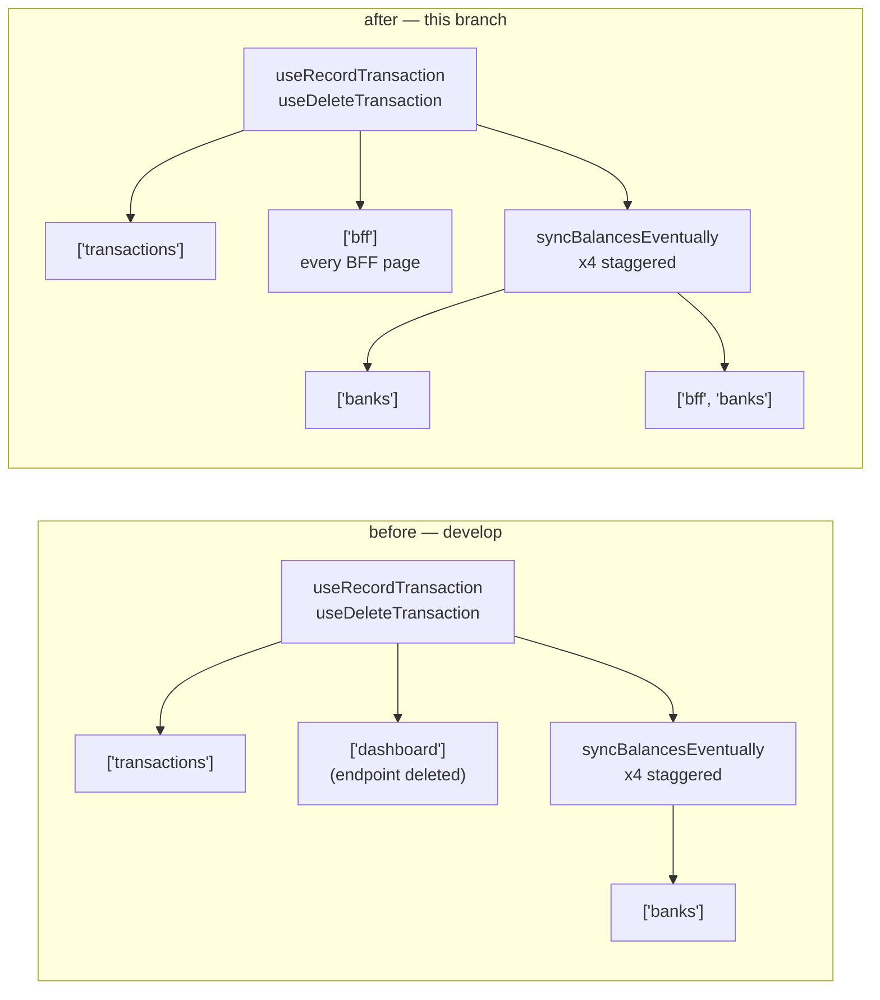

# Wave 4 · Plan 03 — Frontend dead code, `recharts`, stale query keys

## Branches and repositories involved

| Repo | Branch | Base |
|---|---|---|
| `front/financial-app` | `chore/wave4-dead-code-purge` | `develop` |

No other repo was touched. Nothing was pushed (R11). No `Co-Authored-By` trailer (R12).

## Objective

Remove the three unreferenced `components/pages/investments/**` components, drop the
`recharts` dependency they were the sole consumer of, and retarget the two transaction
mutation `onSuccess` invalidations from the deleted `['dashboard']` endpoint key to the
`['bff', …]` keys the redesigned pages actually read.

## Connection to plans or specs

- Plan: `docs/superpowers/plans/2026-08-23-wave4-03-front-dead-code.md`
- Spec: `docs/specs/2026-08-10-wave4-redesign.md` § "Plan 03 — dead code and recharts", G5

Plan 03 is Round A and runs in a different repo from plans 01/02. Plan 06 (Round B) rewrites
`components/pages/investments/**` and starts from the tree this branch leaves behind — the
three deleted files must not be reintroduced.

## Diagrams

What died and what changed, against the plan's declared surface:

```
front/financial-app/
├── components/pages/investments/
│   ├── InvestmentsLayout.tsx ────────DELETED  (117 lines)
│   ├── InvestmentsDashboard.tsx ─────DELETED  ( 96 lines)
│   └── HoldingTypeBreakdown.tsx ─────DELETED  (139 lines, sole recharts importer)
├── package.json ─────────────────────MODIFIED (-1 line: "recharts": "^3.8.1")
├── package-lock.json ────────────────REGENERATED (20 packages removed)
├── lib/hooks/useTransactions.ts ─────MODIFIED (+6 / -3)
└── lib/hooks/__tests__/
    └── useTransactions.test.ts ──────NEW      ( 34 lines)
```

Invalidation fan-out before and after:



## Goals

**G1. The frontend carries no dead investments component and no `recharts`** — **met**.

**G2. No cache invalidation targets the deleted dashboard endpoint, and a recorded or deleted
transaction refreshes every BFF page that shows its effects** — **met**.

**G3. Nothing else changed** — **met**. `git diff develop --stat` touches exactly the seven
paths the plan names (three deletions, `package.json`, `package-lock.json`,
`useTransactions.ts`, the new test) and nothing else.

## What was done

**Task 1 — delete the dead chain.** Re-ran the reference grep on the branch: zero importers
outside the three files themselves. `git rm`'d all three. The only other repo-wide hit was
`tsconfig.tsbuildinfo`, a tracked incremental-build cache, not a code reference.

**Task 2 — remove `recharts`.** Dropped the dependency line from `package.json` and reran
`npm install`; 20 packages left the tree and the lockfile now contains zero `recharts`
occurrences.

**Task 3 — retarget the invalidations (TDD).** Wrote
`lib/hooks/__tests__/useTransactions.test.ts` first and confirmed it failed against the old
code for exactly the predicted reason. Then replaced both `['dashboard']` invalidations with
`['bff']` and made `syncBalancesEventually` invalidate `['banks']` **and** `['bff', 'banks']`
on each of its four staggered ticks. The Kafka-propagation comment above the function is
unchanged.

## Problems found

**`node_modules` was absent.** The frontend repo had no installed dependencies, so
`npm run build` failed with `next: command not found` before any plan work could be gated.
Resolved with `npm ci`, which left `package-lock.json` byte-identical — so no unplanned
lockfile churn entered the Task 1 commit.

**One pre-existing ESLint error blocks `npm run build` and `npm run lint` on `develop`.**
`lib/hooks/__tests__/useOverviewPage.test.tsx:76` trips `react/display-name` with an anonymous
arrow-function wrapper component. This is **not** caused by this plan and is **not** fixable
within it:

- The file is byte-identical to `develop` on this branch —
  `git diff develop --name-only -- lib/hooks/__tests__/useOverviewPage.test.tsx` is empty.
- `git blame` puts the offending line at commit `52d3815b`
  (`feat(front): add overview page query hook`, 2026-08-09), two weeks before this branch.
- Fixing it would touch a file outside the plan's declared surface and break G3.

It is the **only** error in the whole lint run; everything else is a warning. `next build`
reaches `✓ Compiled successfully` and fails only afterwards, in its lint stage — so the
deletions and the `recharts` removal are proven not to break compilation.

## Files and commits touched

| Repo | Branch | Commit |
|---|---|---|
| `front/financial-app` | `chore/wave4-dead-code-purge` | `f4b7048` chore(front): delete unreferenced investments dashboard chain |
| `front/financial-app` | `chore/wave4-dead-code-purge` | `0a87cb7` chore(front): remove recharts, dead since the owned-SVG charts shipped |
| `front/financial-app` | `chore/wave4-dead-code-purge` | `aa91f3f` fix(front): retarget transaction mutation invalidations from dead dashboard key to bff keys |

## Verification evidence

### G1 — no dead component, no dead dependency

Reference grep before deletion (Task 1, Step 2) — the plan's stop-and-report gate:

```
$ grep -rn "InvestmentsLayout\|InvestmentsDashboard\|HoldingTypeBreakdown" \
    --include="*.ts" --include="*.tsx" app/ components/ lib/ \
    | grep -v "components/pages/investments/\(InvestmentsLayout\|InvestmentsDashboard\|HoldingTypeBreakdown\).tsx:"
EXIT=1
```

Zero lines. Repo-wide, only the three files themselves matched (plus the generated
`tsconfig.tsbuildinfo` cache):

```
$ git grep -ln "InvestmentsLayout\|InvestmentsDashboard\|HoldingTypeBreakdown"
components/pages/investments/HoldingTypeBreakdown.tsx
components/pages/investments/InvestmentsDashboard.tsx
components/pages/investments/InvestmentsLayout.tsx
tsconfig.tsbuildinfo
```

After all three tasks:

```
$ npm ls recharts
financial-app@0.1.0 /home/ssmirnoff/Documents/proyects/financial-app/front/financial-app
└── (empty)

$ grep -rn "recharts\|InvestmentsDashboard\|HoldingTypeBreakdown\|InvestmentsLayout" app/ components/ lib/
GREP_EXIT=1        # no matches

$ grep -c "recharts" package-lock.json
0
```

`npm install` after the `package.json` edit:

```
removed 20 packages, and audited 855 packages in 4s
```

Compilation, proving nothing referenced what was deleted:

```
   ▲ Next.js 15.5.12
   Creating an optimized production build ...
 ✓ Compiled successfully in 2.0s
   Linting and checking validity of types ...
```

The build then exits 1 in its lint stage on the pre-existing error documented above:

```
$ npm run build ; echo "BUILD_EXIT=$?"
15: ✓ Compiled successfully in 2.0s
18:Failed to compile.
105:76:10  Error: Component definition is missing display name  react/display-name
BUILD_EXIT=1
```

The referenced file is `lib/hooks/__tests__/useOverviewPage.test.tsx`, untouched by this
branch. No warning or error in the run names any file this plan owns.

### G2 — no invalidation targets the deleted endpoint

Failing test first (Task 3, Step 2), against the unmodified hook:

```
 FAIL  lib/hooks/__tests__/useTransactions.test.ts > useRecordTransaction cache invalidation > invalidates bff page queries, not the deleted dashboard key
AssertionError: expected [ '["transactions"]', '["dashboard"]' ] to include '["bff"]'
 ❯ lib/hooks/__tests__/useTransactions.test.ts:27:18
     26|     expect(keys).toContain(JSON.stringify(['transactions']))
     27|     expect(keys).toContain(JSON.stringify(['bff']))
       |                  ^

 Test Files  1 failed (1)
      Tests  1 failed (1)
```

After the implementation, the full suite:

```
$ npm run test:run ; echo "TEST_EXIT=$?"

 Test Files  49 passed (49)
      Tests  153 passed (153)
   Start at  14:57:14
   Duration  8.40s (transform 3.46s, setup 7.12s, import 41.21s, tests 15.48s, environment 34.97s)
TEST_EXIT=0
```

49 files / 153 tests, up from 48 / 152 on `develop` — the one new test, no regression in any
untouched suite.

No live query key targets the dead endpoint:

```
$ grep -rn "queryKey.*'dashboard'" lib/ app/ components/ --include="*.ts" --include="*.tsx" | grep -v "__tests__"
EXIT=1        # no matches
```

The plan's `grep -n "'dashboard'" lib/ -r` returns exactly one line, and it is the new test's
negative assertion — the assertion that proves the key is gone, not a use of it:

```
lib/hooks/__tests__/useTransactions.test.ts:28:    expect(keys).not.toContain(JSON.stringify(['dashboard']))
```

Resulting hook:

```ts
function syncBalancesEventually(queryClient: ReturnType<typeof useQueryClient>) {
  for (const ms of [300, 1200, 2500, 4500]) {
    setTimeout(() => {
      queryClient.invalidateQueries({ queryKey: ['banks'] })
      queryClient.invalidateQueries({ queryKey: ['bff', 'banks'] })
    }, ms)
  }
}
```

Both `useRecordTransaction` and `useDeleteTransaction` now invalidate `['transactions']` and
`['bff']`, then call `syncBalancesEventually`.

### G3 — nothing else changed

```
$ git diff develop --stat
 .../pages/investments/HoldingTypeBreakdown.tsx     | 139 -------------
 .../pages/investments/InvestmentsDashboard.tsx     |  96 ---------
 components/pages/investments/InvestmentsLayout.tsx | 117 -----------
 lib/hooks/__tests__/useTransactions.test.ts        |  34 +++
 lib/hooks/useTransactions.ts                       |   9 +-
 package-lock.json                                  | 228 +--------------------
 package.json                                       |   1 -
 7 files changed, 46 insertions(+), 578 deletions(-)
```

Exactly the plan's declared surface. No i18n, no restyling, no component rewrite, no
`@ts-ignore` or suppression flag anywhere in the diff.

### Gate summary

| Gate | Exit | Verdict |
|---|---|---|
| `npm run build` | 1 | Compiles clean; fails in the lint stage on the pre-existing `useOverviewPage.test.tsx` error |
| `npm run test:run` | 0 | Green — 49 files / 153 tests |
| `npm run lint` | 1 | One error, pre-existing, in a file this plan does not own |

## Contract changes

None. No endpoint, DTO field, Kafka event schema or migration changed. The `['dashboard']`
query key referenced a gateway route that plan 01 deletes; this branch only stops the
frontend from invalidating a key nothing reads. No component's props changed, and the three
deleted files had no importers.

## Follow-ups and deferred work

1. **`react/display-name` error in `lib/hooks/__tests__/useOverviewPage.test.tsx:76`.**
   Pre-existing since `52d3815b` (2026-08-09), it fails both `npm run build` and
   `npm run lint` on `develop` and on every branch cut from it. One line: name the wrapper
   returned by `createWrapper()`. Out of scope here (G3), and it will block any Wave 4 plan
   that gates on a green build. Should be fixed by whichever plan owns that file, or as a
   standalone one-line hotfix before Round B dispatch. **Route to `docs/specs/IDEAS.md`.**
2. **`tsconfig.tsbuildinfo` is tracked in git.** An incremental-build cache under version
   control invites spurious diffs and false grep hits — it already matched the Task 1
   reference grep repo-wide. Belongs in `.gitignore`. **Route to `docs/specs/IDEAS.md`.**
3. **~303 `npx tsc --noEmit` errors** remain, an explicit Wave 4 non-goal, unchanged by this
   branch.
4. **Plan 06** rewrites `components/pages/investments/**` from the post-plan-03 tree: 20 files,
   not 23. It must not reintroduce the deleted chain.

## Results

Three commits on `chore/wave4-dead-code-purge` in `front/financial-app`, not pushed and not
merged. 352 lines of unreferenced component code and 20 npm packages are gone; the two
transaction mutations now refresh the BFF pages that actually display their effects instead of
invalidating a key belonging to a deleted endpoint, proven by a test written before the fix.

All three plan goals are met. Of the three gates, `npm run test:run` is green and
`npm run build` compiles clean; `npm run build` and `npm run lint` both exit 1 on a single
pre-existing ESLint error in a file outside this plan's surface, which follow-up 1 routes
onward. Wave 4 plan 06 is unblocked.

## Other references

- `.ai/references/REPORTS_STRUCTURE.md` — this template
- `front/financial-app/.ai/references/UI_STATE.md` — query-key and invalidation conventions
- `docs/specs/2026-08-10-wave4-redesign.md` § Problems 11 — the plan 03 / plan 06 ordering
