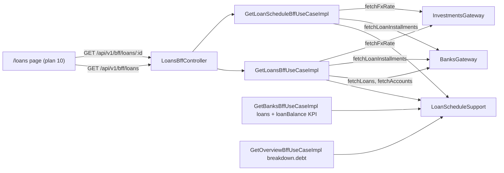

# Wave 4 · Plan 02 — `GET /api/v1/bff/loans` (+ repair the Bancos loans mapping)

## Branches and repositories involved

| Repo | Branch | Base |
|---|---|---|
| `back/ms-gateway` | `feat/wave4-loans-bff` | `develop` (at `e757853`, plan 01 merged) |

No other repo was touched. The report file itself lives in the parent repo and is left
uncommitted per the plan.

## Objective

Add a tenth BFF surface for the Préstamos rebuild — a loans list endpoint plus a per-loan
installment schedule endpoint — and repair the Bancos loans section, which read keys
`ms-banks` never sends (`label`, `principalAmount`, `outstandingAmount`,
`installmentsPaid`, `installmentsTotal`, `nextInstallmentDate`) and therefore rendered
zeros for any user with loans. Outstanding balance does not exist upstream; under French
amortisation it is the sum of unpaid installment amounts, computed in the gateway by one
shared helper consumed by every caller.

## Connection to plans or specs

- Plan: `docs/superpowers/plans/2026-08-23-wave4-02-loans-bff.md` (executed task by task).
- Spec: `docs/specs/2026-08-10-wave4-redesign.md` — § Plan 02, Problems §5 and §10, goal G2.
- Predecessor: plan 01 (`chore/wave4-delete-legacy-dashboard`, merge `e757853`) moved the
  three shared records into `domain.model.bff`; this plan branched only after that merge.
- Consumer: plan 10 (`feat/wave4-page-prestamos`) regenerates `schema.d.ts` from this
  contract. No frontend file was touched here.

## Diagrams



Fan-out shape — one implementation in `LoanScheduleSupport.enrich`, three consumers:

```
loansFuture ──thenCompose──▶ enrich(loans, loanId -> banks.fetchLoanInstallments(userId, loanId))
                                 │
                                 ├─ loan 1 ─▶ fetchLoanInstallments ─▶ parse ─┐
                                 ├─ loan 2 ─▶ fetchLoanInstallments ─▶ parse ─┤
                                 └─ loan n ─▶ fetchLoanInstallments ─▶ parse ─┘
                                                                              │
                            CompletableFuture.allOf(...).thenApply(join all) ─▶ List<LoanWithSchedule>
                            (no future is joined outside this continuation;
                             an empty loans list issues zero downstream calls)
```

## Goals

**G1.** `GET /api/v1/bff/loans` and `GET /api/v1/bff/loans/{id}` exist, shaped
`Section<T>`/`ObservedAt`/`MoneyFigure` like the nine shipped endpoints, and degrade per
section instead of failing whole — *Verified by*: `mvn verify` green including
`LoansBffTest` OK-path, degradation-path and schedule tests. — **met**

**G2.** Outstanding balance and next installment are computed from real installment data by
one implementation consumed by both the new endpoint and the Bancos tab — *Verified by*:
`LoanScheduleSupportTest` green; `grep -rn "outstandingAmount\|principalAmount" src/main`
returns 0 matches. — **met** (the grep also forced a third consumer into scope, see
*Problems found*)

**G3.** The Bancos loans section renders real values for a user with loans — *Verified by*:
the Task 7 test green against real `LoanResponse` keys. — **met**

## What was done

1. **`BanksGateway.fetchLoanInstallments(UserId, Long loanId)`** — new port method plus the
   `BanksGatewayImpl` adapter hitting `GET /api/v1/banks/loans/{id}/installments`,
   envelope-unwrapped to raw maps, `List.of()` on any error, mirroring `fetchLoans`.
2. **`LoanScheduleSupport`** — the single implementation of installment math: `parse` (keys
   `id`, `installmentNumber`, `amount`, `dueDate`, `paid`, `paidDate`; ordered by number),
   `outstanding` (sum of unpaid amounts), `nextUnpaid` (earliest-due unpaid), and `enrich`
   (the bounded parallel per-loan fan-out returning `List<LoanWithSchedule>`).
3. **Domain contract** — `LoansKpis`, `LoanDetailRow`, `InstallmentRow` in `BffDomainModels`;
   `LoansBffData` and `LoanScheduleBffData`; `GetLoansBffUseCase` and
   `GetLoanScheduleBffUseCase`.
4. **`GetLoansBffUseCaseImpl`** — three guarded sections (`kpis`, `loans`, `payFromAccounts`)
   over `fetchLoans` + the schedule fan-out + `fetchAccounts`, money through
   `BffMoneyConverter`, `PageTimeoutBudget` applied per section, dual constructor with an
   injectable `Clock`. `installmentsPaid` comes from the loan row
   (`totalInstallments − remainingInstallments`); `outstanding` and the next installment come
   from the schedule. KPIs count active loans only.
5. **`GetLoanScheduleBffUseCaseImpl`** — one guarded `installments` section, rows ordered by
   installment number.
6. **Web layer** — `LoansBffController` (both routes), `LoansBffResponse`,
   `LoanScheduleBffResponse`, three new records in `BffWebResponses` and four new `BffMapper`
   methods. `AccountOptionResponse` already existed for the transactions filter options and
   was reused rather than duplicated; `toFilterOptionsResponse` was refactored onto the new
   `BffMapper::toAccountOptionResponse` so the account-option mapping also has one
   implementation.
7. **Bancos repair** — `GetBanksBffUseCaseImpl` now reads `name`, `principal`, `currency`,
   `totalInstallments`, `remainingInstallments` and derives `outstanding` /
   `nextInstallmentDate` from the schedule. The `loanBalance` KPI switched from the invented
   `outstandingAmount` key to the same installment sum. The wire shape of `LoanRow` /
   `LoanRowResponse` is unchanged.
8. **Overview repair** (beyond the plan's task list, required by G2's grep) —
   `GetOverviewBffUseCaseImpl`'s `breakdown.debt` read the same non-existent
   `outstandingAmount` key and is now computed from the schedule through the same helper.

## Problems found

- **The invented-key bug had a third site the plan did not name.**
  `GetOverviewBffUseCaseImpl:123` computed `breakdown.debt` from
  `l.get("outstandingAmount")`, so loan debt on the Overview page silently contributed zero.
  G2 is stated as a repo-wide grep over `src/main`, so leaving it would have made G2
  unverifiable and left the same "renders zeros" defect live on a second page. It was fixed
  with the shared helper and the existing `OverviewBffTest` breakdown case was rewritten onto
  real `LoanResponse` keys — the assertion value (`debt = 20000.00`) is unchanged, so the test
  was strengthened, not weakened.
- **The plan pinned the fan-out as a private record + private method inside
  `GetLoansBffUseCaseImpl`, and told Task 7 to "build the same enriched fan-out".** Copying it
  would have produced two (then three) implementations of one behavior. The fan-out was
  instead lifted into `LoanScheduleSupport.enrich(loans, installmentsByLoanId)` — which is
  what the plan's own architecture note asks for ("one shared helper that both consume") — and
  covered by two new tests, including one asserting an empty loans list issues zero downstream
  calls.
- **No existing `BanksBffTest` case needed a `fetchLoanInstallments` stub.** Every pre-existing
  test stubs `fetchLoans` with an empty list, so no fan-out occurs; the plan anticipated this.
  That the suite stays green under Mockito strict stubbing is itself the proof that the
  zero-loans path makes zero downstream calls.
- **KPI currency summation is unchanged in kind.** `LoansKpis.totalOutstanding` /
  `monthlyPayment` sum across loans and convert from `Currency.ARS`, exactly as the Bancos KPI
  already did. Per-row figures do use each loan's own currency. Mixed-currency loan portfolios
  would need a real multi-currency sum; noted as a follow-up rather than silently invented here.

## Files and commits touched

| Repo | Branch | Commit |
|---|---|---|
| `back/ms-gateway` | `feat/wave4-loans-bff` | `afb03b0` feat(gateway): BanksGateway.fetchLoanInstallments |
| `back/ms-gateway` | `feat/wave4-loans-bff` | `d726469` feat(gateway): LoanScheduleSupport installment math |
| `back/ms-gateway` | `feat/wave4-loans-bff` | `1ec9055` feat(gateway): loans BFF domain contract |
| `back/ms-gateway` | `feat/wave4-loans-bff` | `2c8550b` feat(gateway): GetLoansBffUseCaseImpl composition |
| `back/ms-gateway` | `feat/wave4-loans-bff` | `3d56e16` feat(gateway): loan schedule BFF use case |
| `back/ms-gateway` | `feat/wave4-loans-bff` | `07a7de7` feat(gateway): GET /api/v1/bff/loans + /{id} web layer |
| `back/ms-gateway` | `feat/wave4-loans-bff` | `0bfc82b` fix(gateway): banks loans section reads real LoanResponse keys, computes outstanding from installments |

Created:

```
src/main/java/com/financialapp/gateway/application/bff/impl/LoanScheduleSupport.java
src/main/java/com/financialapp/gateway/application/bff/impl/GetLoansBffUseCaseImpl.java
src/main/java/com/financialapp/gateway/application/bff/impl/GetLoanScheduleBffUseCaseImpl.java
src/main/java/com/financialapp/gateway/domain/model/bff/LoansBffData.java
src/main/java/com/financialapp/gateway/domain/model/bff/LoanScheduleBffData.java
src/main/java/com/financialapp/gateway/domain/usecase/bff/GetLoansBffUseCase.java
src/main/java/com/financialapp/gateway/domain/usecase/bff/GetLoanScheduleBffUseCase.java
src/main/java/com/financialapp/gateway/web/controller/bff/LoansBffController.java
src/main/java/com/financialapp/gateway/web/dto/response/bff/LoansBffResponse.java
src/main/java/com/financialapp/gateway/web/dto/response/bff/LoanScheduleBffResponse.java
src/test/java/com/financialapp/gateway/application/bff/LoanScheduleSupportTest.java
src/test/java/com/financialapp/gateway/application/bff/LoansBffTest.java
```

Modified:

```
src/main/java/com/financialapp/gateway/domain/gateway/BanksGateway.java
src/main/java/com/financialapp/gateway/infrastructure/gateway/Impl/BanksGatewayImpl.java
src/main/java/com/financialapp/gateway/domain/model/bff/BffDomainModels.java
src/main/java/com/financialapp/gateway/application/bff/impl/GetBanksBffUseCaseImpl.java
src/main/java/com/financialapp/gateway/application/bff/impl/GetOverviewBffUseCaseImpl.java
src/main/java/com/financialapp/gateway/web/dto/response/bff/BffWebResponses.java
src/main/java/com/financialapp/gateway/web/mapper/BffMapper.java
src/test/java/com/financialapp/gateway/infrastructure/gateway/Impl/BanksGatewayImplTest.java
src/test/java/com/financialapp/gateway/application/bff/BanksBffTest.java
src/test/java/com/financialapp/gateway/application/bff/OverviewBffTest.java
```

## Verification evidence

`mvn verify` in `back/ms-gateway` (tail):

```
[INFO] Running com.financialapp.gateway.web.controller.CurrenciesControllerTest
[INFO] Tests run: 1, Failures: 0, Errors: 0, Skipped: 0, Time elapsed: 0.028 s -- in com.financialapp.gateway.web.controller.CurrenciesControllerTest
[INFO] Running com.financialapp.gateway.architecture.LayeredArchitectureTest
15:10:57.739 [main] INFO com.tngtech.archunit.core.PluginLoader -- Detected Java version 21.0.12.1
[INFO] Tests run: 3, Failures: 0, Errors: 0, Skipped: 0, Time elapsed: 0.857 s -- in com.financialapp.gateway.architecture.LayeredArchitectureTest
[INFO]
[INFO] Results:
[INFO]
[INFO] Tests run: 101, Failures: 0, Errors: 0, Skipped: 0
[INFO]
[INFO] --- jar:3.4.2:jar (default-jar) @ ms-gateway ---
[INFO] --- spring-boot:3.4.2:repackage (repackage) @ ms-gateway ---
[INFO] ------------------------------------------------------------------------
[INFO] BUILD SUCCESS
[INFO] ------------------------------------------------------------------------
[INFO] Total time:  4.179 s
[INFO] Finished at: 2026-08-23T15:10:58-03:00
[INFO] ------------------------------------------------------------------------
```

Per-class results for the classes this plan touched:

```
[INFO] Tests run: 4, Failures: 0, Errors: 0, Skipped: 0 -- in com.financialapp.gateway.application.bff.BanksBffTest
[INFO] Tests run: 6, Failures: 0, Errors: 0, Skipped: 0 -- in com.financialapp.gateway.application.bff.LoanScheduleSupportTest
[INFO] Tests run: 5, Failures: 0, Errors: 0, Skipped: 0 -- in com.financialapp.gateway.application.bff.OverviewBffTest
[INFO] Tests run: 4, Failures: 0, Errors: 0, Skipped: 0 -- in com.financialapp.gateway.application.bff.LoansBffTest
[INFO] Tests run: 5, Failures: 0, Errors: 0, Skipped: 0 -- in com.financialapp.gateway.infrastructure.gateway.Impl.BanksGatewayImplTest
```

Test count moved 88 → 101 on this branch. No test is disabled:

```
$ grep -rn "@Disabled" src/
$ echo $?
1
```

G2's grep, over `src/main`:

```
$ grep -rn "outstandingAmount\|principalAmount" src/main
$ echo $?
1
```

TDD evidence — each implementation step was preceded by a red run. Representative failures
observed before the corresponding fix:

```
[ERROR] BanksGatewayImplTest.java:[79,17] cannot find symbol
  symbol:   method fetchLoanInstallments(com.financialapp.gateway.domain.common.model.UserId,long)

[ERROR] com.financialapp.gateway.application.bff.BanksBffTest.loans_section_reads_real_ms_banks_keys_and_computes_outstanding
expected: "Auto"

[ERROR] com.financialapp.gateway.application.bff.OverviewBffTest.kpisCommitAndBreakdownComposeFromBanksAndPortfolio
expected: 20000.00
```

Behavioural self-checks required by the plan's review focus:

| Check | Evidence |
|---|---|
| Empty loans list ⇒ zero `fetchLoanInstallments` calls | `LoanScheduleSupportTest.enrich_of_no_loans_fetches_no_schedules` counts 0 invocations; every pre-existing `BanksBffTest`/`OverviewBffTest` case stubs `fetchLoans` empty and passes with no `fetchLoanInstallments` stub at all |
| One upstream failure degrades only its own sections, never a 500 | `LoansBffTest.loans_section_degrades_to_unavailable_when_upstream_fails` (`loans` + `kpis` UNAVAILABLE, `payFromAccounts` OK); `LoansBffTest.schedule_degrades_when_installments_fetch_fails`. Every section is wrapped in `Section.guard` + `applyBudget`, so the composed future never completes exceptionally |
| Fan-out futures joined only inside the `allOf` continuation | `LoanScheduleSupport.enrich` joins inside `CompletableFuture.allOf(...).thenApply(...)` — the only `join()` on a per-loan future in the codebase |

Not run: live HTTP verification against a running stack. The seeder does not yet create loan
installments (spec Problems §7 routes that to plan 15), so a live call would exercise the
empty-loans path only.

## Contract changes

Two new routes, both additive:

- `GET /api/v1/bff/loans?currency=ARS&secondary=none` → `ApiResponse<LoansBffResponse>` with
  sections `kpis` (`LoansKpisResponse`: `totalOutstanding`, `monthlyPayment`, `activeLoans`,
  `nextDueDate`), `loans` (`List<LoanDetailRowResponse>`: `id`, `label`, `bankNumber`,
  `principal`, `outstanding`, `interestRate`, `installmentsPaid`, `installmentsTotal`,
  `nextInstallmentDate`, `nextInstallmentAmount`, `active`) and `payFromAccounts`
  (`List<AccountOptionResponse>`: `cbu`, `alias` — the existing record, reused).
- `GET /api/v1/bff/loans/{id}?currency=ARS&secondary=none` →
  `ApiResponse<LoanScheduleBffResponse>` with section `installments`
  (`List<InstallmentRowResponse>`: `id`, `number`, `amount`, `dueDate`, `paid`, `paidDate`),
  ordered by `number`.

New downstream dependency: `GET /api/v1/banks/loans/{id}/installments` on `ms-banks`
(read-only, already exposed by `LoanController:86`). No ms-banks change.

Unchanged on the wire: `BanksBffResponse.loans` (`LoanRowResponse`) and
`OverviewBffResponse.breakdown` keep their exact shapes. Only the upstream mapping behind them
changed — fields that previously always serialised as `""` / `0` / `0.00` now carry real
values, and `nextInstallmentDate` is now `null` when no unpaid installment exists instead of
defaulting to today.

No migration, no Kafka event, no config change (`/api/v1/bff/**` has no proxy route in
`application.yml`, so the new controller is picked up with no route edit).

## Follow-ups and deferred work

- **Multi-currency loan KPIs.** `LoansKpis` and the Bancos `loanBalance` sum amounts across
  loans and convert from ARS. A portfolio mixing ARS and USD loans would report a wrong total.
  Route to `docs/specs/IDEAS.md` before the Préstamos page ships mixed-currency data.
- **Schedule amounts assume the loan's currency is ARS.** `GetLoanScheduleBffUseCaseImpl`
  converts from `Currency.ARS`, as the plan specifies, because the schedule endpoint does not
  fetch the loan row. If per-loan currency must show on the schedule view, the endpoint needs
  one extra upstream call.
- **Seed data.** `scripts/seed-demo-user.sh` seeds no loans and no installments, so the repaired
  Bancos section and the new endpoint have never been exercised against live data — this is the
  same blind spot that let the invented-key bug survive. Plan 15 owns the fix.
- **Frontend consumption and `schema.d.ts` regeneration** are plan 10's, by design.

## Results

Seven commits on `feat/wave4-loans-bff`, `mvn verify` green at 101 tests (up from 88), no
disabled tests, ArchUnit layer rules intact. The Préstamos BFF contract exists and is stable
for plan 10 to consume, and the loans-renders-zeros defect is gone from all three places it
lived — the Bancos rows, the Bancos `loanBalance` KPI, and the Overview `breakdown.debt` —
each now reading real `LoanResponse` keys and computing outstanding through one shared
implementation. Nothing was pushed; the branch is local and unmerged.

## Other references

- Plan: `docs/superpowers/plans/2026-08-23-wave4-02-loans-bff.md`
- Spec: `docs/specs/2026-08-10-wave4-redesign.md` (§ Plan 02, Problems §5, §7, §10, G2)
- Upstream contract: `back/ms-banks` `LoanController:45,86`, `LoanResponse`,
  `LoanInstallmentResponse`
- Patterns mirrored: `GetBanksBffUseCaseImpl`, `BanksBffController`, `BffMapper`,
  `BffWebResponses`, `BanksGatewayImplTest`
