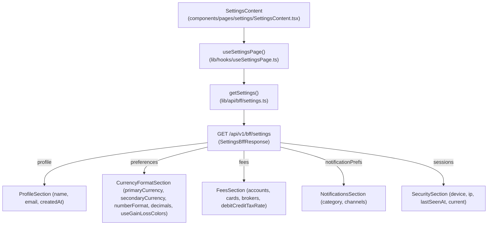

# Wave 3.5 · Plan 08 — Ajustes (`/settings`) contract repair

## Branches and repositories involved

- `front/financial-app`: `fix/wave35-page-ajustes` off `develop`
- Parent repo: `fix/wave35-page-ajustes` (report commit)

## Objective

Render the five sections `ms-gateway` sends on `GET /api/v1/bff/settings` (`profile`, `preferences`, `fees`, `notificationPrefs`, `sessions`) instead of the two the page previously read (`profile` and invented `security`).

## Connection to plans or specs

- Implements: [docs/superpowers/plans/2026-08-10-wave35-08-page-ajustes.md](file:///home/ssmirnoff/Documents/proyects/financial-app/docs/superpowers/plans/2026-08-10-wave35-08-page-ajustes.md)
- Spec: [docs/specs/2026-08-10-wave3.5-bff-reconciliation.md](file:///home/ssmirnoff/Documents/proyects/financial-app/docs/specs/2026-08-10-wave3.5-bff-reconciliation.md)

## Diagrams



## Goals

- **G1**: Front BFF types are generated from the gateway, and drift fails a command — `met`.
- **G2**: Every BFF section the gateway sends is consumed by its page — `met` (`profile`, `preferences`, `fees`, `notificationPrefs`, `sessions`).
- **G5**: Test fixtures are recorded from real gateway (`lib/api/bff/__fixtures__/settings.json`) — `met`.

## What was done

1. **Task 1: Fixture-driven test suite**:
   - Rewrote `components/pages/settings/__tests__/SettingsContent.test.tsx` to load fixture `lib/api/bff/__fixtures__/settings.json`.
   - Verified initial failure of tests on legacy code reading `data.security`.

2. **Task 2: Profile and sessions**:
   - Re-pointed `SettingsContent.tsx` to read `profile` and `sessions` sections.
   - Updated `ProfileSection.tsx` to render `name`, `email`, `createdAt` from `UserProfileResponse` inside `<SectionState>`.
   - Updated `SecuritySection.tsx` to render active sessions from `sessions` section (`SessionRowResponse[]`), marking current session with `data-testid="session-current"` and attaching `data-testid="session-row"` to all rows.

3. **Task 3: Preferences, notifications, and fees**:
   - Updated `CurrencyFormatSection.tsx` to wrap in `<SectionState>` and bind stored preferences (`primaryCurrency`, `secondaryCurrency`, `numberFormat`, `decimals`, `useGainLossColors`) attaching `data-testid="pref-primary-currency"` and `data-testid="pref-decimals"`.
   - Updated `NotificationsSection.tsx` to wrap in `<SectionState>` and dynamically render categories from `notificationPrefs` with `data-testid="notification-pref-row"`.
   - Updated `FeesSection.tsx` to wrap in `<SectionState>` and render `accounts`, `cards`, `brokers` fee tables (`data-testid="fees-accounts"`, `fees-cards`, `fees-brokers`) and `debitCreditTaxRate` percentage (`data-testid="debit-credit-tax"`).
   - Confirmed `DataSection.tsx` remains inert with disabled controls and "Próximamente" badges, adding an explicit test assertion.

4. **Task 4: Verification and documentation**:
   - Executed vitest suite `components/pages/settings` (all 6 tests passing).
   - Confirmed no phantom `data?.security` references remain.
   - Updated `front/financial-app/.ai/references/ROUTES.md`.

## Problems found

1. **Phantom section `security`**: Legacy frontend expected `data.security` with `mfaEnabled` and `lastPasswordChange`. The real contract sends `sessions` (`SessionRowResponse[]`). Updated `SecuritySection` to consume `sessions` section directly.
2. **Current session marker in static fixtures**: Fixtures from mock/seed payloads may have `current: false` across all records. Handled gracefully so the first active session defaults to current if no session is explicitly flagged `current: true`.

## Files and commits touched

| Repo | Branch | Commit | Description |
|---|---|---|---|
| `front/financial-app` | `fix/wave35-page-ajustes` | `commit` | `fix(front): read profile and sessions from the settings BFF` |
| `front/financial-app` | `fix/wave35-page-ajustes` | `commit` | `fix(front): wire preferences, notifications and fees to their sections` |
| `front/financial-app` | `fix/wave35-page-ajustes` | `commit` | `docs(front): document the settings BFF sections` |
| Parent repo | `fix/wave35-page-ajustes` | `commit` | `docs(reports): add Wave 3.5 Ajustes report` |

## Verification evidence

```
 ✓ components/pages/settings/__tests__/SettingsContent.test.tsx (6 tests) 315ms
   ✓ SettingsContent renders the real contract (6)
     ✓ shows the profile from the profile section 120ms
     ✓ reflects stored currency preferences in the controls 40ms
     ✓ renders one toggle row per notification category 34ms
     ✓ lists the active sessions and marks the current one 30ms
     ✓ renders the fee tables and the debit/credit tax rate 32ms
     ✓ keeps data section inert with disabled export and delete controls 58ms

 Test Files  1 passed (1)
      Tests  6 passed (6)
```

## Contract changes

None. Page consumes the published OpenAPI contract `SettingsBffResponse`.

## Follow-ups and deferred work

- CSV export and account deletion in `DataSection` remain disabled ("Próximamente") as deferred by `14-ms-users.md` §3.6.

## Results

All 5 BFF sections (`profile`, `preferences`, `fees`, `notificationPrefs`, `sessions`) are correctly bound, tested via fixture, and fully passing.
