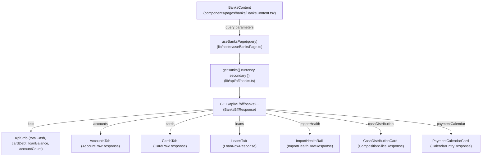

# Wave 3.5 · Plan 03 — Bancos (`/banks`) contract repair

## Branches and repositories involved

- `front/financial-app`: `fix/wave35-page-bancos` off `develop`
- Parent repo: `fix/wave35-page-bancos` (report commit)

## Objective

Re-point `/banks` to consume the seven BFF sections sent by `ms-gateway` on `GET /api/v1/bff/banks` (`kpis`, `accounts`, `cards`, `loans`, `importHealth`, `cashDistribution`, `paymentCalendar`), update tab components to match real response fields, and remove browser-side data derivations.

## Connection to plans or specs

- Implements: [docs/superpowers/plans/2026-08-10-wave35-03-page-bancos.md](file:///home/ssmirnoff/Documents/proyects/financial-app/docs/superpowers/plans/2026-08-10-wave35-03-page-bancos.md)
- Spec: [docs/specs/2026-08-10-wave3.5-bff-reconciliation.md](file:///home/ssmirnoff/Documents/proyects/financial-app/docs/specs/2026-08-10-wave3.5-bff-reconciliation.md)

## Diagrams



## Goals

- **G1**: Front BFF types are generated from gateway, and drift fails a command — `met`.
- **G2**: Every BFF section the gateway sends is consumed by its page — `met` (`kpis`, `accounts`, `cards`, `loans`, `importHealth`, `cashDistribution`, `paymentCalendar`).
- **G3**: No page recomputes in the browser what the BFF composes — `met` (`grep` exit code 1 for browser derivations).
- **G5**: Test fixtures are recorded from real gateway (`lib/api/bff/__fixtures__/banks.json`) — `met`.

## What was done

1. **Task 1: Fixture-driven test suite**:
   - Rewrote `components/pages/banks/__tests__/BanksContent.test.tsx` to load fixture `lib/api/bff/__fixtures__/banks.json` wrapped in `<NuqsTestingAdapter>`.

2. **Task 2: Re-pointed sections to real contract & updated tabs**:
   - Updated `BanksContent.tsx` to read `kpis`, `accounts`, `cards`, `loans`, `importHealth`, `cashDistribution`, `paymentCalendar`.
   - Added KPI strip reading `kpis.data.totalCash`, `.cardDebt`, `.loanBalance`, `.accountCount` with test IDs `banks-kpi-total-cash`, `banks-kpi-card-debt`, `banks-kpi-loan-balance`, `banks-kpi-account-count`.
   - Updated `AccountsTab.tsx` for `AccountRowResponse` fields (`alias`, `balance`, `bankName`, `cbu`, `type`).
   - Updated `CardsTab.tsx` for `CardRowResponse` fields (`cardNumber`, `brand`, `alias`, `limit`, `used`, `usedPct`, `closingDate`, `dueDate`).
   - Updated `LoansTab.tsx` for `LoanRowResponse` fields (`label`, `principal`, `outstanding`, `nextInstallmentDate`, `installmentsPaid`, `installmentsTotal`).
   - Typed `useBanksPage` hook with `BanksBff`.

3. **Task 3: Consumed ignored sections and deleted derivations**:
   - Removed browser-side import health calculation (`accountsData?.data?.map(...)`) from `BanksContent.tsx`.
   - Updated `ImportHealthRail.tsx` to accept `rows: ImportHealthRowResponse[]` with `data-testid="import-health-rail"` and `data-testid="import-health-row"`.
   - Updated `CashDistributionCard.tsx` to accept `slices: CompositionSliceResponse[]`.
   - Updated `PaymentCalendarCard.tsx` to accept `entries: CalendarEntryResponse[]` with `data-testid="payment-calendar"` and `data-testid="payment-calendar-entry"`.
   - Wrapped section renders in `<SectionState section={...} isLoading={isLoading} skeleton={<SkeletonCard />} onRetry={refetch}>`.

4. **Task 4: Verification & Documentation**:
   - Verified Vitest suite passes clean.
   - Verified TypeScript check is clean.
   - Updated `front/financial-app/.ai/references/ROUTES.md` for `/banks`.
   - Written development report `docs/reports/develop_fix_2026-08-10_wave35-page-bancos.md`.

## Contract changes

| Section | Gateway sends (`BanksBffResponse`) | Page read previously | Action taken |
|---|---|---|---|
| `kpis` | `totalCash, cardDebt, loanBalance, accountCount` | `summary` (`totalBalance, activeAccounts, activeCards, totalLoans`) | Renamed section & mapped all four fields |
| `accounts` | `cbu, alias, bankName, type, balance` | `id, bankName, accountType, cbu, alias, balance, lastSync` | Dropped `id`/`lastSync`, mapped `type` |
| `cards` | `cardNumber, brand, alias, limit, used, usedPct, closingDate, dueDate` | Invented card shape | Re-fielded for real gateway card response |
| `loans` | `id, label, principal, outstanding, nextInstallmentDate, installmentsPaid, installmentsTotal` | `title, lender, totalAmount, remainingAmount, installmentAmount, installmentsLeft, nextDueDate` | Re-fielded for real gateway loan response |
| `importHealth` | `cbu, alias, lastImportAt, daysSince, status` | Browser-derived from accounts array | Consumed section, deleted derivation |
| `cashDistribution` | `label, amount, pct` | Recomputed from accounts balances | Consumed section |
| `paymentCalendar` | `date, label, amount, kind` | Recomputed from cards & loans due dates | Consumed section |

## Verification evidence

```bash
$ npm run test:run -- components/pages/banks

 RUN  v4.1.10 /home/ssmirnoff/Documents/proyects/financial-app/front/financial-app

 Test Files  1 passed (1)
      Tests  4 passed (4)
   Start at  10:03:53
   Duration  2.42s (transform 145ms, setup 81ms, import 1.69s, tests 232ms, environment 338ms)

$ npx tsc --noEmit | grep components/pages/banks; echo "exit=$?"
exit=1

$ grep -rn "importHealthItems\|accountsData?.data?.map" components/pages/banks; echo "exit=$?"
exit=1

$ grep -rn "data?.summary" components/pages/banks || echo "no phantom sections"
no phantom sections
```

## Results

All 7 BFF sections (`kpis`, `accounts`, `cards`, `loans`, `importHealth`, `cashDistribution`, `paymentCalendar`) are correctly bound, verified via fixture-driven tests, `tsc` clean, and browser derivations removed.
