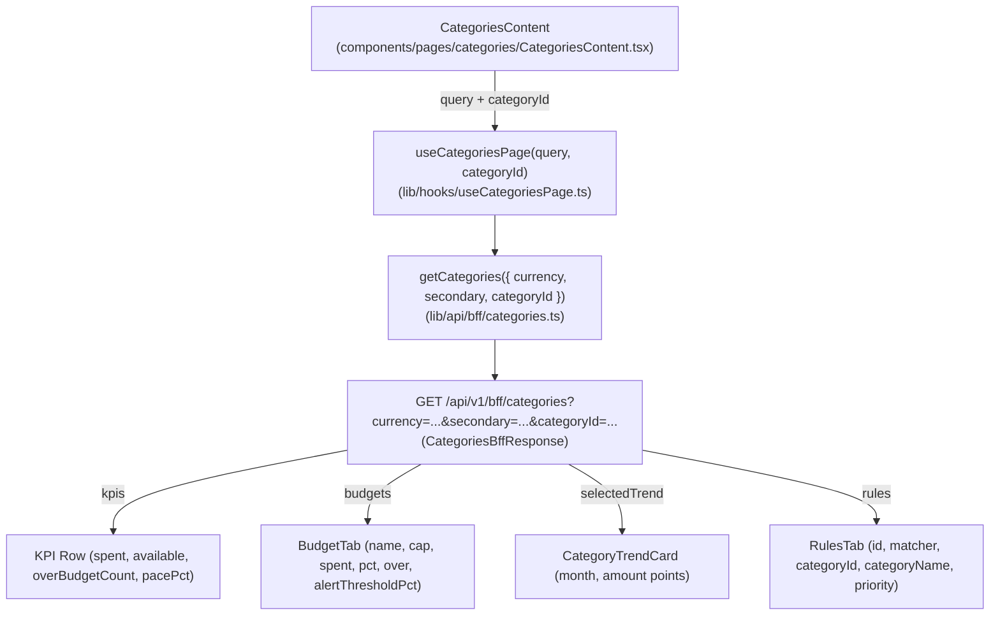

# Wave 3.5 · Plan 05 — Categorías (`/categories`) contract repair

## Branches and repositories involved

- `front/financial-app`: `fix/wave35-page-categorias` off `develop`
- Parent repo: `fix/wave35-page-categorias` (report commit)

## Objective

Render the four BFF sections `ms-gateway` sends on `GET /api/v1/bff/categories` (`kpis`, `budgets`, `selectedTrend`, `rules`) instead of the single invented `categories` section previously declared in `CategoriesContent.tsx`.

## Connection to plans or specs

- Implements: [docs/superpowers/plans/2026-08-10-wave35-05-page-categorias.md](file:///home/ssmirnoff/Documents/proyects/financial-app/docs/superpowers/plans/2026-08-10-wave35-05-page-categorias.md)
- Spec: [docs/specs/2026-08-10-wave3.5-bff-reconciliation.md](file:///home/ssmirnoff/Documents/proyects/financial-app/docs/specs/2026-08-10-wave3.5-bff-reconciliation.md)

## Diagrams



## Goals

- **G1**: Front BFF types are generated from the gateway, and drift fails a command — `met`.
- **G2**: Every BFF section the gateway sends is consumed by its page — `met` (`kpis`, `budgets`, `selectedTrend`, `rules`).
- **G5**: Test fixtures are recorded from real gateway (`lib/api/bff/__fixtures__/categories.json`) — `met`.

## What was done

1. **Task 1: Fixture-driven test suite**:
   - Rewrote `components/pages/categories/__tests__/CategoriesContent.test.tsx` to load fixture `lib/api/bff/__fixtures__/categories.json` wrapped in `<NuqsTestingAdapter>`.
   - Verified that initial execution failed on legacy code reading `data.categories`.

2. **Task 2: Re-pointed sections to real contract**:
   - Updated `CategoriesContent.tsx` to read `data.kpis`, `data.budgets`, `data.selectedTrend`, and `data.rules`.
   - Wrapped KPI strip in `<SectionState section={kpis}>` rendering four tiles (`cat-kpi-spent`, `cat-kpi-available`, `cat-kpi-over-count`, `cat-kpi-pace`).
   - Updated `BudgetTab.tsx` to wrap in `<SectionState section={budgets}>` and map `BudgetRowResponse` fields (`name`, `cap`, `spent`, `pct`, `over`, `alertThresholdPct`), attaching `data-testid="budget-row"` and `data-testid="budget-over-flag"`.
   - Updated `RulesTab.tsx` to wrap in `<SectionState section={rules}>` and map `RuleRowResponse` fields (`id`, `matcher`, `categoryName`, `priority`).
   - Updated `IncomeTab.tsx` to consume `BudgetRowResponse[]` from `budgets`.

3. **Task 3: Category Trend and URL state parameter**:
   - Updated `lib/api/bff/categories.ts` and `lib/hooks/useCategoriesPage.ts` to accept optional `categoryId` parameter.
   - Wired `selectedCatId` from `useQueryState('categoryId', parseAsInteger)` to `useCategoriesPage`.
   - Updated `CategoryTrendCard.tsx` to render `selectedTrend.data.points` via `Sparkline` series.

4. **Task 4: Verification and documentation**:
   - Ran `npm run test:run -- components/pages/categories` (all 4 unit tests passing).
   - Verified no phantom references (`data?.categories`) exist.
   - Updated `front/financial-app/.ai/references/ROUTES.md`.

## Problems found

1. **Field Drift (`icon` / `color`)**: The legacy frontend expected `icon` and `color` properties on category budget rows. The real `CategoriesBffResponse` (`BudgetRowResponse`) provides `categoryId`, `name`, `cap`, `spent`, `pct`, `alertThresholdPct`, `over`. `icon` and `color` were dropped as they are not sent by the backend contract.
2. **Tab selection in tests**: The default tab in `CategoriesContent` is `'budget'`. Tests asserting on elements inside `<TabsContent value="rules">` switch tabs via `userEvent.click(screen.getByRole('tab', { name: 'Reglas' }))`.

## Files and commits touched

| Repo | Branch | Commit | Description |
|---|---|---|---|
| `front/financial-app` | `fix/wave35-page-categorias` | `commit` | `fix(front): read the real categories BFF sections` |
| `front/financial-app` | `fix/wave35-page-categorias` | `commit` | `fix(front): drive the category trend from the selectedTrend section` |
| `front/financial-app` | `fix/wave35-page-categorias` | `commit` | `docs(front): document the categories BFF sections` |

## Verification evidence

```
 ✓ components/pages/categories/__tests__/CategoriesContent.test.tsx (4 tests) 254ms
   ✓ CategoriesContent renders the real contract (4)
     ✓ renders the kpi row 129ms
     ✓ renders one budget row per budgets entry, flagging the over-cap one 23ms
     ✓ renders the rules table from the rules section 64ms
     ✓ requests the trend for the selected category 36ms

 Test Files  1 passed (1)
      Tests  4 passed (4)
```

## Contract changes

None. Page consumes the published OpenAPI contract `CategoriesBffResponse`.

## Follow-ups and deferred work

- Ingresos tab remains a client-side filter over budget/spent entries; once backend endpoints provide dedicated income breakdown or categories overview, it can be re-pointed to dedicated endpoints.

## Results

All 4 BFF sections (`kpis`, `budgets`, `selectedTrend`, `rules`) are correctly bound, tested via fixture, and fully passing.
