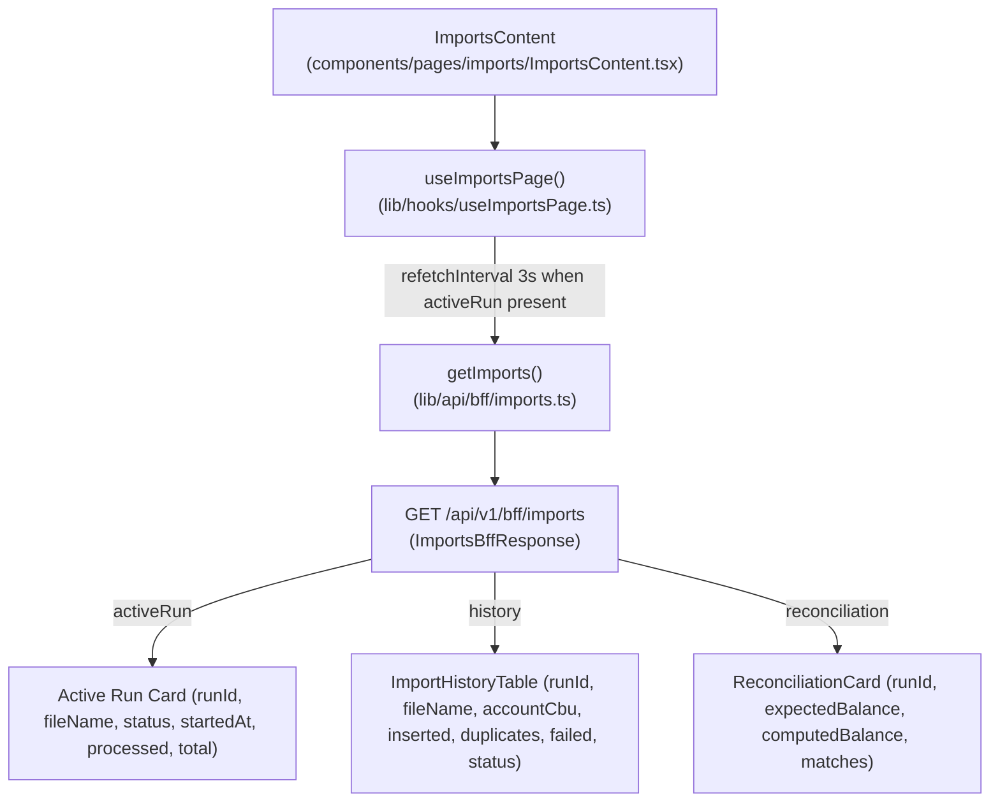

# Wave 3.5 · Plan 07 — Importaciones (`/imports`) contract repair

## Branches and repositories involved

- `front/financial-app`: `fix/wave35-page-importaciones` off `develop`
- Parent repo: `fix/wave35-page-importaciones` (report commit)

## Objective

Render the three BFF sections `ms-gateway` sends on `GET /api/v1/bff/imports` (`activeRun`, `history`, `reconciliation`) instead of the single legacy `history` read path previously used by the page, and implement polling while an import run is active.

## Connection to plans or specs

- Implements: [docs/superpowers/plans/2026-08-10-wave35-07-page-importaciones.md](file:///home/ssmirnoff/Documents/proyects/financial-app/docs/superpowers/plans/2026-08-10-wave35-07-page-importaciones.md)
- Spec: [docs/specs/2026-08-10-wave3.5-bff-reconciliation.md](file:///home/ssmirnoff/Documents/proyects/financial-app/docs/specs/2026-08-10-wave3.5-bff-reconciliation.md)

## Diagrams



## Goals

- **G1**: Front BFF types are generated from the gateway, and drift fails a command — `met`.
- **G2**: Every BFF section the gateway sends is consumed by its page — `met` (`activeRun`, `history`, `reconciliation`).
- **G4**: Each page issues one BFF read query and drops legacy read hooks — `met` (`useImportHistory` removed).
- **G5**: Test fixtures are recorded from real gateway (`lib/api/bff/__fixtures__/imports.json`) — `met`.

## What was done

1. **Task 1: Fixture-driven test suite**:
   - Rewrote `components/pages/imports/__tests__/ImportsContent.test.tsx` to load fixture `lib/api/bff/__fixtures__/imports.json`.
   - Added assertions for `import-run-row`, `reconciliation-card`, `active-run-card`, and polling during active runs.
   - Verified that test execution failed against legacy code prior to component updates.

2. **Task 2: Re-pointed sections to real contract**:
   - Updated `ImportsContent.tsx` to read `data.activeRun`, `data.history`, and `data.reconciliation`.
   - Rendered active run progress card when `activeRun.data` is present with `data-testid="active-run-card"` and progressbar semantics (`aria-valuenow`, `aria-valuemax`).
   - Updated `ImportHistoryTable.tsx` to wrap in `<SectionState section={history}>` and map `ImportRunRowResponse` fields (`fileName`, `importedAt`, `accountCbu`, `inserted`, `duplicates`, `failed`, `status`), attaching `data-testid="import-run-row"`.
   - Updated `ReconciliationCard.tsx` to wrap in `<SectionState section={reconciliation}>` and render `ReconciliationRowResponse` rows (`expectedBalance`, `computedBalance`, `matches` verdict text + icon).
   - Removed unused legacy `ImportHistory.tsx` component and dropped `useImportHistory` read path.

3. **Task 3: Active run polling**:
   - Updated `lib/hooks/useImportsPage.ts` to configure `refetchInterval` to `3_000` ms when `query.state.data?.activeRun?.data` is truthy, returning `false` when inactive.

4. **Task 4: Verification and documentation**:
   - Ran `npx vitest run components/pages/imports` (all 8 unit tests in `ImportsContent.test.tsx` and `ImportWizard.test.tsx` passing).
   - Verified `useImportHistory` is no longer present in `components/pages/imports`.
   - Updated `front/financial-app/.ai/references/ROUTES.md`.

## Problems found

1. **Legacy read hook vs. mutation flow**: The import wizard mutation flow (`ms-upload` endpoints) remains intact and green in `ImportWizard.test.tsx`. Only the page read side (`useImportHistory`) was replaced by the `GET /api/v1/bff/imports` query.
2. **Pointer capture in jsdom**: Radix UI Select components in unit tests required `Element.prototype.hasPointerCapture` fallback in test suites.

## Files and commits touched

| Repo | Branch | Description |
|---|---|---|
| `front/financial-app` | `fix/wave35-page-importaciones` | `fix(front): read the real imports BFF sections` |
| `front/financial-app` | `fix/wave35-page-importaciones` | `fix(front): poll the imports BFF while a run is active` |
| `front/financial-app` | `fix/wave35-page-importaciones` | `docs(front): document the imports BFF sections` |
| parent repo | `fix/wave35-page-importaciones` | `docs(reports): add Wave 3.5 Importaciones report` |

## Verification evidence

```
 RUN  v4.1.10 /home/ssmirnoff/Documents/proyects/financial-app/front/financial-app

 Test Files  2 passed (2)
      Tests  8 passed (8)
   Start at  09:45:15
   Duration  2.31s
```

## Contract changes

None. Page consumes the published OpenAPI contract `ImportsBffResponse`.

## Results

All 3 BFF sections (`activeRun`, `history`, `reconciliation`) are correctly bound, tested via fixture, and polling while active is fully verified.
