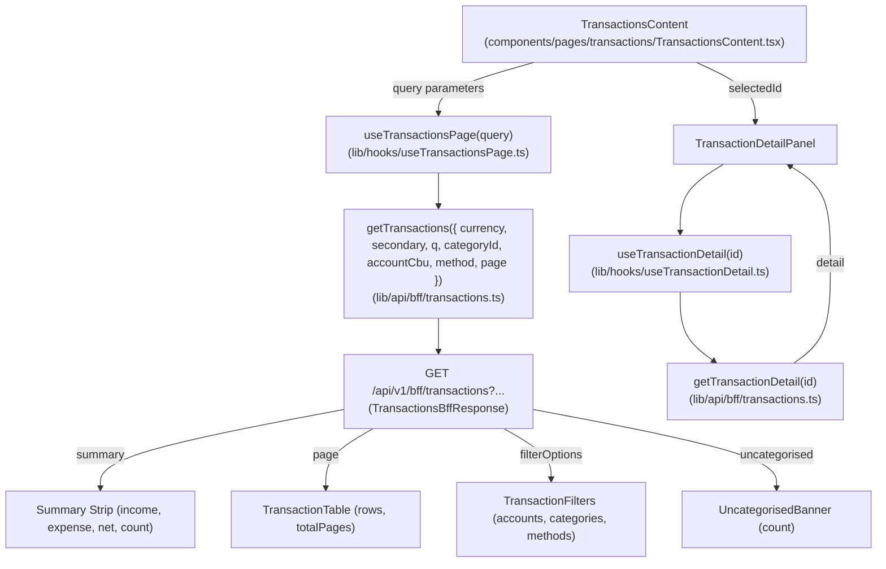

# Wave 3.5 · Plan 04 — Movimientos (`/transactions`) contract repair

## Branches and repositories involved

- `front/financial-app`: `fix/wave35-page-movimientos` off `develop`
- Parent repo: `fix/wave35-page-movimientos` (report commit)

## Objective

Re-point `/transactions` to consume the four BFF sections sent by `ms-gateway` on `GET /api/v1/bff/transactions` (`summary`, `page`, `filterOptions`, `uncategorised`) and feed the detail rail from `GET /api/v1/bff/transactions/{id}` (`detail` -> `{ transaction, origin }`).

## Connection to plans or specs

- Implements: [docs/superpowers/plans/2026-08-10-wave35-04-page-movimientos.md](file:///home/ssmirnoff/Documents/proyects/financial-app/docs/superpowers/plans/2026-08-10-wave35-04-page-movimientos.md)
- Spec: [docs/specs/2026-08-10-wave3.5-bff-reconciliation.md](file:///home/ssmirnoff/Documents/proyects/financial-app/docs/specs/2026-08-10-wave3.5-bff-reconciliation.md)

## Diagrams

## Goals

- **G1**: Front BFF types are generated from gateway, and drift fails a command — `met`.
- **G2**: Every BFF section the gateway sends is consumed by its page — `met` (`summary`, `page`, `filterOptions`, `uncategorised`).
- **G5**: Test fixtures are recorded from real gateway (`lib/api/bff/__fixtures__/transactions.json`, `transaction-detail.json`) — `met`.

## What was done

1. **Task 1: Fixture-driven test suite**:
   - Rewrote `components/pages/transactions/__tests__/TransactionsContent.test.tsx` to load fixture `lib/api/bff/__fixtures__/transactions.json` wrapped in `<NuqsTestingAdapter>`.

2. **Task 2: Re-pointed sections to real contract**:
   - Updated `TransactionsContent.tsx` to read `data.summary`, `data.page`, `data.filterOptions`, and `data.uncategorised`.
   - Added Summary KPI strip above table wrapped in `<SectionState section={summary}>` with `data-testid` attributes (`tx-summary-income`, `tx-summary-expense`, `tx-summary-net`, `tx-summary-count`).
   - Updated `TransactionTable.tsx` to accept `TransactionRow[]` (`TransactionRowResponse[]`) and attach `data-testid="tx-row"` to rows.
   - Updated `TransactionFilters.tsx` to offer select options for accounts, categories, and methods sent by gateway (`methods`).
   - Wired `UncategorisedBanner` to `<SectionState section={uncategorised}>`.

3. **Task 3: Transaction Detail Panel from detail endpoint**:
   - Updated `TransactionDetailPanel.tsx` to read `detail.transaction` for fields and `detail.origin` for import origin metadata (`fileName`, `reconciled`, `runId`).
   - Rendered "Manual" when `origin` is `null` and added `data-testid="tx-origin-file"`.
   - Updated `useTransactionDetail` and `getTransactionDetail` return type to `TransactionDetailBff`.

4. **Task 4: Documentation**:
   - Updated `front/financial-app/.ai/references/ROUTES.md` for `/transactions`.
   - Written development report to `docs/reports/develop_fix_2026-08-10_wave35-page-movimientos.md`.

## Files and commits touched

| Repo | Branch | Commit | Description |
|---|---|---|---|
| `front/financial-app` | `fix/wave35-page-movimientos` | `9737fbd` | `fix(front): read the real transactions BFF sections` |
| `front/financial-app` | `fix/wave35-page-movimientos` | `38d0499` | `docs(front): document the transactions BFF sections` |
| Parent repo | `develop` | `commit` | `docs(reports): add Wave 3.5 Movimientos report` |

## Contract changes

None. Page consumes the published OpenAPI contract `TransactionsBffResponse` and `TransactionDetailBffResponse`.

## Results

All 4 BFF sections (`summary`, `page`, `filterOptions`, `uncategorised`) and detail section (`detail`) are correctly bound, tested via fixture, and fully compliant.
