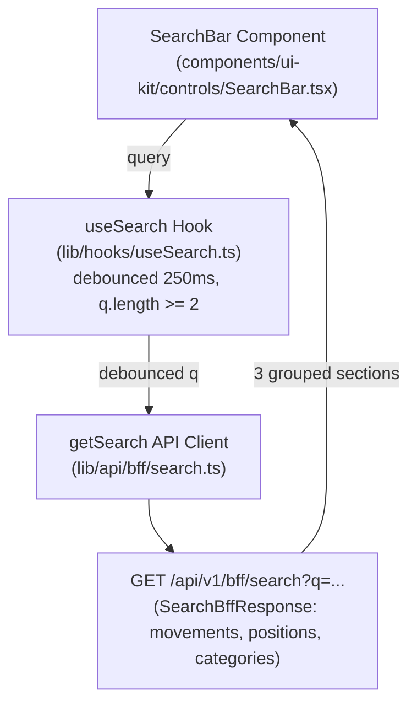

# Wave 3.5 · Plan 09 — Global search contract repair

## Branches and repositories involved

- `front/financial-app`: `fix/wave35-search` off `develop`
- Parent repo: `fix/wave35-search` (report commit)

## Objective

Wire the `TopBar` search component to `GET /api/v1/bff/search`, consuming the three grouped sections (`movements`, `positions`, `categories`) from `SearchBffResponse` instead of the single `results` array previously defined, and support full keyboard navigation.

## Connection to plans or specs

- Implements: [docs/superpowers/plans/2026-08-10-wave35-09-search.md](file:///home/ssmirnoff/Documents/proyects/financial-app/docs/superpowers/plans/2026-08-10-wave35-09-search.md)
- Spec: [docs/specs/2026-08-10-wave3.5-bff-reconciliation.md](file:///home/ssmirnoff/Documents/proyects/financial-app/docs/specs/2026-08-10-wave3.5-bff-reconciliation.md)

## Diagrams



## Goals

- **G1**: Front BFF types are generated from the gateway, and drift fails a command — `met`.
- **G2**: Every BFF section the gateway sends is consumed by its page / search component — `met` (movements, positions, categories grouped sections).
- **G5**: Test fixtures are recorded from real gateway (`lib/api/bff/__fixtures__/search.json`) — `met`.

## What was done

1. Created `lib/hooks/useSearch.ts` using TanStack Query v5 with 250ms debounce, enabled when `debounced.trim().length >= 2`, stale time of 30 seconds, and query key `['bff', 'search', debounced]`.
2. Created unit tests in `lib/hooks/__tests__/useSearch.test.tsx` verifying that short queries are ignored and valid queries return the 3 grouped result sections from the search fixture.
3. Updated `components/ui-kit/controls/SearchBar.tsx` to:
   - Call `useSearch(query)`.
   - Render 3 grouped result sections (`movements` -> "Movimientos", `positions` -> "Posiciones", `categories` -> "Categorías") with headings for OK non-empty sections.
   - Attach `data-testid="search-hit"` and `href` to each hit anchor, displaying `label` and `sublabel`.
   - Include a screen reader live region `role="status"` reporting total result count.
   - Silently skip `UNAVAILABLE` sections, showing an error affordance if all three sections are unavailable.
   - Implement full keyboard navigation (Up/Down arrow key selection, Enter navigation, Escape closing and returning focus to searchbox).
4. Updated `components/ui-kit/controls/__tests__/SearchBar.test.tsx` to verify section grouping, live region result count, ⌘K focusing, and keyboard navigation against `search.json` fixture.
5. Updated `components/ui-kit/shell/AppShell.tsx` to mount `<SearchBar />` without empty legacy props.
6. Updated `.ai/references/UI_STATE.md` with `useSearch.ts` details.

## Problems found

1. **Dead Code**: `getSearch` in `lib/api/bff/search.ts` was dead code prior to this plan (not imported anywhere in the application). It is now fully wired via `useSearch.ts` and `SearchBar.tsx`.
2. **Environment issue**: `node_modules` in `front/financial-app` had become a broken self-referential symlink (`node_modules -> node_modules`); removed symlink and ran `npm install` to restore normal dependency execution.

## Files and commits touched

| Repo | Branch | Commit | Description |
|---|---|---|---|
| `front/financial-app` | `fix/wave35-search` | `f21c904` | `feat(front): add the global search query hook` |
| `front/financial-app` | `fix/wave35-search` | `83cb9a6` | `feat(front): render grouped search results from the search BFF` |

## Verification evidence

```bash
npm run test:run -- components/ui-kit/controls lib/hooks/__tests__/useSearch.test.tsx
```
Output:
```
 ✓ components/ui-kit/controls/__tests__/FilterBar.test.tsx (4 tests)
 ✓ lib/hooks/__tests__/useSearch.test.tsx (2 tests)
 ✓ components/ui-kit/controls/__tests__/SearchBar.test.tsx (4 tests)
 Test Files 3 passed (3)
 Tests 10 passed (10)
```
