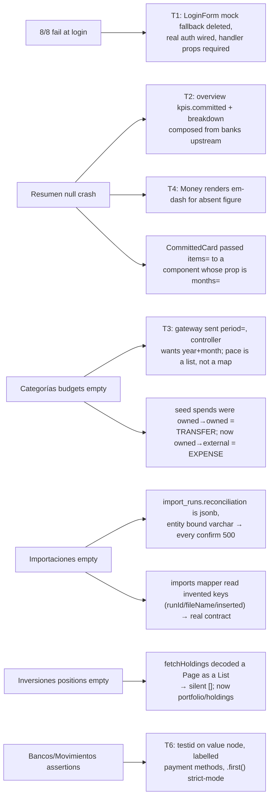

# Wave 3.5 Round D — Live-Smoke Remediation Report

## Branches and repositories involved

| Repo | Branch | Merged to develop |
|---|---|---|
| parent | `chore/wave35-round-d-seed` | yes (`50216c8`) |
| `back/ms-gateway` | `fix/wave35-schema-validation`, `fix/wave35-round-d-bff-sections` | yes (`684d156`) |
| `back/ms-upload` | `fix/wave35-schema-validation`, `fix/wave35-round-d-jsonb` | yes (`8d0787f`) |
| `back/ms-banks` | `fix/wave35-schema-validation` | yes (`c1e0283`) |
| `back/ms-finances` | `fix/wave35-schema-validation` | yes (`17846ca`) |
| `back/ms-investments` | `fix/wave35-schema-validation` | yes (`d5c7b9c`) |
| `front/financial-app` | `fix/wave35-round-d-pages` | yes (`168138b`) |

## Objective

Close Wave 3.5 honestly. The wave reported itself complete on unit tests and the drift gate;
the first real execution of its live suite (2026-08-12) failed 8/8 at the login step. Round D
fixes what the live run found and gets `npm run e2e:live` green against real services, a real
database and a seeded demo user.

## Connection to plans or specs

- Executes [docs/superpowers/plans/2026-08-12-wave35-11-round-d-remediation.md](../superpowers/plans/2026-08-12-wave35-11-round-d-remediation.md)
- Closes [docs/specs/2026-08-10-wave3.5-bff-reconciliation.md](../specs/2026-08-10-wave3.5-bff-reconciliation.md);
  supersedes the "Wave Exit Status" of `develop_chore_2026-08-10_wave35-live-smoke.md`
- Unblocks [docs/specs/2026-08-10-wave4-redesign.md](../specs/2026-08-10-wave4-redesign.md)

## Diagrams

### What each live failure turned out to be



## Goals

- **G1 — auth wired, no unwired form can ship** — **met.** Login and register pages call
  `lib/api/auth.ts`; `onLogin`/`onRegister` are required props; the `password === 'wrong'`
  mock is deleted (grep returns no matches); server failure messages surface via `ApiError`.
- **G2 — no section reports OK with a null member** — **met** (with two documented semantic
  absences). A scan of all seven page payloads found no null members under `status: OK`
  except `importHealth.lastImportAt/daysSince` (account never imported) and
  `reconciliation.expectedBalance` (CSV carries no statement balance) — real domain absences,
  not wiring gaps. The market strip now reports `UNAVAILABLE` when IOL is offline instead of
  20 empty rows under OK.
- **G3 — every seeded entity visible through its BFF** — **met.** Seeder output below:
  transactions, budgets, budget spend, loans, import history and holdings all verified
  through the BFF, and the script exits non-zero when a step persists nothing.
- **G4 — no page renders a client-side exception** — **met.** A dedicated live test sweeps
  all 10 routes recording `pageerror` events: zero, and the Next error overlay string
  appears nowhere.
- **G5 — live smoke green end to end** — **met.** 9/9 (8 page tests + the G4 sweep), output
  pasted below.
- **G6 — procedure reproducible by someone who was not here** — **met.**
  `front/financial-app/README.md` documents the container to stop, the port-3000/CORS
  constraint and the seed step; `npm run e2e:live` exists.

## What was done

- **T0** — committed the pre-verified schema-validation repair across five repos
  (`@JdbcTypeCode(SqlTypes.CHAR)` on five CHAR(n) columns, `V8__outbox_event_data_json_to_jsonb.sql`,
  gateway `@Autowired` constructor disambiguation, transactions mapper contract fix).
- **T1** — register page wired to the real API; both auth forms lost their mock fallback and
  their optional handler; errors surface the server message; auth suites rewritten (11 tests).
- **T2** — overview `kpis.committed` composed from upcoming payments; `breakdown` composes
  cash/debt/savings from accounts, cards and loans; overview movement rows read
  `fromCbu`/`paymentMethod`/`kind`; `@Schema(requiredMode = REQUIRED)` on section, money and
  overview response records so springdoc emits `required` arrays.
- **T3** — budgets and pace call `?year=&month=` (the `period=` param was rejected with 400
  and swallowed to `[]`); pace is decoded as the list it is; budget rows join cap with pace
  per category; kpis computed from the real fields.
- **T4** — `Money` renders an em-dash for a null/absent figure; `BreakdownCard` formats
  absent members; `CommittedCard` fixed to pass `months=` (it passed a nonexistent `items=`
  prop, so the chart always said "Sin datos suficientes").
- **T5** — seeder seeds holdings, routes spends owned→external so the ownership classifier
  sees expenses, retries reads while the stack warms, verifies six figures through the BFF
  and fails loudly. Root causes found live: the csv confirm 500'd on the jsonb column, and
  the transactions existence check read a wrong jq path (`.data.page.totalElements`) so every
  run reseeded.
- **T6** — banks account-count testid moved to the value node; payment methods labelled for
  the user (`formatPaymentMethod`, one implementation) while options keep enum values; the
  gateway stopped inventing `TRANSFER/CARD/CASH` and mirrors ms-finances `PaymentMethod`;
  summary `count` reads the window's `totalElements` instead of the currency count;
  positions empty state got a real testid via `SectionState.emptyTestId`; import rows are
  labelled by account tail + period because ms-upload keeps no filename.
- **Beyond the plan** — `fetchHoldings` re-pointed to `portfolio/holdings` with the real
  field names; imports mapper rewritten to the real `ImportRunResponse` contract.
- **T7** — `npm run e2e:live`; README live procedure; live-verification rule and Round D
  tech-debt recorded in `docs/specs/IDEAS.md`.

## Problems found

- Wave 3.5's fixtures were captured through mappers that invented keys, so unit tests could
  not catch any of this — only the live run could.
- `npx tsc --noEmit` carries ~303 pre-existing errors (was 316; Round D removed 13, added 0).
  One of them was the CommittedCard prop bug that blanked a chart in production. Routed to
  IDEAS: CI runs no tsc gate.
- The gateway BFF page budget masks cold-start emptiness as OK-empty on first calls;
  the seeder now retries, but the pattern deserves thought in Wave 4.

## Files and commits touched

| Repo | Branch | Commits |
|---|---|---|
| parent | `chore/wave35-round-d-seed` | `757fea7`, `f458dbc` |
| ms-gateway | `fix/wave35-schema-validation` | `c0fd612` |
| ms-gateway | `fix/wave35-round-d-bff-sections` | `87d67bc`, `8dc59e8`, `d477d78`, `4e8b8fe` |
| ms-upload | `fix/wave35-schema-validation` | `6052cdc` |
| ms-upload | `fix/wave35-round-d-jsonb` | `d11d3b6` |
| ms-banks | `fix/wave35-schema-validation` | `c29a3cb`, `9900416` |
| ms-finances | `fix/wave35-schema-validation` | `4bbaf19` |
| ms-investments | `fix/wave35-schema-validation` | `7de62f2` |
| front/financial-app | `fix/wave35-round-d-pages` | `de7b397`, `38a0481`, `bc368dc`→`734ca0f` |

## Verification evidence

`npm run e2e:live` against the full compose stack (real Postgres, Kafka, MinIO), seeded demo
user, frontend from source on port 3000:

```
Running 9 tests using 1 worker

  ✓  1 [live] › e2e/live-smoke.spec.ts:8:5 › Resumen renders composed KPIs and the flow chart (1.0s)
  ✓  2 [live] › e2e/live-smoke.spec.ts:16:5 › Bancos renders all seven sections with seeded entities (1.1s)
  ✓  3 [live] › e2e/live-smoke.spec.ts:25:5 › Movimientos renders the summary strip, rows and method filter (817ms)
  ✓  4 [live] › e2e/live-smoke.spec.ts:32:5 › Categorías flags the deliberately over-cap budget (775ms)
  ✓  5 [live] › e2e/live-smoke.spec.ts:39:5 › Inversiones renders portfolio sections and degrades only the market strip (787ms)
  ✓  6 [live] › e2e/live-smoke.spec.ts:45:5 › Importaciones lists the seeded run and its reconciliation (739ms)
  ✓  7 [live] › e2e/live-smoke.spec.ts:52:5 › Ajustes renders profile, preferences, notifications, fees and sessions (842ms)
  ✓  8 [live] › e2e/live-smoke.spec.ts:61:5 › global search returns a grouped movements hit (1.1s)
  ✓  9 [live] › e2e/live-smoke.spec.ts:68:5 › no route throws a client-side exception against live data (7.8s)

  9 passed (15.4s)
```

Seeder (`bash scripts/seed-demo-user.sh`):

```
  verified: transactions (131)
  verified: budgets (1)
  verified: budget spend (327500)
  verified: loans (1)
  verified: import history (1)
  verified: holding positions (2)
  Demo user seeding completed successfully.
```

Unit and build gates: `mvn verify` exit 0 in ms-gateway (94 tests) and ms-upload;
`npm run test:run` 48 files / 152 tests passed; `npm run bff:check` exit 0 against the
re-dumped `openapi/gateway.json`.

## Contract changes

- `GET /api/v1/bff/overview` — `kpis.committed` and `breakdown.{cash,debt,savings}` now
  populated; `SectionResponse.status/observedAt`, `MoneyView.amount/currency` and all
  overview kpi/breakdown members declared `required` in OpenAPI (generated `schema.d.ts`
  regenerated in the same change).
- `GET /api/v1/bff/transactions` — `filterOptions.methods` now the real ms-finances
  `PaymentMethod` values; `summary.count` is the movement count for the window.
- `GET /api/v1/bff/investments` — `marketStrip` is `UNAVAILABLE` when the market upstream
  has no usable quotes; `positions`/`recentOperations` carry real priced holdings.
- `GET /api/v1/bff/imports` — history/activeRun/reconciliation now mapped from the real
  `ImportRunResponse`; `fileName` is a derived label (account tail + period).
- ms-upload migration `V8__outbox_event_data_json_to_jsonb.sql`.
- Frontend `LoginFormProps.onLogin` / `RegisterFormProps.onRegister` became required.

## Follow-ups and deferred work

Routed to `docs/specs/IDEAS.md` (2026-08-23 sections): the live-verification process rule;
gateway transactions paging/filtering (`page` vs `cursor`, filters never forwarded); ~303
pre-existing tsc errors with no CI gate; the stale `frontend` compose image; IOL offline
behaviour. ms-upload keeping no original filename is a small contract gap if the UI is ever
to show one.

## Results

Wave 3.5 is genuinely closed: a user can log in through the UI, all eight pages render real
seeded data against the live stack, no section lies about its own health, and the suite that
proves it is one command with a documented procedure. Wave 4 is unblocked.

## Other references

- `front/financial-app/README.md` — live smoke procedure
- `docs/superpowers/plans/2026-08-12-wave35-11-round-d-remediation.md` — the executed plan
