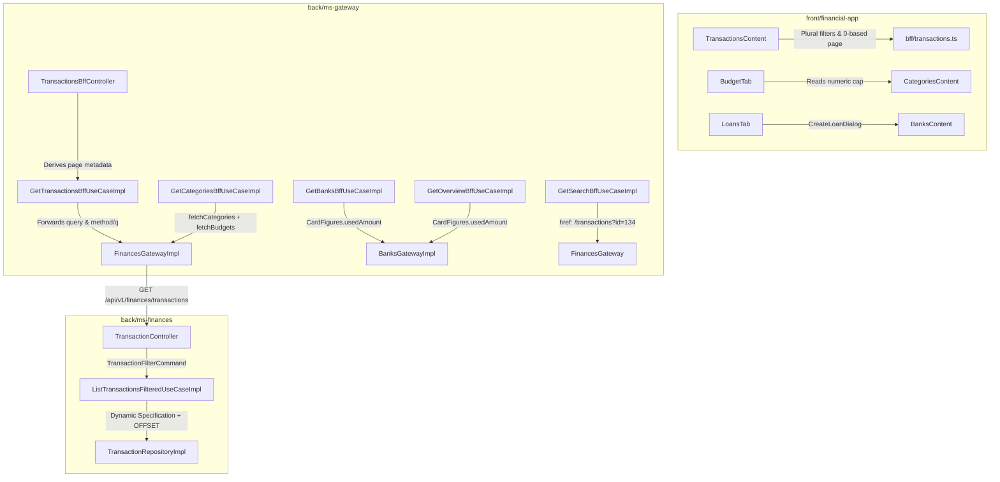

# Live Testing Bugfix Report

## Branches and repositories involved

| Repository | Base Branch | Working Branch |
|---|---|---|
| `Sergio-Smirnoff/financial-app` (parent) | `develop` | `chore/dev-overlay-opt-in` |
| `back/ms-finances` | `develop` | `hotfix/live-testing-issues` |
| `back/ms-gateway` | `develop` | `hotfix/live-testing-issues` |
| `front/financial-app` | `develop` | `hotfix/live-testing-issues` |

## Objective

Fix seven functional regressions and edge-case defects identified during manual live testing:
1. Category budget rows were not listed if no budget existed, and budgeted caps rendered as "Sin límite" due to reading `cat.cap.amount` instead of `cat.cap`.
2. Card tiles and card-debt KPIs reported $0.00 because ms-gateway read `card.usedBalance` instead of `card.usedAmount`.
3. Loans could not be created from the Bancos page loans tab (`/banks?tab=loans`).
4. Movements table filters (`categories`, `accounts`, `method`, `q`, `page`) were dropped or misaligned across frontend, gateway, and finances.
5. Inversiones page rendered an ugly blocking error box when the market strip was unavailable (empty table in ms-investments).
6. Global search movement hits navigated to `/transactions/<id>` which threw a 404.
7. Missing translations (`common.actions` in both locales, `newSubcategory` in `BudgetTab`).

## Connection to plans or specs

- Plan: [`docs/superpowers/plans/2026-09-20-live-testing-bugfix.md`](../superpowers/plans/2026-09-20-live-testing-bugfix.md)
- Specs & ideas: [`docs/specs/IDEAS.md`](../specs/IDEAS.md)

## Diagrams



## Goals

- **G1. A category created in the UI appears on `/categories` immediately, with no budget defined, and a budgeted category shows its numeric cap.** — `met`
- **G2. Card tiles and both card-debt KPIs report the amount ms-banks computed, not zero.** — `met`
- **G3. A loan can be created from `/banks?tab=loans` and appears in that tab without a reload.** — `met`
- **G4. Category, account, method, text and uncategorised filters each narrow the movements table, and page 2 shows different rows than page 1.** — `met`
- **G5. `/investments` loads with no "No pudimos cargar esta sección" banner when the market index table is empty, and every other section keeps its error state.** — `met`
- **G6. A search hit on a movement opens that movement's detail without a 404, and `/transactions/134` redirects instead of 404-ing.** — `met`
- **G7. The browser console is free of `Could not resolve` translation errors on `/investments` and `/categories`, in both locales.** — `met`
- **G8. Every gate is green on a bare runner and no contract drift remains.** — `met`

## What was done

1. **ms-finances (`back/ms-finances`):**
   - Extended `TransactionFilterCommand` and `TransactionFilter` to accept `List<CategoryId> categoryIds`, `List<Cbu> accountCbus`, `PaymentMethod paymentMethod`, and `String descriptionQuery`.
   - Updated `TransactionRepositoryImpl` to dynamically add specification predicates for list categories, list account CBUs, `COALESCE(payment_method, 'OTHER') = :method`, and case-insensitive description search `%q%`.
   - Added offset-based pagination to `TransactionRepositoryImpl` through `CursorPage(Integer page, Integer size)` while preserving cursor pagination priority.
   - Updated `TransactionController.list` to accept new request parameters and forward them.
   - Documented endpoints in `.ai/references/API.md` and updated `README.md` (including Flyway head `V26`).

2. **ms-gateway (`back/ms-gateway`):**
   - Added `method` and `q` to `TransactionQuery`, `GetTransactionsBffUseCase`, `TransactionsBffController`, and forwarded them in `FinancesGatewayImpl`.
   - Derived page metadata (`totalPages = (int) Math.ceil((double) totalElements / size)`) inside `GetTransactionsBffUseCaseImpl`.
   - Created `CardFigures` domain model with backward-compatible `usedAmount` resolver (`usedAmount` falling back to `usedBalance`) and updated `GetBanksBffUseCaseImpl` and `GetOverviewBffUseCaseImpl`.
   - Added `fetchCategories` to `FinancesGateway` and updated `GetCategoriesBffUseCaseImpl` to list unbudgeted categories alongside budgeted ones.
   - Updated `GetSearchBffUseCaseImpl` to generate movement search hit hrefs as `/transactions?id=<id>`.
   - Documented endpoints in `.ai/references/API.md`, `.ai/references/DOMAIN.md`, and `README.md`.

3. **Frontend (`front/financial-app`):**
   - Updated `openapi/gateway.json` with `method` and `q` parameters and regenerated `schema.d.ts` cleanly (`bff:check` 0 diff).
   - Updated `lib/api/bff/transactions.ts` and `lib/hooks/useTransactionsPage.ts` to forward `categories`, `accounts`, `method`, `q`, and map 1-based UI pages to 0-based gateway queries.
   - Wired `useQueryState('id', parseAsInteger)` in `TransactionsContent.tsx` to automatically open the transaction detail panel, and created `app/(dashboard)/transactions/[id]/page.tsx` redirect route.
   - Added `onAddLoan` prop to `LoansTab.tsx` and wired `CreateLoanDialog` in `BanksContent.tsx`.
   - Guarded `marketStrip?.status !== 'UNAVAILABLE'` in `InvestmentsContent.tsx` so missing market index data degrades gracefully without an error banner.
   - Added `"actions"` to `messages/es-AR.json` and `messages/en.json`, and updated `BudgetTab.tsx` to call `t('budget.addSubcategory')`.
   - Corrected `BudgetTab.tsx` to type rows as `BudgetRow` and parse `cat.cap` as a number.
   - Documented changes in `.ai/references/API_CLIENT.md` and `README.md`.

## Problems found

1. **Pre-existing Radix pointer-events lock in jsdom test:** `components/pages/investments/__tests__/InvestmentDialogs.test.tsx` fails when clicking submit on `RecordHoldingDialog` because `react-remove-scroll` applies `pointer-events: none` to `body` in jsdom. Documented in `IDEAS.md`.
2. **`BudgetTab` map parameter was typed as `any`:** Concealed property access mismatches (`cat.cap.amount`) from `tsc`. Resolved by typing as `BudgetRow`.
3. **`CursorPage` naming:** Now carries an offset parameter in addition to cursor. Renaming to a general window concept deferred to `IDEAS.md`.

## Files and commits touched

| Repo | Branch | Commit | Message |
|---|---|---|---|
| `back/ms-finances` | `hotfix/live-testing-issues` | `c858483` | `feat(finances): add list and method tx filters` |
| `back/ms-finances` | `hotfix/live-testing-issues` | `af8e1bb` | `feat(finances): support offset paging in tx list` |
| `back/ms-finances` | `hotfix/live-testing-issues` | `666607d` | `docs(finances): document transaction filters and paging` |
| `back/ms-gateway` | `hotfix/live-testing-issues` | `9066222` | `fix(gateway): forward transaction filters and page` |
| `back/ms-gateway` | `hotfix/live-testing-issues` | `9d5c7df` | `fix(gateway): read card usedAmount from ms-banks` |
| `back/ms-gateway` | `hotfix/live-testing-issues` | `49da597` | `fix(gateway): list categories without a budget` |
| `back/ms-gateway` | `hotfix/live-testing-issues` | `dcfe50d` | `fix(gateway): link search hits to /transactions` |
| `back/ms-gateway` | `hotfix/live-testing-issues` | `fc28bc1` | `docs(gateway): document transaction filters and paging` |
| `front/financial-app` | `hotfix/live-testing-issues` | `a6f8a8e` | `fix(front): send BFF transaction filter params` |
| `front/financial-app` | `hotfix/live-testing-issues` | `a98ddfe` | `fix(front): open transaction detail from url id` |
| `front/financial-app` | `hotfix/live-testing-issues` | `c79b3b8` | `feat(front): add loan creation to banks tab` |
| `front/financial-app` | `hotfix/live-testing-issues` | `bee5db0` | `fix(front): hide market strip when unavailable` |
| `front/financial-app` | `hotfix/live-testing-issues` | `ece8fba` | `fix(front): add missing i18n keys` |
| `front/financial-app` | `hotfix/live-testing-issues` | `e41b117` | `fix(front): render budget cap number` |
| `front/financial-app` | `hotfix/live-testing-issues` | `162209c` | `docs(front): document transaction filters and routing` |

## Verification evidence

### ms-finances (`mvn verify`)
```
[INFO] Results:
[INFO] 
[INFO] Tests run: 226, Failures: 0, Errors: 0, Skipped: 0
[INFO] 
[INFO] ------------------------------------------------------------------------
[INFO] BUILD SUCCESS
[INFO] ------------------------------------------------------------------------
[INFO] Total time:  8.529 s
```

### ms-gateway (`mvn verify`)
```
[INFO] Results:
[INFO] 
[INFO] Tests run: 110, Failures: 0, Errors: 0, Skipped: 0
[INFO] 
[INFO] ------------------------------------------------------------------------
[INFO] BUILD SUCCESS
[INFO] ------------------------------------------------------------------------
[INFO] Total time:  4.629 s
```

### front/financial-app (`npm run lint && npm run typecheck && npm run bff:check && npm run build`)
```
npm notice run financial-app@0.1.0 bff:check
npm notice run openapi-typescript openapi/gateway.json -o /tmp/schema.check.d.ts && diff -q /tmp/schema.check.d.ts lib/api/bff/schema.d.ts
✨ openapi-typescript 7.13.0
🚀 openapi/gateway.json → /tmp/schema.check.d.ts [50.1ms]
npm notice run financial-app@0.1.0 build
npm notice run next build
   ▲ Next.js 15.5.12
   Creating an optimized production build ...
 ✓ Compiled successfully in 7.7s
   Linting and checking validity of types     ✓ Linting and checking validity of types 
   Collecting page data     ✓ Collecting page data 
 ✓ Generating static pages (14/14)
   Collecting build traces     ✓ Collecting build traces 
   Finalizing page optimization     ✓ Finalizing page optimization 
```

### front/financial-app (`npm run i18n:check`)
```
npm notice run financial-app@0.1.0 i18n:check
npm notice run node scripts/i18n-check.mjs
i18n OK — 682 keys
```

## Contract changes

- `GET /api/v1/finances/transactions`: Added query parameters `categoryIds` (List<Long>), `accountCbus` (List<String>), `paymentMethod` (String), `q` (String), and `page` (Integer, 0-based).
- `GET /api/v1/bff/transactions`: Added query parameters `method` (String) and `q` (String). Derived response page metadata (`totalPages`).
- `FinancesGateway.fetchTransactions`: Updated method signature to accept `TransactionQuery`.
- `FinancesGateway.fetchCategories`: Added method to query `GET /api/v1/finances/categories`.
- `GetSearchBffUseCaseImpl`: Movement search hits now link to `/transactions?id=<id>` instead of `/transactions/<id>`.
- `app/(dashboard)/transactions/[id]/page.tsx`: Redirects `/transactions/:id` to `/transactions?id=:id`.

## Follow-ups and deferred work

All routed to `docs/specs/IDEAS.md`:
- `TransactionFilters.tsx:26` writes `page` as string `'1'` while `TransactionsContent.tsx:43` reads it with `parseAsInteger`.
- `lib/format/paymentMethod.ts` hardcodes Spanish labels.
- `TransactionsContent.tsx:75-78` `handleBulkCategorise` is a no-op.
- `npm run i18n:check` does not cross-reference keys used in code.
- ms-finances `CursorPage` carries offset and cursor.
- ms-finances `TransactionController` builds `DateRange` only when both `from` and `to` are present.
- N+1 `categoryRepository.findNamesById` in `TransactionController.list`.
- JaCoCo plugin missing in ms-finances and ms-gateway.
- Duplicate parse helpers across gateway BFF use cases.

## Results

All 7 live-testing bugfixes and functional defects have been resolved and verified with automated unit and integration tests across the polyrepo. Every modified repository builds and passes its verification suites without regressions.

## Other references

- Plan: `docs/superpowers/plans/2026-09-20-live-testing-bugfix.md`
- IDEAS: `docs/specs/IDEAS.md`
