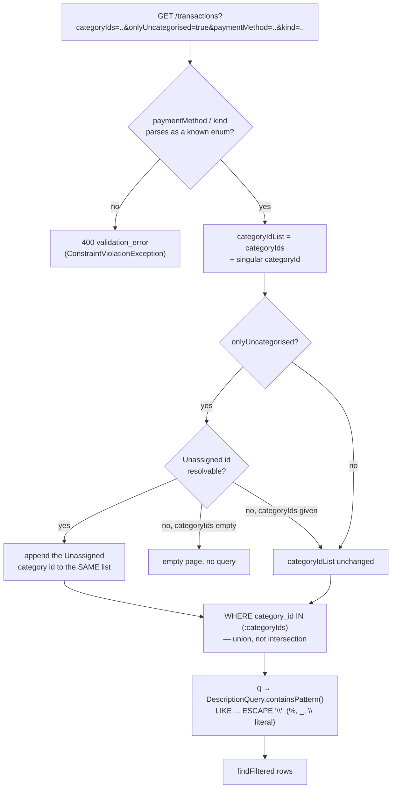

# Live-testing bugfix — Round B

## Branches and repositories involved

| Repo | Branch | Base |
|---|---|---|
| `back/ms-finances` | `hotfix/live-testing-round-b` | `develop` @ `286d82c` |
| `back/ms-gateway` | `hotfix/live-testing-round-b` | `develop` @ `e63487a` |
| `front/financial-app` | `hotfix/live-testing-round-b` | `develop` @ `930ff9b` |
| `financial-app` (parent) | `hotfix/live-testing-round-b` | `chore/dev-overlay-opt-in` |

All four branches are local only — none pushed (R11).

## Objective

Round A (`docs/superpowers/plans/2026-09-20-live-testing-bugfix.md`) fixed the first live-testing
pass but review of its diffs surfaced 7 MAJOR-severity gaps: category-filter semantics that
silently intersected instead of unioned, an unescaped `LIKE` search, an unhonest cursor/offset
mix, a silently-ignored bad `paymentMethod`, budget rows that dropped uncategorised/unbudgeted
categories, a stale `usedBalance` phantom key, and two frontend regressions (holding-form input
loss, an unvalidated `/transactions/[id]` route) — plus the frontend suite red since `fa4dc02`.
Round B (`docs/superpowers/plans/2026-09-21-live-testing-round-b.md`, Tasks 1–9) fixed all seven
and made the frontend suite green for the first time since that regression. Task 10 (this report)
closes the round: it corrects every backend/frontend reference doc the new behaviour invalidated,
updates both READMEs, routes what deliberately went unfixed into `docs/specs/IDEAS.md`, and writes
this development report with fresh, pasted gate evidence. A final whole-branch review then found
four more items (two Important, two Minor folded in); the **final review fix wave** closed them and
re-ran every gate — its commits and fresh numbers are recorded below.

## Connection to plans or specs

- Plan: `docs/superpowers/plans/2026-09-21-live-testing-round-b.md` (this round, Tasks 1–10).
- Predecessor: `docs/superpowers/plans/2026-09-20-live-testing-bugfix.md` (Round A) and its report
  `docs/reports/develop_hotfix_2026-09-20_live-testing-bugfix.md` (referenced by the plan as the
  source of the 7 MAJOR findings this round fixes).
- Process rule this round satisfies for the first time: `docs/specs/IDEAS.md` § "Process rule —
  live verification" — Round A's G8 ("frontend suite green") is only now claimable.

## Diagrams

Branch/commit chain per repo (Task 10's doc commits, then the final review fix wave, close each
chain):

```
back/ms-finances   develop@286d82c ─┬ 1309747 fix: union uncategorised with categories
                                     ├ c4adaa3 fix: escape LIKE wildcards in search
                                     ├ 879047f refactor: make CursorPage offset honest
                                     ├ 6ed026d fix: reject unknown payment methods
                                     ├ 84dcb83 test: pin legacy account branch guard
                                     ├ db1bf2e test: pin every legacy guard parameter
                                     ├ 9e4e274 docs: record filter and paging rules   (Task 10)
                                     ├ 9c1b251 test: pin the search contains pattern  (final fix wave)
                                     ├ e26d640 fix: keep categories if unassigned missing (final fix wave)
                                     └ 08b9491 docs: note the unassigned fallback      (final fix wave)

back/ms-gateway    develop@e63487a ─┬ e28b1d4 fix: encode downstream query params
                                     ├ 657e0ab fix: list subcategories without budgets
                                     ├ 5b25e00 chore: drop usedBalance and dead code
                                     ├ 1386897 docs: correct BFF reference and ports  (Task 10)
                                     ├ d3a6277 docs: scope the encoding note          (Task 10 review)
                                     ├ f786526 feat: expose parentId on budget rows   (final fix wave)
                                     └ 33b0345 docs: document budget row parentId     (final fix wave)

front/financial-app develop@930ff9b┬ 4184216 fix: keep holding form input on refetch
                                     ├ c4f26c0 test: tighten bugfix assertions
                                     ├ d305e65 fix: validate transaction id route
                                     ├ 0f15a6d docs: record url and degrade contracts (Task 10)
                                     ├ f2367b4 fix: hide add-subcategory on child rows (final fix wave)
                                     ├ b42f537 fix: tighten the transaction id route  (final fix wave)
                                     └ 5c991e5 docs: record parentId and id route rule (final fix wave)
```

Category-filter union semantics fixed by Task 1, and the paymentMethod/kind validation fixed by
Task 4, as they now compose inside `TransactionController.list` / `TransactionRepositoryImpl.findFiltered`:



## Goals

Restated verbatim from the plan, each marked `met` / `not-met` / `partial`:

- **G1. Every movements filter returns the rows that actually match — including a search term
  containing `&`, `=`, `%`, `_`, a brace or an accent, and "Sin categorizar" selected alongside a
  real category.** — **partial.** The automated half is met: `mvn -f back/ms-finances/pom.xml
  verify` and `mvn -f back/ms-gateway/pom.xml verify` both pass green in full (see Verification
  evidence), including `uncategorisedIsUnionedWithTheSelectedCategories`,
  `findFilteredBindsAnEscapedContainsPatternWithAnEscapeClause`, and the three
  `FinancesGatewayImplTest` encoding cases. The manual half — searching `Bed & Bath` and `50%`
  against a running stack — was **not run** in this round (no task brought the stack up); routed
  to Follow-ups.
- **G2. Anything the user creates in the categories tree is visible on `/categories` immediately,
  budgeted or not, and its cap renders as a number.** — **partial.** `mvn -f
  back/ms-gateway/pom.xml verify` (`subcategoriesAreListedEvenWithoutABudget`,
  `everyCategoryIsListedEvenWithoutABudget`) and `npm run test:run` (which includes `npx vitest
  run components/pages/categories`) both pass. Manually creating a subcategory through
  `CreateCategoryDialog` against a running stack was **not run**; routed to Follow-ups.
- **G3. No user-supplied value can alter, crash or silently empty the internal call chain.** —
  **partial.** `mvn -f back/ms-gateway/pom.xml verify`
  (`fetchTransactionsDoesNotLetTheQueryInjectExtraParameters`,
  `fetchTransactionsEncodesBracesInsteadOfTreatingThemAsUriVariables`) and `mvn -f
  back/ms-finances/pom.xml verify` (`listRejectsAnUnknownPaymentMethod`,
  `listRejectsAnUnknownKind`) pass. **The "silently empty" clause is not met on the BFF path for an
  invalid `method`:** ms-finances now answers 400, but `FinancesGatewayImpl.fetchTransactions`
  ends in `onErrorReturn(Map.of())` (a declared non-goal of this round, already routed to
  `IDEAS.md`), so the gateway turns that 400 into an `OK` section holding an empty page — the user
  still sees a silently empty table. G3 is therefore `partial` for that path even once the live
  check is run. Hitting `/transactions/abc` on a running stack was **not run**; routed to
  Follow-ups (the route itself is now unit-pinned: `app/(dashboard)/transactions/[id]/__tests__/page.test.ts`).
- **G4. Input a user has already typed or navigated to survives — a banks refetch does not clear
  the holding form, and a transaction id in the URL opens its panel.** — **partial.** `npm run
  test:run` includes and passes `InvestmentDialogs.test.tsx`'s `keeps typed quantity when the
  banks query returns a new array`. Alt-tabbing mid-entry against a running app was **not run**;
  routed to Follow-ups.
- **G5. The frontend suite is green for the first time since `fa4dc02`, and Round A's G8 becomes
  claimable.** — **met.** `npm run test:run` reports `Test Files 66 passed (66)` and `Tests 255
  passed (255)`, 0 failed, after the final review fix wave (see Verification evidence; Task 10's
  own run was `64`/`243` — the plan text says 242, Task 9 added one `it()`, and the fix wave added
  two files and twelve tests). `npm run lint`, `npm run typecheck`, `npm run i18n:check`, `npm run bff:check` and `npm
  run build` all exited 0 in this session.
- **G6. The regressions this round fixes cannot silently return: every new behaviour fails its
  test when reverted, and the two load-bearing invariants Round A left unguarded are pinned.** —
  **met.** Evidence gathered from the executing tasks' own reports (mutation checks are not
  re-run in Task 10 — re-running them would mean re-breaking working code for no new signal):
  - Task 4 (`task-4-report.md`): removing `&& page == null` from the legacy-branch guard turned
    `anyFilterParameterLeavesTheLegacyAccountBranch`'s `page` case red
    (`Tests run: 6, Failures: 1`); restored immediately, `git diff` showed no residual change.
  - `theOffsetComponentIsARowOffsetAndSurvivesReconstruction` is part of the 249 passing tests in
    the final fix wave's fresh `mvn -f back/ms-finances/pom.xml verify` run.
  - Final fix wave: reverting `searchByDescription` to pass the raw query turned
    `searchByDescriptionPassesAnEscapedContainsPattern` red (`Tests run: 9, Failures: 1`); reverting
    `/transactions/[id]/page.tsx` to its pre-validation redirect turned 9 of 10 cases of the new
    route test red. Both reverts undone before commit.
  - Task 7 (`task-7-report.md`): reverting the `usedAmount`/`usedBalance` key swap back to the
    phantom key turned `debt` from `20000.00` to `5000.00` (`OverviewBffTest`,
    `Tests run: 6, Failures: 1`); revert undone before commit.
  - Task 9 (`task-9-report.md`): renaming `esAR.common.actions` to a typo'd key with the `as any`
    casts removed failed `npm run typecheck` (`TS2339`, `EXIT:2`); restoring the correct key
    returned `EXIT:0`.
- **G7. Nothing in the two batches now claims a contract or a type that does not exist.** —
  **met.** `grep -rn "usedBalance" back/ms-gateway/src` → no matches. `grep -rn "as any"
  front/financial-app/lib/__tests__/i18n.test.tsx` → no matches. `grep -n "PageMetadata"
  back/ms-gateway/.ai/references/DOMAIN.md` → no matches (fixed by this task, see Contract
  changes). `.ai/references/API.md` (ms-gateway) now lists ms-banks among the transactions BFF's
  downstreams (fixed by this task).

## What was done

**ms-finances (Tasks 1–4, `1309747`…`db1bf2e`):**
- `1309747` — `categoryIds`/`onlyUncategorised` union: the Unassigned category id is appended to
  the same `categoryIdValues` list used for `IN (:categoryIds)`, instead of being handled as a
  separate exclusive branch.
- `c4adaa3` — `DescriptionQuery.containsPattern()` escapes `\`, `%`, `_` (backslash first) before
  wrapping in `%…%`; both `findFiltered` and `searchByDescription` bind it with `ESCAPE '\\'`.
- `879047f` — `CursorPage.ofPage(cursorAfter, size, pageNumber)` makes the offset an honest row
  offset instead of re-multiplying on every reconstruction; cursor and offset are mutually
  exclusive by construction.
- `6ed026d` — `paymentMethod` and `kind` now go through a shared `parseEnumParam` helper that
  throws `ConstraintViolationException` (→ 400 `validation_error`) on an unrecognised value,
  replacing the previous silent-ignore (`paymentMethod`) and 404-via-`IllegalArgumentException`
  (`kind`) behaviours.
- `84dcb83`, `db1bf2e` — extended `anyFilterParameterLeavesTheLegacyAccountBranch` from 5 to all
  12 guard parameters (review fix).

**ms-gateway (Tasks 5–7, `e28b1d4`…`5b25e00`):**
- `e28b1d4` — `FinancesGatewayImpl.fetchTransactions` now builds its `UriComponentsBuilder` and
  calls `.build().encode().toUri()`, percent-encoding every forwarded filter value.
- `657e0ab` — `GetCategoriesBffUseCaseImpl` walks every category (not just budgeted ones) and
  every subcategory, emitting a `BudgetRow` per node; subcategory rows get a synthetic
  `"<parent> / <child>"` name.
- `5b25e00` — `CardFigures.usedAmount` drops the `usedBalance` fallback (ms-banks never sends that
  key); `GetTransactionsBffUseCaseImpl` drops a redundant `query.size() > 0` guard (already
  enforced in `TransactionQuery`'s canonical constructor) and the now-unused `parseInt` helper.

**front/financial-app (Tasks 8–9, `4184216`…`d305e65`):**
- `4184216` — `RecordHoldingDialog` no longer resets the typed quantity when the `banks` TanStack
  Query result is a new array with the same values (identity-only change from a refetch).
- `c4f26c0` — tightened `OverviewBffTest`/`SearchBffTest` assertions (see G6 evidence above) and
  removed the `as any` casts around `i18n.test.tsx`'s `common.actions` lookup.
- `d305e65` — `/transactions/[id]/page.tsx` validates the path id is a positive integer
  (`notFound()` otherwise) before redirecting to `/transactions?id=<id>`.

**Task 10 (this task) — docs and report:**
- `9e4e274` (ms-finances) — `API.md`'s transactions row now states the union semantics, the
  literal `q` match, the 400 on an unrecognised `paymentMethod`, and `page`-only-without-`cursor`;
  `DOMAIN.md` gained `DescriptionQuery` and `CursorPage.ofPage`; `.ai/AGENTS.md`'s load-bearing
  facts gained the opt-in offset mode; `README.md`'s endpoint table mirrors the same parameter
  list.
- `1386897` (ms-gateway) — `API.md` fixed the wrong downstream list (added ms-banks) and the
  missing `=` after `&secondary`, and gained a new "BFF composition notes" section
  (`fetchCategories` port, the budget-merge/`"parent / child"` rule, `CardFigures`, the
  `/transactions?id=` search-hit contract, and percent-encoding); `DOMAIN.md` replaced the
  nonexistent `PageMetadata` name with `BffDomainModels.TransactionsPage`; `README.md` gained
  `TransactionQuery.java`/`CardFigures.java` in the file tree and refreshed the `FinancesGateway`
  line.
- `0f15a6d` (front) — `API_CLIENT.md` reworded the plural/singular filter-parameter claim and
  added the `?id=` contract, `LoansTabProps.onAddLoan`, and the market-strip degrade rule;
  `README.md` gained a "Recent UX Fixes (2026-09-21)" entry.
- `docs/specs/IDEAS.md` gained a new "Tech-debt — found during live-testing Round B (2026-09-21)"
  section (the 11 items the plan named as deliberately unfixed, plus 3 items surfaced during this
  task: the triplicated blank/trim search rule, the remaining `parseDecimal`-family duplicates
  beside `CardFigures`, and pre-existing R9 comment/Javadoc in ms-finances).
- This report.

**Final review fix wave (after the whole-branch review):**
- `9c1b251` (ms-finances) — `TransactionRepositoryImplQueryTest.searchByDescriptionPassesAnEscapedContainsPattern`
  pins that `/transactions/search` binds `DescriptionQuery.containsPattern()` (`"50%"` →
  `%50\%%`); before it, reverting to the raw query stayed green and search would have become
  exact-match.
- `e26d640` (ms-finances) — `findFiltered` no longer returns an empty page when the Unassigned
  category cannot be resolved but `categoryIds` were selected; under union semantics it filters by
  the selected ids alone. With `onlyUncategorised` and no `categoryIds` it still returns an empty
  page without querying. Two tests pin both branches.
- `08b9491` (ms-finances) — `API.md` and `README.md` state the fallback.
- `f786526` (ms-gateway) — `BudgetRow`/`BudgetRowResponse` gained a nullable `parentId`, set on
  subcategory rows by `GetCategoriesBffUseCaseImpl` and `null` on root and orphan rows;
  `CategoriesBffTest.subcategoryRowsCarryTheirParentIdAndRootRowsDoNot` pins all three.
- `33b0345` (ms-gateway) — `API.md` budget-merge note documents `parentId`.
- `f2367b4` (front) — `openapi/gateway.json` re-dumped from the patched gateway (only diff:
  `BudgetRowResponse.parentId`), `schema.d.ts` regenerated with `npm run bff:types`, the categories
  fixture gained a root row and a `parentId`-carrying subcategory row, and `BudgetTab` renders
  "+ Subcategoría" only when `parentId` is null — it used to show on subcategory rows, where
  ms-finances' `CreateSubcategoryUseCaseImpl` always 404'd. `BudgetTab.test.tsx` pins it.
- `b42f537` (front) — `/transactions/[id]` now validates with `/^[1-9]\d{0,15}$/` (rejecting
  `1e3`, `0x1A`, `" 5 "`, `01`, over-long ids that `Number()` accepted) and redirects with the
  validated string; `page.test.ts` pins `notFound()` for bad ids and `redirect('/transactions?id=12')`.
- `5c991e5` (front) — `API_CLIENT.md` documents `parentId` and the id rule; `README.md`'s route row
  matches the id rule.
- Parent — this report and `docs/specs/IDEAS.md` (the R9 entry gains the two `//` comments inside
  `findFiltered`; two new entries: the inline-FQN mock in `TransactionRepositoryImplQueryTest`, and
  orphan budget rows that are really subcategories).

## Problems found

Carried over from the plan's "Problems to consider" (all resolved as designed, restated for the
record):
1. Union semantics are a product decision — chosen because it is the only reading under which
   both "Sin categorizar" and a real category chip can be active without an always-empty table.
2. Two response codes changed: unknown `paymentMethod` (silent-ignore → 400) and unknown `kind`
   (404 → 400). Both are intentional and listed under Contract changes.
3. `BudgetRow` still has a single `name` field. Task 6 left out `parentId`, but the final review
   showed the front needs it (the add-subcategory action was offered on child rows and always
   failed), so the final fix wave added it — see Contract changes.
4. `DescriptionQuery` touches both `TransactionFilter` and `TransactionFilterCommand`, and the
   JPQL escape change also affects `/transactions/search`; verified via the full `mvn verify` run
   (both `TransactionRepositoryImplQueryTest` and `SearchTransactionsUseCaseImplTest` pass).
5. `ESCAPE '\'` needed the backslash doubled in the Java text block; Hibernate accepted it as-is
   on the configured dialect (no fallback character was needed).
6. Task 8's holding-form fix is a genuine production fix, not a test-only repair.
7. Task 7 step 2 was expected to pass before the production change (non-discriminating baseline);
   step 4's temporary revert is the meaningful check.
8. No JaCoCo in ms-finances or ms-gateway — not claimed as a coverage gate anywhere in this round.

New, found while writing this task's docs:
9. The task brief's Step 6 command for ms-finances (`git add … .ai/AGENTS.md …`) targets a file
   that `.gitignore`'s bare `AGENTS.md` pattern excludes in all three repos (it matches the
   nested `.ai/AGENTS.md`, not just a hypothetical root symlink — no root `AGENTS.md` exists in
   any of the three repos). Committed with `git add -f` to honour the brief's explicit intent;
   routed to `IDEAS.md` as a `.gitignore` scoping bug.
10. `CursorPage.java` does not currently carry a class-top Javadoc comment (unlike
    `TransactionKind`, `CategoryId` and `Money`, which do) — the IDEAS.md entry for the R9
    Javadoc cleanup was written to name only the three confirmed cases.

## Files and commits touched

| Repo | Branch | Commit |
|---|---|---|
| back/ms-finances | hotfix/live-testing-round-b | `1309747` fix(finances): union uncategorised with categories |
| back/ms-finances | hotfix/live-testing-round-b | `c4adaa3` fix(finances): escape LIKE wildcards in search |
| back/ms-finances | hotfix/live-testing-round-b | `879047f` refactor(finances): make CursorPage offset honest |
| back/ms-finances | hotfix/live-testing-round-b | `6ed026d` fix(finances): reject unknown payment methods |
| back/ms-finances | hotfix/live-testing-round-b | `84dcb83` test(finances): pin legacy account branch guard |
| back/ms-finances | hotfix/live-testing-round-b | `db1bf2e` test(finances): pin every legacy guard parameter |
| back/ms-finances | hotfix/live-testing-round-b | `9e4e274` docs(finances): record filter and paging rules |
| back/ms-gateway | hotfix/live-testing-round-b | `e28b1d4` fix(gateway): encode downstream query params |
| back/ms-gateway | hotfix/live-testing-round-b | `657e0ab` fix(gateway): list subcategories without budgets |
| back/ms-gateway | hotfix/live-testing-round-b | `5b25e00` chore(gateway): drop usedBalance and dead code |
| back/ms-gateway | hotfix/live-testing-round-b | `1386897` docs(gateway): correct BFF reference and ports |
| front/financial-app | hotfix/live-testing-round-b | `4184216` fix(front): keep holding form input on refetch |
| front/financial-app | hotfix/live-testing-round-b | `c4f26c0` test(front): tighten bugfix assertions |
| front/financial-app | hotfix/live-testing-round-b | `d305e65` fix(front): validate transaction id route |
| front/financial-app | hotfix/live-testing-round-b | `0f15a6d` docs(front): record url and degrade contracts |
| back/ms-gateway | hotfix/live-testing-round-b | `d3a6277` docs(gateway): scope the encoding note |
| financial-app (parent) | hotfix/live-testing-round-b | `310cfae` docs: report live-testing round B |
| **Final review fix wave** | | |
| back/ms-finances | hotfix/live-testing-round-b | `9c1b251` test(finances): pin the search contains pattern |
| back/ms-finances | hotfix/live-testing-round-b | `e26d640` fix(finances): keep categories if unassigned missing |
| back/ms-finances | hotfix/live-testing-round-b | `08b9491` docs(finances): note the unassigned fallback |
| back/ms-gateway | hotfix/live-testing-round-b | `f786526` feat(gateway): expose parentId on budget rows |
| back/ms-gateway | hotfix/live-testing-round-b | `33b0345` docs(gateway): document budget row parentId |
| front/financial-app | hotfix/live-testing-round-b | `f2367b4` fix(front): hide add-subcategory on child rows |
| front/financial-app | hotfix/live-testing-round-b | `b42f537` fix(front): tighten the transaction id route |
| front/financial-app | hotfix/live-testing-round-b | `5c991e5` docs(front): record parentId and id route rule |
| financial-app (parent) | hotfix/live-testing-round-b | *(this report + IDEAS.md — committed after this file is written)* |

Task 10's own file changes:
- `back/ms-finances/.ai/references/API.md`, `.ai/references/DOMAIN.md`, `.ai/AGENTS.md`,
  `README.md`
- `back/ms-gateway/.ai/references/API.md`, `.ai/references/DOMAIN.md`, `README.md`
- `front/financial-app/.ai/references/API_CLIENT.md`, `README.md`
- `docs/specs/IDEAS.md` (parent)
- `docs/reports/develop_hotfix_2026-09-21_live-testing-round-b.md` (this file, parent)

## Verification evidence

All gate output below is from fresh runs after the final review fix wave (2026-09-22), superseding
Task 10's numbers (246 / 114 backend tests, 64 files / 243 frontend tests).

**`mvn -f back/ms-finances/pom.xml verify`**:
```
[INFO] Running com.financialapp.finances.architecture.LayeredArchitectureTest
[INFO] Tests run: 5, Failures: 0, Errors: 0, Skipped: 0, Time elapsed: 0.561 s -- in com.financialapp.finances.architecture.LayeredArchitectureTest
[INFO]
[INFO] Results:
[INFO]
[INFO] Tests run: 249, Failures: 0, Errors: 0, Skipped: 0
[INFO]
[INFO] --- spring-boot:3.4.2:repackage (repackage) @ ms-finances ---
[INFO] ------------------------------------------------------------------------
[INFO] BUILD SUCCESS
[INFO] ------------------------------------------------------------------------
[INFO] Total time:  8.741 s
```

**`mvn -f back/ms-gateway/pom.xml verify`**:
```
[INFO] Running com.financialapp.gateway.architecture.LayeredArchitectureTest
[INFO] Tests run: 3, Failures: 0, Errors: 0, Skipped: 0, Time elapsed: 1.180 s -- in com.financialapp.gateway.architecture.LayeredArchitectureTest
[INFO]
[INFO] Results:
[INFO]
[INFO] Tests run: 115, Failures: 0, Errors: 0, Skipped: 0
[INFO]
[INFO] --- spring-boot:3.4.2:repackage (repackage) @ ms-gateway ---
[INFO] ------------------------------------------------------------------------
[INFO] BUILD SUCCESS
[INFO] ------------------------------------------------------------------------
[INFO] Total time:  12.618 s
```

**`npm run lint`** (front/financial-app) — `EXIT:0`. 31 pre-existing warnings
(`@typescript-eslint/no-unused-vars`, `react-hooks/exhaustive-deps`, one
`jsx-a11y/role-has-required-aria-props`), none in a file the fix wave touched, zero errors.

**`npm run typecheck`** — `EXIT:0` (`tsc --noEmit`, no output).

**`npm run i18n:check`** — `EXIT:0`:
```
i18n OK — 682 keys
```

**`npm run bff:check`** — `EXIT:0`:
```
✨ openapi-typescript 7.13.0
🚀 openapi/gateway.json → /tmp/schema.check.d.ts [61ms]
```
(`diff -q` against `lib/api/bff/schema.d.ts` reported no difference.)

**`npm run test:run`** — `EXIT:0`:
```
 Test Files  66 passed (66)
      Tests  255 passed (255)
   Start at  17:19:19
   Duration  14.05s (transform 5.13s, setup 10.00s, import 83.56s, tests 29.30s, environment 51.16s)
```

**`npm run build`** — `EXIT:0`. All 14 routes compiled (`/transactions/[id]` present as dynamic
`ƒ`), no type-check failure, no build error:
```
Route (app)                                 Size  First Load JS
┌ ○ /                                    2.72 kB         207 kB
├ ○ /_not-found                          1.01 kB         103 kB
├ ○ /banks                               55.9 kB         300 kB
├ ○ /categories                          14.6 kB         245 kB
├ ○ /design-preview                      11.7 kB         242 kB
├ ○ /imports                             14.5 kB         207 kB
├ ○ /investments                         11.5 kB         259 kB
├ ƒ /investments/holdings/[id]           3.06 kB         215 kB
├ ○ /loans                               7.34 kB         237 kB
├ ○ /login                               8.34 kB         135 kB
├ ○ /register                            5.16 kB         160 kB
├ ○ /settings                            10.7 kB         198 kB
├ ○ /transactions                        4.81 kB         246 kB
└ ƒ /transactions/[id]                     130 B         102 kB
```

## Contract changes

- **`GET /api/v1/finances/transactions` — `categoryIds` + `onlyUncategorised` are unioned, not
  intersected.** Selecting "Sin categorizar" alongside a real category id now returns both sets
  instead of an always-empty page.
- **`GET /api/v1/finances/transactions` — an unrecognised `paymentMethod` or `kind` now returns
  400 `validation_error`**, replacing the previous silent-ignore (`paymentMethod`) and 404
  `resource_not_found` (`kind`, via `GlobalExceptionHandler`'s catch-all
  `IllegalArgumentException` → 404 mapping).
- **New value object `DescriptionQuery`** (`domain/model/transaction/DescriptionQuery.java`):
  wraps the `q` search parameter, escapes `%`, `_` and `\` so they match literally, trims and
  rejects blank. Threaded through `TransactionFilter` and `TransactionFilterCommand` (both
  records gained a field).
- **`CursorPage` gained a `CursorPage.ofPage(cursorAfter, size, pageNumber)` factory** and a
  third component, `offset` — a genuine row offset (not re-derived on every reconstruction),
  mutually exclusive with `cursorAfter`. `page` is honoured only when `cursor` is absent.
- **`GetCategoriesBffUseCaseImpl` now emits a `BudgetRow` for every category and subcategory**,
  budgeted or not (previously only categories with a matching budget appeared). Subcategory rows
  carry a synthetic `"<parent name> / <child name>"` in `BudgetRow.name`.
- **`BudgetRow` / `BudgetRowResponse` gained a nullable `parentId` (Long)** (final fix wave) —
  additive and backward-compatible: the parent category's id on subcategory rows, `null` on
  root-category rows and on orphan budget rows. `openapi/gateway.json` and `schema.d.ts` in the
  front were regenerated for it. The front uses it to offer "+ Subcategoría" on root rows only.
- **`GET /api/v1/finances/transactions` — `onlyUncategorised` with an unresolvable Unassigned
  category** (final fix wave): with `categoryIds` it now filters by those ids alone instead of
  returning an empty page; alone it still returns an empty page.
- **Frontend `/transactions/[id]`** (final fix wave) accepts only `/^[1-9]\d{0,15}$/`; ids such as
  `1e3`, `0x1A`, `" 5 "` or `01`, which `Number()` used to accept, now 404.
- **`CardFigures.usedAmount` no longer falls back to the `usedBalance` key.** ms-banks never sent
  that key; the fallback was dead code that could mask a real `usedAmount` regression. Any caller
  still relying on `usedBalance` will now see `0` instead of a phantom figure.
- **`ms-gateway` downstream query values are now percent-encoded** (`FinancesGatewayImpl.fetchTransactions`
  builds its URI via `UriComponentsBuilder...build().encode().toUri()`), closing a query-injection
  surface where a raw `&`/`=`/`{`/`}` in a filter value could alter or crash the downstream call.
- No Kafka event schema, migration, or DTO wire-shape outside the above changed.

## Follow-ups and deferred work

Routed to `docs/specs/IDEAS.md` under "Tech-debt — found during live-testing Round B
(2026-09-21)" (11 items from the plan's Step 4, plus 3 more found while writing these docs — the
search-rule triplication, the remaining `parseDecimal`-family duplicates, and the pre-existing R9
comment/Javadoc in ms-finances) and under the standalone `.gitignore` bug entry.

Not routed to IDEAS.md, but explicitly open from this task:
- **G1–G4's manual/live-app verification clauses were not executed this round.** No task in Round
  B brought the stack up; the automated-test half of each goal is met, the "in the running app…"
  half is not. Per the existing `IDEAS.md` process rule ("No wave may report a live-verification
  goal met without pasted run output"), these goals stay `partial` until someone runs
  `npm run e2e:live` (or an equivalent manual pass) against a live stack and pastes the output.
- **Merge decision.** Per this task's explicit instructions, Step 7 ("stop and ask" whether to
  merge each branch to `develop` or open a PR) is skipped — the controller handles merge/push
  decisions, not this task.

## Results

Round B closes all 7 MAJOR findings from the Round A review with unit/slice-test evidence, plus
the four items of the final whole-branch review, and the frontend suite is green (`Test Files 66
passed (66)`, `Tests 255 passed (255)`) for the first time since `fa4dc02` — Round A's G8 is now
claimable. Both backend services build and verify green (249 and 115 tests respectively, 0
failures). All reference docs Round A left stale or wrong
are corrected across the three service repos, and the backlog now records exactly what this round
deliberately left unfixed. The gaps against the plan's own goals are the live-app manual
verification clause on G1–G4, which no task in this round executed, and G3's BFF path for an
invalid `method`, which stays silently empty until the gateway's `onErrorReturn(Map.of())` is
replaced (routed to `IDEAS.md`).

## Other references

- Plan: `docs/superpowers/plans/2026-09-21-live-testing-round-b.md`
- Task briefs and reports: `.superpowers/sdd/2026-09-21-live-testing-round-b/task-{1..10}-{brief,report}.md`
- Mutation-check evidence cited in G6: `task-4-report.md` (legacy guard), `task-7-report.md`
  (`usedAmount`/`usedBalance` key revert), `task-9-report.md` (`common.actions` typecheck RED/GREEN)
- Round A plan and report: `docs/superpowers/plans/2026-09-20-live-testing-bugfix.md`,
  `docs/reports/develop_hotfix_2026-09-20_live-testing-bugfix.md`
- Report structure: `.ai/references/REPORTS_STRUCTURE.md`; goal structure: `.ai/references/GOALS_STRUCTURE.md`
