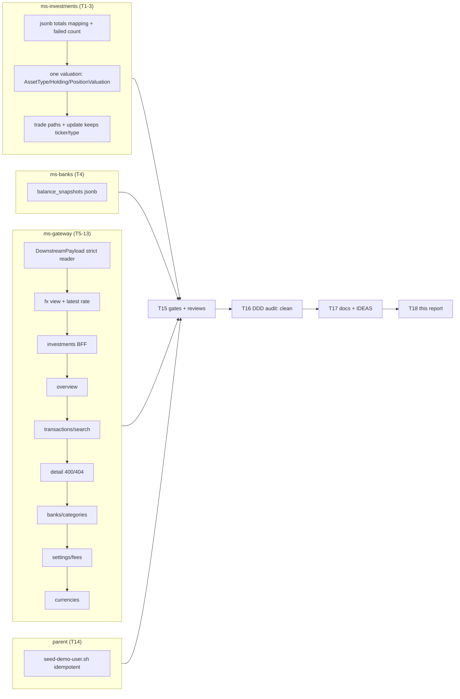

# Live-testing Round C1 backend remediation

## Branches and repositories involved

| Repository | Branch | Base |
|---|---|---|
| `back/ms-investments` | `hotfix/live-testing-round-c` | `develop` @ `3bee88c` |
| `back/ms-banks` | `hotfix/live-testing-round-c` | `develop` @ `c1e0283` |
| `back/ms-gateway` | `hotfix/live-testing-round-c` | `develop` @ `5e4dd34` |
| parent `financial-app` (worktree `../financial-app-round-c`) | `hotfix/live-testing-round-c` | `develop` @ `ae18f03` |

Not touched: `front/financial-app` (proved unchanged by the OpenAPI diff), `ms-finances`, `ms-users`, `ms-upload`, `ms-notifications` (read for DTO shapes only). The branches are **not merged, not pushed, not released**. The production server is still on v1.3.0.

User decisions of 2026-09-28: **D16 accepted** (holding edit fix lands in C1), **D12 accepted** (demo seed lands in C1), **D10** = the ms-upload ownership hole is fixed by a separate security hotfix right after C1 merges. Every other D-default in the plan is in force.

## Objective

Make the production backend report real numbers again. Portfolio and balance snapshots are stored (they were rejected by PostgreSQL's jsonb type). Bonds are valued per 100 nominal through one implementation. Every audited BFF field reads the key its downstream actually sends, and degrades to `UNAVAILABLE` instead of a silent zero. Currency views convert. Bad transaction ids get 400/404. The demo seed is idempotent.

## Connection to plans or specs

- Plan: `docs/superpowers/plans/2026-09-28-live-testing-round-c1-backend.md` (no separate spec; authority was memory `project-round-c-decisions` plus the one-screen spec rev 4 as context).
- Unblocks A1 (`docs/superpowers/plans/2026-09-27-a1-catch-up-endpoints.md`, dependency P3). The A1 branch `feature/catch-up-endpoints` in ms-investments must **rebase onto `develop` after this merges and keep `SnapshotCaptureResult`**.
- Precedes the one-screen spec Part A/B; Part A drops the holding-edit item (D16) and the `fetchFxRates` swallow item.
- Follow-ups are routed to `docs/specs/IDEAS.md` (section "Tech-debt — found during live-testing Round C1").

## Diagrams



```
Round C1
├── ms-investments   6 code/doc commits   G1 G2 G3
├── ms-banks         2 commits            G1
├── ms-gateway      12 commits            G4 G5 G6 G7
└── parent           4 commits (seed, review fix, IDEAS)   G8
```

## Goals

Statuses reflect unit/integration evidence only. **No live check (LG1-LG10) has run: they are Task 20, after release and deploy, which have not happened.** Every goal that names an LG check is therefore `partial`, and its missing part is that live check.

| Goal | Status | Evidence / what is missing |
|---|---|---|
| G1 | partial | Unit/IT half met: ms-investments 376/376 and ms-banks 41/41 green (`PortfolioSnapshotRepositoryImplJpaTest`, `CapturePortfolioSnapshotUseCaseImplTest`, `SchedulerTest`, `BalanceSnapshotRepositoryImplIT`). The live-Postgres half is not proven: H2 is a surrogate. Missing: LG3, Task 20. |
| G2 | partial | Unit half met (`PositionValuationTest` and the read/write path tests, 376/376). Missing: LG2 (AO29 = 904 779,00 live), Task 20. |
| G3 | met | `UpdateHoldingUseCaseImplTest.execute_keepsTheEditedTickerAndAssetType_andMovesNoMoneyWithoutAFundingCbu` green in 376/376. No LG check. |
| G4 | partial | Fixture tests green (gateway 179/179); `BFF CONTRACT UNCHANGED`; `bff:check` exit 0. Missing: LG1, LG6, LG8, LG9. |
| G5 | partial | `InvestmentsGatewayImplTest` and `InvestmentsBffTest` cases green. Missing: LG7 (incl. weekend/morning run). |
| G6 | partial | `GlobalExceptionHandlerTest`, `TransactionsBffTest`, `FinancesGatewayImplTest` cases green. Missing: LG5, LG6. |
| G7 | partial | Gateway tests green. Missing: LG4, LG10. |
| G8 | met (with a stated limit) | Double-run printed `IDEMPOTENT`, and the undo-and-rerun added exactly one import run. It ran on a local dev DB that **already held duplicates** from earlier non-idempotent runs, so it proves "a re-run adds zero", not "a fresh DB yields exactly one". Note: the first Task 14 review found `has()` treated a jq error as absent (duplicate risk); fixed in `a7fa306` and re-reviewed. |

Goals restated verbatim from the plan:

- **G1. Every nightly run stores one portfolio snapshot and one balance snapshot per user on PostgreSQL, and a failing user is counted, logged at ERROR with the count, and does not stop the others.** Status: partial (see table).
- **G2. ms-investments values a bond at its price per 100 nominal everywhere it values a position — holdings list, summary, detail, account valuation, sale proceeds, thresholds and therefore snapshots — through one domain implementation; AO29 (687 VN at 131 700) is worth 904 779,00.** Status: partial.
- **G3 (conditional on D16 — moves back to Part A if rejected). Editing a holding keeps the new ticker and asset type, and moves no money when no funding CBU is sent.** Status: met (D16 accepted).
- **G4. Every BFF field the audit found mismatched reads the key its downstream actually sends — checked against fixtures copied from the real DTOs — and a missing or malformed audited key renders that one section `UNAVAILABLE` instead of 0 / "" / today / 1970, without changing any BFF response shape.** Status: partial.
- **G5. Currency views convert on every day of the week: the gateway asks ms-investments for `MEP`/`CCL`/`OFICIAL`, uses the latest rate on or before the day (Friday's on a weekend), a failed rate request degrades instead of passing pesos off as dollars, and investments totals combine every currency bucket at the view's rate (MEP in the ARS view).** Status: partial.
- **G6. A non-numeric transaction id gets 400 `invalid_request`; an id that does not exist for the user gets 404 `resource_not_found`; an existing one shows its payment method, own account and label, direction and import origin.** Status: partial.
- **G7. Sections that were always empty show data: category filter options and search categories, investment alerts, settings fees / notification channels / sessions, and the currency picker's account and holding currencies.** Status: partial.
- **G8 (conditional on D12 — dropped from this plan if the seed stays in C-2). Running the demo seed twice leaves every entity count unchanged, and a re-run after a partial failure creates only what is missing.** Status: met (D12 accepted; limit above).

## What was done

- **ms-investments (T1-T3):** `totals` mapped as jsonb; snapshot capture returns `SnapshotCaptureResult` and the scheduler logs ERROR with the failed count; one valuation (`AssetType.marketValue`, `Holding.costBasis/marketValue/valuation`, `PositionValuation`) replaces the nine price x quantity sites; trade paths (create, close, thresholds) use it; `PUT /holdings/{id}` keeps the edited ticker and type.
- **ms-banks (T4):** `balance_snapshots` maps its three columns as jsonb.
- **ms-gateway (T5-T13):** strict `DownstreamPayload` reader (with `flagOr` raising on a present non-Boolean, ruled during T5 review); fx view mapping and latest-rate lookup; investments, overview, transactions/search (category tree), detail (400/404), banks/categories, settings (fees object) and currencies BFFs rewritten against fixtures copied from the real downstream DTOs.
- **Parent (T14):** `scripts/seed-demo-user.sh` looks up each entity by natural key before creating it; a fix wave made a lookup failure abort the run and tightened the transaction lookup to exact description.
- **T15:** gates, OpenAPI diff, final reviews in all four repos (all READY after one parent fix wave). **T16:** DDD audit, clean in all three services (0 introduced findings). **T17:** R18 docs, READMEs and IDEAS.

## Problems found

- **Problem 8 (from the plan): the brief's production figures are internally inconsistent.** AO29 alone at 131 700 x 687 = 90 477 900 exceeds the stated pre-fix portfolio total of 10 661 892,60. Either the price row differed when the total was taken or it was computed another way. LG1 therefore recomputes expected values from SQL at check time and never compares against 10 661 892,60.
- **T5 review:** `flagOr` coerced a present non-Boolean to `false` silently; fixed (`21afc02`).
- **T14:** the brief's `snapshot` helper used `(.data.content // .data) | length`, which errors on a plain JSON array in real jq; the corrected expression was used. The local stack's gateway publishes no host port, so the run used the container IP. The dirty DB baseline limits the G8 claim (see Goals).
- **T15 final review (parent, "with fixes"):** seed `has()` read a jq error as "absent" (transaction duplicate risk) and the transaction lookup used a substring `q`; both fixed in `a7fa306`, re-review found 2/2 addressed.
- **T15 final review (minors, routed to IDEAS):** list adapters' `onErrorReturn(List.of())` read as OK-empty; alerts filtered inside the latest window; USD-view buy/sell spread round trip (D13); dead DTO components `HoldingResponse.symbol`, `AccountResponse.id/name`; `StatusErrorCodes` maps 403/409/422 to `internal_error`; bond `currentPrice` units differ (per-100 quote vs per-1 cost when unpriced); `UpdateHoldingUseCaseImpl` does not check price currency vs holding currency.
- **T16 DDD audit:** clean, 0 introduced. Five pre-existing items routed to IDEAS: `MoneyConversion` dead code; `CardFigures` inline percentage; `buildBreakdown` percentage duplication; `new BrokerFeeNetting()` in use cases; raw `Map` ports and `String` asset-type key.
- **Ruling (T3):** `PriceThresholdBreachedEvent.currentPrice` is now the per-nominal unit price for bonds; the only consumer (ms-notifications alert text) just formats it. Bond alert text shows 1600 instead of 160000.
- **Deferred minors:** T6 RED was reasoned, not run; T7 `usdRate` fetched twice in the ARS view; T13 test import order and inline `WebClient` setup in `BanksGatewayImplTest`; T14 natural-key lookup residual risk for same-day overlapping descriptions with the same amount (lookup now exact-description).
- **Task 20 Step 4 (read-only SQL to find past bond sales booked x100) has not run**, since it needs prod. Its results belong here once run.

## Files and commits touched

| Repo | Branch | Commit |
|---|---|---|
| ms-investments | `hotfix/live-testing-round-c` | `f551492` fix(investments): map snapshot totals as jsonb |
| ms-investments | same | `1ef99a3` fix(investments): count and log failed snapshots |
| ms-investments | same | `0cd34ae` fix(investments): value bonds per 100 nominal |
| ms-investments | same | `f249f20` fix(investments): trade bonds per 100 nominal |
| ms-investments | same | `372c624` fix(investments): keep edited ticker and type |
| ms-investments | same | `9e1a430` docs(investments): record valuation and snapshots |
| ms-banks | `hotfix/live-testing-round-c` | `7285f6f` fix(banks): map balance snapshots as jsonb |
| ms-banks | same | `1be46d5` docs(banks): record snapshot jsonb mapping |
| ms-gateway | `hotfix/live-testing-round-c` | `2e8f1c7` refactor(gateway): add strict downstream reader |
| ms-gateway | same | `21afc02` fix(gateway): reject malformed flags in reader |
| ms-gateway | same | `4aaea3f` fix(gateway): map fx view and use latest rate |
| ms-gateway | same | `16d2314` fix(gateway): read portfolio totals and alerts |
| ms-gateway | same | `4d495a8` fix(gateway): read real keys in the overview BFF |
| ms-gateway | same | `f3a18f2` fix(gateway): build filters from the category tree |
| ms-gateway | same | `51327fb` fix(gateway): read real keys in transaction detail |
| ms-gateway | same | `fe31b37` fix(gateway): answer 400 and 404 for bad tx ids |
| ms-gateway | same | `7619e1a` fix(gateway): read real keys in banks and rules |
| ms-gateway | same | `2e2c95a` fix(gateway): read the fees object in settings |
| ms-gateway | same | `e17aa29` fix(gateway): read currencies from real endpoints |
| ms-gateway | same | `9df0f43` docs(gateway): record strict BFF reads |
| parent | `hotfix/live-testing-round-c` | `78687ab` fix(scripts): make the demo seed idempotent |
| parent | same | `a7fa306` fix(scripts): address branch review findings |
| parent | same | `52da7cc` docs: route round C1 follow-ups |
| parent | same | (this report) docs: report live-testing round C1 |

## Verification evidence

Pasted from the gate logs (`mvn clean verify`, Task 15 Step 1). JaCoCo is enforced only in ms-investments; ms-banks and ms-gateway have no coverage gate.

### ms-investments

```
$ mvn clean verify   # 376 tests, JaCoCo gate
[INFO] Tests run: 376, Failures: 0, Errors: 0, Skipped: 0
[INFO] All coverage checks have been met.
[INFO] BUILD SUCCESS
...
[INFO] Analyzed bundle 'ms-investments' with 159 classes
[INFO] All coverage checks have been met.
[INFO] ------------------------------------------------------------------------
[INFO] BUILD SUCCESS
[INFO] ------------------------------------------------------------------------
[INFO] Total time:  20.123 s
[INFO] Finished at: 2026-09-29T15:01:27-03:00
[INFO] ------------------------------------------------------------------------
```

### ms-banks

```
$ mvn clean verify   # 41 tests
[INFO] Tests run: 142, Failures: 0, Errors: 0, Skipped: 0
[INFO] Tests run: 41, Failures: 0, Errors: 0, Skipped: 0
[INFO] BUILD SUCCESS
...
[INFO] 
[INFO] --- failsafe:3.5.2:verify (default) @ ms-banks ---
[INFO] ------------------------------------------------------------------------
[INFO] BUILD SUCCESS
[INFO] ------------------------------------------------------------------------
[INFO] Total time:  20.449 s
[INFO] Finished at: 2026-09-29T15:01:48-03:00
[INFO] ------------------------------------------------------------------------
```

### ms-gateway

```
$ mvn clean verify   # 179 tests
[INFO] Tests run: 179, Failures: 0, Errors: 0, Skipped: 0
[INFO] BUILD SUCCESS
...
[INFO] Replacing main artifact /home/ssmirnoff/Documents/proyects/financial-app/back/ms-gateway/target/ms-gateway-0.0.1-SNAPSHOT.jar with repackaged archive, adding nested dependencies in BOOT-INF/.
[INFO] The original artifact has been renamed to /home/ssmirnoff/Documents/proyects/financial-app/back/ms-gateway/target/ms-gateway-0.0.1-SNAPSHOT.jar.original
[INFO] ------------------------------------------------------------------------
[INFO] BUILD SUCCESS
[INFO] ------------------------------------------------------------------------
[INFO] Total time:  7.912 s
[INFO] Finished at: 2026-09-29T15:02:58-03:00
[INFO] ------------------------------------------------------------------------
```

### OpenAPI / BFF contract (Task 15 Step 2)

The local gateway was rebuilt from the branch. The diff of `{paths, components}` against `front/financial-app/openapi/gateway.json` printed:

```
BFF CONTRACT UNCHANGED
```

`npm run bff:check` exited 0 (openapi-typescript 7.13.0 regenerated to `/tmp/schema.check.d.ts`; `diff -q` silent).

### Seed double-run (Task 14 Step 4)

Ran on a local dev DB that already held duplicates from earlier non-idempotent runs. This proves a re-run adds zero, not that a fresh DB yields exactly one. Output below is the first-pass evidence at `78687ab`; the fix wave `a7fa306` was re-reviewed but this Step 4 transcript was not re-pasted from a new run.

```

$ GATEWAY_URL=http://172.19.0.17:8080 ./scripts/seed-demo-user.sh > run1.log && snapshot > first.txt
$ GATEWAY_URL=http://172.19.0.17:8080 ./scripts/seed-demo-user.sh > run2.log && snapshot > second.txt
$ diff first.txt second.txt && echo IDEMPOTENT
IDEMPOTENT

first.txt / second.txt (identical):
/api/v1/finances/categories 63
/api/v1/finances/transactions?size=100 100
/api/v1/banks/accounts 2
/api/v1/banks/cards 1
/api/v1/banks/loans 1
/api/v1/upload/history 2
/api/v1/investments/holdings?page=0&size=100 2

(`snapshot` used a corrected `jq` expression — `if (.data|type)=="array" then .data|length else
.data.content|length end` — the brief's `(.data.content // .data) | length` throws on a plain
JSON array in real `jq`, since `.content` on an array is a hard error, not `null`; this is a bug
in the brief's own throwaway verification helper, not in the deliverable script or the app.)

An earlier standalone run (before the two above) had already reproduced Step 2's expected
symptom on the *old* script and observed 21 duplicate `Supermercado` categories from repeated
prior seeding — confirming the "duplicates today" baseline described in the brief.

### Partial-failure proof (Review-focus 5: undo + re-run)

$ curl -sb "$jar" http://172.19.0.17:8080/api/v1/upload/history | jq -c '.data[]|{id,accountCbu,periodFrom,status}'
{"id":2,"accountCbu":"0170099200000000000017","periodFrom":"2026-09-11","status":"PARTIAL"}
{"id":1,"accountCbu":"0170099200000000000017","periodFrom":"2026-08-11","status":"PARTIAL"}

$ snapshot > before_undo.txt
$ curl -sb "$jar" -c "$jar" -XPOST http://172.19.0.17:8080/api/v1/upload/runs/2/undo
{"status":200,"title":"OK","message":"Import undone","data":{"deletedCount":0,"skippedCount":0,"skippedTransactionIds":[]}}

$ GATEWAY_URL=http://172.19.0.17:8080 ./scripts/seed-demo-user.sh   # tail
  import run confirmed: {"importId":3,"status":"PARTIAL","importedCount":0}
  ...
  verified: import history (3)

$ snapshot > after_undo.txt
$ diff before_undo.txt after_undo.txt
6c6
< /api/v1/upload/history 2
---
> /api/v1/upload/history 3

Only `/api/v1/upload/history` changed, by exactly +1 — every other section (categories,
transactions, accounts, cards, loans, holdings) stayed identical. A follow-up run after that
confirmed the new post-undo state is itself stable (`diff` empty, `STABLE`).

```

No live re-run transcript exists for the fix wave `a7fa306`; it was verified by a scoped code re-review (2/2 findings addressed, no new breakage). The full seed transcript above is `task-14-report.md` in the SDD workspace (main checkout, gitignored).

**Not run:** every live check LG1-LG10 (Task 20).

## Contract changes

No BFF response shape changed (proved by `BFF CONTRACT UNCHANGED` and `bff:check` exit 0). Behaviour changes:

- `/bff/transactions/{id}`: non-numeric id gives 400 `invalid_request`; a missing (or other user's) id gives 404 `resource_not_found` instead of a 200 with an empty panel or a 500.
- Gateway route 404/400 errors carry `resource_not_found` / `invalid_request` instead of `internal_error` (messages unchanged).
- Sections that were silently empty or zero are now `UNAVAILABLE` when the downstream key is missing or malformed.
- `fetchFxRates` sends `MEP|CCL|OFICIAL` (was `USD_MEP`) and fails instead of returning `[]`.
- `fetchFxRate(view, day)` returns the latest rate on or before the day (7-day lookback) instead of that exact day's.
- Investments totals are view-currency sums of all buckets (MEP in the ARS view).
- `PUT /holdings/{id}` applies the edited ticker and asset type.
- Bond sale proceeds are divided by 100; bond valuation, thresholds and the threshold event's `currentPrice` are per nominal.
- Ports: `NotificationsGateway.fetchLatestOfType`; `BanksGateway.fetchFees` returns `Map`.
- `CapturePortfolioSnapshotUseCase.execute` returns `SnapshotCaptureResult` (**A1 must rebase and keep it**).
- No migrations, no Kafka schema changes. Snapshot `totals` columns keep their type; only the JDBC mapping changed.

## Follow-ups and deferred work

Routed to `docs/specs/IDEAS.md`, section "Tech-debt — found during live-testing Round C1 (2026-09-28)":

- Remaining private parse helpers (`GetImportsBffUseCaseImpl`, `GetLoansBffUseCaseImpl`, `CardFigures`, `LoanScheduleSupport`), R4.
- Other adapters' `onErrorReturn` turning 5xx into OK-empty lists; alerts filtered inside the latest window; server-side notification type filter.
- **D10:** ms-upload `GET /runs/by-transaction/{id}` has no ownership check. Scheduled as a separate security hotfix right after C1 merges (user ruling).
- D11: sessions never report `current=true`.
- D5/D2/D1/D3/D4/D6: sourceless fields (fee concept and `debitCreditTaxRate`, `fileName`, `bankName`, rule `priority`, session `ip`, evolution cost series; store `totalCost` in `portfolio_snapshots.totals` while young).
- D7/D8: cross-currency summing and duplicate monthly-flow points (Part B).
- `PortfolioWebMapper.toPositionSearchResponse` labels cost basis `marketValue`; `BalanceSnapshotScheduler` swallows per-user failures without a count; `FxRateController` unknown view is not a 400; import active count includes `PENDING`/`PARTIAL`/`UNDONE`; `ManualCurrencyRateResponse` not audited; USD spread round trip; dead DTO components; `StatusErrorCodes` for 403/409/422; `usdRate` fetched twice; bond `currentPrice` units; edit does not check price currency; T16 pre-existing DDD items.
- Process: A1 rebase after merge; Task 19 (merge or PR, user decides), Task 20 (release, deploy, live checks, past-bond-sale SQL), all the user's.

## Results

Unit and integration evidence is green in all three services (376 + 41 + 179 tests, BUILD SUCCESS, JaCoCo met in ms-investments), the BFF contract is unchanged, final reviews are READY in all four repos and the DDD audit is clean. G3 and G8 are met; G1, G2, G4-G7 are `partial` until the live checks (Task 20) run after release and deploy. Nothing is merged, pushed or released; the server is still on v1.3.0.

## Other references

- Plan: `docs/superpowers/plans/2026-09-28-live-testing-round-c1-backend.md`
- SDD workspace (main checkout, gitignored): `.superpowers/sdd/2026-09-28-live-testing-round-c1-backend/` (`progress.md`, `commits.txt`, `task-1-report.md` to `task-17-report.md`, `task-16-audit.md`, `gate-*.log`)
- A1 plan: `docs/superpowers/plans/2026-09-27-a1-catch-up-endpoints.md`
- One-screen spec: `docs/superpowers/specs/2026-09-28-one-screen-layout-design.md`
- `docs/specs/IDEAS.md`
