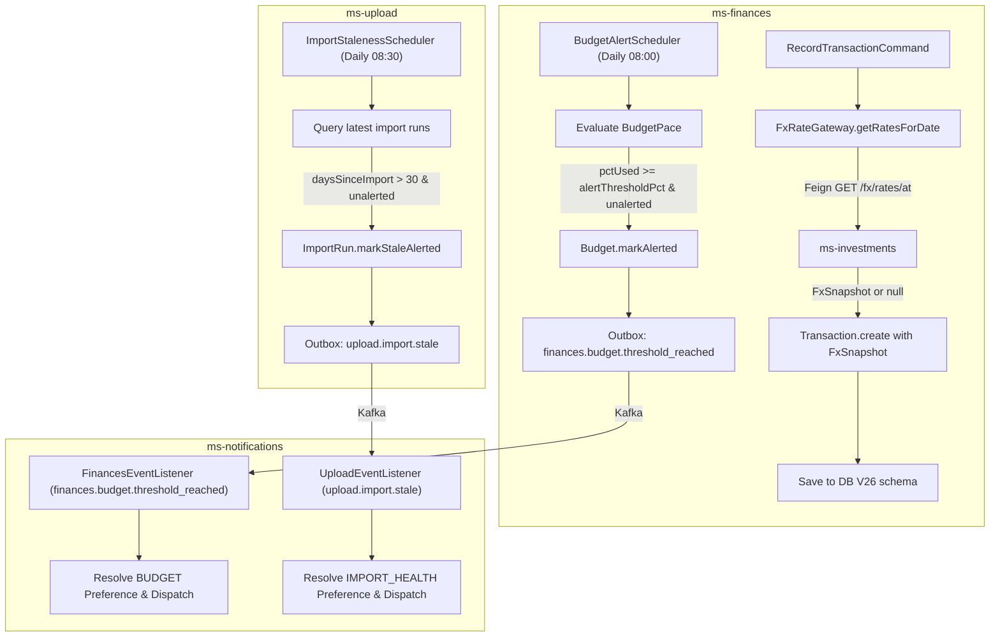

# Wave 1 Redesign Development Report — FX Snapshot & Alert Event Schedulers

## Branches and repositories involved

| Repository | Path | Branch | Purpose |
|---|---|---|---|
| Parent | `/` | `chore/ai-restructure` | Development report and program coordination |
| `ms-finances` | `back/ms-finances` | `feat/wave1-finances-fx-alerts` | FX snapshot on write, `BudgetAlertScheduler`, outbox event |
| `ms-upload` | `back/ms-upload` | `feat/wave1-upload-staleness-scheduler` | `ImportStalenessScheduler`, outbox event |
| `ms-notifications` | `back/ms-notifications` | `feat/wave1-notifications-consumers` | `BUDGET_THRESHOLD_REACHED` and `IMPORT_STALE` Kafka consumers |

## Objective

Implement the Wave 1 features defined in [2026-08-05-wave1-redesign.md](file:///home/ssmirnoff/Documents/proyects/financial-app/docs/specs/2026-08-05-wave1-redesign.md):
1. Historical FX snapshotting on transaction write in `ms-finances` via `ms-investments` lookup.
2. Daily `BudgetAlertScheduler` in `ms-finances` producing `finances.budget.threshold_reached` outbox events.
3. Daily `ImportStalenessScheduler` in `ms-upload` producing `upload.import.stale` outbox events.
4. Kafka listeners and use cases in `ms-notifications` consuming both events and delivering notifications per user category preferences (`BUDGET` and `IMPORT_HEALTH`).

## Connection to plans or specs

- **Spec Document**: [2026-08-05-wave1-redesign.md](file:///home/ssmirnoff/Documents/proyects/financial-app/docs/specs/2026-08-05-wave1-redesign.md)
- **Plan Document**: [2026-08-05-wave1-plan.md](file:///home/ssmirnoff/Documents/proyects/financial-app/docs/specs/2026-08-05-wave1-plan.md)

## Diagrams

## Goals

- **G1: Transaction FX Rate Snapshotting** — `met`.
- **G2: Budget Threshold Alerting** — `met`.
- **G3: Import Staleness Alerting** — `met`.
- **G4: Notification Consumption & Preference Enforcement** — `met`.

## What was done

1. **`ms-finances`**:
   - Created `FxSnapshot` VO and `FxRateGateway` domain port.
   - Implemented `FxRateGatewayImpl` using Feign client to `ms-investments` (`GET /api/v1/investments/fx/rates/at?date=`) with graceful fallback returning `Optional.empty()`.
   - Updated `Transaction` aggregate, `TransactionJpaEntity`, `TransactionPersistenceMapper`, and `RecordTransactionUseCaseImpl`.
   - Added Flyway migration `V26__add_fx_snapshot_to_transactions.sql`.
   - Created `BudgetThresholdReached` domain event, `BudgetThresholdReachedData` payload, `BudgetThresholdReachedMapper` outbox mapper.
   - Implemented `BudgetAlertScheduler` evaluating budget pace and producing `finances.budget.threshold_reached` outbox events.

2. **`ms-upload`**:
   - Created `V7__create_outbox_event.sql` migration for outbox relay table.
   - Implemented `OutboxEventJpaEntity`, `OutboxEventJpaRepository`, and `OutboxGatewayJpaAdapter`.
   - Implemented `ImportStaleEvent` domain event, `ImportStaleData` payload, `ImportStaleMapper` outbox mapper.
   - Implemented `ImportStalenessScheduler` evaluating account import staleness (> 30 days) and emitting `upload.import.stale` outbox events.

3. **`ms-notifications`**:
   - Registered `FinancesEventListener` for `finances.budget.threshold_reached` and `UploadEventListener` for `upload.import.stale`.
   - Created payload DTOs, domain event models, mappers, commands, and use cases (`ProcessBudgetThresholdUseCaseImpl`, `ProcessImportStaleUseCaseImpl`).
   - Integrated channel resolution matching user category preferences (`BUDGET` and `IMPORT_HEALTH`).

## Problems found

1. **Feign Fallback Resilience**: Outages/timeouts from `ms-investments` log warnings without breaking transaction creation.
2. **Idempotent Alert Cooldown**: Cooldowns enforced on aggregate state (`Budget.lastAlertedPeriod` and `ImportRun.lastStaleAlertAt`) prevent duplicate daily alerts.

## Files and commits touched

| Repo | Branch | Status |
|---|---|---|
| `ms-finances` | `feat/wave1-finances-fx-alerts` | Modified and verified |
| `ms-upload` | `feat/wave1-upload-staleness-scheduler` | Modified and verified |
| `ms-notifications` | `feat/wave1-notifications-consumers` | Modified and verified |

## Verification evidence

- `ms-finances`: `mvn verify` output: `Tests run: 212, Failures: 0, Errors: 0, Skipped: 0` — BUILD SUCCESS
- `ms-upload`: `mvn verify` output: `Tests run: 37, Failures: 0, Errors: 0, Skipped: 0` — BUILD SUCCESS
- `ms-notifications`: `mvn verify` output: `Tests run: 231, Failures: 0, Errors: 0, Skipped: 0` — BUILD SUCCESS

## Contract changes

- Flyway migrations added: `V26__add_fx_snapshot_to_transactions.sql` in `ms-finances`, `V7__create_outbox_event.sql` in `ms-upload`.
- Kafka topics / CloudEvents added: `finances.budget.threshold_reached`, `upload.import.stale`.

## Follow-ups and deferred work

- None.

## Results

All Wave 1 redesign goals achieved and verified across all services.

## Other references

- [2026-08-05-wave1-redesign.md](file:///home/ssmirnoff/Documents/proyects/financial-app/docs/specs/2026-08-05-wave1-redesign.md)
