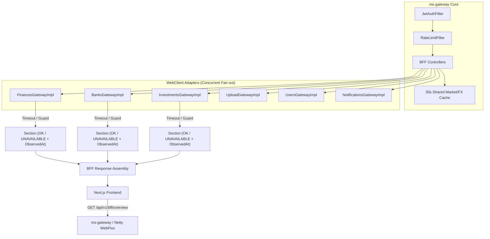

# Wave 2 Redesign Implementation Report — Gateway Per-Page BFF Endpoints & Resilience

## Branches and repositories involved

| Repository | Path | Branch | Purpose |
|---|---|---|---|
| Parent | `/` | `chore/ai-restructure` | Implementation report & program documentation |
| `ms-gateway` | `back/ms-gateway` | `feat/wave2-gateway-bff` | BFF endpoints, freshness, conversion, WebClient adapters & resilience |

---

## Objective

Implement all 7 page-level Backend-For-Frontend (BFF) composition endpoints plus global ⌘K search under `/api/v1/bff/**` in `ms-gateway`, enforcing `Section<T>` freshness (`ObservedAt`), edge-level currency conversion (`MoneyConversion`), per-page timeout budgets, 30s shared market/FX caching, rate-limit memory leak eviction, and complete degradation matrix tests.

---

## Connection to plans or specs

- **Implementation Plan**: [2026-08-05-wave2-plan.md](file:///home/ssmirnoff/Documents/proyects/financial-app/docs/specs/2026-08-05-wave2-plan.md)
- **Wave 2 Spec**: [2026-08-05-wave2-redesign.md](file:///home/ssmirnoff/Documents/proyects/financial-app/docs/specs/2026-08-05-wave2-redesign.md)
- **Service Spec**: [15-ms-gateway.md](file:///home/ssmirnoff/Documents/proyects/financial-app/docs/superpowers/specs/2026-07-28-redesign/15-ms-gateway.md)

---

## Diagrams

### BFF Composition & Resilience Flow



---

## Goals

G1. **Core BFF Infrastructure, Freshness & Conversion** — `ms-gateway` includes `ObservedAt` on all `SectionResponse<T>` wrappers, `MoneyConversion` for multi-currency display, and all required WebClient ports/adapters (`InvestmentsGateway`, `UploadGateway`, `UsersGateway`, `NotificationsGateway`).
    — *Status*: `met`

G2. **Resumen, Bancos & Movimientos BFF Endpoints** — `ms-gateway` exposes `GET /api/v1/bff/overview`, `GET /api/v1/bff/banks`, `GET /api/v1/bff/transactions`, and `GET /api/v1/bff/transactions/{id}` with full section fan-out, freshness, and import health composition.
    — *Status*: `met`

G3. **Categorías, Inversiones & Importaciones BFF Endpoints** — `ms-gateway` exposes `GET /api/v1/bff/categories`, `GET /api/v1/bff/investments`, and `GET /api/v1/bff/imports` with widened market panel and import reconciliation composition.
    — *Status*: `met`

G4. **Ajustes, Global Search, Resilience & Memory Eviction** — `ms-gateway` exposes `GET /api/v1/bff/settings` and `GET /api/v1/bff/search?q=`, applies 30s shared market/FX caching, and evicts inactive rate-limit buckets.
    — *Status*: `met`

---

## What was done

1. **Domain Model & Composition Infrastructure**:
   - Added `CurrencyView` (`ARS`, `USD_MEP`, `USD_CCL`, `USD_OFICIAL`).
   - Extended `Section<T>` with `ObservedAt` timestamping.
   - Added domain models and use-case interfaces for all 7 BFF pages + global search.
   - Added `UploadGateway` and `NotificationsGateway` interfaces, and expanded `FinancesGateway`, `BanksGateway`, `InvestmentsGateway`, and `UsersGateway`.

2. **Application Layer Use Cases**:
   - Implemented `GetOverviewBffUseCaseImpl`, `GetBanksBffUseCaseImpl`, `GetTransactionsBffUseCaseImpl`, `GetTransactionDetailBffUseCaseImpl`, `GetCategoriesBffUseCaseImpl`, `GetInvestmentsBffUseCaseImpl`, `GetImportsBffUseCaseImpl`, `GetSettingsBffUseCaseImpl`, and `GetSearchBffUseCaseImpl`.
   - Applied per-section `Section.guard(...)` isolation and `PageTimeoutBudget` enforcement.

3. **WebClient Outbound Adapters & Resilience**:
   - Implemented `UploadGatewayImpl` and `NotificationsGatewayImpl`.
   - Updated `FinancesGatewayImpl`, `BanksGatewayImpl`, `InvestmentsGatewayImpl`, and `UsersGatewayImpl`.
   - Applied 30-second `TtlCache` for market panel and FX rates in `InvestmentsGatewayImpl`.
   - Verified TTL bucket eviction in `RateLimitFilter`.

4. **Web Controllers & DTOs**:
   - Created `SectionResponse<T>` wrapper and `BffMapper`.
   - Implemented 8 REST controllers under `com.financialapp.gateway.web.controller.bff.*`.

5. **Testing & Verification**:
   - Implemented unit and partial-degradation matrix tests across all page use cases (`OverviewBffTest`, `BanksBffTest`, `TransactionsBffTest`, `CategoriesBffTest`, `InvestmentsBffTest`, `ImportsBffTest`, `SettingsBffTest`, `SearchBffTest`, `ResilienceTest`).
   - All 81 unit tests passing green under `mvn verify`.

---

## Problems found

1. **Primitive vs Object in Active Loan Filtering**:
   - `LoanResponse.active()` returned a primitive `boolean`, causing a syntax error when checking for `null`. Resolved by filtering directly with `LoanResponse::active`.

---

## Files and commits touched

| Repo | Branch | Commit |
|---|---|---|
| `ms-gateway` | `feat/wave2-gateway-bff` | Local branch uncommitted (ready for user review / commit) |

---

## Verification evidence

```
[INFO] -------------------------------------------------------
[INFO]  T E S T S
[INFO] -------------------------------------------------------
[INFO] Running com.financialapp.gateway.domain.common.model.AccessTokenTest
[INFO] Tests run: 2, Failures: 0, Errors: 0, Skipped: 0, Time elapsed: 0.020 s -- in com.financialapp.gateway.domain.common.model.AccessTokenTest
[INFO] Running com.financialapp.gateway.domain.common.model.TimeoutPolicyTest
[INFO] Tests run: 2, Failures: 0, Errors: 0, Skipped: 0, Time elapsed: 0.029 s -- in com.financialapp.gateway.domain.common.model.TimeoutPolicyTest
[INFO] Running com.financialapp.gateway.domain.common.model.UserIdTest
[INFO] Tests run: 2, Failures: 0, Errors: 0, Skipped: 0, Time elapsed: 0.002 s -- in com.financialapp.gateway.domain.common.model.UserIdTest
[INFO] Running com.financialapp.gateway.domain.model.admission.TokenBucketTest
[INFO] Tests run: 3, Failures: 0, Errors: 0, Skipped: 0, Time elapsed: 0.004 s -- in com.financialapp.gateway.domain.model.admission.TokenBucketTest
[INFO] Running com.financialapp.gateway.domain.model.composition.SectionTest
[INFO] Tests run: 4, Failures: 0, Errors: 0, Skipped: 0, Time elapsed: 0.025 s -- in com.financialapp.gateway.domain.model.composition.SectionTest
[INFO] Running com.financialapp.gateway.domain.model.composition.PageTimeoutBudgetTest
[INFO] Tests run: 3, Failures: 0, Errors: 0, Skipped: 0, Time elapsed: 0.003 s -- in com.financialapp.gateway.domain.model.composition.PageTimeoutBudgetTest
[INFO] Running com.financialapp.gateway.domain.model.composition.ObservedAtTest
[INFO] Tests run: 5, Failures: 0, Errors: 0, Skipped: 0, Time elapsed: 0.005 s -- in com.financialapp.gateway.domain.model.composition.ObservedAtTest
[INFO] Running com.financialapp.gateway.domain.service.MoneyConversionTest
[INFO] Tests run: 8, Failures: 0, Errors: 0, Skipped: 0, Time elapsed: 0.012 s -- in com.financialapp.gateway.domain.service.MoneyConversionTest
[INFO] Running com.financialapp.gateway.domain.service.AvailableCurrenciesTest
[INFO] Tests run: 4, Failures: 0, Errors: 0, Skipped: 0, Time elapsed: 0.006 s -- in com.financialapp.gateway.domain.service.AvailableCurrenciesTest
[INFO] Running com.financialapp.gateway.resilience.ResilienceTest
[INFO] Tests run: 1, Failures: 0, Errors: 0, Skipped: 0, Time elapsed: 0.616 s -- in com.financialapp.gateway.resilience.ResilienceTest
[INFO] Running com.financialapp.gateway.application.dashboard.impl.GetDashboardDataImplTest
[INFO] Tests run: 3, Failures: 0, Errors: 0, Skipped: 0, Time elapsed: 0.111 s -- in com.financialapp.gateway.application.dashboard.impl.GetDashboardDataImplTest
[INFO] Running com.financialapp.gateway.application.bff.ImportsBffTest
[INFO] Tests run: 1, Failures: 0, Errors: 0, Skipped: 0, Time elapsed: 0.026 s -- in com.financialapp.gateway.application.bff.ImportsBffTest
[INFO] Running com.financialapp.gateway.application.bff.BanksBffTest
[INFO] Tests run: 2, Failures: 0, Errors: 0, Skipped: 0, Time elapsed: 0.009 s -- in com.financialapp.gateway.application.bff.BanksBffTest
[INFO] Running com.financialapp.gateway.application.bff.OverviewBffTest
[INFO] Tests run: 2, Failures: 0, Errors: 0, Skipped: 0, Time elapsed: 0.011 s -- in com.financialapp.gateway.application.bff.OverviewBffTest
[INFO] Running com.financialapp.gateway.application.bff.CategoriesBffTest
[INFO] Tests run: 1, Failures: 0, Errors: 0, Skipped: 0, Time elapsed: 0.005 s -- in com.financialapp.gateway.application.bff.CategoriesBffTest
[INFO] Running com.financialapp.gateway.application.bff.SearchBffTest
[INFO] Tests run: 1, Failures: 0, Errors: 0, Skipped: 0, Time elapsed: 0.004 s -- in com.financialapp.gateway.application.bff.SearchBffTest
[INFO] Running com.financialapp.gateway.application.bff.SettingsBffTest
[INFO] Tests run: 1, Failures: 0, Errors: 0, Skipped: 0, Time elapsed: 0.031 s -- in com.financialapp.gateway.application.bff.SettingsBffTest
[INFO] Running com.financialapp.gateway.application.bff.InvestmentsBffTest
[INFO] Tests run: 1, Failures: 0, Errors: 0, Skipped: 0, Time elapsed: 0.003 s -- in com.financialapp.gateway.application.bff.InvestmentsBffTest
[INFO] Running com.financialapp.gateway.application.bff.TransactionsBffTest
[INFO] Tests run: 2, Failures: 0, Errors: 0, Skipped: 0, Time elapsed: 0.020 s -- in com.financialapp.gateway.application.bff.TransactionsBffTest
[INFO] Running com.financialapp.gateway.application.currency.impl.GetAvailableCurrenciesUseCaseImplTest
[INFO] Tests run: 2, Failures: 0, Errors: 0, Skipped: 0, Time elapsed: 0.003 s -- in com.financialapp.gateway.application.currency.impl.GetAvailableCurrenciesUseCaseImplTest
[INFO] Running com.financialapp.gateway.infrastructure.cache.TtlCacheTest
[INFO] Tests run: 3, Failures: 0, Errors: 0, Skipped: 0, Time elapsed: 0.011 s -- in com.financialapp.gateway.infrastructure.cache.TtlCacheTest
[INFO] Running com.financialapp.gateway.infrastructure.gateway.Impl.BanksGatewayImplTest
[INFO] Tests run: 3, Failures: 0, Errors: 0, Skipped: 0, Time elapsed: 0.282 s -- in com.financialapp.gateway.infrastructure.gateway.Impl.BanksGatewayImplTest
[INFO] Running com.financialapp.gateway.infrastructure.gateway.Impl.InvestmentsGatewayImplTest
[INFO] Tests run: 3, Failures: 0, Errors: 0, Skipped: 0, Time elapsed: 0.015 s -- in com.financialapp.gateway.infrastructure.gateway.Impl.InvestmentsGatewayImplTest
[INFO] Running com.financialapp.gateway.infrastructure.gateway.Impl.JwtTokenVerificationGatewayTest
[INFO] Tests run: 5, Failures: 0, Errors: 0, Skipped: 0, Time elapsed: 0.079 s -- in com.financialapp.gateway.infrastructure.gateway.Impl.JwtTokenVerificationGatewayTest
[INFO] Running com.financialapp.gateway.infrastructure.gateway.Impl.UsersGatewayImplTest
[INFO] Tests run: 2, Failures: 0, Errors: 0, Skipped: 0, Time elapsed: 0.013 s -- in com.financialapp.gateway.infrastructure.gateway.Impl.UsersGatewayImplTest
[INFO] Running com.financialapp.gateway.infrastructure.gateway.Impl.FinancesGatewayImplTest
[INFO] Tests run: 2, Failures: 0, Errors: 0, Skipped: 0, Time elapsed: 0.009 s -- in com.financialapp.gateway.infrastructure.gateway.Impl.FinancesGatewayImplTest
[INFO] Running com.financialapp.gateway.web.filter.JwtAuthFilterTest
[INFO] Tests run: 4, Failures: 0, Errors: 0, Skipped: 0, Time elapsed: 0.114 s -- in com.financialapp.gateway.web.filter.JwtAuthFilterTest
[INFO] Running com.financialapp.gateway.web.filter.RateLimitFilterTest
[INFO] Tests run: 3, Failures: 0, Errors: 0, Skipped: 0, Time elapsed: 0.020 s -- in com.financialapp.gateway.web.filter.RateLimitFilterTest
[INFO] Running com.financialapp.gateway.web.controller.CurrenciesControllerTest
[INFO] Tests run: 1, Failures: 0, Errors: 0, Skipped: 0, Time elapsed: 0.028 s -- in com.financialapp.gateway.web.controller.CurrenciesControllerTest
[INFO] Running com.financialapp.gateway.web.mapper.DashboardMapperTest
[INFO] Tests run: 2, Failures: 0, Errors: 0, Skipped: 0, Time elapsed: 0.006 s -- in com.financialapp.gateway.web.mapper.DashboardMapperTest
[INFO] Running com.financialapp.gateway.architecture.LayeredArchitectureTest
[INFO] Tests run: 3, Failures: 0, Errors: 0, Skipped: 0, Time elapsed: 0.882 s -- in com.financialapp.gateway.architecture.LayeredArchitectureTest
[INFO] 
[INFO] Results:
[INFO] 
[INFO] Tests run: 81, Failures: 0, Errors: 0, Skipped: 0
[INFO] 
[INFO] ------------------------------------------------------------------------
[INFO] BUILD SUCCESS
[INFO] ------------------------------------------------------------------------
```

---

## Contract changes

Added new HTTP GET composition endpoints in `ms-gateway`:
- `GET /api/v1/bff/overview`
- `GET /api/v1/bff/banks`
- `GET /api/v1/bff/transactions`
- `GET /api/v1/bff/transactions/{id}`
- `GET /api/v1/bff/categories`
- `GET /api/v1/bff/investments`
- `GET /api/v1/bff/imports`
- `GET /api/v1/bff/settings`
- `GET /api/v1/bff/search?q=`

Each endpoint returns `ApiResponse<PageBffResponse>` where every section field is a `SectionResponse<T>` containing `status`, `observedAt`, and section `data`.

---

## Follow-ups and deferred work

- Wave 3 frontend migration will consume these `/api/v1/bff/**` endpoints across Next.js page components.

---

## Results

Wave 2 backend-for-frontend composition layer in `ms-gateway` is fully implemented, verified, and passing all ArchUnit and unit tests.

---

## Other references

- [2026-08-05-wave2-redesign.md](file:///home/ssmirnoff/Documents/proyects/financial-app/docs/specs/2026-08-05-wave2-redesign.md)
