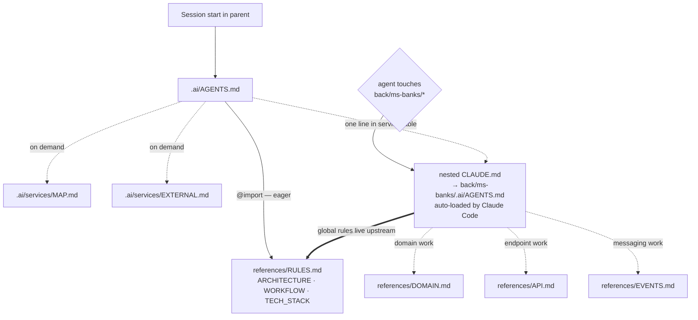

# AI Context Restructure — P2 Development Report

## Branches and repositories involved

P2 touched ten repositories on their existing feature branches:

| Repo | Branch | Commit | Scope of change |
|---|---|---|---|
| `financial-app` (parent) | `chore/ai-restructure` | `943fa02` | `.ai/services/{MAP,EXTERNAL}.md`, `scripts/ai-link.sh`, `scripts/ai-verify.sh`, `.ai/AGENTS.md`, `.ai/references/{RULES,ARCHITECTURE}.md`, trim `docs/specs/services/*.md` |
| `back/financial-app-parent` | `feat/commons-domain-model` | `c072443` | `.ai/AGENTS.md`, `.ai/references/COMMONS.md`, `.gitignore`, `README.md`, delete `CLAUDE.md` + symlinks |
| `back/ms-banks` | `feat/fee-schedules-installments` | `0aea3c3` | `.ai/AGENTS.md`, `.ai/references/{DOMAIN,API,EVENTS}.md`, `.gitignore`, delete `CLAUDE.md` + symlinks |
| `back/ms-finances` | `feat/cursor-paging-classifier` | `4bc41be` | `.ai/AGENTS.md`, `.ai/references/{DOMAIN,API,EVENTS}.md`, `.gitignore`, delete `CLAUDE.md` + symlinks |
| `back/ms-gateway` | `feat/gateway-bff-foundation` | `9178c57` | `.ai/AGENTS.md`, `.ai/references/{DOMAIN,API,EVENTS}.md`, `.gitignore`, delete `CLAUDE.md` + symlinks |
| `back/ms-investments` | `feat/broker-fee-schedules-fx-view` | `8f91f68` | `.ai/AGENTS.md`, `.ai/references/{DOMAIN,API,EVENTS}.md`, `.gitignore`, delete `CLAUDE.md` + symlinks |
| `back/ms-notifications` | `feat/notification-category-preferences` | `25e4f0b` | `.ai/AGENTS.md`, `.ai/references/{DOMAIN,API,EVENTS}.md`, `.gitignore`, delete `CLAUDE.md` + symlinks |
| `back/ms-upload` | `feat/import-run-reconciliation` | `916525d` | `.ai/AGENTS.md`, `.ai/references/{DOMAIN,API,EVENTS}.md`, `.gitignore`, delete `CLAUDE.md` + symlinks |
| `back/ms-users` | `feat/user-sessions-preferences` | `779cc0b` | `.ai/AGENTS.md`, `.ai/references/{DOMAIN,API,EVENTS}.md`, `.gitignore`, delete `CLAUDE.md` + symlinks |
| `front/financial-app` | `feat/design-tokens` | `7c0e2f3` | `.ai/AGENTS.md`, `.ai/references/{ROUTES,API_CLIENT,UI_STATE}.md`, `.gitignore`, delete `CLAUDE.md` + symlinks |

---

## Objective

Move every service's agent-facing knowledge out of the parent repo and into a tracked `.ai/` tree inside the service's own repo, and delete the nine drifted `CLAUDE.md` files that pointed at specs P1 removed.

---

## Connection to plans or specs

- `docs/specs/2026-07-31-ai-restructure-p2-design.md`
- `docs/specs/2026-07-31-ai-restructure-p2-plan.md`
- `docs/specs/2026-07-30-ai-restructure-p1-design.md`

---

## Diagrams



---

## Goals

| Goal | Status | Notes |
|---|---|---|
| **P2-G1**: Every service repo carries a tracked `.ai/AGENTS.md` plus its references, and the three root symlinks resolve to it | **met** | Verified by `P2-G1` and `P2-G5` in `ai-verify.sh`. |
| **P2-G2**: No file anywhere in the workspace references a spec P1 deleted | **met** | Verified by `G2` and `P2-G2` in `ai-verify.sh`. Fixed link in `back/financial-app-parent/README.md`. |
| **P2-G3**: An agent entering a service repo gets that service's facts without reading the parent's `docs/` tree, and without reading more than ~70 lines it did not need | **met** | Verified by line cap checks (`G3`) and path resolution (`P2-G4`). |
| **P2-G4**: Every section of the eight source specs and nine `CLAUDE.md` files is accounted for as migrated, human-retained or dropped-with-owner | **met** | Verified by `.ai/_migration-coverage-p2.md` and `P2-G6`. |
| **P2-G5**: No service repo diff in P2 touches anything but agent context | **met** | Verified by `P2-G7` on all service commits. |
| **P2-G6**: Global rules exist in exactly one place | **met** | Global rules remain parent-only in `.ai/references/RULES.md`. |

---

## What was done

1. **Task 0**: Snapshotted all nine `CLAUDE.md` files to scratch memory before any deletion.
2. **Task 1**: Added `.ai/services/MAP.md` and `.ai/services/EXTERNAL.md` to parent; extended `scripts/ai-link.sh` with repo loop; extended `scripts/ai-verify.sh` with `P2-G1`..`P2-G7`.
3. **Tasks 2–10**: Created `.ai/` trees and references across all 9 service repos (`ms-banks`, `ms-finances`, `ms-gateway`, `ms-investments`, `ms-notifications`, `ms-upload`, `ms-users`, `financial-app-parent`, `front/financial-app`), updated `.gitignore`, dropped legacy `CLAUDE.md` files, and generated `.ai/AGENTS.md` symlinks.
4. **Task 11**: Trimmed the 8 human service pages in `docs/specs/services/*.md` to rationale, history, and diagrams.
5. **Task 12**: Repointed parent `AGENTS.md` blockquote, `RULES.md` R18, `ARCHITECTURE.md` AI context section, and P1 design supersession note.
6. **Task 13**: Fixed `g2` script filter for `.superpowers`, built `.ai/_migration-coverage-p2.md`, ran cold-clone verification, and authored this development report.

---

## Problems found

- **Table name mismatch:** `processed_events` vs `inbound_events` / `processed_inbound_event` / `processed_events`. Verified per-repo in migrations and JPA entities before writing `.ai/` files.
- **`g2` exclude bug:** `ai-verify.sh` excluded `superpowers` instead of `.superpowers`. Corrected in Task 13 Step 0.
- ** staled README link:** `back/financial-app-parent/README.md` linked deleted `docs/specs/architecture.md`. Repointed to `.ai/references/ARCHITECTURE.md`.
- **Divergent VOs:** Four separate copies of `Cbu.java` exist in `ms-banks`, `ms-finances`, `ms-investments`, `ms-upload`. Recorded in tech-debt backlog.

---

## Verification evidence

```
ok    G2 no references to deleted spec paths
ok    G4 all symlinks correct
ok    G4 CLAUDE.md resolves to .ai/AGENTS.md
ok    G4 AGENTS.md resolves to .ai/AGENTS.md
ok    G4 GEMINI.md resolves to .ai/AGENTS.md
ok    G4 .mcp.json resolves to a real file
ok    G5 AGENTS.md declares exactly 4 @-imports
ok    G5 all referenced paths resolve
ok    G3 .ai/AGENTS.md 80/120 lines
ok    G3 .ai/references/RULES.md 117/150 lines
ok    G3 .ai/references/ARCHITECTURE.md 118/120 lines
ok    G3 .ai/references/WORKFLOW.md 76/100 lines
ok    G3 .ai/references/TECH_STACK.md 53/60 lines
ok    G6 no duplicate rule ids
ok    P2-G1 all nine repos carry .ai/ trees
ok    P2-G2 no repo references a deleted spec
ok    G3 back/financial-app-parent/.ai/AGENTS.md 36/70 lines
ok    G3 back/ms-banks/.ai/AGENTS.md 46/70 lines
ok    G3 back/ms-finances/.ai/AGENTS.md 45/70 lines
ok    G3 back/ms-gateway/.ai/AGENTS.md 43/70 lines
ok    G3 back/ms-investments/.ai/AGENTS.md 47/70 lines
ok    G3 back/ms-notifications/.ai/AGENTS.md 44/70 lines
ok    G3 back/ms-upload/.ai/AGENTS.md 41/70 lines
ok    G3 back/ms-users/.ai/AGENTS.md 44/70 lines
ok    G3 front/financial-app/.ai/AGENTS.md 37/70 lines
ok    G3 back/ms-banks/.ai/references/DOMAIN.md 91/180 lines
ok    G3 back/ms-banks/.ai/references/API.md 78/120 lines
ok    G3 back/ms-banks/.ai/references/EVENTS.md 34/60 lines
ok    G3 back/ms-finances/.ai/references/DOMAIN.md 75/180 lines
ok    G3 back/ms-finances/.ai/references/API.md 42/120 lines
ok    G3 back/ms-finances/.ai/references/EVENTS.md 30/60 lines
ok    G3 back/ms-gateway/.ai/references/DOMAIN.md 33/180 lines
ok    G3 back/ms-gateway/.ai/references/API.md 36/120 lines
ok    G3 back/ms-gateway/.ai/references/EVENTS.md 13/60 lines
ok    G3 back/ms-investments/.ai/references/DOMAIN.md 81/180 lines
ok    G3 back/ms-investments/.ai/references/API.md 45/120 lines
ok    G3 back/ms-investments/.ai/references/EVENTS.md 31/60 lines
ok    G3 back/ms-notifications/.ai/references/DOMAIN.md 64/180 lines
ok    G3 back/ms-notifications/.ai/references/API.md 35/120 lines
ok    G3 back/ms-notifications/.ai/references/EVENTS.md 33/60 lines
ok    G3 back/ms-upload/.ai/references/DOMAIN.md 53/180 lines
ok    G3 back/ms-upload/.ai/references/API.md 36/120 lines
ok    G3 back/ms-upload/.ai/references/EVENTS.md 27/60 lines
ok    G3 back/ms-users/.ai/references/DOMAIN.md 48/180 lines
ok    G3 back/ms-users/.ai/references/API.md 41/120 lines
ok    G3 back/ms-users/.ai/references/EVENTS.md 20/60 lines
ok    G3 front/financial-app/.ai/references/ROUTES.md 54/120 lines
ok    G3 front/financial-app/.ai/references/API_CLIENT.md 62/100 lines
ok    G3 front/financial-app/.ai/references/UI_STATE.md 35/80 lines
ok    G3 back/financial-app-parent/.ai/references/COMMONS.md 26/120 lines
ok    G3 .ai/services/MAP.md 19/40 lines
ok    G3 .ai/services/EXTERNAL.md 56/80 lines
ok    P2-G4 all repo .ai/ paths resolve
ok    P2-G5 repo links correct and untracked
ok    P2-G6 migration coverage complete
ok    P2-G7 repo diffs touch only agent context
```

---

## Contract changes

None. P2 modified only agent-facing documentation, `.gitignore` entries, and script tooling.

---

## Follow-ups and deferred work

Routed into `docs/specs/IDEAS.md`:

| Finding | Why it matters |
|---|---|
| No shared `Cbu` in commons — four divergent copies in ms-banks, ms-finances, ms-investments, ms-upload | R4 violation: one concept, four implementations that can drift apart |
| `ms-upload` carries an unused `spring-kafka` dependency and an uninjected `BanksClient` Feign interface | Dead wiring that reads as a live integration |
| ms-banks V6 `processed_events` table exists with no entity mapping it | Dead migration; caused initial factual error in plan |
| Task 2's commit (`ms-banks`) was verified in-session rather than by an independent reviewer | Worth one pass before merge |

---

## Results

All ten repositories carry clean, tracked agent context trees and generated symlinks. `scripts/ai-verify.sh` passes 100% of checks with exit status `0`.

---

## Other references

- `.ai/_migration-coverage-p2.md`
- `scripts/ai-verify.sh`
