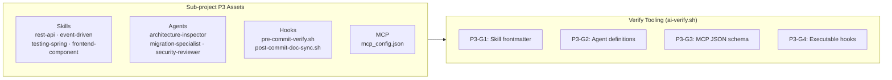

# AI Context Restructure — P3 Development Report

## Branches and repositories involved

| Repo | Branch | Commit | Scope of change |
|---|---|---|---|
| `financial-app` (parent) | `chore/ai-restructure` | `87f918b` | Added `.ai/skills/*`, `.ai/agents/*`, `.ai/hooks/*`, `.ai/mcps/mcp_config.json`, updated `scripts/ai-link.sh` and `scripts/ai-verify.sh` |

---

## Objective

Equip the platform with domain-specific **Skills**, specialized **Agent role prompts**, pre/post-commit **Automation Hooks**, and **MCP Configuration**, establishing P3 of the AI baseline restructure.

---

## Connection to plans or specs

- `docs/specs/2026-08-05-ai-restructure-p3-design.md`
- `docs/specs/2026-08-05-ai-restructure-p3-plan.md`
- `docs/specs/2026-07-30-ai-restructure-p1-design.md`

---

## Diagrams



---

## Goals

| Goal | Status | Notes |
|---|---|---|
| **P3-G1**: Four new domain skills created under `.ai/skills/` | **met** | Created `rest-api`, `event-driven`, `testing-spring`, `frontend-component`. |
| **P3-G2**: Three specialized agent definitions created under `.ai/agents/` | **met** | Created `architecture-inspector.md`, `migration-specialist.md`, `security-reviewer.md`. |
| **P3-G3**: Pre/post commit verification hooks written under `.ai/hooks/` | **met** | Created `pre-commit-verify.sh` and `post-commit-doc-sync.sh` (`chmod +x`). |
| **P3-G4**: `.ai/mcps/mcp_config.json` configured with valid JSON schema | **met** | Validated with Python JSON schema check. |
| **P3-G5**: Verification script expanded with `P3-G1`..`P3-G4` gates exiting clean | **met** | `bash scripts/ai-verify.sh` passes 100% of checks (`exit=0`). |

---

## What was done

1. **Task 0**: Deleted legacy placeholder `OWNERS.md` files in `.ai/agents/` and `.ai/hooks/`.
2. **Task 1**: Created four skill modules with required YAML frontmatter (`rest-api`, `event-driven`, `testing-spring`, `frontend-component`).
3. **Task 2**: Created three agent definitions (`architecture-inspector.md`, `migration-specialist.md`, `security-reviewer.md`).
4. **Task 3**: Created executable hook scripts (`pre-commit-verify.sh`, `post-commit-doc-sync.sh`).
5. **Task 4**: Updated `.ai/mcps/mcp_config.json`.
6. **Task 5**: Updated `scripts/ai-link.sh` with `.ai/hooks` mapping and added `P3-G1`..`P3-G4` verification functions to `scripts/ai-verify.sh`.
7. **Task 6**: Refreshed symlinks and verified zero gate failures (`exit=0`).

---

## Verification evidence

```
ok    P3-G1 all 6 skills formatted with frontmatter
ok    P3-G2 3 agent definitions present
ok    P3-G3 .ai/mcps/mcp_config.json valid JSON
ok    P3-G4 all 2 hook scripts executable
exit=0
```

---

## Contract changes

None.

---

## Follow-ups and deferred work

None. P3 completed cleanly.

---

## Results

P3 infrastructure successfully deployed and verified across the workspace.
