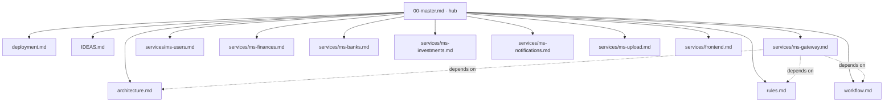

# financial-app — Master Spec (Hub)

financial-app is a personal-finance platform for the Argentine market: Java microservices
behind a Spring Cloud Gateway, a Next.js frontend, a single PostgreSQL instance with
per-service schemas, Kafka for async domain events, and MinIO for file storage. It is a
**polyrepo** — every backend service and the frontend is its own git repository, gitignored
by this parent repo (they are not git submodules).

This file is the **hub**. It holds almost no detail itself; it routes to the focused specs
below. Edit a single concern (e.g. the rules) in its own file — none of these grow into a
300-line monolith.

## Spec map

## Cross-cutting specs

| Spec | What it covers |
|---|---|
| [architecture.md](architecture.md) | Polyrepo topology, runtime topology (gateway → services), auth/cookie/CSRF flow, Postgres schemas, Kafka, MinIO, DDD layering |
| [rules.md](rules.md) | Implementation rules: DDD always, SOLID, shared `{status, title, code, message, data}` envelope (commons-core), exception handling via commons `ApiExceptionHandler` + per-service `DomainError` catalogs, `@ApiErrorCodes` Swagger docs, env-config, Flyway, MapStruct/Lombok, no-comments rule, supported currencies |
| [workflow.md](workflow.md) | Branching (`master → feature → develop`, per repo), commit rules (no push / no co-author / no commit unless asked), read-before-plan, update-docs-after-impl; **CI/CD** (reusable workflows, branch rulesets, GHCR image tags, release flow — see § CI/CD) |
| [deployment.md](deployment.md) | `scripts/dev.sh` commands, port map, env vars, Docker vs local, startup flow |
| [IDEAS.md](IDEAS.md) | Running backlog of future ideas, improvements, and things to keep in mind |

## Service specs

| Service | Port | Spec |
|---|---|---|
| Gateway | 8080 | [services/ms-gateway.md](services/ms-gateway.md) |
| Users (auth) | 8081 | [services/ms-users.md](services/ms-users.md) |
| Finances | 8082 | [services/ms-finances.md](services/ms-finances.md) |
| Banks | 8083 | [services/ms-banks.md](services/ms-banks.md) |
| Notifications | 8084 | [services/ms-notifications.md](services/ms-notifications.md) |
| Upload | 8085 | [services/ms-upload.md](services/ms-upload.md) |
| Investments | 8086 | [services/ms-investments.md](services/ms-investments.md) |
| Frontend | 3000 | [services/frontend.md](services/frontend.md) |

`back/financial-app-parent` is the Maven BOM (infrastructure, not a service); see
[architecture.md](architecture.md).

## How to use these docs

- **Humans** read the specs here for reference, and [GETTING-STARTED](../GETTING-STARTED.md) to set up the
  workspace for the first time.
- **Claude** reads each repo's `CLAUDE.md` (which routes here). Before planning any change,
  read the repo's `README.md`, this hub, the relevant service spec, [rules.md](rules.md),
  and [workflow.md](workflow.md).
- **After every implementation**, update the relevant service spec **and** the repo README
  (see [workflow.md](workflow.md)).
