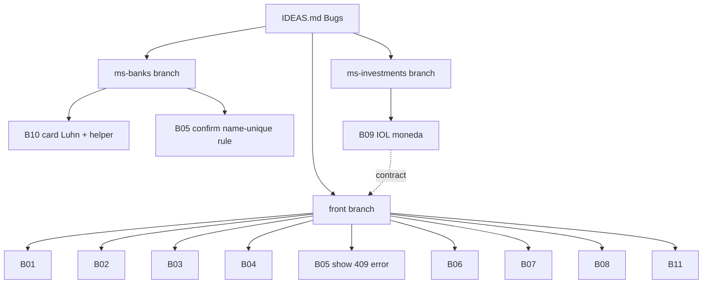

# Bugfix Batch — Investments UX, Cards, IOL Currency, Accounts

**Date:** 2026-06-12
**Scope:** `front/financial-app`, `back/ms-investments`, `back/ms-banks`
**Source:** `docs/specs/IDEAS.md` → Bugs section
**Status:** plan, pending execution

Fixes the 11 open bugs logged in IDEAS.md. Grouped by repo so each can ship on its
own branch + `mvn verify` / frontend type-check gate. Two design forks were decided
up front (see Decisions).

## Decisions (locked)

- **Card number (B10):** keep Luhn validation (PANs stay real) **and** add a helper so a
  user supplying BIN+account gets the check digit auto-completed. Fix the misleading error.
- **IOL currency (B9):** read IOL's authoritative `moneda` field from the API response
  (currently dropped before it reaches the DTO). No ticker-suffix heuristic.

## Bug → fix map

```
ms-banks (backend)
  B10  Card "must be 16 digits" lie        → CardNumber check-digit + helper + split error
  B05  Account 409 on create (root)        → confirm name-uniqueness is intended (frontend surfaces it)

ms-investments (backend)
  B09  IOL currency hardcoded ARS          → capture `moneda`, map USD/ARS, drop DEFAULT_CURRENCY

front/financial-app
  B01  Search results placement            → order: searchbar → results → market discovery
  B02  Tab "Markets" → "Market Discovery"  → rename label
  B03  Holdings chart garbage at end       → drop incomplete/today partial point or null-guard
  B04  Portfolio total above filters       → reorder; empty-bank empty-state message
  B05  Account-create 409 not shown        → surface ApiError message in account form
  B06  Small accounts UI breaks            → responsive layout fix
  B07  Balance-delay disclaimer            → footer note on accounts/investments
  B08  Empty account selector              → "no accounts available" message vs empty <Select>
  B11  Sentinel CBU → friendly name        → map broker/sentinel CBUs in Transaction History
  B12  Card-box error message              → real reason (check-digit vs length), no swallow

Cross-cutting (added)
  Part D  Front-wide error/validation review → all forms: surface ApiError, zod ↔ backend, copy
  Part E  Docs update for today's 3 plans    → purge INVESTMENT/old-account-model references
```



---

## Part A — ms-banks

### B10 — Card number rejected with wrong reason
**Symptom:** POST `/api/v1/banks/cards` with `0140000000000000` → 400 `invalid_card_number`
"Card number must be exactly 16 digits", although it *is* 16 digits. `1212121212123232`
succeeds.

**Root cause (verified):** `CardNumber.from()` computes the Luhn check digit over
BIN(6)+account(9) and requires the supplied 16th digit to equal it
(`requireMatchingCheckDigit`). Both the length failure and the check-digit failure throw
`InvalidCardNumberException` with the **same** "must be exactly 16 digits" message. So a
Luhn mismatch is reported as a length error. `0140000000000000` is simply not Luhn-valid.
File: `back/ms-banks/.../domain/model/card/CardNumber.java`.

**Fix:**
1. Split the failure modes in `CardNumber`:
   - `requireSixteenDigits` → `InvalidCardNumberException` (format/length) — message
     "Card number must be exactly 16 digits".
   - `requireMatchingCheckDigit` → new `InvalidCardCheckDigitException` — message
     "Card number check digit is invalid (Luhn)". New `DomainError.INVALID_CARD_CHECK_DIGIT`
     (BAD_REQUEST, code `invalid_card_check_digit`). Add to `CardController` `@ApiErrorCodes`.
2. Helper to auto-complete the check digit (rich VO behaviour, no new service):
   - `CardNumber.fromPartial(String bin6account9)` — accepts the 15-digit
     BIN+account, appends the computed Luhn digit, returns a valid `CardNumber`.
   - Optionally expose via DTO: if `cardNumber` is 15 digits, treat as partial and complete;
     if 16, validate as today. Keep `^\d{15,16}$` pattern on `CardRequest.cardNumber` and
     branch in the mapper. (Decision: keep request-side simple — accept 15 *or* 16.)
3. Update `CardNumber.last4()` / `value()` unchanged.

**Files:** `CardNumber.java`, new `InvalidCardCheckDigitException.java`, `DomainError.java`,
`CardController.java`, `CardRequest.java` (+ mapper), and the `CardNumber` unit tests.

**Verify:** unit test — `0140000000000000` (full, bad Luhn) → check-digit error;
`014000000000000` (15-digit partial) → completes to a valid Luhn card; existing
`1212121212123232` still passes. `mvn verify` in ms-banks.

### B05 (backend half) — Account create 409
**Symptom:** creating an account → 409 Conflict; report blames "no alias".
**Root cause (verified):** `OpenAccountUseCaseImpl` rejects when
`existsByUserIdAndBankNumberAndName` — i.e. a duplicate **name** in the same bank for the
same user. This is an intended uniqueness rule; alias is not the cause. No backend change
needed beyond confirming the rule. The real defect is frontend (B05 front) not showing the
message. **Action:** none in backend except double-check the 409 body carries the
`resource_already_exists` code/message envelope (it does via the advice).

---

## Part B — ms-investments

### B09 — IOL price feed currency hardcoded to ARS
**Symptom:** every instrument reports currency `ARS`, even USD tickers (JOYYD = USD,
JOYY = ARS).

**Root cause (verified):** `IolGatewayImpl` uses `DEFAULT_CURRENCY = "ARS"` for
`PriceDetail`, `HistoricalPricePoint`, and `MarketQuote`. `IolApiClient.getPriceInternal`
parses the raw `JsonNode body` of IOL `CotizacionDetalle` but never reads `moneda`, and the
DTOs (`IolPriceDetail`, `IolMarketQuote`) have no currency field.

**Fix:**
1. Add a currency resolver VO in infrastructure: map IOL `moneda` string →
   `SupportedCurrency` (`peso_Argentino`/`pesos` → ARS; `dolar_Estadounidense`/`dolar*` →
   USD). Keep the mapping table in one place (no per-enum-state methods).
2. `IolApiClient`: read `body.get("moneda")` in `getPriceInternal`, the historical endpoint,
   and panel quotes; add `currency` to `IolPriceDetail`, `IolHistoricalPricePoint.detail`,
   and `IolMarketQuote`.
3. `IolGatewayImpl`: delete `DEFAULT_CURRENCY`; build `PriceDetail` / `HistoricalPricePoint`
   / `MarketQuote` / `Money` from the resolved currency. Fallback only if `moneda` absent →
   log + ARS, so feed never crashes.

**Files:** `IolApiClient.java`, `dto/IolPriceDetail.java`, `dto/IolMarketQuote.java`,
`dto/IolHistoricalPricePoint.java`, `IolGatewayImpl.java`, new currency-resolver VO + test.

**Verify:** unit test resolver (moneda strings → currency); ms-investments `mvn verify`;
manual `./dev.sh local service-investments` and confirm a USD ticker reports USD.

**Contract note:** price/quote currency now varies — frontend already renders per-currency
panels, so no breaking change, but spot-check the holdings detail page after.

---

## Part C — front/financial-app  (`components/pages/investments/` unless noted)

### B01 — Search result placement
Order inside Market Discovery tab must be: **search bar → results → market discovery list**.
Currently results render elsewhere. Adjust `MarketsTab.tsx` / `TickerSearchBox.tsx` /
`MarketDiscoveryCard.tsx` composition so the result dropdown/list sits directly under the
search input, above the discovery cards.

### B02 — Rename tab
`InvestmentsLayout.tsx`: tab label "Markets" → "Market Discovery" (label only; keep route/key).

### B03 — Holdings chart garbage at the end
Chart shows unreal values at the right edge. Likely a trailing partial/incomplete data point
(today's not-yet-closed bar or a null collapsing to 0). In `PortfolioPerformanceChart.tsx` /
`PerformanceTab.tsx` (and `PriceChart.tsx`/`TickerChartPanel.tsx` if same): drop the trailing
point when incomplete, or null-guard so missing values are gaps not zeros. Confirm against the
IOL series after B09.

### B04 — Portfolio total before filters + empty state
`InvestmentsDashboard.tsx`: render `PortfolioSummaryCard` **above** `BankFilter`. When the
selected bank has no holdings, show an empty-state message instead of a blank/zero card.

### B05 (frontend half) — Show the 409
Account-create form (banks accounts page) must catch the `ApiError` (409
`resource_already_exists`) and display its `message` (`"Account ... already exists in bank"`)
as an inline form error / toast. Mirror the card-form catch pattern. The card-form silent-fail
(old IDEAS note) is the same class of bug — verify card form also surfaces its ApiError.

### B06 — Small-width accounts UI breaks
Accounts list/cards break at narrow widths. Add responsive wrapping/min-width/overflow handling
on the accounts components so they reflow instead of overflowing.

### B07 — Balance-delay disclaimer
Add a footer note on accounts (and investments where balances show): "Account balances may take
a few moments to update after a transaction." Small muted text at the bottom.

### B08 — Empty account selector
Where an account `<Select>` is used for transfers / buy-holdings and no accounts are available,
render a "No accounts available — create one first" message instead of an empty selector.

### B11 — Sentinel CBU → friendly name in Transaction History
Transaction History table shows raw broker/sentinel CBUs. Map known sentinel CBUs (per-currency
broker sentinels, etc.) to their illustrative app names. Add a single lookup
(`lib/`/util) reused by the table renderer; unknown CBUs fall back to the raw value or a masked
form. (Confirm the canonical sentinel CBU list with ms-finances / ms-banks before hardcoding.)

### B12 — Improve the card-creation box error message
`components/pages/banks/CardFormDialog.tsx` + `lib/schemas/card.ts`. The dialog currently
fails silently / shows a generic message on the card POST. Pair with backend B10:
- When the API returns `invalid_card_check_digit`, show the real reason ("Card number check
  digit is invalid") instead of the misleading "must be 16 digits".
- When it returns `invalid_card_number`, show the length/format message.
- Surface the `ApiError.message` inline on the `cardNumber` field (or toast), never swallow it.
- Align the client-side zod schema with the backend rule decided in B10 (accept 15-digit
  partial or 16-digit full PAN; reflect the same wording the user will see on submit).

---

## Part D — Front-wide error-message & validation review  `[ux]` `[tech-debt]`

Beyond the specific dialogs above, sweep **every** form/dialog so messages and validations
match what the backend enforces and what a user expects. Stack: `react-hook-form` + `zod`
(`lib/schemas/`), errors via `ApiError` (`lib/api/client.ts`, carries `message`/`code`/`data`).

**In scope (all forms/dialogs):**
```
auth/LoginForm, auth/RegisterForm
banks/AddAccountDialog, banks/CardFormDialog, banks/CardExpenseDialog,
banks/RecordTransactionDialog, banks/CardDetailDialog, banks/TransactionHistoryDialog
investments/HoldingForm, investments/SellHoldingDialog
loans/LoanForm
imports/ImportDuplicatesDialog
lib/schemas/card.ts, lib/schemas/cardExpense.ts (+ any missing schemas)
```

**Checklist per form:**
1. **Server errors surfaced** — every mutation `catch`es `ApiError` and shows
   `message` (mapped by `code` where a friendlier copy is warranted), inline on the offending
   field when `ApiError.data` names it, else a toast. No silent failures (the card-form and
   account-form silent-fail are the known instances).
2. **Client validation matches backend** — zod rules mirror backend VOs/constraints (e.g.
   card 15/16-digit + Luhn-aware copy, CBU length/bank-prefix, amounts positive, dates,
   required fields). Add schemas where forms validate ad-hoc or not at all.
3. **Message quality** — human wording, not raw codes; consistent tone; actionable
   ("Account name already used in this bank" not "resource_already_exists").
4. **Empty/disabled states** — selectors with no options show a message (ties to B08);
   submit disabled while pending; no double-submit.
5. **What the user expects** — surface new validations introduced by today's backend changes
   (per-user account/name uniqueness, INVESTMENT account type removed — drop any stale option,
   bank-number/CBU rules) so the form never offers something the backend now rejects.

**Deliverable:** a short audit note (which forms changed, which messages were remapped) +
the code changes. **Verify:** `tsc`/lint + manual smoke of each form's happy + error path.

---

## Part E — Documentation update for today's 3 implemented plans  `[docs]` `[tech-debt]`

Today (2026-06-12) three coordinated plans shipped to `develop` across the repos; docs still
reference the pre-change model. Update all stale documentation.

**The 3 plans:**
1. **ms-investments** — derived-view re-key: deleted `INVESTMENT` holding type, holdings
   re-keyed to `BankNumber` VO, derived `(userId, bankNumber, currency)` read-model (V14);
   plus Plan B ticker research/search + holding-detail endpoints, `TickerSearchResult` type.
2. **ms-banks** — removed `INVESTMENT` account type and the investments dependency (V18),
   collapsed the degenerate `Account` hierarchy into one concrete type, per-user name/uniqueness
   scoping. (README already purged — verify nothing else stale.)
3. **front** — 5-tab investments layout + `BankFilter`, ticker research/search UI, holding
   detail + research pages, design polish; transfer-to-investment (#6) and edit-holding (#7)
   structural fixes.

**Docs to reconcile (find & fix every mention of the old model — INVESTMENT type, old Account
hierarchy, account-keyed holdings):**
- Root `ARCHITECTURE.md`, `README.md`.
- Per-repo `README.md` + `CLAUDE.md` for ms-investments, ms-banks, front (ms-banks README
  done — confirm). Investments/banks domain docs.
- `docs/specs/` + `docs/superpowers/specs/` entries describing the old investment-account /
  holdings-by-account model — mark superseded with a pointer to the derived-view spec.
- `docs/specs/IDEAS.md` — bugs #6/#7 already resolved structurally; remove if still listed.
- Memory: ensure `project_investments_derived_view.md`, `project_investments_bank_contract_gap.md`,
  and `MEMORY.md` stage tracker reflect DONE state (largely done — verify, fix drift).

**Method:** grep each repo for `INVESTMENT`, `investment account`, `AccountType.INVESTMENT`,
account-keyed holding language; update or delete. **Verify:** no stale references remain
(`grep -ri "INVESTMENT account"` clean except historical changelogs/migrations).

---

## Execution order

1. **ms-banks** B10 (branch `fix/card-number-checkdigit`) → `mvn verify`.
2. **ms-investments** B09 (branch `fix/iol-currency`) → `mvn verify` + manual.
3. **front** B01–B08, B11, B12 (branch `fix/investments-ux-batch`) → `tsc`/lint, manual smoke.
   B12 depends on B10 (error codes); B03 + B11 verified after B09 is running.
4. **front** Part D error/validation sweep — same branch or `chore/front-validation-audit`
   after the targeted fixes land (B05/B08/B12 are its first instances).
5. **Part E** docs sweep across all 3 repos + root + memory (can run in parallel; no code dep).
6. Per repo: merge to `develop` (do **not** push — user controls remote).
7. **Post-fix docs** — update documentation to reflect *these bug fixes* (separate from Part E,
   which covers today's earlier 3 plans):
   - ms-banks: card-number rules (Luhn check digit, 15-digit partial auto-complete, new
     `invalid_card_check_digit` code) in README/CLAUDE.md + API error catalog.
   - ms-investments: IOL currency now derived from `moneda` (no hardcoded ARS) in README/CLAUDE.md.
   - front: note error-handling/validation conventions if a README/CLAUDE.md documents forms.
   - `docs/specs/IDEAS.md`: delete the 11 fixed bugs from the Bugs section.
   - memory: update relevant `project_*` files + `MEMORY.md`.
8. Final: run `ddd-architect` on ms-banks + ms-investments (per project convention).

## Open items to confirm before coding
- B11: canonical list of sentinel/broker CBUs and their display names.
- B10: confirm the 15-digit "partial" request path is wanted vs. helper used only internally.

## Documentation
- `docs/specs/IDEAS.md` — Bugs section (source of all 11 items).
