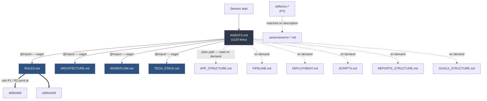
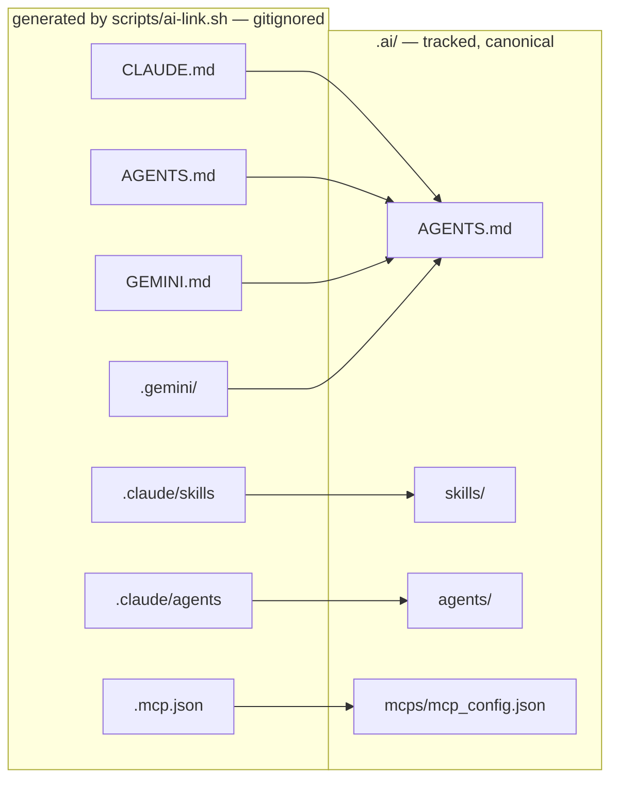
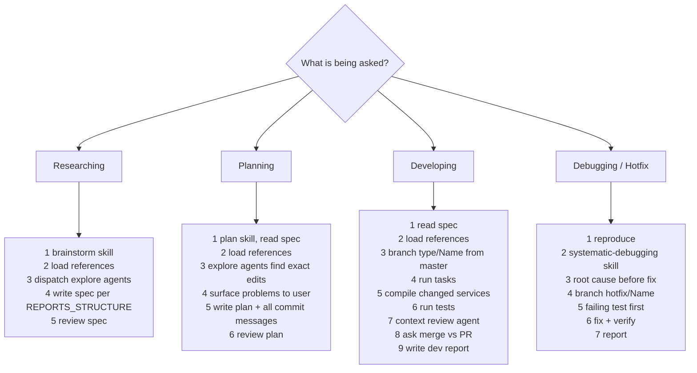

# AI Context Restructure — P1: `.ai/` Skeleton + References

**Type:** chore
**Date:** 2026-07-30
**Status:** design approved, awaiting plan

---

## 1. Repositories and branches involved

| Repo | Branch | Scope of change |
|---|---|---|
| `financial-app` (parent) | `chore/ai-restructure` off `master` | Everything: `.ai/` tree, `scripts/ai-link.sh`, `.gitignore`, deletion of 5 spec files, parent-repo reference sweep |

**P1 touches the parent repo only.** The nine service repos are untouched — see §4.8.

---

## 2. Objective

Today, agent-facing context and human-facing documentation are the same files. Root
`CLAUDE.md` (268 lines) plus `docs/specs/{rules,workflow,architecture,deployment,00-master}.md`
(960 lines) restate each other, mix prose intended for people with rules intended for models,
and load into every session whether relevant or not.

P1 separates the two audiences. All agent-consumed context moves into a tracked `.ai/` tree
written for token density; `docs/` keeps only what a human reads. Four files load into every
session; everything else loads on demand. Tool-specific directories (`.claude/`, `.gemini/`)
become symlink farms pointing into `.ai/`, so one canonical copy serves every tool.

### Measured effect

Numbers below are measured, not estimated: byte counts of the real files at 2026-07-30, divided
by four for a token approximation. Existing docs average 55 bytes per line, which is the figure
used to price the capped files.

| | today | after P1 |
|---|---|---|
| Auto-loaded every session | root `CLAUDE.md` only — 14,495 B ≈ **3,624 tok** | 550 capped lines × 55 B ≈ 30,250 B ≈ **7,560 tok** |
| Read-before-plan tax | the five spec files, 960 lines ≈ **13,377 tok** | **0** — the rules are already resident |
| **Planning or implementation task** | **≈ 17,001 tok** | **≈ 7,560 tok** (−56%) |
| **Trivial question** | **≈ 3,624 tok** | **≈ 7,560 tok** (+109%) |

Always-on context roughly doubles, and that is deliberate. Today the rules a model must never
violate are not loaded — `CLAUDE.md` merely points at them, and compliance depends on the model
choosing to follow a read-before-plan instruction. After P1 they are resident. The saving comes
from deleting the 13k-token read-before-plan tax that every non-trivial task pays today, not from
shrinking the resident set.

The trade is explicit: trivial questions get more expensive so that real work gets cheaper and
more reliably rule-compliant.

---

## 3. Decomposition — where P1 sits

The full restructure request covers four independent subsystems. Each gets its own
spec → plan → implementation cycle.

| Sub-project | Scope | Status |
|---|---|---|
| **P1** | `.ai/` skeleton, `references/` (10 files), `skills/ddd` + `skills/solid`, symlink bootstrap, `.gitignore`, deletion of superseded docs, ref sweep | **this spec** |
| P2 | `.ai/services/*` per-service context files, `.ai/services/EXTERNAL.md`, slim per-repo `.ai/` in all 9 service repos, **and the service-repo reference sweep P1 defers** (§4.8) | later |
| P3 | Remaining skills, `.ai/agents/*`, `.ai/hooks/*` (pre-commit gate, post-commit doc sync), `.ai/mcps/mcp_config.json` | later |
| P4 | `docs/` reorganisation, `docs/superpowers/` unfreeze and merge, README dedupe, archive of stray files | later, **after redesign Wave 0 has been dispatched and merged** |

---

## 4. Design decisions and their rationale

These were settled during brainstorming. Recorded because each rules out an approach that
looks reasonable from the outside.

### 4.1 `.ai/` is canonical; `.claude/` and `.gemini/` are generated link farms

No AI tool auto-discovers a `.ai/` directory. Claude Code scans `.claude/skills/<name>/SKILL.md`,
`.claude/agents/<name>.md`, hooks declared in `.claude/settings.json`, and MCP servers in
`.mcp.json` at repo root. Rather than fight this, `.ai/` holds the real files and the tool
directories hold symlinks.

`.claude/` and `.gemini/` stay gitignored — they mix machine-local settings with repo config,
and git-tracked symlinks are fragile across platforms. A tracked, idempotent
`scripts/ai-link.sh` regenerates every link after clone.

### 4.2 `@import` for the always-on four, plain paths for the rest

`@file.md` in Claude Code inlines the file at session start — it is eager, not lazy. That makes
it exactly right for `RULES`, `ARCHITECTURE`, `WORKFLOW`, `TECH_STACK`, and exactly wrong for
the other six references, which are reached by plain markdown paths the agent reads on demand.
`@` is also Claude-specific; Codex and Gemini read `AGENTS.md` literally, so the plain-path
majority degrades gracefully.

### 4.3 Per-service context loads via Skills

There is no native "load file X when the model mentions service Y" mechanism. Skills are the one
native load-on-relevance loader — matched on their `description` field. P2 therefore exposes each
service file as a skill (`description: "Use when working on ms-banks..."`), costing one
description line of always-on context per service instead of the whole file.

**Superseded 2026-07-31 by P2 §4.3:** nested `CLAUDE.md` auto-load makes the `skills/svc-*`
loaders unnecessary. No such skills were created.

### 4.4 DDD and SOLID become skills in P1, not P3

`RULES.md` is meaningless if its two most important rules are dead pointers. The two skills are
pulled forward so `RULES.md` can say `DDD: follow @.ai/skills/ddd` from the first commit.

### 4.5 Superseded docs are deleted, not mirrored

Keeping `docs/specs/rules.md` as a "human-readable version" of `.ai/references/RULES.md`
recreates the duplication the restructure exists to remove, and guarantees drift. The files are
deleted; git history preserves them. Inbound references are rewritten rather than redirected.

### 4.6 `IDEAS.md` stays human-owned in `docs/`

The known-bugs and tech-debt backlog remains at `docs/specs/IDEAS.md` and is **not** moved into
`.ai/references/`. It grows without bound, so it must never be always-on, and it is written for a
person to triage. `WORKFLOW.md` mandates reading it by path in the Researching and Planning modes,
and `REPORTS_STRUCTURE.md` routes deferred work back into it. Any relocation within `docs/` is a
P4 concern.

### 4.7 `docs/superpowers/` is frozen

That tree is gitignored and holds the live 32-plan redesign program with Wave −1 and Wave 0
written but not dispatched. Reorganising it now would break cross-references inside plans that
have not run. P4 handles it after Wave 0 merges. P1 touches those files only to rewrite dead
link lines.

---

### 4.8 The service-repo reference sweep is deferred to P2

The nine service repos each carry a `CLAUDE.md` that links to `docs/specs/rules.md`,
`docs/specs/workflow.md` and `docs/specs/00-master.md`. P1 does **not** fix those links, for one
decisive reason: **P2 replaces every per-repo `CLAUDE.md` wholesale** with a slim `.ai/` pointer.
Repairing link lines in P1 produces work that P2 deletes.

Two supporting facts, both verified 2026-07-30. First, all nine repos sit on completed but
unmerged Wave 0 feature branches (`feat/fee-schedules-installments`, `feat/cursor-paging-classifier`,
`feat/gateway-bff-foundation`, `feat/broker-fee-schedules-fx-view`,
`feat/notification-category-preferences`, `feat/import-run-reconciliation`,
`feat/user-sessions-preferences`, `feat/commons-domain-model`, `feat/design-tokens`); adding
commits after their audit means the audited SHA is not the merged SHA. Second, four of the nine
have untracked `AGENTS.md` / `GEMINI.md` symlinks while five have them tracked — an inconsistency
P2 normalises anyway.

Consequence for P1: dead links to `docs/specs/*` survive inside the nine service repos between
P1 and P2. This is accepted and recorded here so it is not mistaken for an oversight. G2 scopes
its check to the parent repo accordingly.

## 5. Target structure

```
financial-app/
├── .ai/                              tracked, canonical
│   ├── AGENTS.md                     always-on entry point (≤120 lines)
│   ├── references/
│   │   ├── RULES.md              @   always-on (≤150)
│   │   ├── ARCHITECTURE.md       @   always-on (≤120)
│   │   ├── WORKFLOW.md           @   always-on (≤100)
│   │   ├── TECH_STACK.md         @   always-on (≤60)
│   │   ├── APP_STRUCTURE.md          lazy — envelope, exceptions, auth, persistence, currencies
│   │   ├── PIPELINE.md               lazy — GitHub Actions, rulesets, release flow
│   │   ├── DEPLOYMENT.md             lazy — prod VM, compose overlays, local run
│   │   ├── SCRIPTS.md                lazy — what each script does
│   │   ├── REPORTS_STRUCTURE.md      lazy — spec / plan / dev-report skeletons
│   │   └── GOALS_STRUCTURE.md        lazy — what makes a goal a goal
│   ├── skills/
│   │   ├── ddd/SKILL.md              P1
│   │   └── solid/SKILL.md            P1
│   ├── services/   OWNERS.md → P2
│   ├── agents/     OWNERS.md → P3     (flat `<name>.md` files, Claude-native shape)
│   ├── hooks/      OWNERS.md → P3
│   └── mcps/       OWNERS.md → P3
├── scripts/ai-link.sh                tracked, idempotent, has --check mode
├── CLAUDE.md  →  .ai/AGENTS.md       gitignored symlink
├── AGENTS.md  →  .ai/AGENTS.md       gitignored symlink
├── GEMINI.md  →  .ai/AGENTS.md       gitignored symlink
├── .mcp.json  →  .ai/mcps/mcp_config.json    gitignored symlink; target ships as `{"mcpServers":{}}`
├── .claude/                          gitignored
│   ├── skills  →  ../.ai/skills      directory symlink
│   ├── agents  →  ../.ai/agents      directory symlink
│   └── settings.local.json           machine-local, untouched
└── .gemini/                          gitignored — settings only, see note below
```

Directory symlinks are possible for both `skills/` and `agents/` because `.ai/agents/` uses flat
`<name>.md` files, matching Claude Code's native layout. Two exceptions:

- **Hooks** are `settings.json` entries plus scripts, not discovered files. P3 wires them
  explicitly; there is no `.claude/hooks` symlink.
- **`.gemini/`** does not mirror `.claude/`. Gemini CLI discovers root `GEMINI.md` and
  `.gemini/settings.json`; it has no skills or agents discovery. `.gemini/` therefore receives
  settings only, and Gemini's context arrives entirely through the root `GEMINI.md` symlink.

`.mcp.json` must not dangle. `.ai/mcps/mcp_config.json` ships in P1 containing
`{"mcpServers":{}}` so the symlink resolves from day one; P3 fills it. `ai-link.sh` additionally
skips any link whose target is absent rather than creating a broken one.

### Load-time diagram



Solid arrows load at session start. Dotted arrows load only when the task needs them.

### Canonical-vs-link relationship



---

## 6. Content mapping

Every fact moves exactly once. Left-hand sources are deleted at the end of P1.

| Source | Destination |
|---|---|
| `CLAUDE.md` §0 read-before-plan | `WORKFLOW.md`, folded into the four modes |
| `CLAUDE.md` §1 "other AI tools" | `ARCHITECTURE.md` § AI context layer |
| `CLAUDE.md` §2 system map + mermaid | `ARCHITECTURE.md` |
| `CLAUDE.md` §3 domain-model catalog | **dropped in P1**, restored per-service in P2 |
| `CLAUDE.md` §4 DDD layering + package tree | `skills/ddd` (layering) + `APP_STRUCTURE.md` (package tree) |
| `CLAUDE.md` §5 naming table | `RULES.md` R7 |
| `CLAUDE.md` §6 response envelope | `APP_STRUCTURE.md` |
| `CLAUDE.md` §7 comment policy | `RULES.md` R9 |
| `CLAUDE.md` §8 git / workflow | `RULES.md` R11–R14 + `WORKFLOW.md` + `PIPELINE.md` |
| `CLAUDE.md` §9 destructive approval | `RULES.md` R15 |
| `rules.md` §1 DDD | `skills/ddd` |
| `rules.md` §2 SOLID | `skills/solid` |
| `rules.md` §3 envelope, §4 exception handling | `APP_STRUCTURE.md` |
| `rules.md` §5 configuration, §6 persistence, §8 currencies | `APP_STRUCTURE.md` |
| `rules.md` §7 comments | `RULES.md` R9 |
| `rules.md` §9 CI constraints | `RULES.md` R16–R17 (the two hard bans) + `PIPELINE.md` (remainder) |
| `workflow.md` branching, commit rules, per-repo targets | `WORKFLOW.md` + `RULES.md` |
| `workflow.md` CI/CD | `PIPELINE.md` |
| `architecture.md` §1 polyrepo, §2 runtime, §4 data stores | `ARCHITECTURE.md` |
| `architecture.md` §3 auth / cookie / CSRF flow | `APP_STRUCTURE.md` |
| `architecture.md` §5 DDD layering | `skills/ddd` |
| `architecture.md` §6 CI/CD | `PIPELINE.md` |
| `deployment.md` §1 `dev.sh` reference | `SCRIPTS.md` |
| `deployment.md` §2–§7 | `DEPLOYMENT.md` |
| `00-master.md` spec map | `AGENTS.md` — the reference index replaces the hub |
| *new*, derived from `.github/workflows/*.yml`, `.github/rulesets/*.json` | `PIPELINE.md` |
| *new*, derived from `scripts/*.sh`, `scripts/github/*.sh` | `SCRIPTS.md` |
| *new*, derived from poms + `front/financial-app/package.json` | `TECH_STACK.md` |
| *new*, authored | `REPORTS_STRUCTURE.md`, `GOALS_STRUCTURE.md` |

`docs/specs/services/*.md` are untouched by P1 — P2 owns them.

---

## 7. Line budgets

Caps are ceilings with deliberate reserve, so P2 and P3 additions do not force a rewrite.

### `RULES.md` — 150 lines

| Block | Lines | Contents |
|---|---|---|
| Header + how to cite | 4 | one line explaining the `Rxx` id scheme |
| R1–R2 Architecture | 8 | DDD → `@.ai/skills/ddd`; SOLID → `@.ai/skills/solid` |
| R3–R6 Modeling | 14 | reification, no duplicate behaviour, VO conventions, no method-per-enum-state |
| R7 Naming | 32 | the existing 22-row table, kept verbatim |
| R8 Language | 4 | English identifiers only |
| R9 Comments | 5 | policy + one counter-example |
| R10 Envelope | 4 | one-line contract, full shape in `APP_STRUCTURE.md` |
| R11–R13 Git | 16 | never push · never `Co-Authored-By` · never commit unsolicited · branch naming |
| R14 Commit format | 14 | conventional commits, subject ≤50, when a body is required, one example |
| R15 Destructive changes | 5 | explain → ask → wait |
| R16–R17 Verification | 10 | `mvn verify` not `mvn test`; no suppression to reach green |
| R18 Docs sync | 5 | update service reference + README after implementation |
| Reserve | 29 | |

Each rule is at most three lines of prose plus at most one example. Numbered ids let hooks,
review agents and reports cite a rule instead of quoting it.

Style sample:

```markdown
### R9 — Comments only on request
Write a comment only when the user asks for one, or asks why something is done a
certain way. Never above a class/record/interface declaration. Never restate code.
✗ `// increment counter` above `count++`
```

### `ARCHITECTURE.md` — 120 lines

Polyrepo topology 18 · service/port/schema table 14 · runtime mermaid 16 · data stores 20 ·
repo layout tree 22 · AI context layer 20 · reserve 10.

The AI context layer section documents `.ai/` as canonical, the generated link farms, and
`scripts/ai-link.sh`.

### `WORKFLOW.md` — 100 lines

Mode-selection preamble 6 · Researching 18 · Planning 22 · Developing 26 · Debugging/Hotfix 20 ·
reserve 8. Each mode is a numbered step list, not prose.

### `TECH_STACK.md` — 60 lines

Backend 14 · frontend 10 · infrastructure 8 · build and dependency order 16 · version pins 8 ·
reserve 4.

### `AGENTS.md` — 120 lines

Identity and polyrepo one-liner 8 · the four `@`-imports 6 · lazy reference index with a
"read when" trigger per file 22 · service index and the rule to read `.ai/services/<svc>.md`
first 16 · skills and agents index 12 · mode router 8 · non-negotiables digest 8 · footer 4 ·
reserve 36.

Lazy files are uncapped but written to the same density. `APP_STRUCTURE.md` is expected to be the
largest at roughly 250 lines, since it absorbs the envelope contract, the exception hierarchy,
the `DomainError` → HTTP mapping table, and the auth flow.

---

## 8. The four workflow modes

`WORKFLOW.md` opens with a router: pick the mode, follow its numbered steps.



Planning carries a hard requirement: every commit message the implementation will make is
written into the plan, so the user can edit them before work starts. Those messages follow
`RULES.md` R14.

---

## 9. `GOALS_STRUCTURE.md`

New file, no existing source. Defines what a goal is, for use inside specs, plans and reports.

- **Goal is not a task.** A task is an action taken; a goal is an observable end state after
  tasks run. "Add `BudgetRepository`" is a task. "A user can set a monthly cap per category and
  the API rejects an over-cap write" is a goal.
- **Form:** `G<n>. <observable outcome> — Verified by: <command or observable>`. No goal ships
  without a verification clause; if the check cannot be named, it is not yet a goal.
- **Constraints:** 3–8 goals per plan, each independently verifiable, mapped many-to-many onto
  tasks — never one goal per task. An explicit `Non-goals` list bounds scope.
- **Traceability:** the plan states goals; the development report restates each as
  `met / not-met / partial` with pasted evidence.

---

## 10. `REPORTS_STRUCTURE.md`

Three outputs. Section 1 is the short standard reply; sections 2 and 3 are file templates.

**Standard output reply** — what the issue was, what changed, the result. Three short paragraphs,
no file written.

**Spec / plan template**, written to `docs/specs/` or `docs/plans/`:
name · branches and repositories involved · objective · connection to related specs or plans ·
diagrams · what will be done · problems to consider · goals (per `GOALS_STRUCTURE.md`) ·
content references needed to implement.

**Development report template**, written to
`docs/reports/<from_branch>_<branch_type>_<date>_<name>.md`:
name · branches and repositories involved · objective · connection to plans or specs · diagrams ·
goals with met/not-met status · what was done · problems found · **files and commits touched**
(repo → branch → SHA table) · **verification evidence** (pasted `mvn verify` / test output) ·
**contract changes** (endpoints, DTO fields, Kafka schemas, migrations — empty means nothing
broke) · **follow-ups and deferred work**, feeding `IDEAS.md` · results · other references.

The three additions beyond the original request — commits/evidence, contract changes,
follow-ups — exist to make a report auditable rather than narrative, and to stop known gaps
evaporating between sessions.

The existing `docs/reports/WAVE00_2026-07-30.md` predates this convention and is grandfathered;
it is not renamed. The naming rule applies to reports written from P1 onward.

---

## 11. Execution order

Each numbered step is one commit.

1. `.gitignore` — add `.gemini/`, confirm `.ai/` is tracked, keep the three root markdown
   symlinks ignored as generated artifacts.
2. `scripts/ai-link.sh` with `--check` mode. Run it; confirm every link resolves.
3. **Coverage matrix first.** Write `.ai/_migration-coverage.md`: one row per heading in the five
   dying files and root `CLAUDE.md`, each with its destination. Rows are generated from
   `grep -nE '^#{1,3} '` output, not from memory. This is the audit instrument and it is written
   before any content is authored.
4. `skills/ddd/SKILL.md`, `skills/solid/SKILL.md`.
5. `APP_STRUCTURE.md` — the largest sink.
6. The four always-on files.
7. `PIPELINE.md`, `SCRIPTS.md`, `DEPLOYMENT.md`, `TECH_STACK.md`, derived from live sources.
8. `REPORTS_STRUCTURE.md`, `GOALS_STRUCTURE.md`.
9. `AGENTS.md` last — it indexes everything above.
10. Reference sweep, parent repo only, isolated in its own commit. After removing files P1
    deletes anyway, and excluding `docs/superpowers/archive/` as historical record that must not
    be rewritten, exactly two files need editing:

    ```
    README.md
    docs/GETTING-STARTED.md
    ```

    `docs/superpowers/` is left entirely untouched — its plans and specs are records of work
    already executed, and rewriting their links would falsify what those runs actually referenced.
11. Delete `docs/specs/{rules,workflow,architecture,deployment,00-master}.md` and root
    `CLAUDE.md`; recreate `CLAUDE.md` as a symlink.
12. Create `services/`, `agents/`, `hooks/`, `mcps/` with a one-line `OWNERS.md` naming the
    sub-project that fills each.

---

## 12. Goals

> **Every verification command in this section must use `/usr/bin/grep`, never bare `grep`.**
> The shell here resolves `grep` to a function wrapping **ugrep**, which honours `.gitignore`.
> Because `back/*`, `front/*` and `docs/superpowers/*` are all gitignored, a bare `grep -r`
> silently skips them. During review of this spec the bare form reported 4 matching files where
> the true count was 21 — a gate that passes while missing 81% of its targets. Use
> `/usr/bin/grep -r --exclude-dir=.git --exclude-dir=node_modules`.

G1. Every fact in the five deleted files and root `CLAUDE.md` exists in exactly one file under
`.ai/`.
— *Verified by:* every row of `.ai/_migration-coverage.md` carries a destination, and each row's
fact is located in that destination by an explicit grep. A review subagent then reads the deleted
files from git history against the new tree and reports omissions. **Dispatching that subagent
requires the user's explicit approval at execution time.**

G2. No file in the parent repo points at a deleted path.
— *Verified by:*
```bash
/usr/bin/grep -rl -e 'docs/specs/rules' -e 'docs/specs/workflow' \
  -e 'docs/specs/architecture' -e 'docs/specs/deployment' -e 'docs/specs/00-master' . \
  --exclude-dir=.git --exclude-dir=node_modules --exclude-dir=back --exclude-dir=front \
  --exclude-dir=superpowers
```
returns zero matches. `back/`, `front/` and `docs/superpowers/` are excluded deliberately, per
§4.8 and §11 step 10 — not because grep cannot see them.

G3. The always-on context set stays within budget.
— *Verified by:* `wc -l` on `AGENTS.md`, `RULES.md`, `ARCHITECTURE.md`, `WORKFLOW.md`,
`TECH_STACK.md` returns values at or below 120/150/120/100/60 respectively.

G4. Every tool entry point resolves to canonical content in `.ai/`.
— *Verified by:* `scripts/ai-link.sh --check` exits 0; `readlink -f` on root `CLAUDE.md`,
`AGENTS.md`, `GEMINI.md` each returns the path of `.ai/AGENTS.md`; `readlink -f .mcp.json`
resolves to an existing file.

G5. Every path referenced from the entry point resolves.
— *Verified by:* `/usr/bin/grep -c '^@' .ai/AGENTS.md` returns exactly 4; every `@`-prefixed path
and every markdown link target extracted from `AGENTS.md` and the four always-on files exists on
disk. Run as a script so it is repeatable, not by starting a session and eyeballing it.

G6. No rule text appears in two places.
— *Verified by:* every row of the coverage matrix has exactly one destination, and no `Rxx`
identifier is defined in more than one file.

**Non-goals for P1:** per-service context files, per-repo `.ai/` folders, any skill beyond `ddd`
and `solid`, any agent, any hook, MCP configuration content, `docs/` reorganisation, README
deduplication, and any change to `docs/specs/services/*.md`.

---

## 13. Problems to consider

**The coverage matrix is the entire safety net.** If a fact never gets a row, no gate catches it.
Mitigation is mechanical generation from `grep` output rather than manual transcription.

**`grep` lies in this workspace.** It resolves to a ugrep-backed shell function that honours
`.gitignore`, and the three most reference-dense trees (`back/`, `front/`, `docs/superpowers/`)
are all gitignored. Any verification, audit or discovery step that uses bare `grep` will return a
confidently wrong answer. Every command in this spec uses `/usr/bin/grep`. This is the single
highest-risk item in P1 because the failure mode is a green gate, not an error.

**Dead links persist in the nine service repos between P1 and P2.** Accepted per §4.8. Recorded
so a later reader does not treat it as a defect.

**A gap window exists for the domain-model catalog.** Root `CLAUDE.md` §3 is dropped in P1 and
not restored until P2 populates `.ai/services/`. During that window no file lists the aggregates
per service. Accepted deliberately: the catalog is a per-service concern and duplicating it into
`ARCHITECTURE.md` only to delete it again in P2 is wasted work. `docs/specs/services/*.md` still
carry the full domain models throughout.

**Auth flow is demoted to lazy loading.** `architecture.md` §3 moves into `APP_STRUCTURE.md`,
so cookie and CSRF details are no longer always in context. Justified because auth details matter
only when touching auth or gateway code, and `ARCHITECTURE.md` retains a one-line pointer.

**`.claude/` and `.gemini/` remain gitignored.** A contributor who skips `ai-link.sh` gets no AI
context at all rather than degraded context. `docs/GETTING-STARTED.md` gains it as an explicit
step, and P3's pre-commit hook can call `ai-link.sh --check`.

**Loose ends parked for P4:** `.ai/Prompt.md` and `helper.txt` should be archived to
`docs/archive/` rather than left in the AI context path. `docs/specs/2026-06-12-bugfix-batch-*.md`
is a stray spec needing a home. `docs/README.md` duplicates root `README.md`.

---

## 14. References needed to implement

| Path | Why |
|---|---|
| `CLAUDE.md` | primary source, deleted at the end |
| `docs/specs/rules.md` | source for `RULES`, `APP_STRUCTURE`, both skills |
| `docs/specs/workflow.md` | source for `WORKFLOW`, `PIPELINE` |
| `docs/specs/architecture.md` | source for `ARCHITECTURE`, `APP_STRUCTURE`, `skills/ddd` |
| `docs/specs/deployment.md` | source for `DEPLOYMENT`, `SCRIPTS` |
| `docs/specs/00-master.md` | source for the `AGENTS.md` index |
| `.github/workflows/*.yml`, `.github/rulesets/*.json` | source for `PIPELINE.md` |
| `scripts/*.sh`, `scripts/github/*.sh` | source for `SCRIPTS.md` |
| `back/financial-app-parent/pom.xml`, service poms, `front/financial-app/package.json` | source for `TECH_STACK.md` |
| `docker-compose*.yml`, `.env.example` | cross-check for `DEPLOYMENT.md` and `ARCHITECTURE.md` |
| `.gitignore` | must be edited, currently ignores `.claude/` and `CLAUDE.md` |
| `README.md`, `docs/GETTING-STARTED.md` | the only two reference-sweep targets in P1 |
| `docs/reports/WAVE00_2026-07-30.md` | confirms Wave 0 state; explains why service repos are deferred |
