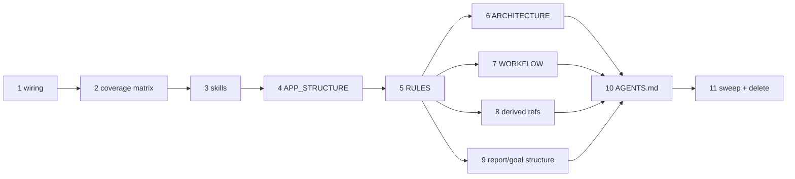
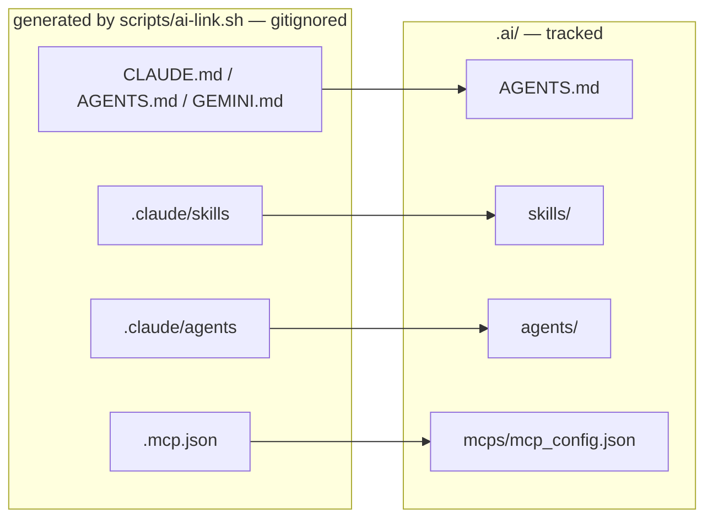

# AI Context Restructure P1 — Implementation Plan

> **For agentic workers:** REQUIRED SUB-SKILL: Use superpowers:subagent-driven-development (recommended) or superpowers:executing-plans to implement this plan task-by-task. Steps use checkbox (`- [ ]`) syntax for tracking.

**Goal:** Move all agent-facing context out of `CLAUDE.md` and `docs/specs/*.md` into a tracked, token-dense `.ai/` tree that every AI tool reaches through generated symlinks.

**Architecture:** `.ai/` holds canonical content. `.claude/`, root `CLAUDE.md`/`AGENTS.md`/`GEMINI.md` and `.mcp.json` are gitignored symlinks regenerated by `scripts/ai-link.sh`. Four reference files load into every session via `@import`; six load on demand. Five superseded spec files are deleted at the end, after a coverage matrix proves every fact they held now lives somewhere in `.ai/`.

**Tech Stack:** Bash (POSIX-ish, `bash` 5+), GNU coreutils (`realpath --relative-to`), markdown. No build system, no test framework — verification is a shell script.

**Spec:** `docs/specs/2026-07-30-ai-restructure-p1-design.md`. Read it before starting. Section numbers referenced below (§2, §4.8, §12…) point at that spec.

## Global Constraints

- **Never run `git push`.** The user controls all remote pushes.
- **Never add a `Co-Authored-By` trailer** to any commit message.
- **Commit only the files each task names.** Never `git add -A`.
- **Use `/usr/bin/grep`, never bare `grep`.** In this workspace `grep` is a shell function wrapping ugrep, which honours `.gitignore`. `back/`, `front/` and `docs/superpowers/` are all gitignored, so bare `grep -r` silently skips them and returns confidently wrong answers. This applies to every command you run, not only the ones in this plan.
- **Work in the parent repo only** (`/home/ssmirnoff/Documents/proyects/financial-app`). The nine service repos are out of scope for P1 (spec §4.8).
- **Do not touch `docs/superpowers/`.** It is a frozen historical record (spec §4.7).
- **Do not touch `docs/specs/services/*.md`.** They belong to P2.
- **Line caps are hard.** `AGENTS.md` ≤120, `RULES.md` ≤150, `ARCHITECTURE.md` ≤120, `WORKFLOW.md` ≤100, `TECH_STACK.md` ≤60. `scripts/ai-verify.sh` enforces them.
- **Comment policy applies to the shell scripts too:** no explanatory comments beyond the file-header usage block.
- Branch: `chore/ai-restructure`, created from `master` in Task 1.
- **Read the original `CLAUDE.md` from `$SRC`, never from the repo root.** Task 1's `ai-link.sh` replaces root `CLAUDE.md` with a symlink to `.ai/AGENTS.md`, destroying the 268-line original. That file was untracked and its last committed version is stale, so git cannot restore it. A byte-identical copy (268 lines, 14,495 bytes) is preserved at:

  ```bash
  SRC=.superpowers/sdd/2026-07-30-ai-restructure-p1-plan/sources/CLAUDE.md
  ```

  All line numbers quoted in this plan (`CLAUDE.md:123-174` and so on) refer to that file. Do not delete it until Task 11 reports complete.

---

## File Structure

| Path | Responsibility | Task |
|---|---|---|
| `scripts/ai-link.sh` | Create/refresh every tool symlink; `--check` verifies without writing | 1 |
| `scripts/ai-verify.sh` | Executable form of spec goals G2–G6; run after every task | 1 |
| `.gitignore` | Ignore generated link artifacts; keep `.ai/` tracked | 1 |
| `.ai/mcps/mcp_config.json` | Empty MCP config so `.mcp.json` never dangles | 1 |
| `.ai/_migration-coverage.md` | Audit instrument: every source heading → its destination | 2 |
| `.ai/skills/ddd/SKILL.md` | DDD layering, package convention, port/adapter rules | 3 |
| `.ai/skills/solid/SKILL.md` | SOLID principles as applied in this codebase | 3 |
| `.ai/references/APP_STRUCTURE.md` | Envelope, exception tree, `DomainError`→HTTP, auth flow, persistence, config, currencies | 4 |
| `.ai/references/RULES.md` | `R1`–`R18`, the always-on rule set | 5 |
| `.ai/references/ARCHITECTURE.md` | Polyrepo + runtime topology + data stores + AI context layer | 6 |
| `.ai/references/WORKFLOW.md` | The four modes | 7 |
| `.ai/references/TECH_STACK.md` | Stack + dependency order | 8 |
| `.ai/references/PIPELINE.md` | GitHub Actions, rulesets, release flow | 8 |
| `.ai/references/SCRIPTS.md` | What each script does | 8 |
| `.ai/references/DEPLOYMENT.md` | Prod VM, compose overlays, local run | 8 |
| `.ai/references/REPORTS_STRUCTURE.md` | Spec / plan / dev-report templates | 9 |
| `.ai/references/GOALS_STRUCTURE.md` | What makes a goal a goal | 9 |
| `.ai/AGENTS.md` | Always-on entry point; indexes everything | 10 |
| `.ai/{services,agents,hooks}/OWNERS.md` | One-line stubs naming the sub-project that fills each | 10 |
| `README.md`, `docs/GETTING-STARTED.md` | Reference sweep targets | 11 |

**Deleted in Task 11:** `CLAUDE.md` (becomes a symlink), `docs/specs/rules.md`, `docs/specs/workflow.md`, `docs/specs/architecture.md`, `docs/specs/deployment.md`, `docs/specs/00-master.md`.

**Task dependency order.** Task 1 → 2 → 3 → 4 → 5, then 6/7/8/9 are independent of each other, then 10, then 11.



---

### Task 1: Wiring — branch, gitignore, link script, verify script

Nothing else can be checked until the gates exist. This task builds the gates first and proves they fail, then makes them pass.

**Files:**
- Create: `scripts/ai-link.sh`
- Create: `scripts/ai-verify.sh`
- Create: `.ai/mcps/mcp_config.json`
- Modify: `.gitignore`

**Interfaces:**
- Consumes: nothing.
- Produces: `scripts/ai-link.sh [--check]` — exit 0 when every link is correct, 1 otherwise. `scripts/ai-verify.sh` — exit 0 when gates G2–G6 pass, 1 otherwise, printing one `ok`/`FAIL` line per gate. Every later task runs `scripts/ai-verify.sh` as its test step.

- [ ] **Step 1: Create the branch**

```bash
cd /home/ssmirnoff/Documents/proyects/financial-app
git checkout master
git status --porcelain
git checkout -b chore/ai-restructure
```

Expected: `git status --porcelain` shows only untracked entries (`.ai/`, `AGENTS.md`, `GEMINI.md`, `docs/Financial App Redesign.dc.html`, `docs/reports/`, the two `docs/specs/2026-07-30-ai-restructure-p1-*.md` files). If any **tracked** file is modified, stop and ask the user — the plan assumes a clean tree.

- [ ] **Step 2: Write the verification script**

Create `scripts/ai-verify.sh`:

```bash
#!/usr/bin/env bash
# Executable form of the P1 goals G2-G6.
# Usage: scripts/ai-verify.sh
set -uo pipefail
ROOT="$(cd "$(dirname "${BASH_SOURCE[0]}")/.." && pwd)"
cd "$ROOT"

GREP=/usr/bin/grep
fail=0
pass() { printf 'ok    %s\n' "$1"; }
bad()  { printf 'FAIL  %s\n' "$1"; fail=1; }

# --- G3: line caps -----------------------------------------------------------
check_cap() {
  local file="$1" cap="$2" n
  if [[ ! -f "$file" ]]; then bad "G3 $file missing"; return; fi
  n=$(wc -l < "$file")
  if (( n <= cap )); then pass "G3 $file $n/$cap lines"
  else bad "G3 $file $n lines exceeds cap $cap"; fi
}

# --- G2: no references to deleted paths --------------------------------------
g2() {
  local hits
  hits=$($GREP -rl \
    -e 'docs/specs/rules' -e 'docs/specs/workflow' -e 'docs/specs/architecture' \
    -e 'docs/specs/deployment' -e 'docs/specs/00-master' . \
    --exclude-dir=.git --exclude-dir=node_modules --exclude-dir=back \
    --exclude-dir=front --exclude-dir=superpowers 2>/dev/null \
    | $GREP -v 'ai-restructure-p1' | $GREP -v 'ai-verify.sh' || true)
  if [[ -z "$hits" ]]; then pass "G2 no references to deleted spec paths"
  else bad "G2 stale references in:"; printf '        %s\n' $hits; fi
}

# --- G4/G5: links resolve, entry point is coherent ---------------------------
g4() {
  bash scripts/ai-link.sh --check >/dev/null 2>&1 \
    && pass "G4 all symlinks correct" || bad "G4 ai-link.sh --check failed"
  local f
  for f in CLAUDE.md AGENTS.md GEMINI.md; do
    if [[ "$(readlink -f "$f" 2>/dev/null)" == "$ROOT/.ai/AGENTS.md" ]]; then
      pass "G4 $f resolves to .ai/AGENTS.md"
    else bad "G4 $f does not resolve to .ai/AGENTS.md"; fi
  done
  [[ -f "$(readlink -f .mcp.json 2>/dev/null)" ]] \
    && pass "G4 .mcp.json resolves to a real file" || bad "G4 .mcp.json dangles"
}

g5() {
  [[ -f .ai/AGENTS.md ]] || { bad "G5 .ai/AGENTS.md missing"; return; }
  local n; n=$($GREP -c '^@' .ai/AGENTS.md || true)
  (( n == 4 )) && pass "G5 AGENTS.md declares exactly 4 @-imports" \
                || bad "G5 AGENTS.md has $n @-imports, expected 4"
  local missing=0 p
  while read -r p; do
    [[ -z "$p" ]] && continue
    [[ -e "${p#@}" ]] || { printf '        unresolved: %s\n' "$p"; missing=1; }
  done < <($GREP -ho '^@[^ ]*' .ai/AGENTS.md || true)
  while read -r p; do
    [[ -z "$p" ]] && continue
    [[ "$p" == http* ]] && continue
    [[ -e "$p" ]] || { printf '        unresolved link: %s\n' "$p"; missing=1; }
  done < <($GREP -hoE '\]\((\.ai|docs|scripts)/[^)]*\)' .ai/AGENTS.md .ai/references/*.md 2>/dev/null \
            | sed 's/^](//; s/)$//' || true)
  (( missing == 0 )) && pass "G5 all referenced paths resolve" \
                     || bad "G5 unresolved paths above"
}

# --- G6: no rule id defined twice --------------------------------------------
g6() {
  [[ -f .ai/references/RULES.md ]] || { bad "G6 RULES.md missing"; return; }
  local dupes
  dupes=$($GREP -rhoE '^### R[0-9]+' .ai/ | sort | uniq -d || true)
  [[ -z "$dupes" ]] && pass "G6 no duplicate rule ids" \
                    || bad "G6 duplicate rule ids: $dupes"
}

g2
g4
g5
check_cap .ai/AGENTS.md               120
check_cap .ai/references/RULES.md     150
check_cap .ai/references/ARCHITECTURE.md 120
check_cap .ai/references/WORKFLOW.md  100
check_cap .ai/references/TECH_STACK.md 60
g6

exit $fail
```

- [ ] **Step 3: Run it to verify it fails**

```bash
chmod +x scripts/ai-verify.sh
bash scripts/ai-verify.sh; echo "exit=$?"
```

Expected: `exit=1`, with `FAIL G4 ai-link.sh --check failed` (script does not exist yet) and `FAIL G3 .ai/AGENTS.md missing` among the output. This is the red state. If it exits 0, the script is broken — fix it before continuing.

- [ ] **Step 4: Write the link script**

Create `scripts/ai-link.sh`:

```bash
#!/usr/bin/env bash
# Regenerate the AI tool symlinks that point into .ai/.
# Usage: scripts/ai-link.sh [--check]
#   (no args)  create or refresh every link
#   --check    verify only, exit 1 if any link is wrong or missing
set -uo pipefail
ROOT="$(cd "$(dirname "${BASH_SOURCE[0]}")/.." && pwd)"
cd "$ROOT"

MODE="${1:-link}"
fail=0

LINKS=(
  ".ai/AGENTS.md|CLAUDE.md"
  ".ai/AGENTS.md|AGENTS.md"
  ".ai/AGENTS.md|GEMINI.md"
  ".ai/mcps/mcp_config.json|.mcp.json"
  ".ai/skills|.claude/skills"
  ".ai/agents|.claude/agents"
)

for entry in "${LINKS[@]}"; do
  target="${entry%%|*}"
  link="${entry##*|}"
  linkdir="$(dirname "$link")"

  if [[ ! -e "$target" ]]; then
    printf 'skip  %-20s target %s absent\n' "$link" "$target"
    continue
  fi

  mkdir -p "$linkdir"
  rel="$(realpath --relative-to="$linkdir" "$target")"

  if [[ "$MODE" == "--check" ]]; then
    actual="$(readlink "$link" 2>/dev/null || true)"
    if [[ "$actual" == "$rel" ]]; then
      printf 'ok    %-20s -> %s\n' "$link" "$rel"
    else
      printf 'FAIL  %-20s -> expected %s, got %s\n' "$link" "$rel" "${actual:-<missing>}"
      fail=1
    fi
  else
    ln -sfn "$rel" "$link"
    printf 'link  %-20s -> %s\n' "$link" "$rel"
  fi
done

exit $fail
```

Gemini CLI reads root `GEMINI.md` and `.gemini/settings.json` only — it has no skills or agents discovery, so there is deliberately no `.gemini/` entry in `LINKS` (spec §5).

- [ ] **Step 5: Create the MCP config so `.mcp.json` cannot dangle**

```bash
mkdir -p .ai/mcps
printf '{\n  "mcpServers": {}\n}\n' > .ai/mcps/mcp_config.json
```

- [ ] **Step 6: Create placeholder targets so links can be made**

`ai-link.sh` skips absent targets. `.ai/AGENTS.md`, `.ai/skills` and `.ai/agents` do not exist yet, so create them empty now; later tasks fill them.

```bash
mkdir -p .ai/skills .ai/agents .ai/references
touch .ai/AGENTS.md
```

- [ ] **Step 7: Update `.gitignore`**

Find the existing `CLAUDE.md` and `.claude/` entries and replace that region so the intent is explicit. Apply this diff:

```diff
-CLAUDE.md
+# Generated AI entry points — canonical content lives in .ai/ (see scripts/ai-link.sh)
+/CLAUDE.md
+/AGENTS.md
+/GEMINI.md
+/.mcp.json
+/.claude/
+/.gemini/
```

Then delete the now-duplicate standalone `.claude` and `.claude/` lines further down the file. Verify `.ai/` is **not** ignored:

```bash
git check-ignore -v .ai/AGENTS.md; echo "exit=$? (expect 1 = not ignored)"
git check-ignore -v CLAUDE.md AGENTS.md GEMINI.md .mcp.json .claude/skills
```

Expected: first command exits 1 with no output. Second lists all five as ignored.

- [ ] **Step 8: Run the link script**

```bash
chmod +x scripts/ai-link.sh
rm -f AGENTS.md GEMINI.md
bash scripts/ai-link.sh
bash scripts/ai-link.sh --check; echo "exit=$?"
```

Expected: six `link` lines then six `ok` lines, `exit=0`. `rm -f AGENTS.md GEMINI.md` clears the pre-existing untracked symlinks that point at the old `CLAUDE.md`.

- [ ] **Step 9: Run the verification script**

```bash
bash scripts/ai-verify.sh; echo "exit=$?"
```

Expected: `exit=1` still — G4 now passes, but G3 caps fail because the reference files do not exist and G5 fails because `AGENTS.md` is empty. Confirm the G4 lines read `ok`. That is this task's deliverable.

- [ ] **Step 10: Commit**

```bash
git add scripts/ai-link.sh scripts/ai-verify.sh .gitignore .ai/mcps/mcp_config.json
git commit -m "chore(ai): add .ai wiring, link and verify scripts"
```

---

### Task 2: Coverage matrix

The audit instrument, written before any content, generated mechanically rather than from memory. Spec §11 step 3 and §13 make this the sole safety net against silent fact loss.

**Files:**
- Create: `.ai/_migration-coverage.md`

**Interfaces:**
- Consumes: nothing.
- Produces: `.ai/_migration-coverage.md` — a table with columns `Source | Lines | Heading | Destination | Verified`. Tasks 3–10 flip `Verified` to `yes` for the rows they satisfy. Task 11 refuses to delete anything while a row is still `no`.

- [ ] **Step 1: Generate the raw rows**

The generator must be **fence-aware**. A naive `grep -nE '^#{1,3} '` treats shell comments inside
fenced code blocks as headings — `deployment.md` alone yields 42 matches that way against 18 real
headings, which would put 24 fictional rows into the audit instrument. This awk toggles on ``` and
skips fenced regions:

```bash
SCRATCH=/tmp/claude-1000/-home-ssmirnoff-Documents-proyects-financial-app/d5d78269-a0ab-4b89-859a-bfce7c5c5ca7/scratchpad
SRC=.superpowers/sdd/2026-07-30-ai-restructure-p1-plan/sources/CLAUDE.md
for f in "$SRC" docs/specs/rules.md docs/specs/workflow.md \
         docs/specs/architecture.md docs/specs/deployment.md docs/specs/00-master.md; do
  label="$f"; [[ "$f" == "$SRC" ]] && label="CLAUDE.md"
  awk -v f="$label" '
    /^```/ { fence = !fence; next }
    !fence && /^#{1,3} / {
      if (prev_h != "") printf "| `%s` | %d-%d | %s | | no |\n", f, prev_l, NR-1, prev_h
      prev_l = NR; prev_h = $0; gsub(/\|/, "\\|", prev_h)
    }
    END { if (prev_h != "") printf "| `%s` | %d-%d | %s | | no |\n", f, prev_l, NR, prev_h }
  ' "$f"
done > "$SCRATCH/rows.md"
echo "total rows: $(wc -l < "$SCRATCH/rows.md")"
/usr/bin/grep -oE '^\| `[^`]+`' "$SCRATCH/rows.md" | sort | uniq -c
```

Expected exactly:

```
total rows: 73
     12 | `CLAUDE.md`
      5 | `docs/specs/00-master.md`
      7 | `docs/specs/architecture.md`
     18 | `docs/specs/deployment.md`
     22 | `docs/specs/rules.md`
      9 | `docs/specs/workflow.md`
```

If any count differs, the awk mis-parsed. Fix it rather than proceeding — an incomplete matrix
defeats the only safety net P1 has.

- [ ] **Step 2: Write the matrix file**

Create `.ai/_migration-coverage.md` with this header, then paste the generated rows beneath it and fill the `Destination` column from the spec's §6 mapping table:

```markdown
# Migration coverage matrix — P1

Generated mechanically from `/usr/bin/grep -nE '^#{1,3} '` over the six source files, not
transcribed by hand. Every row must reach `Verified: yes` before Task 11 deletes anything.

`Destination` values come from the spec's §6 content mapping table. A row whose destination is
`DROPPED (P2)` is a deliberate omission recorded in spec §13, not a gap.

| Source | Lines | Heading | Destination | Verified |
|---|---|---|---|---|
```

Fill destinations per spec §6. The four non-obvious ones, spelled out so they are not guessed:

| Source heading | Destination |
|---|---|
| `CLAUDE.md` §3 Domain model catalog (87–122) | `DROPPED (P2)` |
| `CLAUDE.md` §4 DDD layering (123–174) | split: layering prose → `.ai/skills/ddd/SKILL.md`; package tree → `.ai/references/APP_STRUCTURE.md` |
| `rules.md` §9 CI/CD Constraints (253–269) | split: the two hard bans → `RULES.md` R16–R17; remainder → `PIPELINE.md` |
| `workflow.md` Commit Rules (35–43) | `RULES.md` R14 |

Every `## Footer` row's destination is `DROPPED (navigation only)`.

- [ ] **Step 3: Verify no row is left unfilled**

```bash
/usr/bin/grep -c '^| `' .ai/_migration-coverage.md
/usr/bin/grep -n '|  *| no |' .ai/_migration-coverage.md && echo "EMPTY DESTINATION FOUND" || echo "all destinations filled"
```

Expected: `73`, and `all destinations filled`. A row with an empty `Destination` is a fact with
nowhere to go — resolve it now, not in Task 11.

- [ ] **Step 4: Commit**

```bash
git add .ai/_migration-coverage.md
git commit -m "docs(ai): add migration coverage matrix"
```

---

### Task 3: `ddd` and `solid` skills

`RULES.md` R1–R2 are pointers into these two files, so they are built first (spec §4.4).

**Files:**
- Create: `.ai/skills/ddd/SKILL.md`
- Create: `.ai/skills/solid/SKILL.md`
- Modify: `.ai/_migration-coverage.md`

**Interfaces:**
- Consumes: `.ai/skills/` from Task 1.
- Produces: two skill files whose YAML frontmatter `name:` values are exactly `ddd` and `solid`. `RULES.md` R1 and R2 (Task 5) reference them as `@.ai/skills/ddd/SKILL.md` and `@.ai/skills/solid/SKILL.md`.

- [ ] **Step 1: Read the sources**

```bash
/usr/bin/sed -n '7,44p'   docs/specs/rules.md          # §1 DDD Always, §2 SOLID
/usr/bin/sed -n '123,174p' "$SRC"                   # §4 DDD layering + package convention
/usr/bin/sed -n '142,163p' docs/specs/architecture.md  # §5 DDD layering rationale
```

- [ ] **Step 2: Write `.ai/skills/ddd/SKILL.md`**

Frontmatter first — Claude Code requires `name` and `description`, and the description is what makes the skill load on relevance:

```markdown
---
name: ddd
description: Use when designing, reviewing or refactoring any backend service in this repo - defines the four-layer structure, the dependency rule, port and adapter naming, and where each kind of class belongs.
---
```

Body sections, in this order:

1. **The dependency rule** — `domain` never imports `web`, `application` or `infrastructure`. `InfrastructureException` lives in `domain/exception/` as the bridge type: infra throws it, the use case catches and re-throws a typed service exception. ArchUnit `LayeredArchitectureTest` enforces this where present.
2. **Layer responsibilities** — one line each for `web`, `application`, `domain`, `infrastructure`, taken from `CLAUDE.md:123-174`.
3. **Package convention** — reproduce the full `com.financialapp.<service>/` tree from `CLAUDE.md:135-170` verbatim. It is the single most-consulted artifact in the repo.
4. **`ms-gateway` exception** — WebFlux, not servlet; same `web`/`domain`/`infrastructure` split, no `application` layer and no JPA; consumes `commons-core` only, not `commons-web`.
5. **Aggregate rules** — from `rules.md:7-23`: aggregates own their invariants, value objects are immutable, no anemic models, no framework annotations in `domain/`.

- [ ] **Step 3: Write `.ai/skills/solid/SKILL.md`**

```markdown
---
name: solid
description: Use when reviewing class design, splitting a growing class, or deciding where a new responsibility belongs in any backend service in this repo.
---
```

Body: the five principles from `rules.md:24-44`, each as a two-to-three line rule with one concrete example drawn from this codebase (for example, Interface Segregation illustrated by `<Noun>Gateway` ports being one-method interfaces rather than a single fat gateway). Do not restate textbook definitions — state how the principle is applied here.

- [ ] **Step 4: Verify frontmatter and discovery**

```bash
head -4 .ai/skills/ddd/SKILL.md .ai/skills/solid/SKILL.md
bash scripts/ai-link.sh --check
ls -l .claude/skills/
```

Expected: both files open with `---` and carry `name:` matching their directory; `--check` exits 0; `.claude/skills/` resolves through the symlink and lists `ddd` and `solid`.

- [ ] **Step 5: Mark coverage rows verified**

In `.ai/_migration-coverage.md`, flip `Verified` to `yes` for: `rules.md` §1, `rules.md` §2, `architecture.md` §5, and the layering half of `CLAUDE.md` §4.

- [ ] **Step 6: Commit**

```bash
git add .ai/skills/ddd/SKILL.md .ai/skills/solid/SKILL.md .ai/_migration-coverage.md
git commit -m "docs(ai): add ddd and solid skills"
```

---

### Task 4: `APP_STRUCTURE.md`

The largest sink. Draining it first means `RULES.md` can be short (spec §11 step 5).

**Files:**
- Create: `.ai/references/APP_STRUCTURE.md`
- Modify: `.ai/_migration-coverage.md`

**Interfaces:**
- Consumes: nothing from earlier tasks.
- Produces: `.ai/references/APP_STRUCTURE.md` with the exact section headings listed in Step 2. `RULES.md` R10 (Task 5) and `ARCHITECTURE.md` (Task 6) link into these headings by name, so do not rename them.

- [ ] **Step 1: Read the sources**

```bash
/usr/bin/sed -n '45,110p'  docs/specs/rules.md          # §3 envelope
/usr/bin/sed -n '111,182p' docs/specs/rules.md          # §4 exception handling
/usr/bin/sed -n '183,206p' docs/specs/rules.md          # §5 config, §6 persistence
/usr/bin/sed -n '221,252p' docs/specs/rules.md          # §8 supported currencies
/usr/bin/sed -n '83,122p'  docs/specs/architecture.md   # §3 auth / cookie / CSRF
/usr/bin/sed -n '135,170p' "$SRC"                    # package tree
/usr/bin/sed -n '208,221p' "$SRC"                    # §6 envelope summary
```

- [ ] **Step 2: Write the file with exactly these headings**

```markdown
# App Structure — implementation patterns

Loaded on demand, not always-on. Read this before writing a controller, an exception, a
repository, or anything that touches auth.

## Package convention
## Response envelope
## Exception hierarchy
## DomainError to HTTP status
## Exception selection
## Catch order
## Auth, cookies and CSRF
## Persistence
## Configuration
## Supported currencies
```

Content rules for this file:
- Reproduce the `DomainError` → HTTP mapping table (`rules.md:139-162`) **verbatim**. It is a lookup table; paraphrasing it introduces bugs.
- Reproduce the exception hierarchy tree (`rules.md:124-138`) verbatim.
- Keep one success and one error envelope JSON example (`rules.md:61-93`); drop the second error example.
- Keep the controller usage snippet (`rules.md:94-110`) — it is the pattern engineers copy.
- Auth section: cookie names, TTLs, paths, the CSRF echo rule, and the `X-User-Id` injection contract. Prose only; the sequence diagram stays out of `.ai/` and belongs to human docs.
- Currencies: the type rules and the config source, compressed to a table.

- [ ] **Step 3: Verify nothing was dropped**

```bash
/usr/bin/grep -c '^## ' .ai/references/APP_STRUCTURE.md          # expect 10
/usr/bin/grep -c 'DomainError' .ai/references/APP_STRUCTURE.md   # expect >= 1
diff <(/usr/bin/sed -n '139,162p' docs/specs/rules.md | /usr/bin/grep -c '^|') \
     <(/usr/bin/grep -A40 '^## DomainError to HTTP status' .ai/references/APP_STRUCTURE.md | /usr/bin/grep -c '^|')
```

Expected: 10 headings; the `diff` produces no output, meaning the mapping table has the same number of rows before and after the move.

- [ ] **Step 4: Mark coverage rows verified**

Flip to `yes`: `rules.md` §3 and all `3.x`, §4 and all `4.x`, §5, §6, §8 and its subsections; `architecture.md` §3; the package-tree half of `CLAUDE.md` §4; `CLAUDE.md` §6.

- [ ] **Step 5: Commit**

```bash
git add .ai/references/APP_STRUCTURE.md .ai/_migration-coverage.md
git commit -m "docs(ai): add APP_STRUCTURE reference"
```

---

### Task 5: `RULES.md`

**Files:**
- Create: `.ai/references/RULES.md`
- Modify: `.ai/_migration-coverage.md`

**Interfaces:**
- Consumes: `.ai/skills/{ddd,solid}/SKILL.md` (Task 3), `.ai/references/APP_STRUCTURE.md` (Task 4).
- Produces: rule identifiers `R1`–`R18`, each as an `### R<n> — <title>` heading. Hooks, review agents and reports cite these ids. Task 10's `AGENTS.md` and Task 7's `WORKFLOW.md` reference `R14` (commit format) and `R16`/`R17` (verification) by id.

- [ ] **Step 1: Read the sources**

```bash
/usr/bin/sed -n '175,207p' "$SRC"                 # §5 naming table
/usr/bin/sed -n '222,263p' "$SRC"                 # §7 comments, §8 git, §9 destructive
/usr/bin/sed -n '207,220p' docs/specs/rules.md       # §7 code comments
/usr/bin/sed -n '253,269p' docs/specs/rules.md       # §9 CI/CD constraints
/usr/bin/sed -n '35,43p'   docs/specs/workflow.md    # commit rules
```

- [ ] **Step 2: Write the file to this exact allocation**

Budget is 150 lines. Blocks, in order, with their line allowance from spec §7:

| Rules | Lines | Contents |
|---|---|---|
| header | 4 | title + one line stating that rules are cited by id |
| `R1`–`R2` | 8 | DDD → `@.ai/skills/ddd/SKILL.md`; SOLID → `@.ai/skills/solid/SKILL.md`. Pointers only, no restatement. |
| `R3`–`R6` | 14 | reification (concepts become VOs, no bare primitives); one behavior one implementation repo-wide; VO conventions (no redundant `of()`, `java.util.Currency`, rich VOs); no method-per-enum-state |
| `R7` | 32 | the naming table from `CLAUDE.md:181-203`, verbatim |
| `R8` | 4 | English identifiers only, no Spanish in code |
| `R9` | 5 | comments only on request; never above a class/record/interface declaration |
| `R10` | 4 | envelope one-liner + link to `APP_STRUCTURE.md` § Response envelope |
| `R11`–`R13` | 16 | never `git push`; never `Co-Authored-By`; never commit unless asked; branch `<type>/<name>` from `master`, type ∈ `chore`/`feature`/`hotfix` |
| `R14` | 14 | conventional commits, subject ≤50 chars, body only when the why is not obvious, one example |
| `R15` | 5 | destructive changes: explain, ask, wait; per-prompt approval preferred |
| `R16`–`R17` | 10 | `mvn verify` not `mvn test`; no `@Disabled`, skip, tag-exclude or `@SuppressWarnings` to reach green |
| `R18` | 5 | after implementation, update the service reference and that repo's README |

Every rule is at most three lines of prose plus at most one example. Write them in this form:

```markdown
### R9 — Comments only on request
Write a comment only when the user asks for one, or asks why something is done a
certain way. Never above a class/record/interface declaration. Never restate code.
✗ `// increment counter` above `count++`

### R12 — Never add a Co-Authored-By trailer
Commit messages carry no co-author trailer, ever.
```

- [ ] **Step 3: Verify the cap and the id sequence**

```bash
wc -l .ai/references/RULES.md
/usr/bin/grep -oE '^### R[0-9]+' .ai/references/RULES.md | sed 's/### R//' | sort -n | uniq | tr '\n' ' '
bash scripts/ai-verify.sh 2>&1 | /usr/bin/grep -E 'RULES|G6'
```

Expected: ≤150 lines; the id list reads `1 2 3 4 5 6 7 8 9 10 11 12 13 14 15 16 17 18` with no gaps and no duplicates; `G3 .ai/references/RULES.md N/150 lines` reads `ok` and `G6 no duplicate rule ids` reads `ok`.

- [ ] **Step 4: Mark coverage rows verified**

Flip to `yes`: `CLAUDE.md` §5, §7, §8, §9; `rules.md` §7; the two-hard-bans half of `rules.md` §9; `workflow.md` Commit Rules.

- [ ] **Step 5: Commit**

```bash
git add .ai/references/RULES.md .ai/_migration-coverage.md
git commit -m "docs(ai): add RULES reference"
```

---

### Task 6: `ARCHITECTURE.md`

**Files:**
- Create: `.ai/references/ARCHITECTURE.md`
- Modify: `.ai/_migration-coverage.md`

**Interfaces:**
- Consumes: `.ai/references/APP_STRUCTURE.md` (links to its auth section), `scripts/ai-link.sh` (documented in the AI context layer section).
- Produces: `.ai/references/ARCHITECTURE.md` containing a section headed exactly `## AI context layer` — Task 11 greps for that heading.

- [ ] **Step 1: Read the sources**

```bash
/usr/bin/sed -n '7,82p'   docs/specs/architecture.md  # §1 polyrepo, §2 runtime
/usr/bin/sed -n '123,141p' docs/specs/architecture.md # §4 data stores
/usr/bin/sed -n '34,86p'  "$SRC"                   # §1 AI tools, §2 system map
```

- [ ] **Step 2: Write to this allocation (120 lines)**

| Block | Lines | Contents |
|---|---|---|
| Polyrepo topology | 18 | every backend service and the frontend is its own git repo, gitignored by the parent, not submodules; what the parent tracks |
| Service table | 14 | the 9-row service/port/schema/domain table from `CLAUDE.md:59-70`, minus the spec-link column |
| Runtime topology | 16 | the `flowchart TD` from `CLAUDE.md:72-82` |
| Data stores | 20 | one Postgres, schema per service, Flyway with `ddl-auto: validate`; Kafka CloudEvents + outbox; MinIO |
| Repo layout tree | 22 | the assembled-workspace tree |
| AI context layer | 20 | see Step 3 |
| reserve | 10 | |

Auth gets a single line pointing at `APP_STRUCTURE.md` § Auth, cookies and CSRF — it is not restated here.

- [ ] **Step 3: Write the `## AI context layer` section**

This is new content, required by the original request. It must state:

- `.ai/` is the single canonical home for all agent-facing context and is tracked by git.
- `.claude/`, `.gemini/`, root `CLAUDE.md`/`AGENTS.md`/`GEMINI.md` and `.mcp.json` are **generated symlinks**, gitignored, produced by `scripts/ai-link.sh`. Run it once after cloning.
- Four references load every session via `@import`; the rest load on demand.
- Gemini CLI has no skills or agents discovery — it receives context solely through root `GEMINI.md`.
- Human-readable material lives in `docs/`; `.ai/` is written for token density. Never duplicate a fact across the two.

Include this diagram:

````markdown

````

- [ ] **Step 4: Verify**

```bash
wc -l .ai/references/ARCHITECTURE.md
/usr/bin/grep -c '^## AI context layer' .ai/references/ARCHITECTURE.md   # expect 1
bash scripts/ai-verify.sh 2>&1 | /usr/bin/grep ARCHITECTURE
```

Expected: ≤120 lines; exactly one `## AI context layer`; the G3 line reads `ok`.

- [ ] **Step 5: Mark coverage rows verified**

Flip to `yes`: `architecture.md` §1, §2, §4; `CLAUDE.md` §1, §2.

- [ ] **Step 6: Commit**

```bash
git add .ai/references/ARCHITECTURE.md .ai/_migration-coverage.md
git commit -m "docs(ai): add ARCHITECTURE reference"
```

---

### Task 7: `WORKFLOW.md`

**Files:**
- Create: `.ai/references/WORKFLOW.md`
- Modify: `.ai/_migration-coverage.md`

**Interfaces:**
- Consumes: `RULES.md` ids `R14`, `R16`, `R17` (cited, not restated); `REPORTS_STRUCTURE.md` and `GOALS_STRUCTURE.md` (Task 9) are referenced by path — write the links now, the files arrive in Task 9 and `ai-verify.sh` G5 will fail until then, which is expected.
- Produces: four mode headings, exactly `## Researching`, `## Planning`, `## Developing`, `## Debugging / Hotfix`.

- [ ] **Step 1: Read the sources**

```bash
/usr/bin/sed -n '3,34p'  docs/specs/workflow.md   # branching model and flow
/usr/bin/sed -n '44,84p' docs/specs/workflow.md   # read-before-plan, update-docs, per-repo targets
/usr/bin/sed -n '15,33p' "$SRC"                # §0 read-before-plan
```

- [ ] **Step 2: Write to this allocation (100 lines)**

Open with a 6-line router: classify the request as one of four modes, then follow that mode's numbered steps. Then the four modes as numbered lists — no prose paragraphs.

**`## Researching`** (18 lines) — 1. invoke the brainstorming skill. 2. load the reference files the topic needs. 3. dispatch explore agents across the relevant code areas. 4. read `docs/specs/IDEAS.md` for known bugs and debt touching this area. 5. write the spec per `REPORTS_STRUCTURE.md`. 6. review the spec.

**`## Planning`** (22 lines) — 1. invoke the planning skill, read the spec. 2. load reference files. 3. use explore agents to find the exact edits required. 4. surface problems and suggested changes to the user before writing. 5. read `docs/specs/IDEAS.md`. 6. write the plan per `REPORTS_STRUCTURE.md`, with goals per `GOALS_STRUCTURE.md`. 7. review the plan.
Add the hard requirement: **every commit message the implementation will make is written into the plan**, following `RULES.md` R14, so the user can edit them before work starts.

**`## Developing`** (26 lines) — 1. read the spec. 2. load reference files. 3. branch `<type>/<Name>` from `master` unless told otherwise; `chore` for routine work, `feature` for new capability, `hotfix` for defects. 4. run the tasks; steps 5–7 may run between tasks when the load is heavy, otherwise once at the end. 5. compile the modified services. 6. run all tests — `mvn verify`, per `RULES.md` R16. 7. run a context review agent over the whole change. 8. ask the user: merge to `develop`, or open a pull request. 9. write the development report per `REPORTS_STRUCTURE.md`.

**`## Debugging / Hotfix`** (20 lines) — 1. reproduce the failure and capture the exact output. 2. invoke the systematic-debugging skill. 3. establish root cause before proposing any fix. 4. branch `hotfix/<Name>`. 5. write the failing test first. 6. fix, then verify per `RULES.md` R16–R17 — never suppress. 7. report.

Include the mode-router diagram from spec §8.

Per-repo commit targets (`workflow.md:72-84`) compress to two lines inside the Developing mode: one branch per affected repo, not one branch spanning repos; commit inside the repo that owns the change.

- [ ] **Step 3: Verify**

```bash
wc -l .ai/references/WORKFLOW.md
/usr/bin/grep -nE '^## (Researching|Planning|Developing|Debugging)' .ai/references/WORKFLOW.md
bash scripts/ai-verify.sh 2>&1 | /usr/bin/grep WORKFLOW
```

Expected: ≤100 lines; all four mode headings present; G3 line reads `ok`.

- [ ] **Step 4: Mark coverage rows verified**

Flip to `yes`: `workflow.md` Branching Strategy, Branch model, Flow, Read-Before-Plan, Update-Docs-After-Implementation, Per-Repo Commit Targets; `CLAUDE.md` §0.

- [ ] **Step 5: Commit**

```bash
git add .ai/references/WORKFLOW.md .ai/_migration-coverage.md
git commit -m "docs(ai): add WORKFLOW reference"
```

---

### Task 8: Derived references — `TECH_STACK`, `PIPELINE`, `SCRIPTS`, `DEPLOYMENT`

These four are read out of live sources rather than migrated from prose, so they are grouped: the same "go read the real thing and compress it" motion applies to all four.

**Files:**
- Create: `.ai/references/TECH_STACK.md`, `.ai/references/PIPELINE.md`, `.ai/references/SCRIPTS.md`, `.ai/references/DEPLOYMENT.md`
- Modify: `.ai/_migration-coverage.md`

**Interfaces:**
- Consumes: nothing from earlier tasks.
- Produces: four reference files. `TECH_STACK.md` is the only one under a line cap (60).

- [ ] **Step 1: Write `TECH_STACK.md` (cap 60 lines)**

Sources:

```bash
/usr/bin/grep -E '<(java|spring-boot|version|artifactId)' back/financial-app-parent/pom.xml | head -40
/usr/bin/sed -n '1,40p' front/financial-app/package.json
/usr/bin/grep -E 'image:' docker-compose.yml | sort -u
```

Allocation: backend stack table 14 · frontend 10 · infrastructure 8 · build and dependency order 16 · version pins 8 · reserve 4.

The dependency-order block is the part that is not obvious from any single file and must be explicit:

```
financial-app-parent (BOM)
  └── commons-core ──> commons-web, commons-messaging
        └── the 7 services
```

State that a change to `commons-*` must reach the parent repo's `master` before dependent service CI can consume it.

- [ ] **Step 2: Write `PIPELINE.md`**

Sources — read all six workflows and both rulesets:

```bash
for f in .github/workflows/*.yml; do echo "== $f"; cat "$f"; done
for f in .github/rulesets/*.json; do echo "== $f"; cat "$f"; done
/usr/bin/sed -n '253,269p' docs/specs/rules.md
/usr/bin/sed -n '85,135p' docs/specs/workflow.md
/usr/bin/sed -n '164,182p' docs/specs/architecture.md
```

Cover: the six workflows (`backend-ci`, `backend-publish`, `frontend-ci`, `frontend-publish`, `parent-ci`, `release`) with their triggers and what each produces; the concurrency groups; the `master` and `develop` rulesets; the release flow via `scripts/github/release-manager.sh`; the constraint that CI runs with no local infra (H2, EmbeddedKafka, MinIO fake). State the purpose of each workflow in one line — do not paste YAML.

- [ ] **Step 3: Write `SCRIPTS.md`**

One entry per script: what it does, when to reach for it, and the two or three subcommands that matter. Point at the file for anything deeper — this is an index, not a manual.

```
scripts/dev.sh                    753 lines — local and docker dev loop
scripts/deploy.sh                 197 lines — production deploy and update
scripts/backup.sh                  72 lines — Postgres and MinIO snapshots
scripts/git-manager.sh            720 lines — polyrepo branch and status helper
scripts/ai-link.sh                        — regenerate AI symlinks (this restructure)
scripts/ai-verify.sh                      — P1 goal gates
scripts/github/release-manager.sh 515 lines — version bump, tag, release
scripts/github/apply-rulesets.sh   79 lines — push branch protection rulesets
scripts/github/read-ci-failures.sh 75 lines — summarise failing CI runs
scripts/github/fetch-failure-logs.sh 31 lines — pull raw failure logs
```

Read each script's header and its usage/case block before writing its entry:

```bash
for f in scripts/*.sh scripts/github/*.sh; do echo "== $f"; head -30 "$f"; done
```

- [ ] **Step 4: Write `DEPLOYMENT.md`**

Source is `docs/specs/deployment.md`, minus §1 which goes to `SCRIPTS.md`:

```bash
/usr/bin/sed -n '30,300p' docs/specs/deployment.md
```

Cover: port map and Swagger URLs, environment variables, startup flow, docker versus local hybrid mode and what `docker-compose.override.yml` changes, GHCR image tags and releases, first-time deploy on a fresh VM, update and rollback, operations, troubleshooting. Compress the long shell transcript in §7.2 into a numbered list with the commands only.

- [ ] **Step 5: Verify**

```bash
wc -l .ai/references/{TECH_STACK,PIPELINE,SCRIPTS,DEPLOYMENT}.md
bash scripts/ai-verify.sh 2>&1 | /usr/bin/grep TECH_STACK
```

Expected: `TECH_STACK.md` ≤60 lines and its G3 line reads `ok`. The other three are uncapped.

- [ ] **Step 6: Mark coverage rows verified**

Flip to `yes`: every `deployment.md` row; `architecture.md` §6; `workflow.md` CI/CD; the remainder of `rules.md` §9.

- [ ] **Step 7: Commit**

```bash
git add .ai/references/TECH_STACK.md .ai/references/PIPELINE.md \
        .ai/references/SCRIPTS.md .ai/references/DEPLOYMENT.md .ai/_migration-coverage.md
git commit -m "docs(ai): add derived stack and ops references"
```

---

### Task 9: `REPORTS_STRUCTURE.md` and `GOALS_STRUCTURE.md`

Both are new content with no migration source. Their full contents are specified in spec §9 and §10.

**Files:**
- Create: `.ai/references/REPORTS_STRUCTURE.md`, `.ai/references/GOALS_STRUCTURE.md`

**Interfaces:**
- Consumes: nothing.
- Produces: the two files `WORKFLOW.md` (Task 7) already links to. After this task, `ai-verify.sh` G5 stops reporting them as unresolved.

- [ ] **Step 1: Write `GOALS_STRUCTURE.md`**

Four sections, content taken from spec §9:

1. **Goal is not a task.** A task is an action taken; a goal is an observable end state after tasks run. Give the worked example: "Add `BudgetRepository`" is a task; "a user can set a monthly cap per category and the API rejects an over-cap write" is a goal.
2. **Form.** `G<n>. <observable outcome> — Verified by: <command or observable>`. No goal ships without a verification clause; if the check cannot be named, it is not yet a goal.
3. **Constraints.** 3–8 goals per plan. Each independently verifiable. Mapped many-to-many onto tasks, never one goal per task. An explicit `Non-goals` list bounds scope.
4. **Traceability.** The plan states goals; the development report restates each as `met` / `not-met` / `partial` with pasted evidence.

- [ ] **Step 2: Write `REPORTS_STRUCTURE.md`**

Three outputs, per spec §10:

**Standard output reply** — three short paragraphs, no file written: what the issue was, what changed, the result.

**Spec / plan template**, written to `docs/specs/` or `docs/plans/`. Sections: name · branches and repositories involved · objective · connection to related specs or plans · diagrams · what will be done · problems to consider · goals per `GOALS_STRUCTURE.md` · content references needed to implement.

**Development report template**, written to `docs/reports/<from_branch>_<branch_type>_<date>_<name>.md`. Sections: name · branches and repositories involved · objective · connection to plans or specs · diagrams · goals with met/not-met status · what was done · problems found · **files and commits touched** as a repo → branch → SHA table · **verification evidence**, the pasted `mvn verify` or test output · **contract changes** — endpoints, DTO fields, Kafka event schemas, migrations; an empty section means nothing broke · **follow-ups and deferred work**, routed into `docs/specs/IDEAS.md` · results · other references.

State that `docs/reports/WAVE00_2026-07-30.md` predates this convention, is grandfathered, and is not renamed.

State the diagram requirement explicitly: every spec and every plan carries at least one diagram — a tree, a Mermaid flowchart, or an ER diagram.

- [ ] **Step 3: Verify the links from `WORKFLOW.md` now resolve**

```bash
bash scripts/ai-verify.sh 2>&1 | /usr/bin/grep -E 'G5|unresolved'
```

Expected: no line mentioning `REPORTS_STRUCTURE.md` or `GOALS_STRUCTURE.md` as unresolved. G5 may still fail on `AGENTS.md` (empty until Task 10) — that is expected.

- [ ] **Step 4: Commit**

```bash
git add .ai/references/REPORTS_STRUCTURE.md .ai/references/GOALS_STRUCTURE.md
git commit -m "docs(ai): add report and goal structure references"
```

---

### Task 10: `AGENTS.md` entry point and directory stubs

Written last because it indexes everything above (spec §11 step 9).

**Files:**
- Modify: `.ai/AGENTS.md` (created empty in Task 1)
- Create: `.ai/services/OWNERS.md`, `.ai/agents/OWNERS.md`, `.ai/hooks/OWNERS.md`
- Modify: `.ai/_migration-coverage.md`

**Interfaces:**
- Consumes: every file from Tasks 3–9.
- Produces: `.ai/AGENTS.md` containing exactly four lines beginning with `@`. `ai-verify.sh` G5 asserts that count.

- [ ] **Step 1: Write the four `@`-imports**

They must be exactly four, each on its own line, paths relative to the repo root:

```markdown
@.ai/references/RULES.md
@.ai/references/ARCHITECTURE.md
@.ai/references/WORKFLOW.md
@.ai/references/TECH_STACK.md
```

- [ ] **Step 2: Write the rest of the file to this allocation (120 lines)**

| Block | Lines | Contents |
|---|---|---|
| Identity | 8 | what financial-app is, one line on the polyrepo, one line stating this file is the entry point for every AI tool |
| The four imports | 6 | the block from Step 1 plus one line saying these are always resident |
| Lazy reference index | 22 | one row per lazy file with a **read when** trigger: `APP_STRUCTURE.md` before writing a controller, exception, repository or auth code; `PIPELINE.md` before touching CI or releasing; `DEPLOYMENT.md` before deploying or changing compose; `SCRIPTS.md` before reaching for a script; `REPORTS_STRUCTURE.md` when writing a spec, plan or report; `GOALS_STRUCTURE.md` when writing goals |
| Service index | 16 | the 9 services with ports, plus the hard rule: **before reading or editing any file under `back/<svc>` or `front/`, first read `.ai/services/<svc>.md`.** Note that those files arrive in P2 |
| Skills and agents index | 12 | `ddd`, `solid`, how they are invoked; a line saying `.ai/agents/` fills in P3 |
| Mode router | 8 | classify the request, then follow `WORKFLOW.md` |
| Non-negotiables digest | 8 | never `git push` (R11) · never `Co-Authored-By` (R12) · never commit unless asked (R13) · ask before destructive changes (R15). Cite the ids; do not restate the rules |
| Footer | 4 | pointer to `docs/` for human-readable material and to `docs/specs/IDEAS.md` for known bugs |
| reserve | 36 | |

- [ ] **Step 3: Write the three `OWNERS.md` stubs**

```bash
printf '# services/\n\nPer-service agent context files. Populated by sub-project P2.\nSee docs/specs/2026-07-30-ai-restructure-p1-design.md section 3.\n' > .ai/services/OWNERS.md
printf '# agents/\n\nFlat `<name>.md` agent definitions. Populated by sub-project P3.\nSee docs/specs/2026-07-30-ai-restructure-p1-design.md section 3.\n' > .ai/agents/OWNERS.md
mkdir -p .ai/hooks
printf '# hooks/\n\nHook scripts plus their settings.json wiring. Populated by sub-project P3.\nSee docs/specs/2026-07-30-ai-restructure-p1-design.md section 3.\n' > .ai/hooks/OWNERS.md
```

- [ ] **Step 4: Run the full gate**

```bash
bash scripts/ai-link.sh
bash scripts/ai-verify.sh; echo "exit=$?"
```

Expected: every gate except **G2** now reads `ok`. G2 still fails because `README.md`, `docs/GETTING-STARTED.md` and the old spec files still reference the doomed paths — Task 11 fixes that. If any gate other than G2 fails, fix it here rather than deferring.

- [ ] **Step 5: Mark the last coverage rows verified**

Flip to `yes`: `00-master.md` Spec map, Cross-cutting specs, Service specs, How to use these docs — all four are absorbed by the reference index and service index in `AGENTS.md`.

- [ ] **Step 6: Commit**

```bash
git add .ai/AGENTS.md .ai/services/OWNERS.md .ai/agents/OWNERS.md \
        .ai/hooks/OWNERS.md .ai/_migration-coverage.md
git commit -m "docs(ai): add AGENTS entry point and owners stubs"
```

---

### Task 11: Reference sweep, deletion, final gate

The only destructive task. It refuses to run while any coverage row is unverified.

**Files:**
- Modify: `README.md`, `docs/GETTING-STARTED.md`
- Delete: `CLAUDE.md`, `docs/specs/rules.md`, `docs/specs/workflow.md`, `docs/specs/architecture.md`, `docs/specs/deployment.md`, `docs/specs/00-master.md`

**Interfaces:**
- Consumes: everything.
- Produces: a green `scripts/ai-verify.sh`.

- [ ] **Step 1: Hard gate — refuse to proceed on an incomplete matrix**

```bash
/usr/bin/grep -c '| no |' .ai/_migration-coverage.md
```

Expected: `0`. **If this is not zero, stop.** Every non-zero row is a fact about to be deleted with no home. Resolve each one — either place it in `.ai/`, or change its destination to an explicit `DROPPED (…)` with a reason — before continuing. Do not delete anything while this count is above zero.

- [ ] **Step 2: Confirm the true reference list with the right grep**

Apply the same three exclusion filters `ai-verify.sh`'s G2 uses, or the SDD workspace under
`.superpowers/sdd/2026-07-30-ai-restructure-p1-plan/` floods the result with briefs, reports and
the `sources/CLAUDE.md` backup — all of which legitimately name the old paths:

```bash
/usr/bin/grep -rl -e 'docs/specs/rules' -e 'docs/specs/workflow' \
  -e 'docs/specs/architecture' -e 'docs/specs/deployment' -e 'docs/specs/00-master' . \
  --exclude-dir=.git --exclude-dir=node_modules --exclude-dir=back --exclude-dir=front \
  --exclude-dir=superpowers \
  | /usr/bin/grep -v 'ai-restructure-p1' \
  | /usr/bin/grep -v 'ai-verify.sh' \
  | /usr/bin/grep -v '_migration-coverage' | sort
```

Expected exactly these, and nothing else:

```
./README.md
./docs/GETTING-STARTED.md
./docs/specs/workflow.md
```

`docs/specs/workflow.md` is a self-reference inside a file this task deletes. Only `README.md` and `docs/GETTING-STARTED.md` need editing.

> **Why the three filters, and why they are not cheating.** `ai-restructure-p1` covers the spec, this plan, and the whole SDD workspace — a design record and an execution log, which describe the migration and must keep naming its inputs. `ai-verify.sh` holds the search strings themselves. `_migration-coverage` is the audit matrix, whose every row names a deleted source by design; it is the evidence that the deletion was safe, so it outlives the files it indexes. Nothing here suppresses a live link in shipped documentation, which is what G2 exists to catch.

- [ ] **Step 3: Rewrite the two files**

In both, repoint every link:

| Old | New |
|---|---|
| `docs/specs/rules.md` | `.ai/references/RULES.md` |
| `docs/specs/workflow.md` | `.ai/references/WORKFLOW.md` |
| `docs/specs/architecture.md` | `.ai/references/ARCHITECTURE.md` |
| `docs/specs/deployment.md` | `.ai/references/DEPLOYMENT.md` |
| `docs/specs/00-master.md` | `.ai/AGENTS.md` |

In `docs/GETTING-STARTED.md`, add `scripts/ai-link.sh` to the first-run steps — a fresh clone has no `CLAUDE.md` until it runs:

```markdown
### 0. Wire up the AI context files

```bash
./scripts/ai-link.sh
```

Creates `CLAUDE.md`, `AGENTS.md`, `GEMINI.md`, `.mcp.json` and `.claude/` as symlinks into the
tracked `.ai/` directory. Safe to re-run at any time.
```

- [ ] **Step 4: Delete the superseded files**

`CLAUDE.md` is already gitignored and untracked, so removing it is a filesystem operation with no git effect; the other five are tracked.

```bash
rm -f CLAUDE.md
git rm docs/specs/rules.md docs/specs/workflow.md docs/specs/architecture.md \
       docs/specs/deployment.md docs/specs/00-master.md
bash scripts/ai-link.sh
readlink CLAUDE.md
```

Expected: `readlink CLAUDE.md` prints `.ai/AGENTS.md`.

- [ ] **Step 5: Run the full gate green**

```bash
bash scripts/ai-verify.sh; echo "exit=$?"
```

Expected: `exit=0`, every line reading `ok`. This is G1 through G6 satisfied.

- [ ] **Step 6: Cold-start check**

```bash
SCRATCH=/tmp/claude-1000/-home-ssmirnoff-Documents-proyects-financial-app/d5d78269-a0ab-4b89-859a-bfce7c5c5ca7/scratchpad
rm -rf "$SCRATCH/coldclone"
git clone -q -b chore/ai-restructure . "$SCRATCH/coldclone"
cd "$SCRATCH/coldclone"
ls CLAUDE.md 2>/dev/null && echo "UNEXPECTED: CLAUDE.md tracked" || echo "ok: no CLAUDE.md before bootstrap"
bash scripts/ai-link.sh
bash scripts/ai-verify.sh; echo "exit=$?"
cd /home/ssmirnoff/Documents/proyects/financial-app
```

Expected: no `CLAUDE.md` before the bootstrap; after `ai-link.sh`, `ai-verify.sh` exits 0. This proves a fresh clone reaches a working AI context in one command.

- [ ] **Step 7: Commit**

```bash
git add README.md docs/GETTING-STARTED.md
git commit -m "chore(docs): drop superseded specs, repoint links"
```

- [ ] **Step 8: Report to the user**

Do **not** merge and do **not** push. Report: the branch name, the eleven commits, the `ai-verify.sh` output, and the two things P1 knowingly leaves behind — dead `docs/specs/*` links inside the nine service repos (spec §4.8) and the domain-model catalog gap until P2 (spec §13). Then ask whether to merge to `develop` or open a pull request, per `WORKFLOW.md` Developing step 8.

---

## Self-Review

**Spec coverage.** §4.1 wiring → T1. §4.2 `@import` → T10 S1. §4.3 skills-for-services → deferred to P2, noted in T10 S2 service index. §4.4 DDD/SOLID in P1 → T3. §4.5 delete not mirror → T11. §4.6 `IDEAS.md` stays in `docs/` → referenced in T7 and T9, never moved. §4.7 superpowers frozen → excluded from every grep. §4.8 service repos deferred → T11 S2 exclusions and T11 S8 report. §5 tree → T1, T10. §6 mapping → T2 matrix plus per-task "mark coverage rows". §7 budgets → per-task allocation tables, enforced by `ai-verify.sh`. §8 four modes → T7. §9 goals → T9 S1. §10 reports → T9 S2. §11 order → task order. §12 G1–G6 → `ai-verify.sh` plus T11 S1 and S6. §13 risks → the `/usr/bin/grep` global constraint and T11 S1's hard gate.

**Two spec items intentionally realised differently.** G1's "review subagent" is replaced by T11 Step 1's mechanical zero-unverified-rows gate; dispatching a subagent remains available but needs the user's approval, so the plan does not depend on it. G5's session-start check is replaced by the scripted `@`-count and path-resolution check in `ai-verify.sh`, which is repeatable.

**One addition beyond the spec.** `scripts/ai-verify.sh` is not named in the spec; it is the executable form of §12's goals, added so every task has a real test step rather than a manual eyeball.

**Placeholder scan.** No `TBD`, no "similar to Task N", no "add error handling". Every code step carries the actual script or the exact heading allocation. Content for the ten reference files is specified as source line ranges plus target structure with per-block line budgets — the prose itself is written during execution, which is the deliverable, not a placeholder.

**Type consistency.** `scripts/ai-link.sh [--check]` and `scripts/ai-verify.sh` keep the same names and exit-code contract in every task. Rule ids `R1`–`R18` defined in T5 are cited unchanged in T7 and T10. The four `@`-import paths in T10 match the four capped files in T5–T8 and the caps in `ai-verify.sh`. Heading names asserted by later greps (`## AI context layer`, the four mode headings, the ten `APP_STRUCTURE.md` headings) are fixed at their point of definition.
