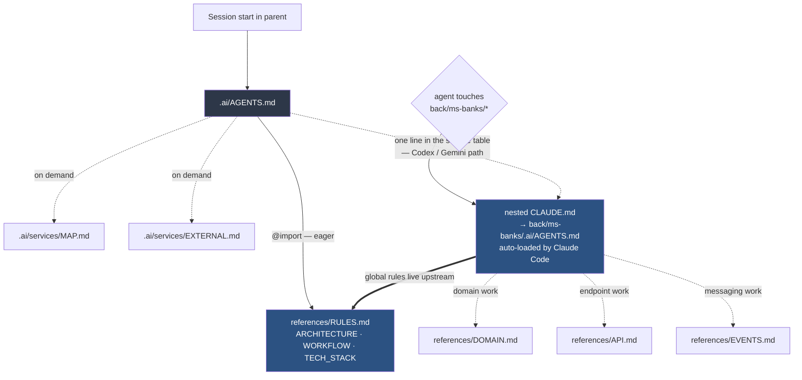
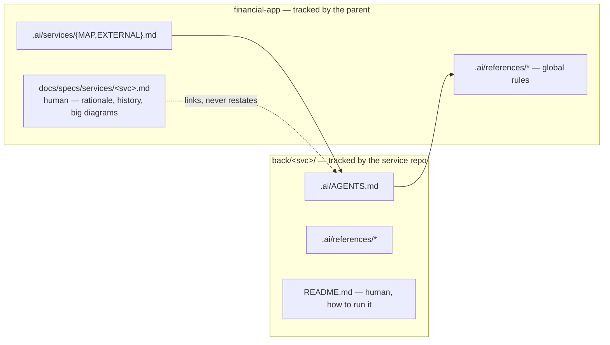

# AI Context Restructure — P2: Per-Service Context

**Type:** chore
**Date:** 2026-07-31
**Status:** design approved, awaiting plan

---

## 1. Branches and repositories involved

P2 touches ten repositories. Per the decision in §4.1, every service repo commits onto its
**existing Wave 0 feature branch** rather than a fresh branch.

| Repo | Branch | Scope of change |
|---|---|---|
| `financial-app` (parent) | `chore/ai-restructure` | `.ai/services/{MAP,EXTERNAL}.md`, `scripts/ai-link.sh`, `scripts/ai-verify.sh`, `.ai/AGENTS.md`, `.ai/references/{RULES,ARCHITECTURE}.md`, trim of `docs/specs/services/*.md` |
| `back/financial-app-parent` | `feat/commons-domain-model` | `.ai/`, `.gitignore`, delete `CLAUDE.md` + symlinks |
| `back/ms-banks` | `feat/fee-schedules-installments` | idem |
| `back/ms-finances` | `feat/cursor-paging-classifier` | idem |
| `back/ms-gateway` | `feat/gateway-bff-foundation` | idem |
| `back/ms-investments` | `feat/broker-fee-schedules-fx-view` | idem |
| `back/ms-notifications` | `feat/notification-category-preferences` | idem |
| `back/ms-upload` | `feat/import-run-reconciliation` | idem |
| `back/ms-users` | `feat/user-sessions-preferences` | idem |
| `front/financial-app` | `feat/design-tokens` | idem |

No source file is touched in any repo. Every diff is confined to `.ai/`, `.gitignore`,
`README.md` and — in the parent only — `docs/`, `scripts/`.

---

## 2. Objective

P1 separated agent context from human documentation **in the parent repo only**. Nine service
repos were left behind, each carrying a hand-written `CLAUDE.md` (29–67 lines, 433 total) that:

- restates the parent's rules from memory, and has already drifted from them;
- links to `docs/specs/rules.md`, `docs/specs/workflow.md` and `docs/specs/00-master.md`, all
  three of which P1 deleted — **nine repos currently point at files that do not exist**;
- says nothing a model could not have guessed, while the 2,784 lines of real service knowledge
  sit in `docs/specs/services/*.md` in a different repo, in a format written for a person.

P2 moves service knowledge to where the service lives, in the density P1 established, and kills
the nine dead-link files. It closes the debt P1 §4.8 opened deliberately.

### Measured effect

Byte counts of the real files at 2026-07-31, divided by four for a token approximation.

| Working on one service | today | after P2 |
|---|---|---|
| Auto-loaded on entering `back/ms-banks/` | `CLAUDE.md` 3.6 kB ≈ **900 tok** | `.ai/AGENTS.md` ≤70 lines ≈ 3.9 kB ≈ **960 tok** |
| Read-before-plan tax | `docs/specs/services/ms-banks.md` 25 kB ≈ **6,250 tok** | 0 — the three references load only if the task needs them |
| Typical task (domain change) | **≈ 7,150 tok** | ≈ 960 + `DOMAIN.md` ≤180 lines ≈ 2,470 → **≈ 3,430 tok** (−52%) |
| Typical task (endpoint only) | **≈ 7,150 tok** | ≈ 960 + `API.md` ≤120 lines ≈ 1,650 → **≈ 2,610 tok** (−63%) |
| Standalone clone of one repo | 900 tok, drifted, three dead links | 960 tok, accurate, plus a stated pointer to the parent |

The saving is the same shape as P1's: not a smaller resident set, but the deletion of a
read-everything-first tax.

---

## 3. Connection to related specs or plans

- **`docs/specs/2026-07-30-ai-restructure-p1-design.md`** — parent spec. P2 is sub-project 2 of
  4 named in its §3. P2 **supersedes P1 §4.3** (per-service context via `skills/svc-*`); see
  §4.3 below. It **discharges P1 §4.8** (deferred service-repo reference sweep).
- **`docs/specs/2026-07-30-ai-restructure-p1-plan.md`** — the executed plan; its task shape,
  coverage-matrix instrument and gate script are reused here.
- **`docs/specs/services/*.md`** — the eight source documents. P2 owns them and trims them.
- **`docs/superpowers/specs/2026-07-28-redesign/`** — frozen (P1 §4.7). P2 commits land on that
  program's feature branches but touch none of its files.

---

## 4. Design decisions and their rationale

### 4.1 P2 commits land on the existing Wave 0 feature branches

All nine repos sit on completed but unmerged Wave 0 branches. P1 §4.8 deferred the sweep partly
to avoid adding commits after those branches were audited. P2 accepts that cost instead of
paying a worse one: a separate `chore/ai-restructure` branch per repo would mean nine extra
merges, and the new context would be absent from the Wave 0 branches an agent is actually
working on today.

**Accepted consequence, stated so it is not mistaken for an oversight:** for all nine repos the
audited SHA is no longer the merged SHA. The mitigation is scope — P2 touches no `src/`, no
`pom.xml`, no migration, no test. Re-auditing a repo is a `git diff --stat` scope check
(`.ai/`, `.gitignore`, `README.md` only), not a re-review. **G7** enforces exactly this.

### 4.2 Service knowledge is canonical inside the service repo

The alternative — parent `.ai/services/ms-banks.md` as canonical — makes a standalone clone of
`ms-banks` context-free, which is the failure P2 exists to fix. Splitting facts between the two
(shared contracts in the parent, internals in the repo) creates two files per service that must
be kept in sync, violating R4.

So: `back/<svc>/.ai/` is canonical and tracked by that repo. The parent tracks no service
content. This also matches the placement decision already taken for domain models.

### 4.3 No loader skills — nested `CLAUDE.md` is the native mechanism

P1 §4.3 planned nine `.ai/skills/svc-*/SKILL.md` loaders in the parent, on the reasoning that
skills are the only native load-on-relevance mechanism. That reasoning was incomplete: Claude
Code auto-loads a **nested** `CLAUDE.md` when the session touches files beneath its directory.
Since `back/ms-banks/CLAUDE.md` is a symlink to `back/ms-banks/.ai/AGENTS.md`, the context
arrives for free the moment work moves into the repo — no description lines resident, no extra
files, and it works identically whether the agent started in the parent or in the repo.

Codex and Gemini do not do nested discovery. They are served by one line in the parent
`AGENTS.md` service table: *before touching `back/<svc>/`, read `back/<svc>/.ai/AGENTS.md`* —
which that table already carries in a form pointing at the not-yet-existent
`.ai/services/<service>.md`, and which P2 repoints.

**P1 §4.3 is superseded.** The P1 design gets a one-line supersession note; it is not rewritten.

### 4.4 Symlinks are gitignored and generated, as in the parent

`scripts/ai-link.sh` grows a loop over the nine repo paths. Each repo gitignores
`/CLAUDE.md`, `/AGENTS.md`, `/GEMINI.md`, exactly as the parent does. One mechanism generates
every link in the workspace.

This is a deliberate trade against the standalone-clone case: a fresh clone of `ms-banks` alone
has `.ai/` but no `CLAUDE.md` until `ai-link.sh` runs from the parent. Accepted because the
same decision was already taken for global rules (§4.5) — the parent workspace is the supported
environment, and half-supporting the standalone case is worse than stating the requirement.

### 4.5 Global rules are pointed at, never copied

A repo `.ai/AGENTS.md` states in one line that R1–R18, the workflow modes and the tech stack
live in the parent at `.ai/references/`, and that the parent workspace is required. It does not
carry a digest. A hand-written digest is precisely what the nine current `CLAUDE.md` files are,
and precisely how they drifted. A script-generated copy was considered and rejected: nine
tracked copies of `RULES.md` regenerated on every rule change is churn for a case (offline
standalone clone) that does not occur in this workspace.

### 4.6 The old per-repo `CLAUDE.md` is deleted, not edited

The symlink takes its name, so the file cannot survive. Its content splits three ways: repo
facts to `.ai/AGENTS.md`, rules to nothing (the parent owns them), dead links to nothing.

**Unlike P1 §4.5, git history does not preserve these originals.** Verified 2026-07-31:
`CLAUDE.md` is listed in `.gitignore` in all nine repos and is tracked by none of them. The 433
lines exist only in this working copy. The migration must therefore treat them as an
irrecoverable source: every one is copied to a scratch snapshot before any deletion, and the
coverage matrix (G6) is what proves nothing was lost. This makes task ordering load-bearing —
the `.ai/` tree for a repo is written and committed **before** that repo's `CLAUDE.md` is
removed, never in the same step.

### 4.6b Five repos ship broken symlinks today

Also verified 2026-07-31: `ms-gateway`, `ms-investments`, `ms-notifications`, `ms-upload` and
`ms-users` **track** `AGENTS.md` and `GEMINI.md` as symlinks pointing at `CLAUDE.md` — a file
those same repos gitignore. A fresh clone of any of the five gets two dangling symlinks. The
other four track neither.

P2 fixes this as a side effect of §4.4: the five tracked links are removed from the index with
`git rm --cached`, and all nine repos gitignore all three names. The links become generated
artifacts everywhere, and no clone carries a dangling one.

### 4.7 The parent human page survives, holding only what the agent files do not

`docs/specs/services/<svc>.md` stays at its current path — relocating anything inside `docs/` is
P4's concern. It is trimmed to rationale, history, onboarding narrative and the large Mermaid
diagrams. Every fact an implementer needs moves to `.ai/`.

Drift is prevented structurally, not by discipline: if the human page states no facts, it has
nothing to drift from. Where a diagram must exist in both, the agent file carries the compact
form and the human page carries the annotated one, and neither restates the other's prose.

### 4.8 Sections that die in the migration

Three kinds of content in `docs/specs/services/*.md` are dropped rather than moved, because P1
already gave them a single owner:

| Content | Owner after P1 |
|---|---|
| Per-service CI/CD section | `.ai/references/PIPELINE.md` |
| Response-envelope general shape | `.ai/references/APP_STRUCTURE.md` |
| Rules digests in per-repo `CLAUDE.md` | `.ai/references/RULES.md` |

Only the service-specific remainder migrates — e.g. ms-banks keeps its `DomainError` slugs, not
the envelope's shape.

---

## 5. Target structure

### 5.1 A service repo

```
back/ms-banks/                          own git repo, branch feat/fee-schedules-installments
├── .ai/                                tracked, canonical
│   ├── AGENTS.md                       ≤70 — identity, port/schema, package tree,
│   │                                     load-bearing repo facts, read-when index,
│   │                                     one-line pointer to parent references
│   └── references/
│       ├── DOMAIN.md                   ≤180 — aggregates, VOs, invariants, enums,
│       │                                 compact ERD, Flyway migration list
│       ├── API.md                      ≤120 — endpoint table, DomainError slugs
│       └── EVENTS.md                   ≤60  — ce_type in/out, outbox, DLT, scheduled jobs,
│                                             outbound Feign calls
├── CLAUDE.md → .ai/AGENTS.md           gitignored, generated by ai-link.sh
├── AGENTS.md → .ai/AGENTS.md           gitignored, generated
├── GEMINI.md → .ai/AGENTS.md           gitignored, generated
├── README.md                           human, ownership unchanged
├── .claude/settings.local.json         machine-local, untouched where present
└── .gitignore                          + /CLAUDE.md /AGENTS.md /GEMINI.md
```

Two repos diverge, because the three-reference split does not describe them:

| Repo | References | Why |
|---|---|---|
| `front/financial-app` | `ROUTES.md`, `API_CLIENT.md`, `UI_STATE.md` | no aggregates, no Kafka. The real axes are routing + middleware, `apiFetch` with 401→refresh→retry, and TanStack Query vs Zustand |
| `back/financial-app-parent` | `COMMONS.md` | BOM plus `commons-{core,web,messaging}`, not a runtime service. Shared VOs already live in the parent's `APP_STRUCTURE.md` (P1); `COMMONS.md` points there and never restates them |

### 5.2 The parent

```
financial-app/
└── .ai/services/
    ├── MAP.md          ≤40 — service → repo path → what it owns → events emitted/consumed
    └── EXTERNAL.md     ≤80 — third-party contracts owned by no single service:
                              IOL / broker API, BCRA CBU + modulo-10 rules, SMTP,
                              MinIO, FX rate sources
```

`MAP.md` carries **no** port or schema column — `ARCHITECTURE.md` owns those. The only overlap
is the service name, so R4 holds. `OWNERS.md` is deleted; the directory now has real content.

### 5.3 Load-time diagram



Solid arrows load without the agent choosing. Dotted arrows load only when the task needs them.

### 5.4 Ownership after P2



---

## 6. What will be done

### 6.1 Content mapping

Applied per service, source `docs/specs/services/<svc>.md` plus `back/<svc>/CLAUDE.md`:

| Source section | Target |
|---|---|
| Summary, folder tree, repo facts, port/schema | `.ai/AGENTS.md` |
| Domain model, aggregates and VOs, enums, domain services, ERD, Flyway migrations | `.ai/references/DOMAIN.md` |
| Endpoint tables, `DomainError` slugs, service-specific envelope notes | `.ai/references/API.md` |
| Kafka integration, scheduled jobs, external service calls | `.ai/references/EVENTS.md` |
| Key-flow narrative, "Recent UX fixes", design rationale, annotated diagrams | stays in `docs/specs/services/<svc>.md` |
| CI/CD, envelope general shape, rules digest | **dropped** — see §4.8 |

### 6.2 Task order

| # | Task | Repo | Commit |
|---|---|---|---|
| 1 | `.ai/services/{MAP,EXTERNAL}.md`, delete `OWNERS.md`; extend `ai-link.sh` with the repo loop; extend `ai-verify.sh` with G1–G7 | parent | `docs(ai): add service map and external contracts` |
| 2 | `ms-banks` `.ai/` — **pattern-setter, reviewed before task 3** | ms-banks | `docs(ai): add repo-local agent context` |
| 3–10 | the same for finances, gateway, investments, notifications, upload, users, financial-app-parent, front | 8 repos | same subject per repo |
| 11 | trim the eight `docs/specs/services/*.md` to the human remainder | parent | `docs: trim service specs to human content` |
| 12 | amend `R18`, parent `AGENTS.md` service table, `ARCHITECTURE.md` AI-context section; supersession note on the P1 design | parent | `docs(ai): repoint service context to repo-local .ai` |
| 13 | run gates, write the coverage matrix, write the development report | parent | `docs(ai): record P2 migration coverage` |

Thirteen commits across ten branches. Task 2 is a review checkpoint: the `ms-banks` tree is the
template every later repo is filled from, so it is approved before eight repeats of it exist.

### 6.3 Line budgets

Ceilings with reserve, priced at the 55 B/line the existing docs average.

| File | Cap | Note |
|---|---|---|
| repo `.ai/AGENTS.md` | 70 | the only per-repo file that ever auto-loads |
| `DOMAIN.md` | 180 | ms-banks and ms-investments will approach it; ms-upload will not |
| `API.md` | 120 | |
| `EVENTS.md` | 60 | ms-users, ms-upload far under |
| front `ROUTES.md` / `API_CLIENT.md` / `UI_STATE.md` | 120 / 100 / 80 | |
| `COMMONS.md` | 120 | |
| `MAP.md` | 40 | |
| `EXTERNAL.md` | 80 | |

Per-repo agent-facing total ≈ 430 lines at the ceiling, against a current single spec of
300–535 lines — but only ~70 of those lines are ever resident.

---

## 7. Problems to consider

1. **Audited SHA ≠ merged SHA in nine repos.** Accepted in §4.1; bounded by G7. If the Wave 0
   audit is re-run, the reviewer must be told the extra commits are `.ai/`-only.
2. **A standalone clone has no `CLAUDE.md`** until `ai-link.sh` runs from the parent (§4.4), and
   no global rules at all (§4.5). Both are deliberate. Each repo `.ai/AGENTS.md` states the
   parent-workspace requirement in its first lines, so the gap is visible rather than silent.
3. **`docs/specs/services/*.md` may trim to almost nothing** for the thinner services —
   `ms-upload` (189 lines) and `ms-gateway` (129) are close to pure fact. If a human page would
   fall below roughly 30 lines it is deleted rather than kept as a stub, and `MAP.md` carries
   the pointer. The plan must decide this per file, not by rule.
4. **Nested-`CLAUDE.md` auto-load is a Claude Code behaviour, not a contract.** If it stops
   firing, Codex/Gemini's explicit-read line in the parent `AGENTS.md` is the fallback for every
   tool, and the loss is one extra `Read` call — not missing context. No gate can assert it, so
   G1 asserts the files exist and are reachable instead.
5. **Eight of the nine repos have no `.claude/` directory**; `ms-banks` has one holding only
   `settings.local.json`. P2 creates none and touches that one only if it lacks the gitignore
   entries. `.claude/skills` and `.claude/agents` directory symlinks are **not** created in
   service repos — there are no repo-local skills or agents; those stay parent-only.
6. **Front and commons diverge from the three-reference shape** (§5.1). This is a real
   inconsistency in the tree and is accepted: forcing `EVENTS.md` onto a repo with no Kafka
   producer would be an empty file that a model must still open to discover is empty.
7. **The nine `CLAUDE.md` files are untracked and unrecoverable** (§4.6). Any migration step
   that deletes one before its replacement is committed loses content permanently. The plan
   snapshots all nine before touching anything, and orders write-then-delete per repo.
8. **`git rm --cached` in five repos changes what a clone receives.** Removing the tracked
   `AGENTS.md`/`GEMINI.md` symlinks (§4.6b) is correct — they dangle today — but it is an index
   change, so the diff in those five repos is not purely additive. G7 must allow deletions of
   exactly those two paths.
9. **The gate ids in §8 collide with `ai-verify.sh`.** That script already defines G2–G6 for
   P1's goals with different meanings. P2's checks are therefore added under the labels
   `P2-G1` … `P2-G7`; the P1 checks keep their names and behaviour, except G2 whose scope
   widens (§8 G2). Goal ids in §8 read as `P2-Gn`.
10. **The coverage matrix is large** — eight source specs plus nine `CLAUDE.md` files, roughly
   130 rows. P1's matrix ran 73 rows and was the most valuable instrument in it. Keep it, but
   the plan should allow one row per source *section*, not per paragraph.

---

## 8. Goals

```
G1. Every service repo carries a tracked .ai/AGENTS.md plus its references, and the three
    root symlinks resolve to it
    — Verified by: scripts/ai-verify.sh G1 and G5 exit 0; `readlink back/ms-banks/CLAUDE.md`
      prints `.ai/AGENTS.md` in all nine repos

G2. No file anywhere in the workspace references a spec P1 deleted
    — Verified by: scripts/ai-verify.sh G2 exit 0 — grep for `docs/specs/rules.md`,
      `docs/specs/workflow.md`, `docs/specs/00-master.md` across parent and all nine repos
      returns nothing

G3. An agent entering a service repo gets that service's facts without reading the parent's
    docs/ tree, and without reading more than ~70 lines it did not need
    — Verified by: every repo .ai/AGENTS.md within its 70-line cap (G3) and every relative
      path inside any .ai/ file resolving (G4)

G4. Every section of the eight source specs and nine CLAUDE.md files is accounted for as
    migrated, human-retained or dropped-with-owner
    — Verified by: .ai/_migration-coverage-p2.md shows 100% of rows verified; G6 exit 0

G5. No service repo diff in P2 touches anything but agent context
    — Verified by: G7 — `git diff --name-only <base>..HEAD` in each of the nine repos matches
      only `.ai/`, `.gitignore`, `README.md`

G6. Global rules exist in exactly one place
    — Verified by: no repo .ai/ file restates an Rxx rule body; grep for the R7 naming-table
      header and the R11–R15 texts outside .ai/references/RULES.md returns nothing
```

### Non-goals

- **Rewriting `README.md` in any repo.** Human onboarding is P4. P2 touches a README only if it
  links to a file P1 deleted.
- **`.ai/agents/`, `.ai/hooks/`, `.ai/mcps/`.** P3 owns them; their `OWNERS.md` stubs stay.
- **Reorganising `docs/`.** P4. `docs/specs/services/` keeps its path (§4.7).
- **Merging the Wave 0 branches.** P2 commits onto them and stops; merging is the redesign
  program's call.
- **Repo-local skills or agents.** No `.claude/skills` or `.claude/agents` symlinks in service
  repos (§7.5).
- **Verifying that nested-`CLAUDE.md` auto-load fires.** Not assertable by script (§7.4).

---

## 9. Content references needed to implement

| File | Why |
|---|---|
| `docs/specs/2026-07-30-ai-restructure-p1-design.md` §4.3, §4.8, §7 | the decisions P2 supersedes and discharges, and the line-budget style |
| `docs/specs/2026-07-30-ai-restructure-p1-plan.md` | task shape, commit-message style, coverage-matrix format |
| `.ai/references/REPORTS_STRUCTURE.md`, `.ai/references/GOALS_STRUCTURE.md` | spec/plan/report skeletons |
| `.ai/references/RULES.md` | R4 no-duplicate-behaviour, R14 commit format, R18 docs sync (amended by task 12) |
| `.ai/references/APP_STRUCTURE.md` | what the envelope, exception and shared-VO sections already own, so repos do not restate them |
| `.ai/references/PIPELINE.md` | what the CI/CD sections already own |
| `.ai/AGENTS.md` service table | the line task 12 repoints |
| `.ai/references/ARCHITECTURE.md` AI-context section | updated to describe the two-level `.ai/` layout |
| `docs/specs/services/*.md` (8 files, 2,784 lines) | the migration source |
| `back/*/CLAUDE.md`, `front/financial-app/CLAUDE.md` (9 files, 433 lines) | the second migration source, deleted afterwards |
| `back/*/README.md` | checked for links to deleted specs |
| `scripts/ai-link.sh`, `scripts/ai-verify.sh` | extended in task 1 |
| `.ai/_migration-coverage.md` | the P1 matrix, as the format template |
