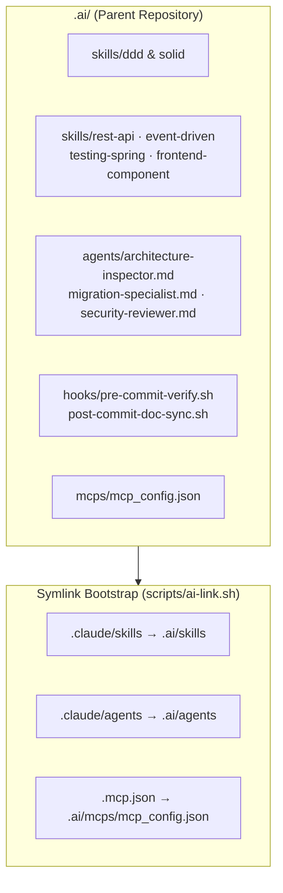

# AI Context Restructure — Sub-project P3 Design Spec

## Branches and repositories involved

- **Parent workspace (`financial-app`)**: Branch `chore/ai-restructure` (or `chore/ai-restructure-p3`).
- Service repositories inherit the skills, agents, hooks, and MCP servers directly through the parent workspace symlink bootstrap (`scripts/ai-link.sh`).

---

## Objective

Complete the AI context layer by populating sub-project P3:
1. Adding specialized **Skills** (`.ai/skills/rest-api`, `.ai/skills/event-driven`, `.ai/skills/testing-spring`, `.ai/skills/frontend-component`).
2. Creating **Agent definitions** (`.ai/agents/architecture-inspector.md`, `.ai/agents/migration-specialist.md`, `.ai/agents/security-reviewer.md`).
3. Configuring **Automation Hooks** (`.ai/hooks/pre-commit-verify.sh`, `.ai/hooks/post-commit-doc-sync.sh`) to automatically run `scripts/ai-verify.sh` on commit.
4. Setting up **MCP Configuration** (`.ai/mcps/mcp_config.json`) for local environment tooling.
5. Updating validation tooling (`scripts/ai-verify.sh`) with P3 verification gates (`P3-G1`..`P3-G4`).

---

## Connection to related specs or plans

- **Supersedes / Extends:** `docs/specs/2026-07-30-ai-restructure-p1-design.md` Section 3 (P3 scope).
- **Follows:** `docs/specs/2026-07-31-ai-restructure-p2-design.md` and `docs/specs/2026-07-31-ai-restructure-p2-plan.md`.

---

## Diagrams

---

## What will be done

### 1. Reusable Skills (`.ai/skills/`)
Each skill is a self-contained directory with a `SKILL.md` file (carrying YAML frontmatter with `name` and `description`):
- **`rest-api/SKILL.md`**: Designing and reviewing REST controllers, OpenAPI `@ApiErrorCodes` annotations, `ApiResponse<T>` handling, query pagination, and status code rules.
- **`event-driven/SKILL.md`**: Outbox pattern semantics, CloudEvents 1.0 binary mode headers, idempotent consumer deduplication via processed events tables, and DLQ error handling.
- **`testing-spring/SKILL.md`**: Spring Boot 3 integration and unit testing rules (`@SpringBootTest`, `@WebMvcTest`, `EmbeddedKafka`, H2 profiles, test assertion hygiene).
- **`frontend-component/SKILL.md`**: Next.js 15 / React 19 component conventions, Zustand store patterns, TanStack Query query keys, and `apiFetch` 401 handling.

### 2. Specialized Subagents (`.ai/agents/`)
Markdown role prompts with explicit mandates and boundary constraints:
- **`architecture-inspector.md`**: Audits Hexagonal / DDD boundary violations, circular imports, and unmanaged BOM dependency declarations.
- **`migration-specialist.md`**: Audits Flyway SQL migrations for non-blocking schema modifications, index efficiency, CBU formatting, and idempotency tracking.
- **`security-reviewer.md`**: Audits JWT token handling, HTTP-only cookies, CSRF protection, and user isolation (`findByUserId` / `findByBankNumberAndUserId`).

### 3. Verification Hooks (`.ai/hooks/`)
- **`pre-commit-verify.sh`**: Executable shell script meant for git `pre-commit` or CLI pre-command execution. Automatically runs `scripts/ai-verify.sh --check`.
- **`post-commit-doc-sync.sh`**: Checks git diff for modified backend/frontend files and emits reminders if `.ai/` references or `README.md` need updating (Rule R18).

### 4. MCP Configuration (`.ai/mcps/mcp_config.json`)
- Provides a clean template and environment configuration for Model Context Protocol servers.

### 5. Verification Gates (`scripts/ai-verify.sh`)
- **`P3-G1`**: Every skill folder in `.ai/skills/` contains a valid `SKILL.md` with required frontmatter (`name`, `description`).
- **`P3-G2`**: Every agent file in `.ai/agents/` is a non-empty `.md` file with structured system role headers.
- **`P3-G3`**: `.ai/mcps/mcp_config.json` contains valid JSON.
- **`P3-G4`**: Executable hooks in `.ai/hooks/` have `+x` permissions.

---

## Problems to consider

1. **Token Economy:** Skills load on demand when their `description` matches. Descriptions must be concise to minimize always-on skill indexing cost.
2. **Tool Portability:** Symlinks in `.claude/skills` and `.claude/agents` must remain relative so cold clones on Linux/macOS resolve seamlessly.
3. **Hook Fail-Safe:** Hooks must exit cleanly (`0`) when running in restricted environments or when `git` / script dependencies are absent.

---

## Goals

- **P3-G1**: Four new domain skills (`rest-api`, `event-driven`, `testing-spring`, `frontend-component`) created and verified under `.ai/skills/`.
- **P3-G2**: Three specialized agent definitions created under `.ai/agents/`.
- **P3-G3**: Pre-commit and post-commit verification hooks written and operational under `.ai/hooks/`.
- **P3-G4**: `.ai/mcps/mcp_config.json` populated with valid MCP server structure.
- **P3-G5**: `scripts/ai-verify.sh` expanded with `P3-G1`..`P3-G4` gates and exiting cleanly with code `0`.

---

## Content references needed to implement

- `.ai/references/RULES.md`
- `.ai/references/ARCHITECTURE.md`
- `.ai/references/APP_STRUCTURE.md`
- `docs/specs/2026-07-30-ai-restructure-p1-design.md`
- `scripts/ai-verify.sh`
- `scripts/ai-link.sh`
