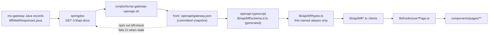
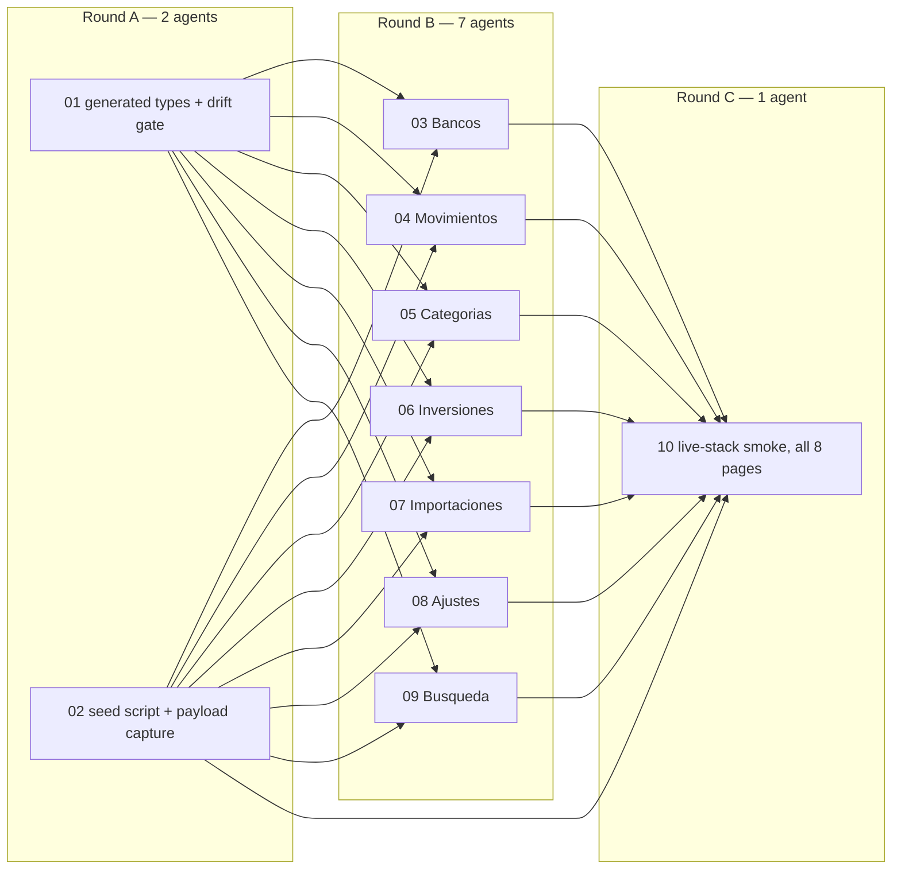

# Wave 3.5 Redesign Specification — BFF Contract Reconciliation

> **Status:** COMPLETED on 2026-08-10. Verified against live gateway stack. Report: [`docs/reports/develop_chore_2026-08-10_wave35-live-smoke.md`](file:///home/ssmirnoff/Documents/proyects/financial-app/docs/reports/develop_chore_2026-08-10_wave35-live-smoke.md).

## Branches and repositories involved

Every branch is cut from `develop`, one branch per repo.

| Repo | Branch | Plans |
|---|---|---|
| `front/financial-app` | `chore/wave35-bff-types-generated` | 01 |
| parent repo | `chore/wave35-seed-and-capture` | 02 |
| `front/financial-app` | `fix/wave35-page-bancos` | 03 |
| `front/financial-app` | `fix/wave35-page-movimientos` | 04 |
| `front/financial-app` | `fix/wave35-page-categorias` | 05 |
| `front/financial-app` | `fix/wave35-page-inversiones` | 06 |
| `front/financial-app` | `fix/wave35-page-importaciones` | 07 |
| `front/financial-app` | `fix/wave35-page-ajustes` | 08 |
| `front/financial-app` | `fix/wave35-search` | 09 |
| `front/financial-app` | `chore/wave35-live-smoke` | 10 |

The wave is `fix/` typed for the page plans because it repairs shipped defects, not new
capability. Plans 01, 02 and 10 are `chore/` — tooling and verification.

---

## Objective

Seven of the eight pages Wave 3 shipped are wired to a BFF contract `ms-gateway` does not
serve. `front/financial-app/lib/api/bff/types.ts` was written from the redesign spec's
contract table rather than from the Java records — Wave 3's dispatch index states that
assumption openly (*"plan 02 writes `lib/api/bff/types.ts` from the spec's contract table, not
from the Java compiling"*) and defers reconciliation to plan 01's Task 7 integration `curl`.
That step exercised `overview` only.

The result: pages read `undefined` for most sections, render empty or skeleton states against a
healthy backend, and their Vitest suites pass because the fixtures encode the same wrong
shape. The tests confirm the error rather than catching it.

This wave makes the Java the single source of truth, mechanically — front types are
**generated** from the gateway's OpenAPI document, so this class of drift cannot recur — then
repairs each page against the real contract and proves it against a live stack.

Wave 4 (`docs/specs/2026-08-10-wave4-redesign.md`) is blocked on this wave: its i18n retrofit
edits the same component files, and extracting strings from components that read the wrong
fields would bake the defect in twice.

---

## Connection to related specs or plans

- Blocks: [docs/specs/2026-08-10-wave4-redesign.md](file:///home/ssmirnoff/Documents/proyects/financial-app/docs/specs/2026-08-10-wave4-redesign.md).
  Wave 4's Round B page plans start from the pages this wave repairs. Wave 4's plan 15
  (full-stack E2E) reuses plan 02's seed script rather than writing its own.
- Repairs: [docs/specs/2026-08-06-wave3-redesign.md](file:///home/ssmirnoff/Documents/proyects/financial-app/docs/specs/2026-08-06-wave3-redesign.md)
  G1 and G5, and [docs/superpowers/plans/2026-08-06-wave3-00-dispatch.md](file:///home/ssmirnoff/Documents/proyects/financial-app/docs/superpowers/plans/2026-08-06-wave3-00-dispatch.md)
  Round A's stated assumption.
- Contract of record: [docs/superpowers/specs/2026-07-28-redesign/15-ms-gateway.md](file:///home/ssmirnoff/Documents/proyects/financial-app/docs/superpowers/specs/2026-07-28-redesign/15-ms-gateway.md)
  §3–§4 — but where the doc and the shipped Java disagree, **the Java wins** and the doc is
  corrected in the same plan. The doc's `MoneyConversion` is the code's `MoneyFigure`/
  `MoneyView`; the doc's per-page section names are the code's record component names.
- Page intent: [docs/superpowers/specs/2026-07-28-redesign/20-front.md](file:///home/ssmirnoff/Documents/proyects/financial-app/docs/superpowers/specs/2026-07-28-redesign/20-front.md)
  §2–§4 — what each section is *for* is unchanged; only its name and shape are corrected.

---

## Diagrams

### The drift, page by page

```
                 gateway sends (BffWebResponses)          front declares (types.ts)
Resumen      ──▶ kpis netWorth breakdown flow             kpis netWorth breakdown flow
                 committed upcomingPayments               committed upcomingPayments
                 spendByCategory latestMovements          spendByCategory latestMovements   ✅ match
Bancos       ──▶ kpis accounts cards loans                summary accounts cards loans      ✖ 3 sections dropped,
                 importHealth cashDistribution                                                 1 renamed
                 paymentCalendar
Movimientos  ──▶ summary page filterOptions               filters movements                 ✖ all renamed,
                 uncategorised                                                                 2 dropped
Categorías   ──▶ kpis budgets selectedTrend rules         categories                        ✖ 4 → 1
Inversiones  ──▶ marketStrip kpis evolution positions     summary holdings allocation       ✖ 7 → 3, all renamed
                 composition recentOperations alerts
Importaciones──▶ activeRun history reconciliation         history                           ✖ 3 → 1
Ajustes      ──▶ profile preferences fees                 profile security                  ✖ 5 → 2
                 notificationPrefs sessions
Búsqueda     ──▶ movements positions categories           results                           ✖ 3 → 1
```

Field-level divergence exists inside the sections that *do* line up by name. `LoanRow` is the
clearest: gateway `(id, label, principal, outstanding, nextInstallmentDate, installmentsPaid,
installmentsTotal)` against front `(id, title, lender, totalAmount, remainingAmount,
installmentAmount, installmentsLeft, nextDueDate)`. Every section is re-derived from the Java
in plan 01, not spot-fixed.

### Type flow after plan 01



`types.ts` stops being a hand-written contract and becomes a naming layer over generated
types: `export type BanksBff = components['schemas']['BanksBffResponse']`. A field renamed in
Java then breaks the front build, which is the whole point.

### Round graph



---

## What will be done

### Round A — make the contract mechanical (2 plans, parallel)

**Plan 01 — generated types and a drift gate** (`front/financial-app` + parent
`scripts/`). Adds `scripts/dump-gateway-openapi.sh` (starts the gateway via
`docker compose --profile app`, waits for health, curls `/v3/api-docs`, writes
`front/financial-app/openapi/gateway.json`), adds `openapi-typescript` as a devDependency,
generates `lib/api/bff/schema.d.ts`, and rewrites `lib/api/bff/types.ts` as named aliases over
it. Adds `npm run bff:types` (regenerate) and `npm run bff:check` (regenerate to a temp file,
diff against the committed one, non-zero on difference) and wires `bff:check` into CI. The
snapshot is committed so the front builds without a running backend; the check is what keeps it
honest.

**Plan 02 — seed script and payload capture** (parent repo). `scripts/seed-demo-user.sh`
creates a demo user with two accounts, one credit card, one loan with installments, ~40
transactions across categories and two months, one completed import run and one budget — enough
that every BFF section returns non-empty data. Then `scripts/capture-bff-payloads.sh` curls all
ten BFF endpoints as that user and writes the responses to
`front/financial-app/lib/api/bff/__fixtures__/<page>.json`. Those captured payloads become the
fixtures every page test uses in Round B, replacing hand-written ones. A fixture that came off
the real gateway cannot encode a contract the gateway does not serve.

### Round B — repair each page (7 plans, parallel)

Each plan owns one page directory plus its hook and client file, and touches no file another
plan touches. Each does the same four things:

1. Re-point the page at the real sections, using the generated types. Sections the gateway
   sends and the page currently ignores get rendered — `importHealth`, `cashDistribution`,
   `paymentCalendar` on Bancos; `activeRun` and `reconciliation` on Importaciones;
   `preferences`, `fees`, `notificationPrefs`, `sessions` on Ajustes; `selectedTrend` and
   `rules` on Categorías; `marketStrip`, `evolution`, `composition`, `recentOperations`,
   `alerts` on Inversiones; `filterOptions` and `uncategorised` on Movimientos.
2. Delete browser-side recomputation of data the BFF already composes. `BanksContent.tsx:36`
   derives import health from the accounts array; `11-ms-banks.md` §5 puts that ownership in
   the gateway deliberately, and the gateway ships it.
3. Collapse the page's remaining legacy read hooks into its single BFF query. Bancos still
   calls `useBanks`, Inversiones still calls `usePortfolioSummary`, `usePortfolioEvolution`,
   `usePortfolioHoldings` and `useMarketDiscovery`, Importaciones still calls
   `useImportHistory`. Mutation hooks stay; so do genuinely interactive auxiliary endpoints
   (ticker search, ticker research, file preview) which were never page sections.
4. Rebuild its tests on the captured fixture from plan 02 and assert real field names.

### Round C — prove it (1 plan)

**Plan 10 — live-stack smoke.** With the stack up and the demo user seeded, a Playwright suite
loads all eight pages and asserts that each named section renders its real value — a specific
seeded figure, not merely "not a skeleton". Resumen is included even though its types matched:
nothing has yet proven it renders live data either. This is the wave's exit gate and the
evidence Wave 4 inherits.

---

## Problems to consider

1. **The gateway may itself be wrong somewhere.** This wave assumes the Java is right because
   it was built from `15-ms-gateway.md` §3–4 and verified by `mvn verify` at Stage 0. Where a
   page needs a field the gateway genuinely does not compute, the honest fix is a gateway
   change, not a front workaround — but that is a scope expansion. Each Round B plan states a
   stop-and-report step: if a section cannot be rendered from what the gateway sends, the plan
   stops and reports rather than inventing a client-side derivation.
2. **Round B plans will find dead UI.** Some components render fields that never existed in any
   contract (Inversiones reads `opportunities` and `marketDataAvailable`, which come from
   legacy market-discovery hooks, not the BFF). Each plan decides per component: wire it to a
   real section, or keep it on its auxiliary endpoint — never leave it reading `undefined`.
3. **`openapi-typescript` output is only as good as the springdoc annotations.** If a response
   record lacks schema information the generated types degrade to `Record<string, unknown>`.
   Plan 01 inspects the generated file for `unknown` leakage before declaring done, and adds
   the missing `@Schema` annotations in the gateway if any is found.
4. **The committed OpenAPI snapshot can go stale between waves.** `npm run bff:check` catches
   it only when someone runs CI on the front repo after a gateway change. That is the same
   coupling every polyrepo has; the mitigation is that the check exists and fails loudly, not
   that staleness is impossible.
5. **Seeded data must be deterministic.** If plan 02's script produces random amounts, plan
   10's assertions cannot name a figure. Amounts, dates and categories are fixed constants in
   the script, and the script is idempotent — re-running it against a seeded database is a
   no-op rather than a duplicate.
6. **This wave does not translate anything.** Round B rewrites the same components Wave 4's
   i18n plans will edit, and it is tempting to extract strings while in there. Do not: it
   doubles each plan's review surface and blurs what this wave is for. Wave 4 follows
   immediately.
7. **Wave 3's reports overstate what shipped.** Eleven reports record page goals as met. They
   were verified against fixtures that matched the wrong types, so the evidence was internally
   consistent and externally wrong. Plan 10's report is the correction of record for the
   program; the Wave 3 reports are not rewritten, they are superseded and linked.

---

## Goals

G1. **Front BFF types are generated from the gateway, and drift fails a command** — no
hand-written section shape remains in `lib/api/bff/types.ts`, and changing a field name in a
Java response record makes the front check fail.
— *Verified by*: `npm run bff:check` exits 0 against the committed snapshot; renaming a field in `BffWebResponses.java`, re-dumping, and running `npm run bff:check` exits non-zero; `npx tsc --noEmit` is clean.

G2. **Every BFF section the gateway sends is consumed by its page** — no section named in
`BffWebResponses.java` is ignored by the page that owns it, and no page reads a section name
the gateway does not send.
— *Verified by*: `npm run test:run -- components/pages` green against the captured fixtures; a per-page test asserts the set of consumed section keys equals the set in the fixture.

G3. **No page recomputes in the browser what the BFF composes** — import health, cash
distribution, payment calendar, uncategorised counts and filter options come from their
sections.
— *Verified by*: `grep -rn "importHealthItems\|accountsData?.data?.map" components/pages/banks` returns 0 matches; the Bancos test renders import health from the fixture's `importHealth` section only.

G4. **Each page issues one BFF read query** — legacy per-endpoint read hooks are gone from the
page directories; mutation and auxiliary-interaction hooks remain.
— *Verified by*: `npm run test:run -- components/pages` with a network spy asserting exactly one `/api/v1/bff/<page>` call per render; `grep -rn "usePortfolioSummary\|usePortfolioEvolution\|useImportHistory" components/pages` returns 0 matches.

G5. **Test fixtures are recorded from the real gateway, not written by hand** — every page
test loads `lib/api/bff/__fixtures__/<page>.json`, and those files are reproducible from a
seeded stack.
— *Verified by*: re-running `scripts/capture-bff-payloads.sh` against a freshly seeded stack produces byte-identical fixtures except for timestamps; `git status` shows no fixture drift.

G6. **A seeded demo user exists and is deterministic** — one command produces a database where
every BFF section returns non-empty data, and running it twice changes nothing.
— *Verified by*: `scripts/seed-demo-user.sh` twice in a row, then `curl` each BFF endpoint and confirm every section's `status` is `OK` with non-empty `data`.

G7. **All eight pages render real data against the live stack** — with services running and the
demo user seeded, each page shows seeded figures, not skeletons or empty states.
— *Verified by*: `npm run e2e -- e2e/live-smoke.spec.ts` green with the stack up, asserting named seeded values on all eight pages.

### Non-goals

- **Any i18n work.** Strings stay hardcoded until Wave 4 — see Problems §6.
- **The Préstamos page and its BFF endpoint.** Wave 4 plans 02 and 10 own those; `/loans` is
  untouched here.
- **Deleting `GET /api/v1/dashboard/data`, removing `recharts`, `/ddd-architect`, the a11y and
  security passes.** All remain Wave 4's.
- **Redesigning any page.** This wave changes which fields a component reads and which sections
  it renders. Layout, tokens, component choice and copy are not revisited — if a section was
  designed as a card, it stays a card.
- **Gateway feature work.** Missing computations are reported, not built (Problems §1).
- **Backfilling the Wave 3 reports.** They are superseded by plan 10's report, not rewritten
  (Problems §7).

---

## Content references needed to implement

- [.ai/references/RULES.md](file:///home/ssmirnoff/Documents/proyects/financial-app/.ai/references/RULES.md) · [WORKFLOW.md](file:///home/ssmirnoff/Documents/proyects/financial-app/.ai/references/WORKFLOW.md) · [DEPLOYMENT.md](file:///home/ssmirnoff/Documents/proyects/financial-app/.ai/references/DEPLOYMENT.md) (plans 02, 10) · [SCRIPTS.md](file:///home/ssmirnoff/Documents/proyects/financial-app/.ai/references/SCRIPTS.md) (plan 02)
- `back/ms-gateway/src/main/java/com/financialapp/gateway/web/dto/response/bff/{BffWebResponses.java,*BffResponse.java}` — the contract of record
- `back/ms-gateway/src/main/java/com/financialapp/gateway/web/dto/response/SectionResponse.java` and `web/mapper/BffMapper.java`
- `back/ms-gateway/src/main/java/com/financialapp/gateway/web/controller/bff/*.java` — query parameters per endpoint
- `front/financial-app/lib/api/bff/{types.ts,index.ts,*.ts}` and `lib/hooks/use*Page.ts`
- `front/financial-app/components/pages/<page>/**` — one directory per Round B plan
- [docs/superpowers/specs/2026-07-28-redesign/20-front.md](file:///home/ssmirnoff/Documents/proyects/financial-app/docs/superpowers/specs/2026-07-28-redesign/20-front.md) §2–§4 — what each section is for
- [docs/specs/IDEAS.md](file:///home/ssmirnoff/Documents/proyects/financial-app/docs/specs/IDEAS.md) — money typed `number` against `String` on the wire is fixed by G1 mechanically
