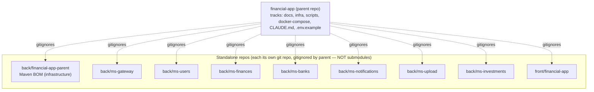
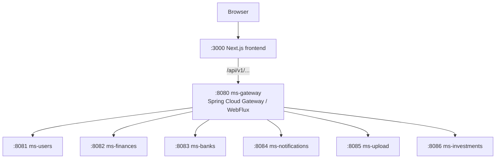
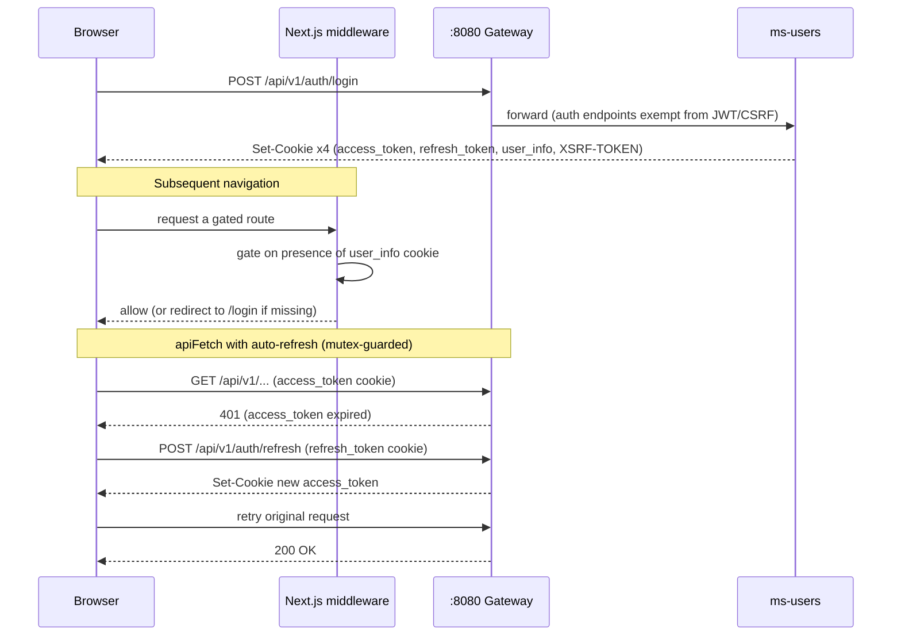
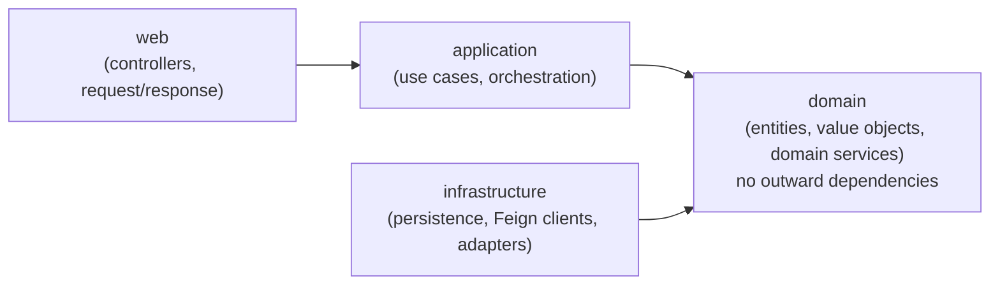

# Architecture

A visual reference for the `financial-app` system: how the repos are organized, how requests flow at runtime, how authentication works, where data lives, and how each service is layered internally.

---

## 1. Polyrepo topology

`financial-app` is a polyrepo. Every backend service folder and the frontend folder is its **own standalone git repository**, each gitignored by the parent repo. These are **not** git submodules — the parent does not track their commits. The parent repo tracks only `docs/`, `infra/`, `scripts/`, `docker-compose*`, `CLAUDE.md`, and `.env.example`.

`back/financial-app-parent` is the **Maven BOM + commons aggregator** (Spring Boot 3.4.2, Spring Cloud 2024.0.1, Java 21). It is infrastructure, not a runtime service — every backend service inherits its managed dependency versions from it, and microservice `pom.xml` files never declare versions directly. Since 2026-06-05 it also hosts two shared code modules, built by the same `mvn install` at its root:

| Module | Contents | Consumed by |
| :-- | :-- | :-- |
| `commons-core` | `ApiResponse` envelope `{status, title, code, message, data}`, `ErrorCategory`, `ErrorCode` interface, `DomainException` base | all 7 services (framework-free except `HttpStatus`/Jackson — safe in domain layers) |
| `commons-web` | `ApiExceptionHandler` base advice, static `ErrorCategoryHttpMapper`, `CommonErrorCode`, `@ApiErrorCodes` + Swagger error-example generation, OpenAPI auto-config | the 6 servlet services (ms-gateway is WebFlux → commons-core only) |
| `commons-messaging` | CloudEvents Kafka plumbing — `OutboxGateway`/`ProcessedEventGateway`/`DomainEventMapper` ports, `OutboxRecord`/`EventType`/`CeAttributes` VOs, `OutboxRelay`, `IdempotentEventProcessor`, `CloudEventSerde`, `CeHeaders`, `StandardDlqErrorHandler` | the event-driven services (producers + consumers) |

**Structural convention.** The shared modules follow the **same DDD layering as the services** — `domain/` (ports under `domain/gateway/`, value objects under `domain/model/`) and `infrastructure/` (framework/SDK adapters) — including *only the layers that genuinely apply* to a library (no `web/` or `application/`, since a shared module has no controllers or business workflows). Concretely, `commons-messaging` keeps the `io.cloudevents` SDK confined to `infrastructure/` and exposes only `domain/gateway` ports to consumers (DIP); gateway implementations that own a database table live in each service's own `infrastructure/gateway/`. `commons-core`/`commons-web` are framework-light building-block modules and stay at their current granularity. Rationale: a shared library is a cross-cutting technical concern, not a bounded context, so it is layered the same way a service is but is never forced to carry empty layers.

Services MUST build `financial-app-parent` (`mvn install`) before their own build — `dev.sh` and every service Dockerfile do this automatically.

---

## 2. Runtime topology

All `/api/v1/...` traffic enters through the gateway, which validates the JWT cookie, injects an `X-User-Id` header, and routes to the owning service.

The gateway also aggregates dashboard summary data from ms-finances and ms-investments in a single call, proxies per-service Swagger docs for the aggregated Swagger UI, and routes the notifications SSE stream with an unbounded response timeout.

---

## 3. Auth / cookie / CSRF flow

Tokens are stored in **HttpOnly cookies** — never accessible to JavaScript. The browser sends them automatically. A successful login sets four cookies.

| Cookie | HttpOnly | Purpose |
|---|---|---|
| `access_token` | Yes | JWT, 24h, path `/api` |
| `refresh_token` | Yes | JWT, 7d, path `/api/v1/auth/refresh` |
| `user_info` | No | `id\|email\|firstName` URL-encoded, read by Next.js middleware |
| `XSRF-TOKEN` | No | CSRF token; frontend echoes it as the `X-XSRF-TOKEN` header on non-GET requests |

The JWT filter on the gateway validates the `access_token` cookie and injects `X-User-Id` downstream; auth endpoints are exempt. `apiFetch` handles the `401 → refresh → retry` cycle automatically, guarded by a mutex so concurrent requests do not trigger overlapping refreshes.

---

## 4. Data stores

A single PostgreSQL instance hosts one schema per service (logical isolation — each service owns exactly one schema, managed by Flyway migrations with Hibernate `ddl-auto: validate`).

| Schema | Owning service | Domain |
|---|---|---|
| `users` | ms-users | accounts, auth credentials |
| `finances` | ms-finances | transactions, categories, loans, card expenses |
| `banks` | ms-banks | banks, accounts, balances |
| `notifications` | ms-notifications | notifications + preferences |
| `upload` | ms-upload | uploaded statement metadata + import sessions |
| `investments` | ms-investments | holdings, asset prices, price history |

**Kafka** carries async domain events between services — internal listeners connect at `kafka:9092`, while local dev connects at `localhost:9093`. Producers in each service publish domain events; consumers update state asynchronously (for example, balance updates are decoupled from transaction recording for eventual consistency).

**MinIO** provides object storage for uploaded files such as bank statements.

---

## 5. DDD layering

Each backend service follows the same internal layering. The **domain** layer sits at the center with no outward dependencies — both the application layer and the infrastructure layer depend inward on it.

The domain layer never imports from web, application, or infrastructure. Use cases live in the application layer and orchestrate domain logic; adapters in the infrastructure layer implement domain-defined ports.

The bridge type `InfrastructureException` canonically lives **in the domain layer** (extending the commons `DomainException`), not in infrastructure: an infrastructure adapter throws it to signal a failure without importing typed domain service exceptions, and a use case catches it and re-throws a specific named domain exception (such as `FinancesServiceException` or `InvestmentsServiceException`). A single `GlobalExceptionHandler` per service — extending the commons `ApiExceptionHandler` — serializes every failure into the shared `{status, title, code, message, data}` envelope, with the machine-readable `code` taken from the service's `DomainError` catalog (each catalog implements the commons `ErrorCode` interface). See [rules.md](rules.md) §3–4 for the full contract.

---

## 6. CI/CD

Central reusable GitHub Actions workflows live in the root repo (`Sergio-Smirnoff/financial-app`,
`.github/workflows/`). Every service repo carries thin caller workflows that reference them
`@master`. The five reusable workflows are: `backend-ci`, `frontend-ci`, `parent-ci` (CI-only for
the Maven BOM), `backend-publish`, and `frontend-publish`.

Every PR and push to `develop`/`master` triggers the `ci / build` status check (`ci.yml` caller).
Branch rulesets on all nine repos enforce this check as required on `master` — merging requires a
passing PR. Docker images are published to GHCR on every `master` push (`latest` + `sha-<shortsha>`)
and on every `v*` tag (`X.Y.Z` + `X.Y` + `latest` + `sha-<shortsha>`). Releases are cut via the
per-repo `release.yml` Actions dropdown or `scripts/github/release-manager.sh` (`release`).

See [workflow.md](workflow.md) § CI/CD for the full workflow table, ruleset details, scripts, and
required PAT permissions.

---

[Master](00-master.md) · [Rules](rules.md) · [Workflow](workflow.md) · [Deployment](deployment.md)
