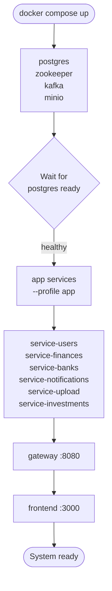

# Deployment & Dev-Ops

## 1. scripts/dev.sh Command Reference

Run `./scripts/dev.sh help` for the full built-in reference.

| Command | What it does |
|---|---|
| `local-all [svc...] [--front]` | Start infra (Docker) + selected services (or all defaults) as background processes with hot-reload; add `--front` to also start the Next.js dev server |
| `local <service>` | Start infra + run one backend service in the foreground via Maven (hot-reload via DevTools) |
| `front` | Start infra + run the Next.js frontend in the foreground via `npm run dev` |
| `up` | Build all images and start every service with microservice ports exposed (dev mode; Docker Compose auto-merges `docker-compose.override.yml` — no explicit `-f` is passed) |
| `prod` | Build all images and start every service **without** exposing microservice ports (uses `docker-compose.yml` only) |
| `down` | Stop and remove all containers and monitoring stack |
| `stop-all` | Kill all local background processes started by `local-all` |
| `logs-local [svc]` | Tail log file(s) from `./logs/` written by `local-all` |
| `build [svc]` | Build all app Docker images, or a single named image |
| `dev <service>` | Build + run a single service in Docker (isolated, not via Maven) |
| `infra` | Start only the infrastructure containers (Postgres, Kafka, MinIO) |
| `restart [svc]` | Restart Docker container(s) |
| `logs [svc]` | Tail Docker container logs |
| `status` / `status-local` | Show Docker / `local-all` process status |
| `monitor` | Start the monitoring stack |

> Service names accepted by `local`, `dev`, `build`, etc.:
> `gateway`, `service-users`, `service-finances`, `service-banks`, `service-notifications`, `service-upload`, `service-investments`

---

## 2. Port Map

| Service | Internal name | Host port | Notes |
|---|---|---|---|
| ms-gateway | `gateway` | 8080 | Single external entry point for all `/api/v1/...` traffic |
| ms-users | `service-users` | 8081 | Auth — register / login / refresh / logout |
| ms-finances | `service-finances` | 8082 | Transactions, loans, card-expenses, categories |
| ms-banks | `service-banks` | 8083 | Banks and accounts |
| ms-notifications | `service-notifications` | 8084 | Kafka consumers, SSE stream, email, preferences |
| ms-upload | `service-upload` | 8085 | Statement upload → MinIO → PDF/CSV parse → preview/confirm |
| ms-investments | `service-investments` | 8086 | Holdings, portfolio P&L, IOL price feed |
| Frontend | `frontend` | 3000 | Next.js 15 |
| PostgreSQL | `postgres` | 5432 | Single instance, per-service schemas |
| Kafka (external) | `kafka` | 9093 | Local dev listener (`localhost:9093`) |
| Kafka (internal) | `kafka` | 9092 | Inter-container listener (`kafka:9092`) |
| MinIO S3 API | `minio` | 9000 | File storage |
| MinIO Console | `minio` | 9001 | Web UI |

### Swagger URLs

| Where | URL |
|---|---|
| Aggregated (via gateway) | `http://localhost:8080/swagger-ui.html` |
| ms-users | `http://localhost:8081/swagger-ui.html` |
| ms-finances | `http://localhost:8082/swagger-ui.html` |
| ms-banks | `http://localhost:8083/swagger-ui.html` |
| ms-notifications | `http://localhost:8084/swagger-ui.html` |
| ms-upload | `http://localhost:8085/swagger-ui.html` |
| ms-investments | `http://localhost:8086/swagger-ui.html` |

Swagger UIs for individual microservices are only reachable in dev mode (ports exposed via `docker-compose.override.yml`).

---

## 3. Environment Variables

The canonical reference is `.env.example` — copy it to `.env` and fill in your values. Never commit `.env`.

| Variable | Default / Example | Purpose |
|---|---|---|
| `POSTGRES_USER` | `financialapp` | PostgreSQL username |
| `POSTGRES_PASSWORD` | `changeme` | PostgreSQL password |
| `POSTGRES_DB` | `financialapp` | PostgreSQL database name |
| `KAFKA_BOOTSTRAP_SERVERS` | `kafka:9092` | Broker address; `local-all` overrides to `localhost:9093` |
| `JWT_SECRET` | _(64+ char random string)_ | HMAC-SHA signing key for access/refresh tokens |
| `INTERNAL_AUTH_TOKEN` | _(random string)_ | Shared `X-Internal-Token` secret for service-to-service calls; **required** — every backend service hard-fails at startup without it |
| `RATE_LIMIT_RPM` | `600` | Gateway per-IP rate limit, requests per minute |
| `JWT_EXPIRATION` | `86400000` | Access token TTL in milliseconds (24 h) |
| `JWT_REFRESH_EXPIRATION` | `604800000` | Refresh token TTL in milliseconds (7 d) |
| `JWT_ENABLED` | `true` | Disable JWT validation in gateway (local testing only) |
| `COOKIE_SECURE` | `false` | Set `true` in production (HTTPS required) |
| `ALLOWED_ORIGINS` | `https://<domain>,http://localhost` | CORS allowed origins list for the gateway |
| `NEXT_PUBLIC_GATEWAY_URL` | `https://<domain>/api` | Gateway base URL baked into the Next.js image |
| `MINIO_ROOT_USER` | `minioadmin` | MinIO access key |
| `MINIO_ROOT_PASSWORD` | `changeme` | MinIO secret key |
| `IOL_USERNAME` / `IOL_PASSWORD` | _(your IOL account)_ | InvertirOnline credentials for price feed |
| `DOMAIN_NAME` | `tu-dominio.duckdns.org` | Public domain used by Traefik + CORS |
| `ACME_EMAIL` | _(your email)_ | Let's Encrypt registration email |
| `MAIL_HOST` / `MAIL_PORT` / `MAIL_USERNAME` / `MAIL_PASSWORD` | _(SMTP creds)_ | Email sending for notifications |

---

## 4. Startup Flow

**Notes:**
- Infra services (`postgres`, `zookeeper`, `kafka`, `minio`) run without a profile and start first.
- App services require `--profile app` — they will not start without it.
- The gateway declares `depends_on` for all backend services; it starts last among the microservices.
- The frontend `depends_on` the gateway.
- On first start, `infra/postgres/init/01-create-schemas.sql` creates the six per-service schemas (`users`, `finances`, `banks`, `notifications`, `upload`, `investments`). Subsequent `docker compose up` runs do not re-execute it.

---

## 5. Docker vs Local Dev

### docker-compose.override.yml

Docker Compose loads `docker-compose.override.yml` automatically alongside `docker-compose.yml` when you run `./scripts/dev.sh up`. It adds:

- Host-port bindings for infrastructure (`postgres:5432`, `kafka:9093`, `minio:9000/9001`)
- Host-port bindings for gateway (`:8080`) and frontend (`:3000`)
- A Traefik dashboard on `:8888`

Individual microservice ports (8081–8086) are present in the override file but commented out — they are reachable through the gateway at `:8080` in Docker mode.

### Production mode

`./scripts/dev.sh prod` uses only `docker-compose.yml` (no override). Microservice ports are not exposed to the host. Only Traefik exposes ports 80 and 443 to the internet; all traffic is TLS-terminated and routed by Traefik to either `gateway:8080` or `frontend:3000` based on path prefix.

**Never use `docker-compose.override.yml` or `./scripts/dev.sh` on a production server.** Production deployments pull pre-built images from GHCR and use `scripts/deploy.sh`.

### Local (hybrid) mode

`./scripts/dev.sh local-all` runs infra in Docker and services as local JVM processes (via Maven). The script overrides connection strings automatically:

- `KAFKA_BOOTSTRAP_SERVERS=localhost:9093` (external Kafka listener)
- `DB_URL=jdbc:postgresql://localhost:5432/financialapp?currentSchema=<schema>`
- All `*_SERVICE_URL` vars point to `localhost:<port>`

Logs land in `./logs/<service>.log`. Use `./scripts/dev.sh logs-local [svc]` to tail them and `./scripts/dev.sh stop-all` to shut everything down.

---

## 6. GHCR Image Tags and Releases

Images are published to GitHub Container Registry (`ghcr.io/sergio-smirnoff/<service>`) by the
`docker-publish.yml` caller in each repo (delegates to the reusable `backend-publish.yml` /
`frontend-publish.yml` in the root repo).

| Event | Tags applied |
|---|---|
| Push to `master` | `latest`, `sha-<shortsha>` |
| `v*` tag (from `release.yml` or `scripts/github/release-manager.sh`) | `X.Y.Z`, `X.Y`, `latest`, `sha-<shortsha>` |

**Releasing a service:**
- Via Actions UI: go to the service repo → Actions → `release.yml` → Run workflow → pick bump type
  (`major` / `minor` / `patch`). The caller enforces a `master`-only guard.
- Via CLI: `scripts/github/release-manager.sh` (`release`) — interactive, dispatches the API trigger in parallel.

`scripts/github/release-manager.sh` (`promote`) handles the develop→master PR + wait + merge before a release — parent first (blocking), then services in parallel.

**Version pinning on the server:** every app service in `docker-compose.yml` reads its image
tag from `.env` — `GATEWAY_VERSION`, `USERS_VERSION`, `FINANCES_VERSION`, `BANKS_VERSION`,
`NOTIFICATIONS_VERSION`, `UPLOAD_VERSION`, `INVESTMENTS_VERSION`, `FRONTEND_VERSION` —
defaulting to `latest`. Pin a semver tag (e.g. `FINANCES_VERSION=1.2.0`) to deploy an exact
release; rollback = set the previous version and re-run
`docker compose --profile app up -d` (or `./scripts/deploy.sh --update`).

**Server needs the root repo only.** Images are prebuilt by CI — service sources are never
cloned on the server. `scripts/deploy.sh` bootstraps `.env` + GHCR login on first run;
`./scripts/deploy.sh --update` pulls the root repo, pulls images (honouring the
`*_VERSION` pins), and restarts the stack in one command.

See [workflow.md](workflow.md) § CI/CD for the full workflow table, required PAT scopes, and
failure-triage scripts.

---

## 7. Production Server Setup (CasaOS)

The full server setup guide is archived at `docs/superpowers/archive/DEPLOYMENT.md` (its
content is folded into this spec). It includes:

- GitHub Container Registry (GHCR) authentication
- Traefik + Let's Encrypt SSL configuration
- DuckDNS dynamic DNS
- `scripts/deploy.sh` first-run (.env wizard + GHCR login) and `--update` (root repo pull + image pull + restart) workflow — root repo only, no service sources on the server
- `scripts/backup.sh` for PostgreSQL + MinIO snapshots
- Common troubleshooting (DB connection refused, Kafka OOM, Traefik 502, CORS errors, memory limits)

---

[Architecture](architecture.md) | [Workflow](workflow.md)
