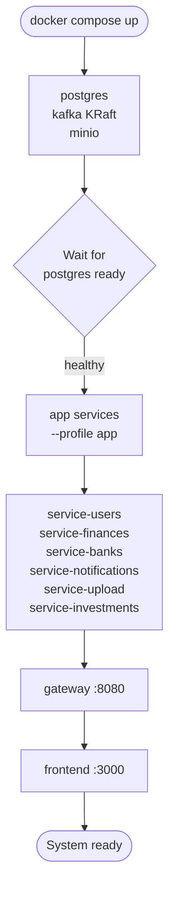

# Deployment & Dev-Ops

## 1. scripts/dev.sh Command Reference

Run `./scripts/dev.sh help` for the full built-in reference.

| Command | What it does |
|---|---|
| `local-all [svc...] [--front]` | Start infra (Docker) + selected services (or all defaults) as background processes with hot-reload; add `--front` to also start the Next.js dev server |
| `local <service>` | Start infra + run one backend service in the foreground via Maven (hot-reload via DevTools) |
| `front` | Start infra + run the Next.js frontend in the foreground via `npm run dev` |
| `up` | Build all images and start every service with microservice ports exposed (dev mode; Docker Compose auto-merges `docker-compose.override.yml` — no explicit `-f` is passed) |
| `prod` | Build all images and start every service **without** exposing microservice ports (uses `docker-compose.yml` only) |
| `down` | Stop and remove all containers (app + always-on infra/monitoring) |
| `stop-all` | Kill all local background processes started by `local-all` |
| `logs-local [svc]` | Tail log file(s) from `./logs/` written by `local-all` |
| `build [svc]` | Build all app Docker images, or a single named image |
| `dev <service>` | Build + run a single service in Docker (isolated, not via Maven) |
| `infra` | Start only the infrastructure containers (Postgres, Kafka, MinIO) |
| `restart [svc]` | Restart Docker container(s) |
| `logs [svc]` | Tail Docker container logs |
| `status` / `status-local` | Show Docker / `local-all` process status |
| `monitor` | Start the monitoring stack |

> Service names accepted by `local`, `dev`, `build`, etc.:
> `gateway`, `service-users`, `service-finances`, `service-banks`, `service-notifications`, `service-upload`, `service-investments`

---

## 2. Port Map

| Service | Internal name | Host port | Notes |
|---|---|---|---|
| ms-gateway | `gateway` | 8080 | Single external entry point for all `/api/v1/...` traffic |
| ms-users | `service-users` | 8081 | Auth — register / login / refresh / logout |
| ms-finances | `service-finances` | 8082 | Transactions, loans, card-expenses, categories |
| ms-banks | `service-banks` | 8083 | Banks and accounts |
| ms-notifications | `service-notifications` | 8084 | Kafka consumers, SSE stream, email, preferences |
| ms-upload | `service-upload` | 8085 | Statement upload → MinIO → PDF/CSV parse → preview/confirm |
| ms-investments | `service-investments` | 8086 | Holdings, portfolio P&L, IOL price feed |
| Frontend | `frontend` | 3000 | Next.js 15 |
| PostgreSQL | `postgres` | 5432 | Single instance, per-service schemas |
| Kafka (external) | `kafka` | 9093 | Local dev listener (`localhost:9093`) |
| Kafka (internal) | `kafka` | 9092 | Inter-container listener (`kafka:9092`) |
| MinIO S3 API | `minio` | 9000 | File storage |
| MinIO Console | `minio` | 9001 | Web UI |

### Swagger URLs

| Where | URL |
|---|---|
| Aggregated (via gateway) | `http://localhost:8080/swagger-ui.html` |
| ms-users | `http://localhost:8081/swagger-ui.html` |
| ms-finances | `http://localhost:8082/swagger-ui.html` |
| ms-banks | `http://localhost:8083/swagger-ui.html` |
| ms-notifications | `http://localhost:8084/swagger-ui.html` |
| ms-upload | `http://localhost:8085/swagger-ui.html` |
| ms-investments | `http://localhost:8086/swagger-ui.html` |

Swagger UIs for individual microservices are only reachable in dev mode (ports exposed via `docker-compose.override.yml`).

---

## 3. Environment Variables

The canonical reference is `.env.example` — copy it to `.env` and fill in your values. Never commit `.env`.

| Variable | Default / Example | Purpose |
|---|---|---|
| `POSTGRES_USER` | `financialapp` | PostgreSQL username |
| `POSTGRES_PASSWORD` | `changeme` | PostgreSQL password |
| `POSTGRES_DB` | `financialapp` | PostgreSQL database name |
| `KAFKA_BOOTSTRAP_SERVERS` | `kafka:9092` | Broker address; `local-all` overrides to `localhost:9093` |
| `KAFKA_CLUSTER_ID` | _(base64 UUID)_ | **Required** for KRaft. Without a fixed id the broker re-formats its storage on every recreate. Generate: `docker run --rm confluentinc/cp-kafka:7.7.0 kafka-storage random-uuid` |
| `JWT_SECRET` | _(64+ char random string)_ | HMAC-SHA signing key for access/refresh tokens |
| `INTERNAL_AUTH_TOKEN` | _(random string)_ | Shared `X-Internal-Token` secret for service-to-service calls; **required** — every backend service hard-fails at startup without it |
| `RATE_LIMIT_RPM` | `600` | Gateway per-IP rate limit, requests per minute |
| `JWT_EXPIRATION` | `86400000` | Access token TTL in milliseconds (24 h) |
| `JWT_REFRESH_EXPIRATION` | `604800000` | Refresh token TTL in milliseconds (7 d) |
| `JWT_ENABLED` | `true` | Disable JWT validation in gateway (local testing only) |
| `COOKIE_SECURE` | `false` | Set `true` in production (HTTPS required) |
| `ALLOWED_ORIGINS` | `https://<domain>,http://localhost` | CORS allowed origins list for the gateway |
| `NEXT_PUBLIC_GATEWAY_URL` | `https://<domain>/api` | Gateway base URL baked into the Next.js image |
| `MINIO_ROOT_USER` | `minioadmin` | MinIO access key |
| `MINIO_ROOT_PASSWORD` | `changeme` | MinIO secret key |
| `IOL_USERNAME` / `IOL_PASSWORD` | _(your IOL account)_ | InvertirOnline credentials for price feed |
| `DOMAIN_NAME` | `tu-dominio.duckdns.org` | Public domain used by Traefik + CORS |
| `ACME_EMAIL` | _(your email)_ | Let's Encrypt registration email |
| `MAIL_HOST` / `MAIL_PORT` / `MAIL_USERNAME` / `MAIL_PASSWORD` | _(SMTP creds)_ | Email sending for notifications |
| `DUCKDNS_DOMAIN` / `DUCKDNS_TOKEN` | _(your DuckDNS sub + token)_ | Dynamic DNS updater (skip if you use a static A record on another provider) |
| `GRAFANA_ADMIN_PASSWORD` | _(strong password)_ | Grafana admin login at `https://<domain>/grafana` |
| `SWAGGER_AUTH` | `admin:$$apr1$$...` | HTTP basic-auth for `https://<domain>/swagger-ui.html`, htpasswd format. **In the root `.env`, double every `$` to `$$`** — compose interpolates `.env` values, so a literal `$apr1$...` hash is corrupted. Generate: `htpasswd -nb admin 'yourpass'` then double the `$`. |

---

## 4. Startup Flow



**Notes:**
- Infra services (`postgres`, `kafka`, `minio`) run without a profile and start first. Kafka runs in **KRaft** mode (no ZooKeeper) and needs a fixed `KAFKA_CLUSTER_ID` in `.env`.
- Monitoring services (`prometheus`, `grafana`, `loki`, `promtail`) also run without a profile — they are **always up** with the stack.
- App services require `--profile app` — they will not start without it.
- The gateway declares `depends_on` for all backend services; it starts last among the microservices.
- The frontend `depends_on` the gateway.
- On first start, `infra/postgres/init/01-create-schemas.sql` creates the six per-service schemas (`users`, `finances`, `banks`, `notifications`, `upload`, `investments`). Subsequent `docker compose up` runs do not re-execute it.

---

## 5. Docker vs Local Dev

### docker-compose.override.yml

Docker Compose loads `docker-compose.override.yml` automatically alongside `docker-compose.yml` when you run the plain `docker compose` command (no explicit `-f`). The override file is **dev-only** and does one thing: publish host ports. It adds:

- Host-port bindings for infrastructure (`postgres:5432`, `kafka:9093`, `minio:9000/9001`)
- Host-port bindings for gateway (`:8080`) and frontend (`:3000`)
- Host-port bindings for every microservice (`8081–8086`) so each per-service Swagger UI is reachable directly
- Host-port bindings for monitoring (`prometheus:9090`, `grafana:3001`, `loki:3100`)
- A Traefik dashboard on `:8888`

### Production mode

Production uses **only** `docker-compose.yml`, which you must select with an explicit `-f` so the dev override is never auto-loaded:

```bash
docker compose -f docker-compose.yml --profile app up -d
```

No microservice, database, or monitoring ports are exposed to the host. Only Traefik exposes ports 80 and 443 to the internet; all traffic is TLS-terminated and routed by Traefik to `gateway:8080`, `frontend:3000`, or `grafana:3000` based on host + path prefix. Grafana (`/grafana`) and Swagger (`/swagger-ui.html`, basic-auth) are reached through Traefik — see Section 7.

**Never use `docker-compose.override.yml` or `./scripts/dev.sh` on a production server.** Production deployments pull pre-built images from GHCR and run the explicit `-f docker-compose.yml` command above (or `scripts/deploy.sh`).

### Local (hybrid) mode

`./scripts/dev.sh local-all` runs infra in Docker and services as local JVM processes (via Maven). The script overrides connection strings automatically:

- `KAFKA_BOOTSTRAP_SERVERS=localhost:9093` (external Kafka listener)
- `DB_URL=jdbc:postgresql://localhost:5432/financialapp?currentSchema=<schema>`
- All `*_SERVICE_URL` vars point to `localhost:<port>`

Logs land in `./logs/<service>.log`. Use `./scripts/dev.sh logs-local [svc]` to tail them and `./scripts/dev.sh stop-all` to shut everything down.

---

## 6. GHCR Image Tags and Releases

Images are published to GitHub Container Registry (`ghcr.io/sergio-smirnoff/<service>`) by the
`docker-publish.yml` caller in each repo (delegates to the reusable `backend-publish.yml` /
`frontend-publish.yml` in the root repo).

| Event | Tags applied |
|---|---|
| Push to `master` | `latest`, `sha-<shortsha>` |
| `v*` tag (from `release.yml` or `scripts/github/release-manager.sh`) | `X.Y.Z`, `X.Y`, `latest`, `sha-<shortsha>` |

**Releasing a service:**
- Via Actions UI: go to the service repo → Actions → `release.yml` → Run workflow → pick bump type
  (`major` / `minor` / `patch`). The caller enforces a `master`-only guard.
- Via CLI: `scripts/github/release-manager.sh` (`release`) — interactive, dispatches the API trigger in parallel.

`scripts/github/release-manager.sh` (`promote`) handles the develop→master PR + wait + merge before a release — parent first (blocking), then services in parallel.

**Version pinning on the server:** every app service in `docker-compose.yml` reads its image
tag from `.env` — `GATEWAY_VERSION`, `USERS_VERSION`, `FINANCES_VERSION`, `BANKS_VERSION`,
`NOTIFICATIONS_VERSION`, `UPLOAD_VERSION`, `INVESTMENTS_VERSION`, `FRONTEND_VERSION` —
defaulting to `latest`. Pin a semver tag (e.g. `FINANCES_VERSION=1.2.0`) to deploy an exact
release; rollback = set the previous version and re-run
`docker compose --profile app up -d` (or `./scripts/deploy.sh --update`).

**Server needs the root repo only.** Images are prebuilt by CI — service sources are never
cloned on the server. `scripts/deploy.sh` bootstraps `.env` + GHCR login on first run;
`./scripts/deploy.sh --update` pulls the root repo, pulls images (honouring the
`*_VERSION` pins), and restarts the stack in one command.

See [workflow.md](workflow.md) § CI/CD for the full workflow table, required PAT scopes, and
failure-triage scripts.

---

## 7. Deploy on any server

This stack is a single canonical `docker-compose.yml`. It runs on **any** Linux host with
Docker — a cloud VM (OCI, AWS, GCP, Hetzner…), a home server, or CasaOS. The server only needs
the **root repo** (orchestration files); service sources are never cloned — images are pulled
prebuilt from GHCR.

### 7.1 Requirements

- Linux host (x86-64 or ARM64 — images are multi-arch), **2+ vCPU, 4 GB+ RAM**, ~20 GB disk.
- **Docker Engine 24+** with the Compose v2 plugin (`docker compose version`).
- Ports **80** and **443** open to the internet (Traefik). No other inbound ports are needed.
- A **domain name** pointing at the server's public IP (any DNS provider; DuckDNS is built in
  but optional).
- A **GHCR token** (classic PAT with `read:packages`) if the images are private.

### 7.2 First-time deploy

```bash
# 1. Install Docker + compose plugin (skip if already present)
curl -fsSL https://get.docker.com | sh

# 2. Get the root repo only (no service sources needed)
git clone https://github.com/Sergio-Smirnoff/financial-app.git
cd financial-app

# 3. Create and fill in .env
cp .env.example .env
#    Required at minimum:
#      POSTGRES_PASSWORD, JWT_SECRET, INTERNAL_AUTH_TOKEN
#      KAFKA_CLUSTER_ID            (docker run --rm confluentinc/cp-kafka:7.7.0 kafka-storage random-uuid)
#      DOMAIN_NAME, ACME_EMAIL     (your domain + Let's Encrypt email)
#      GRAFANA_ADMIN_PASSWORD
#      SWAGGER_AUTH                (htpasswd -nb admin 'pass'  → then double every $ to $$)
#      COOKIE_SECURE=true          (HTTPS in prod)
#    Optional: DUCKDNS_DOMAIN/DUCKDNS_TOKEN (only if using DuckDNS for DNS)
#    Optional: pin image versions  (GATEWAY_VERSION=1.2.0 …) — default is `latest`

# 4. Point DNS at the server: an A record DOMAIN_NAME → <public IP>.
#    (If using DuckDNS, the duckdns container keeps it updated automatically.)

# 5. Log in to GHCR if the images are private
echo "$GHCR_TOKEN" | docker login ghcr.io -u <github-username> --password-stdin

# 6. Launch the full stack. The explicit -f bypasses the dev override, so NO host
#    ports are published except Traefik 80/443.
docker compose -f docker-compose.yml --profile app up -d
```

Traefik requests Let's Encrypt certificates automatically on first start via the HTTP-01
challenge (port 80 must be reachable from the internet).

> **Shortcut:** `scripts/deploy.sh` automates first-run (`.env` wizard + GHCR login) and
> `scripts/deploy.sh --update` does a full update (pull root repo → pull images honouring
> `*_VERSION` pins → restart). It is a convenience wrapper around the command in step 6 — use
> it or the raw command, both are equivalent.

### 7.3 What is reachable after deploy

| URL | Served by | Auth |
|---|---|---|
| `https://<domain>` | frontend | app login |
| `https://<domain>/api` | gateway | JWT cookie |
| `https://<domain>/swagger-ui.html` | gateway (aggregated) | HTTP basic-auth (`SWAGGER_AUTH`) |
| `https://<domain>/grafana` | grafana | `admin` / `GRAFANA_ADMIN_PASSWORD` |

Internal-only (no host ports in prod): Postgres, Kafka, MinIO, Prometheus, Loki, Promtail.
Monitoring is part of the stack and starts automatically — no separate command.

### 7.4 Update / rollback

```bash
# Update to the latest published images
docker compose -f docker-compose.yml --profile app pull
docker compose -f docker-compose.yml --profile app up -d
#   …or, in one command:  ./scripts/deploy.sh --update

# Rollback a service: pin the previous tag in .env and re-up
#   FINANCES_VERSION=1.1.0
docker compose -f docker-compose.yml --profile app up -d
```

### 7.5 Operations

```bash
# Status / logs
docker compose -f docker-compose.yml --profile app ps
docker compose -f docker-compose.yml --profile app logs -f gateway

# Stop everything
docker compose -f docker-compose.yml --profile app down

# Backups (PostgreSQL + MinIO snapshots)
./scripts/backup.sh
```

### 7.6 Troubleshooting

| Symptom | Likely cause / fix |
|---|---|
| Let's Encrypt cert not issued | Port 80 not reachable, or DNS not yet propagated to the server's IP. Check `docker compose logs traefik`. |
| Kafka re-formats data on restart | `KAFKA_CLUSTER_ID` not set in `.env` — set a fixed value. |
| Swagger basic-auth always fails | `SWAGGER_AUTH` `$` not doubled to `$$` in the root `.env` (compose ate the hash). |
| Service exits with auth error at boot | `INTERNAL_AUTH_TOKEN` missing — every backend hard-fails without it. |
| Traefik 502 on `/api` | Backend still starting or unhealthy; check `docker compose ps` + that service's logs. |
| CORS errors in browser | `ALLOWED_ORIGINS` must include `https://<domain>`; `NEXT_PUBLIC_GATEWAY_URL` must be `https://<domain>/api`. |
| Container OOM-killed | Host under-provisioned; the compose file caps Spring services at 768 MB each — size the host accordingly. |

---

[Architecture](architecture.md) | [Workflow](workflow.md)
