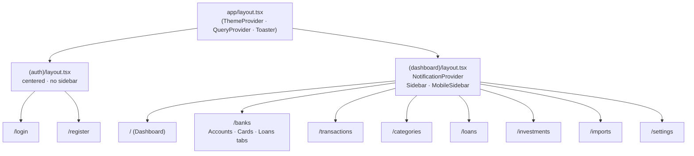
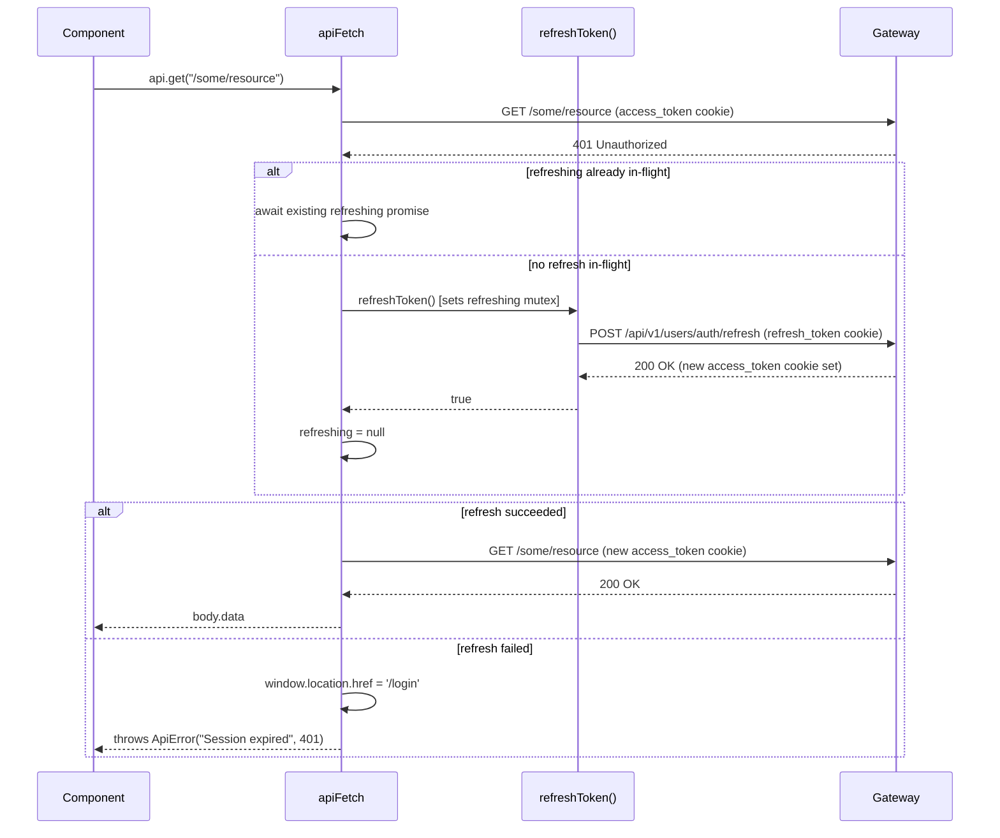

# Frontend — Next.js App

**Stack:** Next.js 15 · React 19 · TypeScript · Tailwind CSS 4 · shadcn/ui · Recharts  
**Port:** 3000  
**Gateway:** `NEXT_PUBLIC_GATEWAY_URL` (default `http://localhost:8080`) — the only backend the frontend ever contacts.

---

## Folder Tree

```
front/financial-app/
├── app/
│   ├── layout.tsx                  # Root: ThemeProvider + QueryProvider + Toaster
│   ├── globals.css
│   ├── (auth)/
│   │   ├── layout.tsx              # Centered, no sidebar
│   │   ├── login/page.tsx
│   │   └── register/page.tsx
│   └── (dashboard)/
│       ├── layout.tsx              # Sidebar + NotificationProvider
│       ├── page.tsx                # /  → Dashboard
│       ├── banks/page.tsx
│       ├── transactions/page.tsx
│       ├── categories/page.tsx
│       ├── loans/page.tsx
│       ├── investments/page.tsx
│       ├── imports/page.tsx
│       └── settings/page.tsx
├── components/
│   ├── layout/                     # Header, Sidebar (exports MobileSidebar), NotificationBell, NotificationDropdown, NotificationDialog, ThemeToggle
│   ├── pages/                      # Domain-scoped components (banks/, dashboard/, investments/, …)
│   ├── shared/                     # App-wide building blocks (ConfirmDialog, Surface, QueryBoundary, …)
│   └── ui/                         # shadcn/ui primitives (button, dialog, select, table, …)
├── lib/
│   ├── api/                        # Domain API modules + client.ts + config.ts
│   ├── hooks/                      # TanStack Query hooks (use*.ts)
│   ├── schemas/                    # Zod form schemas
│   ├── store/                      # Zustand stores
│   └── utils/                      # Pure utilities (currency, dates, cbu, …)
├── providers/
│   ├── QueryProvider.tsx           # TanStack QueryClient wrapper
│   ├── ThemeProvider.tsx           # next-themes
│   └── NotificationProvider.tsx    # Mounts useNotificationSSE
├── types/                          # TypeScript interfaces per domain
└── middleware.ts                   # Route gating on user_info cookie
```

---

## Routing and Layouts



| Route group | Layout | What it renders |
|---|---|---|
| `(auth)` | Full-screen centered flex | Login and Register forms, no navigation chrome |
| `(dashboard)` | Fixed sidebar + scrollable content area | All authenticated pages |
| root | HTML shell | Fonts, global CSS, provider wrapping |

### Dashboard layout detail

The `(dashboard)/layout.tsx` renders a fixed-height flex row:

```
┌──────────────────────────────────────────────┐
│  Sidebar (fixed, 240 px, desktop)            │
│  MobileSidebar (drawer, mobile)              │
│ ┌────────────────────────────────────────┐   │
│ │  Header: page title · theme · bell ·  │   │
│ │          user name · logout           │   │
│ ├────────────────────────────────────────┤   │
│ │  <page content>                        │   │
│ └────────────────────────────────────────┘   │
└──────────────────────────────────────────────┘
```

NotificationProvider wraps the entire dashboard tree and mounts the SSE connection via `useNotificationSSE`.

---

## Middleware

`middleware.ts` runs on every request matched by:

```
matcher: ['/((?!_next/static|_next/image|favicon.ico|api).*)']
```

Logic:

| Condition | Action |
|---|---|
| No `user_info` cookie + protected route | Redirect → `/login` |
| Has `user_info` cookie + auth route (`/login`, `/register`) | Redirect → `/` |
| Otherwise | Pass through |

`user_info` is a non-HttpOnly cookie written by the backend on login. It carries `id|email|firstName` (URL-encoded). The middleware never calls the gateway; it only reads cookie presence.

---

## API Client (`lib/api/client.ts`)

All HTTP calls flow through `apiFetch`. Domain API modules (`lib/api/*.ts`) build typed wrappers around the `api` object.

### apiFetch behavior

| Concern | Behavior |
|---|---|
| Base URL | `NEXT_PUBLIC_GATEWAY_URL` via `API_CONFIG.BASE_URL` |
| Credentials | `credentials: 'include'` on every request |
| Content-Type | `application/json` by default; omitted for `FormData` |
| CSRF | Reads `XSRF-TOKEN` cookie; sends as `X-XSRF-TOKEN` header on all non-GET/HEAD methods |
| Response unwrap | Parses `ApiResponse<T>`; returns `body.data` directly, throws `ApiError` on failure |
| 401 handling | Token refresh → retry (see sequence diagram below) |

### apiFetch 401 → refresh → retry



The `refreshing` variable is a module-level `Promise<boolean> | null`. Concurrent 401 responses from parallel requests all `await` the same promise, so exactly one refresh call is ever in-flight.

### Domain API modules

| Module | Endpoints covered |
|---|---|
| `lib/api/auth.ts` | login, register, logout, refreshToken |
| `lib/api/banks.ts` | banks list/available/metadata, account CRUD, account transactions |
| `lib/api/transactions.ts` | transaction CRUD, filters |
| `lib/api/categories.ts` | category and subcategory CRUD |
| `lib/api/loans.ts` | loan CRUD |
| `lib/api/investments.ts` | holdings CRUD, portfolio summary/evolution, price history, price refresh |
| `lib/api/dashboard.ts` | aggregated dashboard data from gateway BFF |
| `lib/api/notifications.ts` | notifications list, mark-read |
| `lib/api/import.ts` | CSV/PDF upload, import session management |
| `lib/api/cards.ts` | card CRUD |

---

## Auth Helpers (`lib/auth.ts`)

Three client-side-only functions (guard on `typeof document === 'undefined'`):

| Function | Returns | Source cookie |
|---|---|---|
| `getUserFromCookie()` | `{ id, email, name }` or `null` | `user_info` (non-HttpOnly, URL-encoded `id\|email\|firstName`) |
| `getCsrfToken()` | `string` or `null` | `XSRF-TOKEN` (non-HttpOnly, set by Spring Security) |
| `isAuthenticated()` | `boolean` | delegates to `getUserFromCookie()` |

---

## State Management

### Server state — TanStack Query

Every domain has a dedicated hook file in `lib/hooks/`. Hooks follow the pattern `useQuery` for reads and `useMutation` + `queryClient.invalidateQueries` for writes.

| Hook file | Domain |
|---|---|
| `useBanks.ts` | banks, available banks, catalog metadata, accounts CRUD |
| `useTransactions.ts` | transactions list + mutations |
| `useCategories.ts` | categories and subcategories |
| `useLoans.ts` | loans |
| `useInvestments.ts` | holdings, portfolio summary/evolution, price history |
| `useDashboard.ts` | aggregated dashboard from gateway |
| `useNotifications.ts` | notification list + mark-read |
| `useNotificationSSE.ts` | SSE stream (EventSource) — mounted by `NotificationProvider` |
| `useCards.ts` | cards |
| `useImport.ts` | import session wizard |

### UI state — Zustand (`lib/store/ui.store.ts`)

`useUiStore` manages:

| Slice | Fields |
|---|---|
| Active modal | `modal: Modal`, `modalData`, `openModal()`, `closeModal()` |
| Confirm-delete dialog | `confirmDelete`, `openConfirmDelete()`, `closeConfirmDelete()` |
| Sidebar (mobile) | `sidebarOpen`, `setSidebarOpen()`, `toggleSidebar()` |

Modal names: `create-transaction`, `edit-transaction`, `create-category`, `create-subcategory`, `create-loan`, `create-card-expense`, `confirm-delete`.

---

## Component Areas

| Area | Path | Purpose |
|---|---|---|
| App shell | `app/` | Next.js routes, layouts, `globals.css` |
| Layout chrome | `components/layout/` | `Sidebar` (also exports `MobileSidebar`), `Header`, `NotificationBell`, `NotificationDropdown`, `NotificationDialog`, `ThemeToggle` |
| Domain pages | `components/pages/` | All business-logic components, grouped by domain (`banks/`, `dashboard/`, `investments/`, `transactions/`, `categories/`, `loans/`, `imports/`, `settings/`) |
| Shared primitives | `components/shared/` | `ConfirmDialog`, `LoadingSpinner`, `ErrorMessage`, `MultiCurrencyAmount`, `QueryBoundary`, `Surface` |
| shadcn/ui | `components/ui/` | Headless primitives: `button`, `dialog`, `select`, `table`, `tabs`, `input`, `form`, `badge`, `card`, `switch`, `progress`, `scroll-area`, `separator`, `sonner`, `dropdown-menu`, `checkbox` |
| API modules | `lib/api/` | Typed fetch wrappers per domain + `client.ts` + `config.ts` |
| Query hooks | `lib/hooks/` | TanStack Query hooks (`use*.ts`) |
| Zod schemas | `lib/schemas/` | Form validation schemas (`account.ts`, `card.ts`, `cardExpense.ts`) |
| Zustand stores | `lib/store/` | `ui.store.ts` |
| Utilities | `lib/utils/` + `lib/utils.ts` | `currency.ts`, `dates.ts`, `cbu.ts`, `category-utils.ts` (in `lib/utils/`); `lib/utils.ts` (root, `cn` helper) |
| Types | `types/` | TypeScript interfaces per domain (`auth`, `banks`, `finances`, `investments`, `loans`, `cards`, `notifications`, `import`, `api`) |
| Providers | `providers/` | `QueryProvider`, `ThemeProvider`, `NotificationProvider` |

---

## Notifications (SSE)

`useNotificationSSE` opens an `EventSource` to `{GATEWAY_URL}/api/v1/notifications/stream` with `withCredentials: true`. Auth is carried by the `access_token` HttpOnly cookie. On each `notification` event it fires a `sonner` toast and invalidates the `['notifications']` query key. On error it closes and reconnects after 5 s. The hook is mounted exclusively by `NotificationProvider`, which wraps the entire `(dashboard)` layout.

---

## Forms

All forms use `react-hook-form` with `zod` resolvers. Schemas live in `lib/schemas/`. Validated at the field level on change; server errors surface as `toast.error` via the mutation `onError` callback.

---

## CI/CD

Thin caller workflows (`.github/workflows/`) delegate to the shared workflows in the root repo:
`ci.yml` (PRs + develop/master pushes → `npm ci` + lint + build + Docker build; required check
`ci / build`), `docker-publish.yml` (master push / `v*` tag → GHCR `latest` + `sha-*` + semver),
`release.yml` (bump dropdown → semver release). The build must pass without any backend running —
`NEXT_PUBLIC_GATEWAY_URL` is set to a placeholder value during CI.
See [../workflow.md](../workflow.md) § CI/CD.

---

[Master](../00-master.md) | [Architecture](../architecture.md) | [Rules](../rules.md) | [Workflow](../workflow.md)
