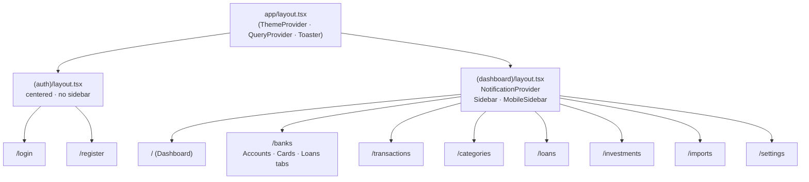
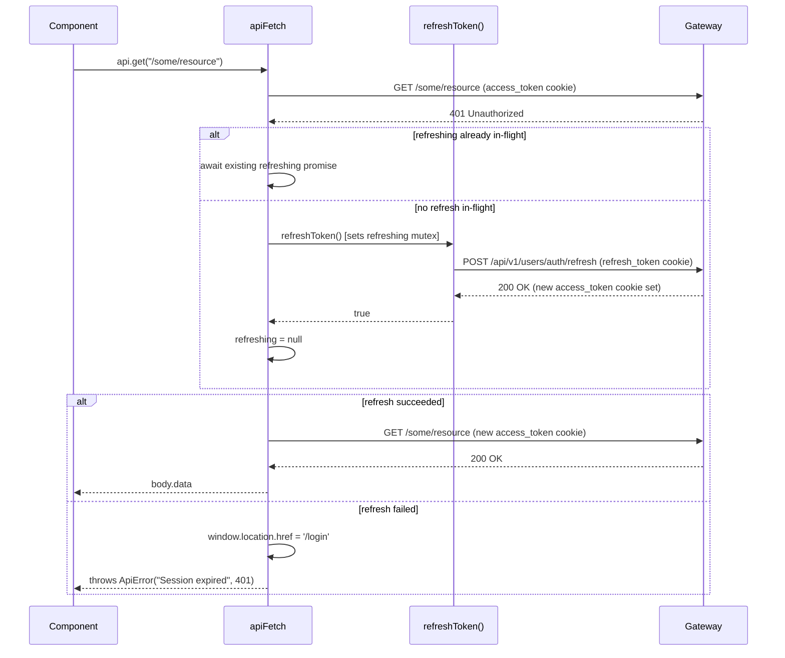

# Frontend — Next.js App

> Human-facing. Facts an implementer needs live in `front/financial-app/.ai/` — this page holds the
> reasoning behind them and does not restate them. If the two disagree, the repo file wins.

---

## Routing and Layouts



### Dashboard layout detail

The `(dashboard)/layout.tsx` renders a fixed-height flex row:

```
┌──────────────────────────────────────────────┐
│  Sidebar (fixed, 240 px, desktop)            │
│  MobileSidebar (drawer, mobile)              │
│ ┌────────────────────────────────────────┐   │
│ │  Header: page title · theme · bell ·  │   │
│ │          user name · logout           │   │
│ ├────────────────────────────────────────┤   │
│ │  <page content>                        │   │
│ └────────────────────────────────────────┘   │
└──────────────────────────────────────────────┘
```

NotificationProvider wraps the entire dashboard tree and mounts the SSE connection via `useNotificationSSE`.

---

## apiFetch 401 → refresh → retry



The `refreshing` variable is a module-level `Promise<boolean> | null`. Concurrent 401 responses from parallel requests all `await` the same promise, so exactly one refresh call is ever in-flight.

---

## Recent UX Fixes (2026-06-12)

| Area | Fix |
|---|---|
| Investments — Markets tab | Ticker research now renders inline below `TickerSearchBox` via an `onSelect` callback; the dedicated `/investments/research/[ticker]` route was removed. |
| Transactions table | Sentinel CBUs render labelled operation names: `Brokerage` for broker sentinel CBUs and `External` for the `0000000000000000000000` installment sentinel; user CBUs render raw as before. |
| `PriceChart` | Non-positive price points are filtered out before rendering, eliminating the drop-to-zero spike caused by pre-open / no-trade IOL candles. |
| Card list | Card item layout fixed so the Expires / behavior row is no longer clipped. |
| Notifications dialog | Close button repositioned so it no longer overlaps the "Mark all as read" control. |
