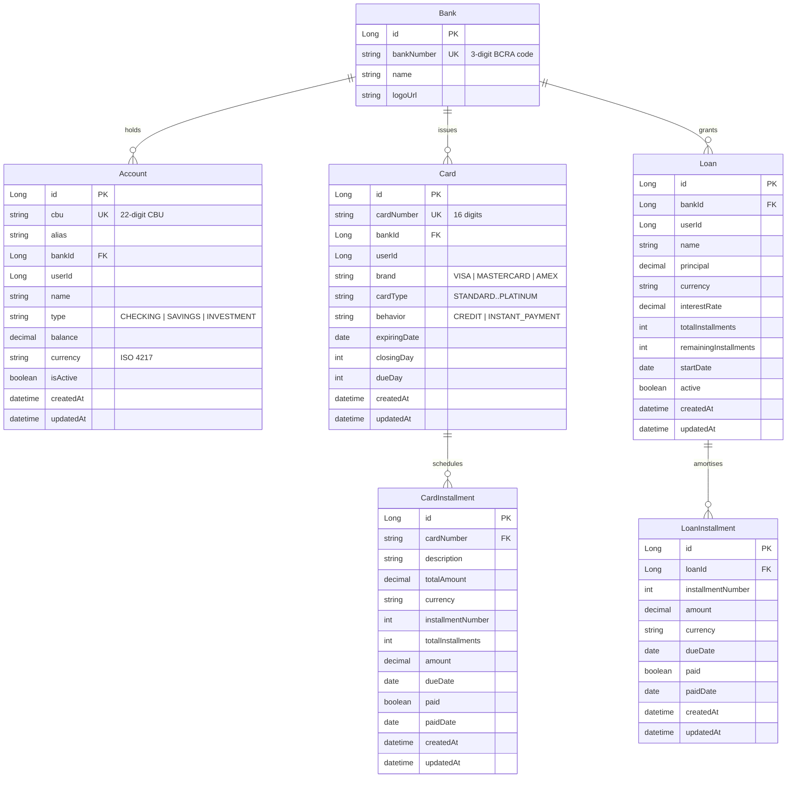

# ms-banks — Service Spec

**Port:** 8083
**Framework:** Spring Boot 3.4.2 (Spring MVC)
**Database:** PostgreSQL — schema `banks`
**Swagger UI:** `http://localhost:8083/swagger-ui.html`

> **OWN GIT REPOSITORY.**
> `back/ms-banks` is a nested git repo with its own remote (`financial-app-back-ms-banks`).
> All commits for banks work must be made inside `back/ms-banks`.
> The parent repo gitignores this path. Never commit banks changes from the parent repo.

---

## Summary

ms-banks owns the user's financial instruments at the bank level: the bank catalog, bank accounts (CBU-addressed), credit/debit cards with installment schedules, and loans amortised via the French method. It provides a consolidated upcoming-payments view (combining loan and card installments) and a metadata endpoint for form selectors. Domain events are published to Kafka on balance adjustments, installment payments, and loan creation; the service also consumes `transaction.created` events from ms-finances to keep account balances in sync.

---

## Domain Model

### Aggregates and Value Objects

| Aggregate | Key VOs | Notes |
|-----------|---------|-------|
| `Bank` | `BankNumber` (3-digit BCRA code), `Logo` | Read-only catalog seeded at startup; no per-user Bank mutation |
| `Account` | `Cbu` (22-digit, two BCRA check digits), `AccountNumber`, `SucursalCode`, `Money`, `UserId` | Abstract root with three subtypes: `CheckingAccount`, `SavingsAccount`, `InvestmentAccount` |
| `Card` | `CardNumber` (16 digits, Luhn), `CardDetails` (`CardBrand`, `CardType`, `CardBehavior`, `YearMonth`, `CardBilling`) | Abstract root: `CreditCard` (supports installments), `DebitCard` (INSTANT\_PAYMENT) |
| `CardInstallment` | `CardInstallmentId`, `Money` | Record; immutable `pay()` returns a new instance |
| `Loan` | `LoanId`, `BankNumber`, `Money`, `AmortizationType` (FRENCH only) | Record; `originate()` factory builds full schedule via `LoanAmortization` |
| `LoanInstallment` | `LoanInstallmentId`, `Money` | Record; immutable `pay()` |

### Enumerations

| Enum | Values |
|------|--------|
| `AccountType` | `CHECKING`, `SAVINGS`, `INVESTMENT` |
| `CardBrand` | `VISA`, `MASTERCARD`, `AMEX` |
| `CardType` | `STANDARD`, `SILVER`, `GOLD`, `BLACK`, `PLATINUM` |
| `CardBehavior` | `CREDIT`, `INSTANT_PAYMENT` |
| `AmortizationType` | `FRENCH` |

### CBU / BankNumber Contract

- **`BankNumber`** — three-digit BCRA entity code; prefix of every CBU issued by that bank.
- **`Cbu`** — 22-digit Argentine CBU (`bankNumber[3] + sucursalCode[4] + checkDigit1[1] + accountNumber[13] + checkDigit2[1]`). `Cbu.from(String)` validates both BCRA modulo-10 check digits.
- Every Account is addressed by its CBU string throughout the API (path variables, query params, Kafka payloads). `bankNumber` query filters use the 3-digit code.
- `INVESTMENT` accounts carry metadata only — the aggregate throws `AccountInvestmentRestrictionException` on any balance adjustment attempt.

### Response Envelope

All endpoints return the shared `ApiResponse<T>` from `commons-core` (built from
`financial-app-parent`):

```json
{
  "status": 201,
  "title": "Created",
  "message": "Account created",
  "data": { "...": "..." }
}
```

Errors use the SAME class — `code` carries the `DomainError` slug, details travel in `data`:

```json
{
  "status": 422,
  "title": "Unprocessable Entity",
  "code": "account_insufficient_funds",
  "message": "Balance 100.00 ARS is less than requested 250.00 ARS",
  "data": { "missing": "150.00" }
}
```

`GlobalExceptionHandler extends ApiExceptionHandler` (commons-web) renders all errors; the
service-specific part is only the `constraintMessages()` override (unique-constraint texts).
Every endpoint declares its throwable codes with `@ApiErrorCodes(catalog = DomainError.class, ...)`
— Swagger examples are generated from the catalog. There is NO separate `ErrorResponse` class.

---

## Entity-Relationship Diagram



---

## Key Flow: Account Balance Adjustment

This flow covers both the REST path (manual adjustment) and the Kafka-driven path (transaction sync from ms-finances).

```mermaid
sequenceDiagram
    participant Client
    participant AccountController
    participant AdjustBalanceUseCase
    participant Account
    participant AccountRepository
    participant DomainEventPublisher
    participant Kafka

    alt REST — manual adjustment
        Client->>AccountController: POST /api/v1/banks/accounts/{cbu}/balance/adjust?delta=...&currency=...
        AccountController->>AdjustBalanceUseCase: execute(AdjustBalanceCommand)
    else Kafka — transaction sync
        Kafka-->>TransactionEventListener: transaction.created event
        TransactionEventListener->>AdjustBalanceUseCase: execute(AdjustBalanceCommand)
        note over TransactionEventListener: idempotency via ProcessedEvent table
    end

    AdjustBalanceUseCase->>AccountRepository: findByCbu(cbu)
    AccountRepository-->>AdjustBalanceUseCase: Account
    AdjustBalanceUseCase->>Account: debit(amount) or credit(amount)
    Account-->>AdjustBalanceUseCase: AccountAdjustment(updatedAccount, events)
    note over Account: Raises BalanceAdjustedEvent;<br/>LowBalanceEvent if balance < 500
    AdjustBalanceUseCase->>AccountRepository: save(updatedAccount)
    AdjustBalanceUseCase->>DomainEventPublisher: publishAll(events)
    DomainEventPublisher-->>Kafka: balance.adjusted / low.balance (AFTER_COMMIT)
```

---

## Endpoint Table

### BankController — `/api/v1/banks`

| Method | Path | Purpose |
|--------|------|---------|
| `GET` | `/api/v1/banks` | List the user's banks (those where they hold accounts), each with their account list |
| `GET` | `/api/v1/banks/available` | Read-only catalog of all available bank names and numbers |
| `GET` | `/api/v1/banks/{bankNumber}` | Get one bank with the user's accounts at that bank |

### AccountController — `/api/v1/banks/accounts`

| Method | Path | Purpose |
|--------|------|---------|
| `GET` | `/api/v1/banks/accounts` | List user accounts; filterable by `type`, `currency`, `bankNumber`, `name`, `hideEmpty` |
| `GET` | `/api/v1/banks/accounts/{cbu}` | Get one account by CBU |
| `POST` | `/api/v1/banks/accounts` | Open (create) an account under a bank |
| `PATCH` | `/api/v1/banks/accounts/{cbu}` | Update account name, balance, or active flag |
| `DELETE` | `/api/v1/banks/accounts/{cbu}` | Close (delete) an account |
| `GET` | `/api/v1/banks/accounts/{cbu}/transactions` | Account transaction history; `?all=true` or `?from=&to=` date filter; default last 5 (proxied from ms-finances) |
| `POST` | `/api/v1/banks/accounts/{cbu}/balance/adjust` | Manually adjust balance by a signed delta |

### CardController — `/api/v1/banks/cards`

| Method | Path | Purpose |
|--------|------|---------|
| `GET` | `/api/v1/banks/cards` | List user cards; optional `?bankNumber=` filter |
| `GET` | `/api/v1/banks/cards/{cardNumber}` | Get one card by 16-digit card number |
| `POST` | `/api/v1/banks/cards` | Issue (create) a card |
| `PATCH` | `/api/v1/banks/cards/{cardNumber}` | Update billing cycle (closingDay, dueDay) and expiry date |
| `DELETE` | `/api/v1/banks/cards/{cardNumber}` | Cancel (delete) a card |

### CardInstallmentController — `/api/v1/banks/cards/{cardNumber}/installments`

| Method | Path | Purpose |
|--------|------|---------|
| `GET` | `/api/v1/banks/cards/{cardNumber}/installments` | List all installments for a card |
| `POST` | `/api/v1/banks/cards/{cardNumber}/installments` | Register a new card expense and generate its installment schedule |
| `POST` | `/api/v1/banks/cards/{cardNumber}/installments/{installmentId}/pay` | Mark one installment as paid from a given account CBU |
| `POST` | `/api/v1/banks/cards/{cardNumber}/installments/import` | Batch import card expenses from a statement (skips duplicates) |
| `POST` | `/api/v1/banks/cards/{cardNumber}/installments/duplicates-check` | Pre-flight check: returns indices of expenses that already exist |

### LoanController — `/api/v1/banks/loans`

| Method | Path | Purpose |
|--------|------|---------|
| `GET` | `/api/v1/banks/loans` | List user loans; optional `?bankNumber=` filter |
| `POST` | `/api/v1/banks/loans` | Originate a loan (French amortisation, full schedule generated) |
| `DELETE` | `/api/v1/banks/loans/{id}` | Cancel (delete) a loan |
| `GET` | `/api/v1/banks/loans/{id}/installments` | List installments for a loan |
| `POST` | `/api/v1/banks/loans/{id}/installments/{installmentId}/pay` | Mark one loan installment as paid from a given account CBU |

### MetadataController — `/api/v1/banks/metadata`

| Method | Path | Purpose |
|--------|------|---------|
| `GET` | `/api/v1/banks/metadata` | Read-only catalog of valid enum values for account types, card brands, card types, and card behaviors — used to populate frontend form selectors |

### UpcomingPaymentController — `/api/v1/banks/upcoming-payments`

| Method | Path | Purpose |
|--------|------|---------|
| `GET` | `/api/v1/banks/upcoming-payments?from=&to=` | Consolidated list of upcoming unpaid loan and card installments within a date range |

---

## Kafka Integration

| Direction | Topic | Trigger |
|-----------|-------|---------|
| Consumes | `transaction.created` | ms-finances publishes when a transaction is recorded; ms-banks adjusts account balance (idempotent via `processed_events` table) |
| Publishes | `balance.adjusted` | After every successful credit or debit |
| Publishes | `low.balance` | When post-adjustment balance falls below 500 (account's own currency) |
| Publishes | `loan.created` (via `LoanCreatedEvent`) | After loan origination |
| Publishes | `loan.installment.paid` | After paying a loan installment |
| Publishes | `card.installment.paid` | After paying a card installment |
| Publishes (alert) | `bank.alert` | Daily scheduler at 08:00: card expiries (30-day window), upcoming loan/card payments (3-day window), low-balance accounts |

All publishes happen `AFTER_COMMIT` via `TransactionalKafkaListener` to prevent phantom events on rollback.

---

## Scheduled Jobs

| Job | Schedule | Action |
|-----|----------|--------|
| `BankAlertScheduler.runDailyAlerts()` | `0 0 8 * * *` (daily 08:00) | Checks card expirations (≤30 days), upcoming loan installments (≤3 days), upcoming card installments (≤3 days), low-balance accounts (< 500) — publishes `bank.alert` events to Kafka |

---

## External Service Calls

| Dependency | Feign Client | Calls |
|------------|-------------|-------|
| ms-finances | `FinancesFeignClient` | `GET /api/v1/finances/transactions?accountCbu=...` — proxied on `GET /accounts/{cbu}/transactions` |
| ms-investments | `InvestmentsFeignClient` | `GET /api/v1/investments/holdings/valuation?accountCbu=...` and `.../count` — used to enrich `INVESTMENT` account metadata |

---

## Folder Tree

```
back/ms-banks/src/main/java/com/financialapp/banks/
│
├── web/                            ← HTTP layer
│   ├── controller/
│   │   ├── AccountController
│   │   ├── BankController
│   │   ├── CardController
│   │   ├── CardInstallmentController
│   │   ├── LoanController
│   │   ├── MetadataController
│   │   └── UpcomingPaymentController
│   ├── dto/
│   │   ├── request/                (AccountRequest, CardRequest, LoanRequest, …)
│   │   └── response/               (AccountResponse, CardResponse, … — envelope from commons-core)
│   ├── mapper/                     (AccountWebMapper, CardWebMapper, LoanWebMapper, …)
│   └── error/                      (GlobalExceptionHandler)
│
├── application/                    ← Use-case implementations
│   ├── account/impl/               (OpenAccount, CloseAccount, UpdateAccount,
│   │                                AdjustBalance, ListAccounts, GetAccount,
│   │                                GetAccountTransactions)
│   ├── bank/impl/                  (ListBanks, ListAvailableBanks, GetBank)
│   ├── card/impl/                  (IssueCard, CancelCard, UpdateCard, GetCard,
│   │                                ListCards, RegisterCardExpense,
│   │                                ListCardInstallments, PayCardInstallment,
│   │                                ImportCardExpenses, CheckDuplicateExpenses)
│   ├── catalog/impl/               (GetBankingCatalog)
│   ├── loan/impl/                  (OriginateLoan, ListLoans, GetLoanInstallments,
│   │                                PayLoanInstallment, CancelLoan)
│   └── upcoming/impl/              (GetUpcomingPayments)
│
├── domain/                         ← Pure domain — no Spring dependencies
│   ├── common/model/               (Cbu, Money, UserId, Installment, Payment)
│   ├── model/
│   │   ├── account/                (Account, AccountType, AccountNumber,
│   │   │                            AccountAdjustment, accountTypes/…)
│   │   ├── bank/                   (Bank, BankNumber, Logo, SucursalCode)
│   │   ├── card/                   (Card, CardInstallment, CardDetails,
│   │   │                            CardBrand, CardType, CardBehavior,
│   │   │                            CardBilling, CardNumber, IssuerBin,
│   │   │                            cardPaymentMethod/…)
│   │   └── loan/                   (Loan, LoanInstallment, LoanId,
│   │                                LoanOrigination, AmortizationType)
│   ├── usecase/                    (use-case interfaces + command records)
│   ├── repository/                 (AccountRepository, CardRepository, …)
│   ├── port/                       (DomainEventPublisher, InvestmentsPort)
│   ├── service/                    (LoanAmortization)
│   ├── event/                      (BalanceAdjustedEvent, LowBalanceEvent,
│   │                                LoanCreatedEvent, LoanInstallmentPaidEvent,
│   │                                CardInstallmentPaidEvent)
│   └── exception/                  (DomainException, DomainError, ErrorCategory,
│                                    account/*, bank/*, card/*, cbu/*, loan/*)
│
└── infrastructure/                 ← Spring / JPA / Kafka / Feign
    ├── persistence/
    │   ├── entity/                 (AccountJpaEntity, BankJpaEntity,
    │   │                            CardJpaEntity, CardInstallmentJpaEntity,
    │   │                            LoanJpaEntity, LoanInstallmentJpaEntity,
    │   │                            ProcessedEventJpaEntity)
    │   ├── jpa/                    (Spring Data JPA repositories)
    │   ├── mapper/                 (JPA ↔ domain mappers)
    │   ├── repository/             (domain port implementations)
    │   ├── query/                  (read-model / projection queries)
    │   └── seed/                   (BankCatalogSeeder)
    ├── messaging/
    │   ├── KafkaDomainEventPublisher
    │   ├── listener/               (TransactionEventListener, TransactionalKafkaListener)
    │   ├── payload/                (TransactionCreatedEvent, BankAlertEvent, …)
    │   └── mapper/
    ├── client/                     (FinancesFeignClient, InvestmentsFeignClient)
    │   └── adapter/                (FinancesClientAdapter, InvestmentsClientAdapter)
    ├── scheduler/                  (BankAlertScheduler)
    └── config/                     (JPA, Kafka, Feign, serializers)
```

---

## Flyway Migrations (schema `banks`)

| Version | Description |
|---------|-------------|
| V1 | Create `banks` and `accounts` tables |
| V2 | Create `cards` and `card_installments` tables |
| V3 | Create `loans` and `loan_installments` tables |
| V4 | Migrate cards and loans to bank-level (add `bank_id`) |
| V5 | Wipe cards and loans data (structural reset) |
| V6 | Create `processed_events` table (idempotency) |
| V7 | Add `cbu` and `alias` columns to `accounts` |
| V8 | Add `card_number` column to `cards` |
| V9 | Make `banks` a global read-only catalog (shared across users) |
| V10 | Drop `logo_url` from bank catalog |
| V11 | Drop `last_4_digits` from cards |
| V12 | Normalise legacy `card_behavior` values |
| V13 | Add `bank_number` column to `banks` |
| V14 | Change `bank_number` to `varchar` |

---

[Master](../00-master.md) | [Architecture](../architecture.md) | [Rules](../rules.md) | [Workflow](../workflow.md)
