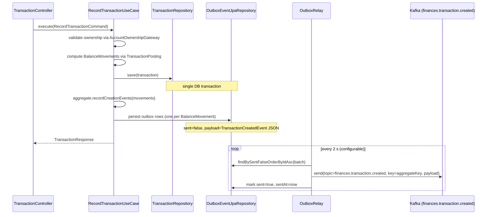

# ms-finances — Service Specification

> Human-facing. Facts an implementer needs live in `back/ms-finances/.ai/` — this page holds the
> reasoning behind them and does not restate them. If the two disagree, the repo file wins.

ms-finances records every money movement in the user's ledger. It owns four bounded concepts:
**Transactions** (account-to-account ledger entries), **Categories / Subcategories** (user-defined
classification trees), and the legacy **Loans** and **CardExpenses** (installment-payment tracking).
The DDD migration is complete for transactions and categories; loans/card-expenses still live in the
`old/` package and are served by legacy controllers.

---

## Architecture overview

```
Browser / Gateway
      │  X-User-Id header
      ▼
web/controller
  TransactionController          /api/v1/finances/transactions
  CategoryController             /api/v1/finances/categories
      │
      ▼
application/transaction/impl     RecordTransaction, UpdateTransaction, DeleteTransaction,
application/category/impl        ListUserTransactions, ListAccountTransactions,
                                 GetTransactionSummary + all Category use-case impls
      │
      ▼
domain/                          Transaction, Category/Subcategory aggregates
  model/                         TransactionKind (derived), ClassifiedTransaction
  service/                       TransactionClassifier, TransactionPosting
  gateway/                       AccountOwnershipGateway (port)
  repository/                    TransactionRepository, CategoryRepository (ports)
      │
      ▼
infrastructure/
  persistence/                   JPA entities + Flyway migrations
  messaging/                     OutboxDomainEventPublisher → outbox_event table
  scheduler/                     OutboxRelay (@Scheduled → Kafka)
  gateway/Impl/                  BankAccountOwnershipGateway (Feign → ms-banks)
```

---

## Account-to-account transaction model

Every transaction is a **money movement from one CBU to another**. `TransactionKind` (EXPENSE /
INCOME / TRANSFER) is **never stored** — it is derived at read time by checking which CBUs the user
owns via ms-banks.

```
expense  = owns(fromCbu) && !owns(toCbu)
income   = !owns(fromCbu) && owns(toCbu)
transfer = owns(fromCbu) && owns(toCbu)
```

`AccountOwnershipGateway` calls ms-banks `GET /api/v1/banks/accounts` (with a short-TTL cache).
**Zero ms-banks code or schema changes are required.**

### Outbox pattern sequence


