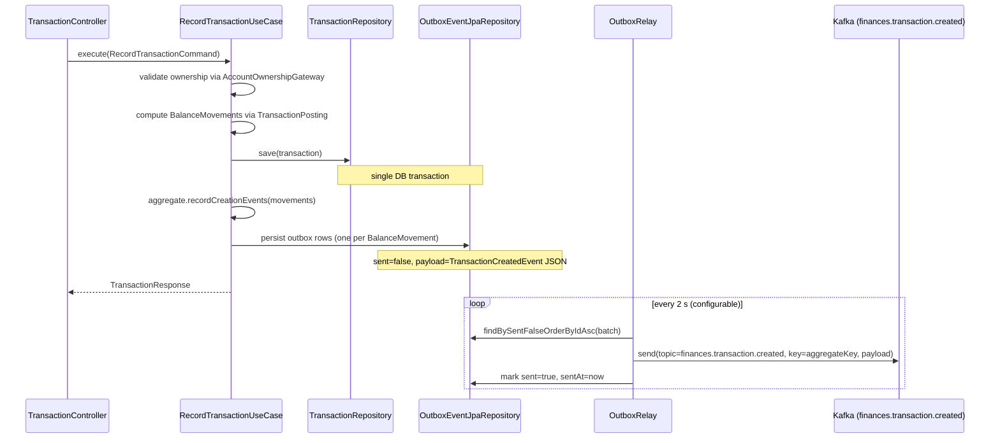
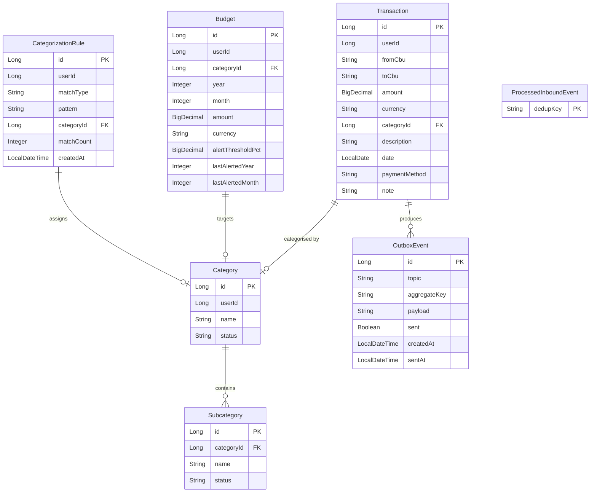

# ms-finances — Service Specification

**Port:** 8082 | **Postgres schema:** `finances` | **Swagger:** `http://localhost:8082/swagger-ui.html`

ms-finances records every money movement in the user's ledger. It owns four bounded concepts:
**Transactions** (account-to-account ledger entries), **Categories / Subcategories** (user-defined
classification trees), and the legacy **Loans** and **CardExpenses** (installment-payment tracking).
The DDD migration is complete for transactions and categories; loans/card-expenses still live in the
`old/` package and are served by legacy controllers.

---

## Architecture overview

```
Browser / Gateway
      │  X-User-Id header
      ▼
web/controller
  TransactionController          /api/v1/finances/transactions
  CategoryController             /api/v1/finances/categories
      │
      ▼
application/transaction/impl     RecordTransaction, UpdateTransaction, DeleteTransaction,
application/category/impl        ListUserTransactions, ListAccountTransactions,
                                 GetTransactionSummary + all Category use-case impls
      │
      ▼
domain/                          Transaction, Category/Subcategory aggregates
  model/                         TransactionKind (derived), ClassifiedTransaction
  service/                       TransactionClassifier, TransactionPosting
  gateway/                       AccountOwnershipGateway (port)
  repository/                    TransactionRepository, CategoryRepository (ports)
      │
      ▼
infrastructure/
  persistence/                   JPA entities + Flyway migrations
  messaging/                     OutboxDomainEventPublisher → outbox_event table
  scheduler/                     OutboxRelay (@Scheduled → Kafka)
  gateway/Impl/                  BankAccountOwnershipGateway (Feign → ms-banks)
```

---

## Account-to-account transaction model

Every transaction is a **money movement from one CBU to another**. `TransactionKind` (EXPENSE /
INCOME / TRANSFER) is **never stored** — it is derived at read time by checking which CBUs the user
owns via ms-banks.

```
expense  = owns(fromCbu) && !owns(toCbu)
income   = !owns(fromCbu) && owns(toCbu)
transfer = owns(fromCbu) && owns(toCbu)
```

`AccountOwnershipGateway` calls ms-banks `GET /api/v1/banks/accounts` (with a short-TTL cache).
**Zero ms-banks code or schema changes are required.**

### `Money` value object

`Money(BigDecimal amount, Currency currency)` — **always a positive magnitude** (amount > 0, scale
2 HALF_EVEN). Direction is never encoded in the amount; per-account sign is derived via
`Transaction.signedFor(Cbu)`.

### `Cbu` value object

`Cbu(String cbuNumber)` — exactly 22 digits validated at construction. `Cbu.EXTERNAL_INSTALLMENT_CBU`
(`"0000000000000000000000"`) is a sentinel for the external side of bank-originated installment
events (structurally impossible as a real CBU).

### Transaction aggregate fields

| Field | Type | Notes |
|---|---|---|
| `id` | `TransactionId` | null until persisted |
| `userId` | `UserId` | owner |
| `fromCbu` | `Cbu` | source account |
| `toCbu` | `Cbu` | destination account — must differ from `fromCbu` |
| `money` | `Money` | positive magnitude; same currency both sides (v1) |
| `categoryId` | `CategoryId` | optional user-assigned category |
| `description` | `String` | normalised; nullable |
| `date` | `LocalDate` | business date |

**Immutable aggregate** — `changeDetails()` returns a new instance. Only `categoryId`,
`description`, and `date` can be edited; CBUs and money are frozen after creation.

`categoryName` is resolved server-side in the application layer (`CategoryNameLookup`) and injected
into `UserTransactionView` before mapping to `TransactionResponse`. The controller never returns a
raw `categoryId` without its resolved name.

### Outbox pattern

Balance movements are written to an `outbox_event` table in the same DB transaction as the
`Transaction` row. `OutboxRelay` polls every 2 s (configurable via `finances.outbox.poll-ms`) and
publishes pending rows to Kafka. The outbox row id (unique per movement) is the idempotency key
on the wire — ms-banks dedups on it, enabling a transfer (two movements, one transaction row) to
produce two distinct Kafka messages without any risk of dedup collision.



---

## Category / Subcategory model

Categories are user-owned reference data. Each `Category` owns a list of `Subcategory` children —
the aggregate is the unit of save.

```
Category
  id:     CategoryId
  userId: UserId
  name:   CategoryName   (non-blank, trimmed, ≤ 100 chars; validated by VO)
  status: CategoryStatus (ACTIVE | ARCHIVED)
  subcategories: List<Subcategory>

Subcategory
  id:     CategoryId     (same id space — self-referential table)
  name:   CategoryName
  status: CategoryStatus
```

- `CategoryName` is a value object; validation lives in its canonical constructor.
- No global/system categories: every category belongs to a user (`userId` always set).
- Archive is a soft-delete (status → ARCHIVED). Restore flips it back to ACTIVE.
- `CategoryResponse` nests **active** subcategories so the frontend renders the full tree from a
  single list call.
- `CategoryRepositoryImpl.save()` uses a `reconcileChildren` strategy: existing subcategory rows
  are updated in-place; new subcategories (id == null) are inserted as new JPA entities.

---

## Ranged summary

`GET /api/v1/finances/transactions/summary` supports optional `from` / `to` (ISO date) query
params. When both are present the aggregate is restricted to `[from, to]` inclusive; when omitted
the response covers all time. Exactly one param present → 400.

Response: `Map<String, CurrencySummaryResponse>` keyed by ISO currency code. Money is serialised
as `String` (decimal, no `BigDecimal` on the wire).

```java
record CurrencySummaryResponse(
    String totalIncome,
    String totalExpense,
    String balance
)
```

The `DateRange` value object (`domain/common/model/`) enforces `from <= to` in its canonical
constructor and is the sole representation of a date window.

---

## Kafka events

### Published (finances → ms-banks)

| Event | Topic | Trigger | Payload summary |
|---|---|---|---|
| `TransactionCreated` | `finances.transaction.created` | New transaction recorded | `transactionId` (outbox row id), `accountCbu`, `amount` (signed), `currency` |
| `TransactionReversed` | `finances.transaction.created` | Transaction deleted | Same shape; negated `amount` — ms-banks credits/debits in reverse |

Both event types share the `TransactionCreatedEvent` wire record. `transactionId` is the outbox
row id (not the transaction PK) so transfers produce two distinct idempotency keys.

### Consumed (ms-banks → finances)

| Topic | Listener | Action |
|---|---|---|
| `payment-events` | `PaymentEventListener` | Records a ledger `Transaction` for bank-originated installment payments. Dedup via SHA-256 of event fields. No balance echo (ms-banks already moved the balance). External side uses `Cbu.EXTERNAL_INSTALLMENT_CBU`. |

---

## Entity-relationship diagram



---

## Endpoint table

### TransactionController — `/api/v1/finances/transactions`

| Method | Path | Request | Response |
|---|---|---|---|
| `POST` | `/` | `X-User-Id` header + `RecordTransactionRequest` body | `ApiResponse<TransactionResponse>` (201) |
| `PUT` | `/{id}` | `X-User-Id` + `UpdateTransactionRequest` body | `ApiResponse<TransactionResponse>` |
| `DELETE` | `/{id}` | `X-User-Id` | `ApiResponse<Void>` (204) |
| `GET` | `/` | `X-User-Id` header **or** `?accountCbu=` param | Dual-mode: with `accountCbu` → `ApiResponse<List<AccountTransactionResponse>>`; without → `ApiResponse<List<TransactionResponse>>` |
| `GET` | `/summary` | `X-User-Id` + optional `?from=&to=` (ISO date) | `ApiResponse<Map<String, CurrencySummaryResponse>>` |

**Dual-mode list:** when `accountCbu` is present the endpoint is called by ms-banks (internal,
no user context required) and returns per-account signed projections. Without it the gateway
routes user-facing requests and scoped to `X-User-Id`.

### CategoryController — `/api/v1/finances/categories`

| Method | Path | Request | Response |
|---|---|---|---|
| `GET` | `/` | `X-User-Id` | `ApiResponse<List<CategoryResponse>>` (with nested active subcategories) |
| `GET` | `/{id}` | `X-User-Id` | `ApiResponse<CategoryResponse>` |
| `POST` | `/` | `X-User-Id` + `CreateCategoryRequest` | `ApiResponse<CategoryResponse>` (201) |
| `PUT` | `/{id}` | `X-User-Id` + `UpdateCategoryRequest` | `ApiResponse<CategoryResponse>` |
| `DELETE` | `/{id}` | `X-User-Id` | `ApiResponse<Void>` — **soft-delete (archive)** |
| `POST` | `/{id}/restore` | `X-User-Id` | `ApiResponse<CategoryResponse>` |
| `GET` | `/{id}/subcategories` | `X-User-Id` | `ApiResponse<List<SubcategoryResponse>>` |
| `POST` | `/{id}/subcategories` | `X-User-Id` + `CreateSubcategoryRequest` | `ApiResponse<SubcategoryResponse>` (201) |
| `DELETE` | `/{id}/subcategories/{subId}` | `X-User-Id` | `ApiResponse<Void>` — **soft-delete** |
| `PUT` | `/{id}/subcategories/{subId}` | `X-User-Id` + `RenameSubcategoryRequest` | `ApiResponse<SubcategoryResponse>` |
| `POST` | `/{id}/subcategories/{subId}/restore` | `X-User-Id` | `ApiResponse<SubcategoryResponse>` |

---

## Folder tree

```
back/ms-finances/src/main/java/com/financialapp/finances/
│
├── FinancesApplication.java
│
├── web/                                   ← HTTP boundary
│   ├── controller/
│   │   ├── TransactionController.java
│   │   └── CategoryController.java
│   ├── dto/
│   │   ├── request/
│   │   │   ├── RecordTransactionRequest.java
│   │   │   ├── UpdateTransactionRequest.java
│   │   │   ├── CreateCategoryRequest.java
│   │   │   ├── CreateSubcategoryRequest.java
│   │   │   ├── UpdateCategoryRequest.java
│   │   │   └── RenameSubcategoryRequest.java
│   │   └── response/
│   │       ├── TransactionResponse.java
│   │       ├── AccountTransactionResponse.java
│   │       ├── CategoryResponse.java
│   │       ├── SubcategoryResponse.java
│   │       └── CurrencySummaryResponse.java
│   ├── mapper/
│   │   ├── TransactionWebMapper.java
│   │   └── CategoryWebMapper.java
│   └── error/
│       └── DomainExceptionHandler.java
│
├── application/                           ← Use-case implementations
│   ├── transaction/impl/
│   │   ├── RecordTransactionUseCaseImpl.java
│   │   ├── UpdateTransactionUseCaseImpl.java
│   │   ├── DeleteTransactionUseCaseImpl.java
│   │   ├── ListUserTransactionsUseCaseImpl.java
│   │   ├── ListAccountTransactionsUseCaseImpl.java
│   │   └── GetTransactionSummaryUseCaseImpl.java
│   └── category/impl/
│       ├── CreateCategoryUseCaseImpl.java
│       ├── CreateSubcategoryUseCaseImpl.java
│       ├── UpdateCategoryUseCaseImpl.java
│       ├── ArchiveCategoryUseCaseImpl.java
│       ├── ArchiveSubcategoryUseCaseImpl.java
│       ├── RestoreCategoryUseCaseImpl.java
│       ├── RestoreSubcategoryUseCaseImpl.java
│       ├── RenameSubcategoryUseCaseImpl.java
│       ├── GetCategoryUseCaseImpl.java
│       ├── ListCategoriesUseCaseImpl.java
│       └── ListSubcategoriesUseCaseImpl.java
│
├── domain/                                ← Pure domain; zero framework imports
│   ├── common/model/
│   │   ├── Money.java                     ← VO: positive magnitude + Currency
│   │   ├── Cbu.java                       ← VO: 22-digit Argentine CBU
│   │   ├── DateRange.java                 ← VO: [from, to] with from<=to invariant
│   │   ├── TransactionId.java
│   │   ├── CategoryId.java
│   │   ├── UserId.java
│   │   └── CategoryStatus.java
│   ├── model/
│   │   ├── transaction/
│   │   │   ├── Transaction.java           ← Aggregate root (fromCbu/toCbu/money)
│   │   │   ├── TransactionKind.java       ← EXPENSE | INCOME | TRANSFER (derived)
│   │   │   ├── ClassifiedTransaction.java ← (Transaction, TransactionKind)
│   │   │   ├── BalanceMovement.java       ← Signed adjustment per owned account
│   │   │   ├── TransactionSummary.java
│   │   │   └── UserTransactionView.java   ← Resolved categoryName carried through use-case
│   │   └── category/
│   │       ├── Category.java              ← Aggregate root; owns subcategories list
│   │       ├── Subcategory.java
│   │       └── CategoryName.java          ← VO: trimmed, non-blank, ≤ 100 chars
│   ├── event/
│   │   ├── DomainEvent.java
│   │   ├── TransactionCreated.java
│   │   └── TransactionReversed.java
│   ├── service/
│   │   ├── TransactionClassifier.java     ← Derives EXPENSE/INCOME/TRANSFER from owned set
│   │   ├── TransactionPosting.java        ← Computes BalanceMovements for outbox
│   │   └── TransactionCurrencyValidator.java
│   ├── gateway/
│   │   ├── AccountOwnershipGateway.java   ← Port: owned CBUs for a user
│   │   ├── DomainEventPublisher.java      ← Port: write domain events to outbox
│   │   └── SupportedCurrencies.java       ← Port: currency whitelist
│   ├── repository/
│   │   ├── TransactionRepository.java
│   │   └── CategoryRepository.java
│   ├── usecase/
│   │   ├── transaction/                   ← Interfaces + command records
│   │   └── category/                      ← Interfaces + command records
│   └── exception/
│       ├── DomainException.java
│       ├── DomainErrorCode.java
│       ├── ErrorCategory.java
│       ├── InvalidCbuException.java
│       ├── InvalidMoneyException.java
│       ├── CurrencyMismatchException.java
│       ├── UnsupportedCurrencyException.java
│       └── transaction/ + category/       ← Domain-specific exceptions
│
└── infrastructure/                        ← Spring + JPA + Kafka adapters
    ├── config/
    │   ├── InternalAuthFilter.java        ← Validates X-Internal-Token header
    │   ├── FeignConfig.java
    │   ├── MessagingConfig.java
    │   ├── SupportedCurrenciesImpl.java
    │   └── DomainServiceConfig.java
    ├── persistence/
    │   ├── entity/
    │   │   ├── TransactionJpaEntity.java
    │   │   ├── CategoryJpaEntity.java
    │   │   ├── OutboxEventJpaEntity.java
    │   │   └── ProcessedInboundEventJpaEntity.java
    │   ├── jpa/                           ← Spring Data JPA repositories
    │   ├── mapper/
    │   │   ├── TransactionPersistenceMapper.java
    │   │   └── CategoryPersistenceMapper.java
    │   └── repository/
    │       ├── TransactionRepositoryImpl.java
    │       ├── CategoryRepositoryImpl.java
    │       └── SystemCategoryResolver.java
    ├── messaging/
    │   ├── OutboxDomainEventPublisher.java ← Implements DomainEventPublisher port
    │   ├── mapper/TransactionEventMapper.java
    │   ├── payload/
    │   │   ├── TransactionCreatedEvent.java ← Wire record for ms-banks
    │   │   └── PaymentEvent.java            ← Inbound from ms-banks
    │   └── listener/
    │       └── PaymentEventListener.java    ← Consumes payment-events topic
    ├── gateway/
    │   └── Impl/BankAccountOwnershipGateway.java ← Feign → ms-banks /accounts
    └── scheduler/
        └── OutboxRelay.java               ← Polls outbox; publishes to Kafka
```

---

## Key design rules

- `@Transactional` lives in application use-case impls, never in controllers.
- The domain layer has zero framework imports (enforced by `LayeredArchitectureTest` with ArchUnit).
- `MigrationSeamTest` tracks old→new migration progress.
- All endpoints return the shared envelope `{ status, title, code, message, data }` from `commons-core` — `code` only on errors, carrying the service `DomainError` slug.
- Exceptions: `DomainExceptionHandler` (`@RestControllerAdvice`) maps `DomainException` subtypes
  to structured HTTP error responses.

---

## CI/CD

Thin caller workflows (`.github/workflows/`) delegate to the shared workflows in the root repo:
`ci.yml` (PRs + develop/master pushes → `mvn verify` + Docker build; required check `ci / build`),
`docker-publish.yml` (master push / `v*` tag → GHCR `latest` + `sha-*` + semver),
`release.yml` (bump dropdown → semver release). Tests must pass without local infra — CI runs on a
bare runner; integration tests use H2 and `EmbeddedKafka` where needed.
See [../workflow.md](../workflow.md) § CI/CD.

---

[Master](../00-master.md) | [Architecture](../architecture.md) | [Rules](../rules.md) | [Workflow](../workflow.md)
