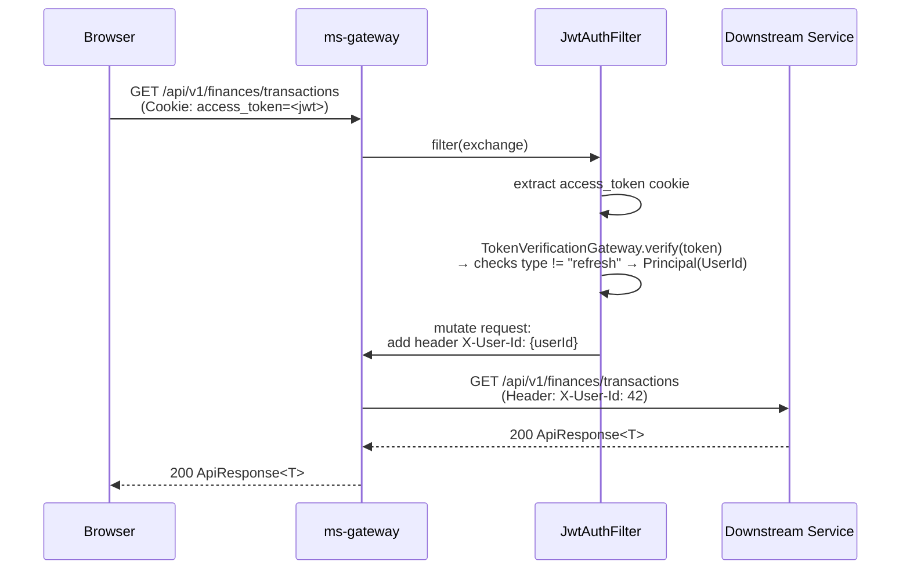

# ms-gateway — API Gateway Service Spec

**Port:** 8080  
**Framework:** Spring Cloud Gateway (WebFlux / Reactor)  
**Role:** Single entry point for all `/api/v1/**` and `/v3/api-docs/**` traffic.

---

## Summary

ms-gateway is the edge service that every browser and external client talks to. It enforces authentication, rate-limits, CORS, and error-response shape before any byte reaches a downstream microservice. It also hosts BFF endpoints (`/api/v1/dashboard/data`, `/api/v1/bff/currencies`) so the frontend can load aggregated data in single round-trips.

---

## Responsibilities

| # | Concern | Component |
|---|---------|-----------|
| 1 | **JWT authentication** — reads `access_token` HttpOnly cookie, validates the token and enforces `type != "refresh"` (missing `type` allowed during rollover; `type == "refresh"` rejected), injects `X-User-Id` header for all downstream requests; `/api/v1/auth/**` and Swagger paths are public | `JwtAuthFilter` (order -2), `JwtTokenVerificationGateway` |
| 2 | **Rate limiting** — per-IP token bucket; default 600 req/min, tunable via `RATE_LIMIT_RPM`; idle buckets evicted sweep-based every 60s; OPTIONS requests bypass | `RateLimitFilter` (order -1) |
| 3 | **Request/response logging** — logs method + path on entry, status + elapsed ms on exit | `LoggingFilter` (order 0) |
| 4 | **BFF endpoints** — fan-out to downstream services (`/api/v1/dashboard/data`, `/api/v1/bff/currencies`) under `Section.guard` partial degradation with `ObservedAt` freshness stamping | `DashboardController`, `CurrenciesController` |
| 5 | **Currency conversion & selector** — 3-case `MoneyConversion` domain service; dynamic currency selector (`AvailableCurrencies`) | `MoneyConversion`, `AvailableCurrencies` |
| 6 | **Resilience & caching** — per-call timeout (3s default) + per-page budget (5s default); 30s single-flight TTL cache on FX rates | `TimeoutPolicy`, `PageTimeoutBudget`, `TtlCache` |
| 7 | **SSE passthrough** — route `/api/v1/notifications/stream` proxied with `response-timeout: -1` to keep the long-lived connection open | `application.yml` route `notifications-sse` |
| 8 | **Swagger proxy** — rewrites `/v3/api-docs/{service}` to each service's own `/v3/api-docs`; aggregated Swagger UI at `/swagger-ui.html` | `application.yml` api-docs routes |
| 9 | **CORS** — `CorsWebFilter` at `HIGHEST_PRECEDENCE`; origins from `ALLOWED_ORIGINS` env var | `CorsConfig` |
| 10 | **Error normalization** — unhandled exceptions serialised into `ApiResponse.failure(status, code, message, null)` | `GatewayErrorWebExceptionHandler`, `ErrorResponseRenderer` |

---

## Filter Execution Order

```
CorsWebFilter (HIGHEST_PRECEDENCE)
  └─ JwtAuthFilter          @Order(-2)   ← authenticates; checks type != "refresh"; injects X-User-Id
       └─ RateLimitFilter   @Order(-1)   ← token-bucket per IP (evicts idle buckets)
            └─ LoggingFilter @Order(0)   ← timer + structured log
                 └─ Spring Cloud Gateway routing
```

---

## Authenticated Request — Sequence Diagram



---

## Currency Domain & 3-Case Conversion Model

Money conversion is decoupled into three distinct concerns:
1. **Dynamic Currency Selector**: `AvailableCurrencies` resolves available currencies from bank accounts, investment holdings, and user preferences (always includes ARS).
2. **FX Quotes**: Gateway-side read model `FxRate` (informational, ms-investments rates). Shared FX reads are cached for 30s via `TtlCache`.
3. **Blended Totals (`MoneyConversion`)**:
   - **Passthrough**: `money.currency == target` → `DisplayMoney(amount, target)`. No rate consulted.
   - **Automatic ARS↔USD**: `{ARS, USD}` pair → use `arsUsdRate` (ARS→USD: `amount / rate.sell()`; USD→ARS: `amount × rate.buy()`, scale 2, HALF_EVEN). Missing rate → **unconvertible** (`DisplayMoney(originalAmount, originalCurrency)`).
   - **Any other pair**: route through ARS using `manualRate.ratePerArs` (e.g. EUR→ARS, or composed EUR→USD). Missing rate → **unconvertible**.

*Unconvertible convention*: Returns `DisplayMoney(originalAmount, originalCurrency)` — caller detects `result.currency() != target` and displays native subtotal. Never silently zeroed or converted at a guessed rate.

---

## Endpoint / Route Table

| Method | Path | Handled by | Purpose |
|--------|------|-----------|---------|
| `GET` | `/api/v1/dashboard/data` | `DashboardController` (local) | BFF — aggregated dashboard (finances + banks) with section `observedAt` |
| `GET` | `/api/v1/bff/currencies` | `CurrenciesController` (local) | BFF — available currencies & default currency selector options |
| `*` | `/api/v1/auth/**` | proxy → ms-users :8081 | Login, register, token refresh, logout — **JWT-exempt** |
| `*` | `/api/v1/users/**` | proxy → ms-users :8081 | User profile management |
| `*` | `/api/v1/finances/**` | proxy → ms-finances :8082 | Transactions, categories, loans, card expenses |
| `*` | `/api/v1/banks/**` | proxy → ms-banks :8083 | Bank accounts, loans, upcoming payments |
| `GET` | `/api/v1/notifications/stream` | proxy → ms-notifications :8084 | SSE stream — `response-timeout: -1` |
| `*` | `/api/v1/notifications/**` | proxy → ms-notifications :8084 | Notification read/management |
| `*` | `/api/v1/upload/**` | proxy → ms-upload :8085 | Statement upload / parse / preview |
| `*` | `/api/v1/investments/**` | proxy → ms-investments :8086 | Holdings, prices, portfolio |
| `GET` | `/v3/api-docs/{service}` | proxy → each service | Per-service OpenAPI JSON (rewrite filter) |
| `GET` | `/swagger-ui.html` | local (SpringDoc) | Aggregated Swagger UI — **JWT-exempt** |
| `GET` | `/actuator/**` | local (Spring Actuator) | Health, info, Prometheus metrics — **JWT-exempt** |

---

## Resilience & Timeout Policy

- `TimeoutPolicy` (`record TimeoutPolicy(Duration perCall)`) populated from `GATEWAY_TIMEOUT_PER_CALL_MS` (default 3 000 ms).
- `PageTimeoutBudget` (`record PageTimeoutBudget(Duration total)`) populated from `GATEWAY_TIMEOUT_PAGE_BUDGET_MS` (default 5 000 ms).
- `Section<T>(T data, SectionStatus status, ObservedAt observedAt)` wraps each section with an `ObservedAt` timestamp (stamped on both `OK` and `UNAVAILABLE` outcomes). `SectionStatus` remains two-valued (`OK | UNAVAILABLE`); "stale" is derived from `observedAt`.
- `TtlCache`: 30s single-flight cache on shared FX reads (`CACHE_FX_TTL_SECONDS`).

---

## Environment Variables

| Variable | Default | Purpose |
|----------|---------|---------|
| `JWT_ENABLED` | `true` | Disable JWT validation in test environments |
| `JWT_SECRET` | *(dev placeholder)* | HMAC-SHA signing key (Base64) |
| `RATE_LIMIT_RPM` | `600` | Token bucket capacity per IP per minute |
| `GATEWAY_TIMEOUT_PER_CALL_MS` | `3000` | Per-call timeout for BFF WebClient calls |
| `GATEWAY_TIMEOUT_PAGE_BUDGET_MS` | `5000` | Per-page outer timeout budget for page BFFs |
| `CACHE_FX_TTL_SECONDS` | `30` | Shared TTL cache duration for FX rate reads |
| `ALLOWED_ORIGINS` | `http://localhost:3000,http://localhost:8080` | CORS allowed origins |
| `INTERNAL_AUTH_TOKEN` | — | Added as `X-Internal-Token` header on every proxied request |
| `USERS_SERVICE_URL` | `http://localhost:8081` | ms-users upstream |
| `FINANCES_SERVICE_URL` | `http://localhost:8082` | ms-finances upstream |
| `BANKS_SERVICE_URL` | `http://localhost:8083` | ms-banks upstream |
| `NOTIFICATIONS_SERVICE_URL` | `http://localhost:8084` | ms-notifications upstream |
| `UPLOAD_SERVICE_URL` | `http://localhost:8085` | ms-upload upstream |
| `INVESTMENTS_SERVICE_URL` | `http://localhost:8086` | ms-investments upstream |

---

[Master](../00-master.md) · [Architecture](../architecture.md) · [Rules](../rules.md) · [Workflow](../workflow.md)
