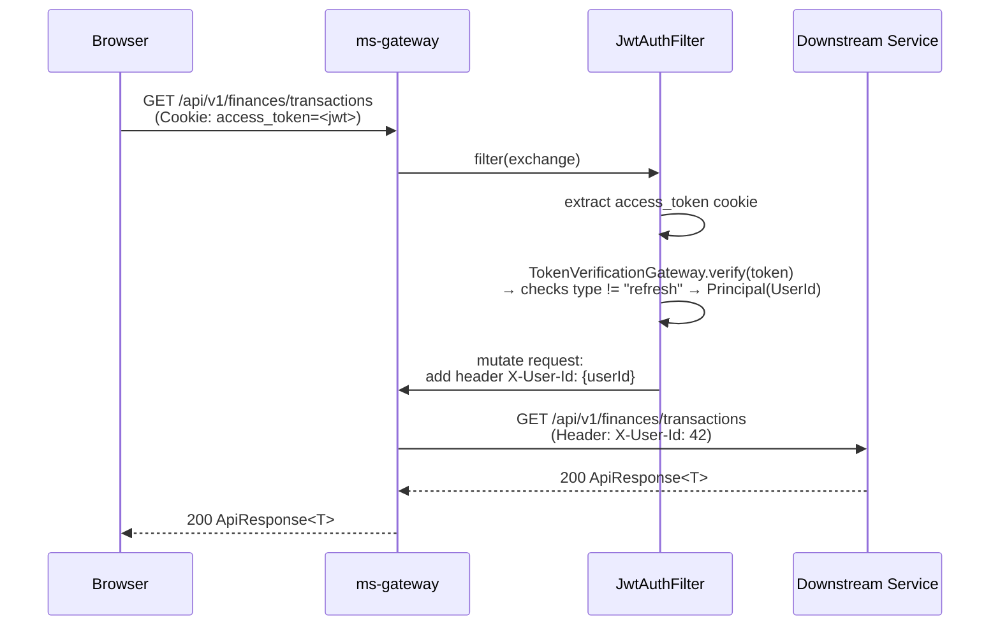

# ms-gateway — API Gateway Service Spec

> Human-facing. Facts an implementer needs live in `back/ms-gateway/.ai/` — this page holds the
> reasoning behind them and does not restate them. If the two disagree, the repo file wins.

ms-gateway is the edge service that every browser and external client talks to. It enforces authentication, rate-limits, CORS, and error-response shape before any byte reaches a downstream microservice. It also hosts BFF endpoints (`/api/v1/dashboard/data`, `/api/v1/bff/currencies`) so the frontend can load aggregated data in single round-trips.

---

## Filter Execution Order

```
CorsWebFilter (HIGHEST_PRECEDENCE)
  └─ JwtAuthFilter          @Order(-2)   ← authenticates; checks type != "refresh"; injects X-User-Id
       └─ RateLimitFilter   @Order(-1)   ← token-bucket per IP (evicts idle buckets)
            └─ LoggingFilter @Order(0)   ← timer + structured log
                 └─ Spring Cloud Gateway routing
```

---

## Authenticated Request — Sequence Diagram



---

## Currency Domain & 3-Case Conversion Model

Money conversion is decoupled into three distinct concerns:
1. **Dynamic Currency Selector**: `AvailableCurrencies` resolves available currencies from bank accounts, investment holdings, and user preferences (always includes ARS).
2. **FX Quotes**: Gateway-side read model `FxRate` (informational, ms-investments rates). Shared FX reads are cached for 30s via `TtlCache`.
3. **Blended Totals (`MoneyConversion`)**:
   - **Passthrough**: `money.currency == target` → `DisplayMoney(amount, target)`. No rate consulted.
   - **Automatic ARS↔USD**: `{ARS, USD}` pair → use `arsUsdRate` (ARS→USD: `amount / sellRate`; USD→ARS: `amount × buyRate`, scale 2, HALF_EVEN). Missing rate → **unconvertible** (`DisplayMoney(originalAmount, originalCurrency)`).
   - **Any other pair**: route through ARS using `manualRate.ratePerArs` (e.g. EUR→ARS, or composed EUR→USD). Missing rate → **unconvertible**.

*Unconvertible convention*: Returns `DisplayMoney(originalAmount, originalCurrency)` — caller detects `result.currency() != target` and displays native subtotal. Never silently zeroed or converted at a guessed rate.
