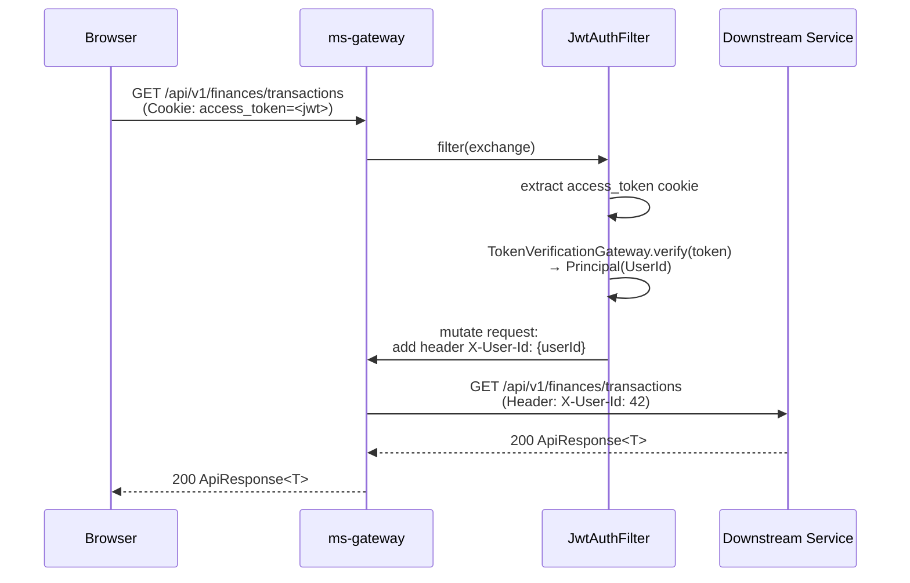
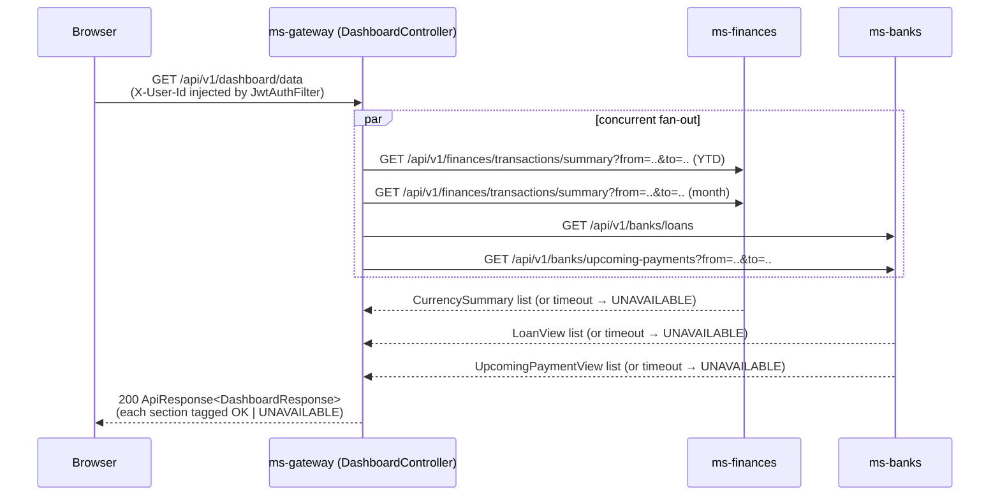

# ms-gateway — API Gateway Service Spec

**Port:** 8080  
**Framework:** Spring Cloud Gateway (WebFlux / Reactor)  
**Role:** Single entry point for all `/api/v1/**` and `/v3/api-docs/**` traffic.

---

## Summary

ms-gateway is the edge service that every browser and external client talks to. It enforces authentication, rate-limits, CORS, and error-response shape before any byte reaches a downstream microservice. It also hosts a BFF aggregation endpoint (`/api/v1/dashboard/data`) so the frontend can load the main dashboard in a single round-trip.

---

## Responsibilities

| # | Concern | Component |
|---|---------|-----------|
| 1 | **JWT authentication** — reads `access_token` HttpOnly cookie, validates the token, injects `X-User-Id` header for all downstream requests; `/api/v1/auth/**` and Swagger paths are public | `JwtAuthFilter` (order -2) |
| 2 | **Rate limiting** — per-IP token bucket; default 600 req/min, tunable via `RATE_LIMIT_RPM`; OPTIONS requests bypass | `RateLimitFilter` (order -1) |
| 3 | **Request/response logging** — logs method + path on entry, status + elapsed ms on exit | `LoggingFilter` (order 0) |
| 4 | **Dashboard BFF** — fan-out to ms-finances (summary) and ms-banks (loans + upcoming payments) concurrently; partial degradation via `Section.guard` (returns `UNAVAILABLE` fallback instead of 500 when a downstream call fails) | `DashboardController` + `GetDashboardDataImpl` |
| 5 | **SSE passthrough** — route `/api/v1/notifications/stream` proxied with `response-timeout: -1` to keep the long-lived connection open | `application.yml` route `notifications-sse` |
| 6 | **Swagger proxy** — rewrites `/v3/api-docs/{service}` to each service's own `/v3/api-docs`; the aggregated Swagger UI at `/swagger-ui.html` lists all six services | `application.yml` api-docs routes |
| 7 | **CORS** — `CorsWebFilter` at `HIGHEST_PRECEDENCE`; origins from `ALLOWED_ORIGINS` env var; `credentials: true`; CORS headers also injected on error responses by `ErrorResponseRenderer` | `CorsConfig` |
| 8 | **Timeout policy** — all outbound WebClient calls (BFF fan-out) honour a `TimeoutPolicy` VO; default 3 000 ms, tunable via `GATEWAY_TIMEOUT_PER_CALL_MS` | `TimeoutPolicy`, `ResilienceConfig` |
| 9 | **Error normalization** — any unhandled exception is serialised into the shared envelope `ApiResponse.failure(status, code, message, null)` (commons-core); gateway codes: `unauthorized` (401), `rate_limit_exceeded` (429), `upstream_unavailable` (502/503/504), `internal_error` (500). Downstream error bodies pass through with their own `code` preserved | `GatewayErrorWebExceptionHandler`, `ErrorResponseRenderer`, `GlobalExceptionHandler` |

---

## Filter Execution Order

```
CorsWebFilter (HIGHEST_PRECEDENCE)
  └─ JwtAuthFilter          @Order(-2)   ← authenticates; injects X-User-Id
       └─ RateLimitFilter   @Order(-1)   ← token-bucket per IP
            └─ LoggingFilter @Order(0)   ← timer + structured log
                 └─ Spring Cloud Gateway routing
```

---

## Authenticated Request — Sequence Diagram



---

## Dashboard BFF Fan-out — Sequence Diagram



---

## Endpoint / Route Table

| Method | Path | Handled by | Purpose |
|--------|------|-----------|---------|
| `GET` | `/api/v1/dashboard/data` | `DashboardController` (local) | BFF — aggregated dashboard (finances + banks) |
| `*` | `/api/v1/auth/**` | proxy → ms-users :8081 | Login, register, token refresh, logout — **JWT-exempt** |
| `*` | `/api/v1/users/**` | proxy → ms-users :8081 | User profile management |
| `*` | `/api/v1/finances/**` | proxy → ms-finances :8082 | Transactions, categories, loans, card expenses |
| `*` | `/api/v1/banks/**` | proxy → ms-banks :8083 | Bank accounts, loans, upcoming payments |
| `GET` | `/api/v1/notifications/stream` | proxy → ms-notifications :8084 | SSE stream — `response-timeout: -1` |
| `*` | `/api/v1/notifications/**` | proxy → ms-notifications :8084 | Notification read/management |
| `*` | `/api/v1/upload/**` | proxy → ms-upload :8085 | Statement upload / parse / preview |
| `*` | `/api/v1/investments/**` | proxy → ms-investments :8086 | Holdings, prices, portfolio |
| `GET` | `/v3/api-docs/{service}` | proxy → each service | Per-service OpenAPI JSON (rewrite filter) |
| `GET` | `/swagger-ui.html` | local (SpringDoc) | Aggregated Swagger UI — **JWT-exempt** |
| `GET` | `/actuator/**` | local (Spring Actuator) | Health, info, Prometheus metrics — **JWT-exempt** |

> All proxied routes receive `X-Internal-Token` header (set via `AddRequestHeader` default filter) plus `X-User-Id` injected by `JwtAuthFilter`.

---

## Resilience & Timeout Policy

`TimeoutPolicy` is a domain VO (`record TimeoutPolicy(Duration perCall)`) populated from env var `GATEWAY_TIMEOUT_PER_CALL_MS` (default 3 000 ms). Every `WebClient` call in `FinancesGatewayImpl` and `BanksGatewayImpl` attaches `.timeout(timeoutPolicy.perCall())`.

`Section.guard` wraps each fan-out future so a timeout or downstream error produces `Section(fallback, UNAVAILABLE)` instead of propagating an exception. The composed `DashboardData` always returns 200; the frontend inspects each section's `status` field to decide whether to show a stale/empty state.

```
Section.guard(call, fallback)
  call succeeds  → Section(data,     SectionStatus.OK)
  call fails     → Section(fallback, SectionStatus.UNAVAILABLE)
```

---

## Package Tree

```
back/ms-gateway/src/main/java/com/financialapp/gateway/
├── GatewayApplication.java
│
├── domain/
│   ├── common/model/
│   │   ├── AccessToken.java          # VO wrapping raw JWT string
│   │   ├── Principal.java            # authenticated identity (UserId)
│   │   ├── TimeoutPolicy.java        # VO — perCall Duration
│   │   └── UserId.java               # typed user identifier
│   ├── exception/
│   │   ├── DomainErrorCode.java
│   │   └── InvalidAccessTokenException.java
│   ├── gateway/
│   │   ├── BanksGateway.java         # port — loans + upcoming payments
│   │   ├── FinancesGateway.java      # port — transaction summaries
│   │   └── TokenVerificationGateway.java  # port — JWT verification
│   ├── model/
│   │   ├── admission/
│   │   │   ├── RateLimitPolicy.java
│   │   │   └── TokenBucket.java
│   │   ├── composition/
│   │   │   ├── Section.java          # partial-degradation wrapper
│   │   │   └── SectionStatus.java    # OK | UNAVAILABLE
│   │   └── dashboard/
│   │       ├── CurrencySummary.java
│   │       ├── DashboardData.java
│   │       ├── LoanView.java
│   │       └── UpcomingPaymentView.java
│   └── usecase/dashboard/
│       └── GetDashboardData.java     # use-case port
│
├── application/
│   └── dashboard/impl/
│       └── GetDashboardDataImpl.java # concurrent fan-out, Section.guard
│
├── infrastructure/
│   ├── config/
│   │   ├── CorsConfig.java           # CorsWebFilter, ALLOWED_ORIGINS
│   │   ├── JwtProperties.java        # jwt.enabled, jwt.secret
│   │   ├── ResilienceConfig.java     # TimeoutPolicy bean
│   │   ├── ServicesProperties.java   # downstream service URLs
│   │   └── TimeoutProperties.java    # gateway.timeout.per-call-ms
│   └── gateway/
│       ├── client/
│       │   └── WebClientConfig.java
│       ├── dto/
│       │   ├── FinanceCurrencyTotals.java
│       │   ├── GatewayApiResponse.java
│       │   ├── LoanResponse.java
│       │   └── UpcomingPaymentResponse.java
│       └── Impl/
│           ├── BanksGatewayImpl.java
│           ├── FinancesGatewayImpl.java
│           └── JwtTokenVerificationGateway.java
│
└── web/
    ├── controller/
    │   └── DashboardController.java  # GET /api/v1/dashboard/data
    ├── dto/response/
    │   ├── (envelope from commons-core)
    │   └── DashboardResponse.java
    ├── error/
    │   ├── ErrorResponseRenderer.java       # serialises ApiResponse.failure(status, code, ...)
    │   ├── GatewayErrorWebExceptionHandler.java  # catches routing/connect errors
    │   └── GlobalExceptionHandler.java
    ├── filter/
    │   ├── JwtAuthFilter.java        # order -2
    │   ├── LoggingFilter.java        # order  0
    │   └── RateLimitFilter.java      # order -1
    └── mapper/
        └── DashboardMapper.java
```

---

## Environment Variables

| Variable | Default | Purpose |
|----------|---------|---------|
| `JWT_ENABLED` | `true` | Disable JWT validation in test environments |
| `JWT_SECRET` | *(dev placeholder)* | HMAC-SHA signing key (Base64) |
| `RATE_LIMIT_RPM` | `600` | Token bucket capacity per IP per minute |
| `GATEWAY_TIMEOUT_PER_CALL_MS` | `3000` | Per-call timeout for BFF WebClient calls |
| `ALLOWED_ORIGINS` | `http://localhost:3000,http://localhost:8080` | CORS allowed origins |
| `INTERNAL_AUTH_TOKEN` | — | Added as `X-Internal-Token` header on every proxied request |
| `USERS_SERVICE_URL` | `http://localhost:8081` | ms-users upstream |
| `FINANCES_SERVICE_URL` | `http://localhost:8082` | ms-finances upstream |
| `BANKS_SERVICE_URL` | `http://localhost:8083` | ms-banks upstream |
| `NOTIFICATIONS_SERVICE_URL` | `http://localhost:8084` | ms-notifications upstream |
| `UPLOAD_SERVICE_URL` | `http://localhost:8085` | ms-upload upstream |
| `INVESTMENTS_SERVICE_URL` | `http://localhost:8086` | ms-investments upstream |

---

[Master](../00-master.md) · [Architecture](../architecture.md) · [Rules](../rules.md) · [Workflow](../workflow.md)
