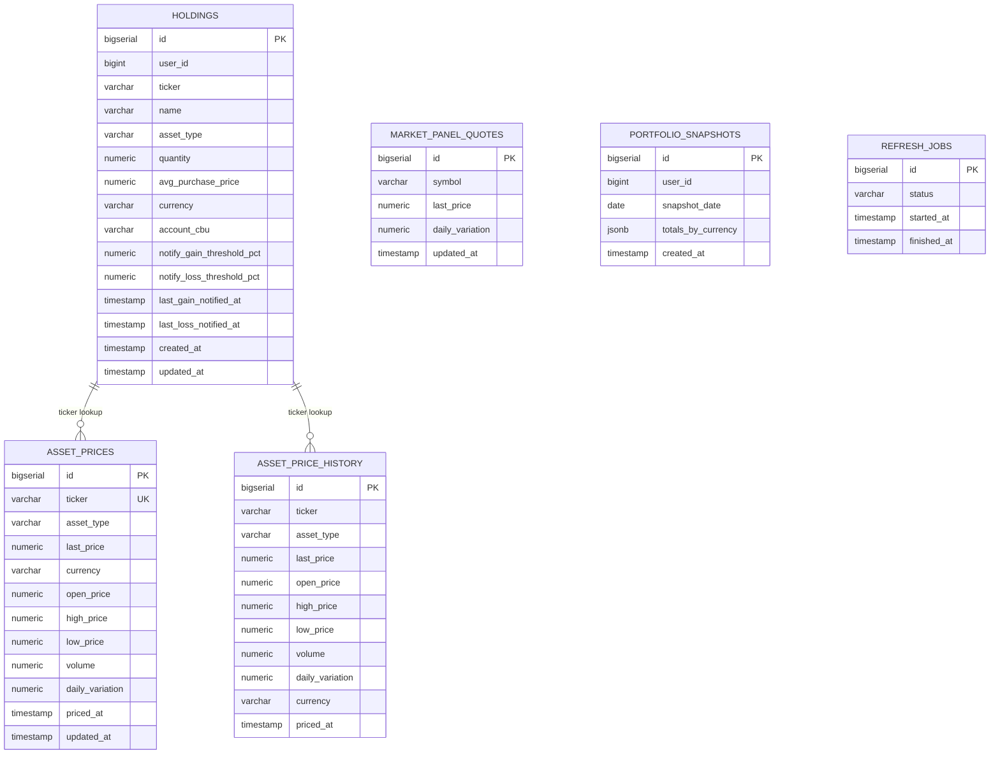
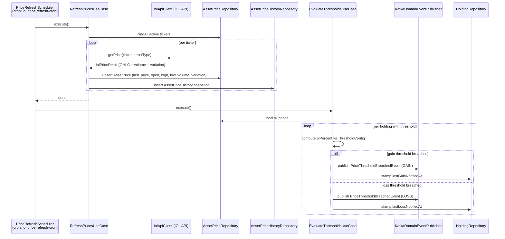
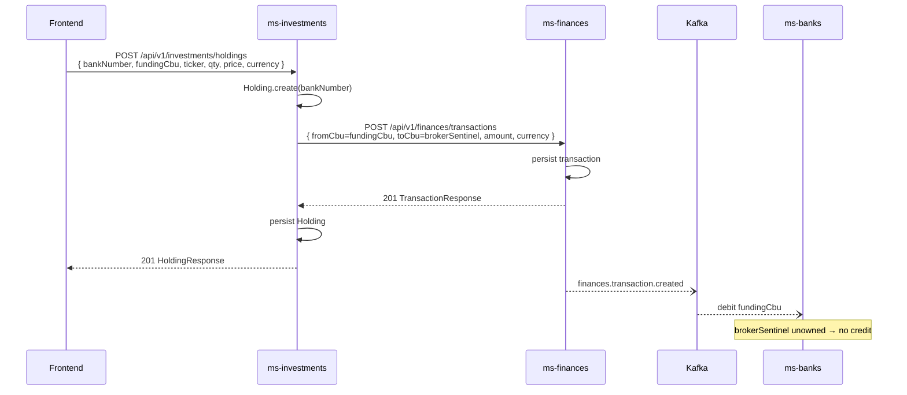

# ms-investments — Investments Service Spec

**Port:** 8086
**Framework:** Spring Boot 3.4.2 (MVC)
**Database schema:** `investments`
**Role:** Holdings CRUD, live IOL price feed, portfolio P&L, notification thresholds, and buy/sell cash-flow integration via ms-finances.

---

## Summary

ms-investments tracks a user's investment portfolio. It stores holdings (what you own and at what cost), fetches live market prices from Invertir Online (IOL), computes unrealised P&L and allocation breakdowns, and checks notification thresholds after each price refresh. Buy/sell operations record a CBU-to-CBU transaction in ms-finances so that the funding account balance is updated correctly. A holding is keyed by `BankNumber`; there is no INVESTMENT account in ms-banks — the "investment account" is a derived read-model (Σ price×qty by bank+currency).

---

## Domain Model

### Aggregates and Value Objects

| Class | Type | Key fields |
|---|---|---|
| `Holding` | Aggregate (record) | `HoldingId`, `UserId`, `BankNumber`, `Ticker`, `name`, `AssetType`, `HoldingQuantity`, `Money avgPurchasePrice`, `ThresholdConfig`, `NotificationTimestamps` |
| `AssetPrice` | Entity (record) | `AssetPriceId`, `Ticker`, `AssetType`, `lastPrice`, `currency`, `openPrice`, `highPrice`, `lowPrice`, `volume`, `dailyVariation`, `pricedAt`, `updatedAt` |
| `AssetPriceHistory` | Entity (record) | `AssetPriceHistoryId`, `Ticker`, `AssetType`, `lastPrice`, `openPrice`, `highPrice`, `lowPrice`, `volume`, `dailyVariation`, `currency`, `pricedAt` |
| `MarketQuote` | Read model | `ticker`, `lastPrice`, `dailyVariation` — used for market discovery panel |
| `PortfolioSnapshot` | Entity | Daily EOD snapshot of per-currency totals for evolution chart |
| `FxRate` | Aggregate (record) | `FxRateId`, `date`, `FxView` (`MEP`/`CCL`/`OFICIAL`), `buy`, `sell`, `FxRateSource` (`IOL_SYNTHETIC`/`IOL_DIRECT`/`MANUAL`) |
| `MarketIndex` | Aggregate (record) | `code`, `value`, `variation`, `updatedAt` (points/bps value; variation is % for MERVAL/SP500, absolute point delta for RIESGO_PAIS) |
| `BrokerFeeSchedule` | Aggregate (record) | `BrokerFeeScheduleId`, `BankNumber`, `AssetType` (nullable), `buyFeePct`, `sellFeePct`, `minimumFee`, `marketFeePct`, `IvaTreatment` |
| `RefreshJob` | Entity | Tracks in-flight / completed price refresh jobs |
| `ThresholdConfig` | VO | `gainPct`, `lossPct` (both nullable NUMERIC(5,2); must be >= 0) |
| `NotificationTimestamps` | VO | `lastGainNotifiedAt`, `lastLossNotifiedAt` (both nullable) |
| `Ticker` | VO | String symbol, e.g. `GGAL`, `AAPL` |
| `HoldingQuantity` | VO | Positive `BigDecimal` quantity |
| `Money` | VO | `amount` + `java.util.Currency` |
| `BankNumber` | VO | 3-digit BCRA bank code — the bank a holding belongs to; holdings are grouped by `(bankNumber, currency)` into the derived investment read-model |
| `UserId` | VO | `Long` |

### AssetType enum

```
STOCK  BOND  CEDEAR  FCI
```

IOL market mapping: `FCI` → `fci`; everything else → `bCBA`.

---

## ER Diagram



---

## Price Feed — IOL Integration

`IolApiClient` authenticates with IOL using OAuth2 password-grant (`/token`). The token is cached in-memory and refreshed 60 seconds before expiry. All calls are protected by Resilience4j `@Retry` + `@CircuitBreaker` (name `iolApi`). On a 401 the client re-authenticates and retries once.

| IOL endpoint used | Purpose |
|---|---|
| `POST /token` | Password-grant auth |
| `GET /api/v2/{market}/Titulos/{ticker}/CotizacionDetalle` | Live OHLC + volume + daily variation for a single ticker |
| `GET /api/v2/{market}/Titulos/{ticker}/Cotizacion/seriehistorica/{from}/{to}/sinAjustar` | Historical series for a ticker (used to backfill price history) |
| `GET /api/v2/Cotizaciones/Acciones/{market}/Argentina` | Panel quotes for market discovery |

Fields extracted: `ultimoPrecio`, `apertura`, `maximo`, `minimo`, `volumen`/`volumenNominal`, `variacion`, `fechaHora`.

`IolGatewayImpl.getHistoricalSeries` filters out any returned point whose `lastPrice` is null or ≤ 0 before persisting history. This removes no-trade sessions and pre-open candles (which IOL returns with a zero price), preventing the trailing drop-to-zero spike on price charts.

---

## Scheduled Price Refresh — Sequence Diagram



`@CacheEvict(value = "portfolio", allEntries = true)` runs before the scheduled method so stale portfolio data is flushed.

---

## Additional Schedulers

| Scheduler | Trigger | Use case |
|---|---|---|
| `PriceRefreshScheduler` | `iol.price-refresh-cron` (weekdays 10–17 ARS) | Refresh live prices + evaluate thresholds |
| `MarketDiscoveryScheduler` | Fixed rate `iol.discovery-refresh-rate` (default 15 min) | Sync panel quotes for market discovery |
| `PortfolioSnapshotScheduler` | `0 0 0 * * *` (daily midnight) | Capture per-user portfolio snapshots for evolution chart |

---

## Portfolio Service

`GetPortfolioSummaryUseCase` joins every holding's `Holding` with its current `AssetPrice` to produce:

- **Cost basis** — `quantity × avgPurchasePrice` per currency
- **Current value** — `quantity × lastPrice` per currency
- **Unrealised P&L** — `currentValue − costBasis` per currency
- **P&L %** — `(currentValue − costBasis) / costBasis × 100`
- **Allocation breakdown** — percentage of total value per ticker and per `AssetType`

`GetPortfolioEvolutionUseCase` reads `PortfolioSnapshot` rows for a given user and number of days, returning one `PortfolioEvolutionPoint` (ARS + USD totals) per day for the Recharts evolution chart.

---

## Notification Thresholds

Each `Holding` carries a `ThresholdConfig` (`gainPct`, `lossPct`). After every scheduled price refresh, `EvaluateThresholdsUseCase` computes the current P&L % for every holding that has at least one threshold set (partial index `idx_holdings_notify` makes this efficient).

When a threshold is breached:
1. `KafkaDomainEventPublisher` maps `PriceThresholdBreachedEvent` to an `OutboxRecord` on topic **`investments.threshold.breached`** (`data` = `InvestmentThresholdData`) and writes it to the `outbox_event` table in the same DB transaction; the commons `OutboxRelay` publishes it as a CloudEvent (1.0, binary mode) consumed by ms-notifications. ms-investments is **producer-only** (no consumers).
2. The corresponding `NotificationTimestamps` field (`lastGainNotifiedAt` / `lastLossNotifiedAt`) is stamped on the `Holding` to prevent re-notification.
3. The frontend `HoldingDetailDialog` reads these timestamps and the current `plPercent` client-side to show breach status.

---

## Bank-Contract Integration (Buy / Sell Cash Flow)

There is no INVESTMENT account in ms-banks — it was removed. A holding belongs to a `BankNumber`, and the "investment account" is a derived read-model. Cash for buys and sells flows exclusively through ms-finances as CBU-to-CBU transactions.

**Buy flow:**

```
fundingCbu (owned) → brokerSentinelCbu(currency) [unowned]
ms-finances persists tx → emits finances.transaction.created (CloudEvent)
ms-banks debits fundingCbu (sentinel unowned → no credit)
```

**Sell flow:**

```
brokerSentinelCbu(currency) [unowned] → destinationCbu (owned)
ms-finances persists tx → emits finances.transaction.created (CloudEvent)
ms-banks credits destinationCbu (sentinel unowned → no debit)
```

`FinancesGatewayImpl` resolves the broker sentinel CBU from `InvestmentsIntegrationProperties` by currency code (env vars `INVEST_BROKER_CBU_ARS`, `INVEST_BROKER_CBU_USD`, etc.). The transaction is recorded before the holding is persisted; a `FinancesServiceException` aborts the entire operation.



---

## Flyway Migrations

| Version | Description |
|---|---|
| V1 | Init: `holdings`, `asset_prices` tables + basic indexes |
| V2 | Threshold fields: `notify_gain_threshold_pct`, `notify_loss_threshold_pct`, `last_gain_notified_at`, `last_loss_notified_at` on `holdings` |
| V3 | Performance indexes: composite `(user_id, ticker)`, partial `WHERE notify_*_threshold_pct IS NOT NULL`, `asset_prices(ticker)` |
| V4 | OHLC columns on `asset_prices` (open, high, low, volume, daily_variation); creates `asset_price_history` table |
| V5 | Adds `bank_account_id BIGINT` to `holdings` (pre-contract migration, superseded) |
| V6 | Adds `bank_id BIGINT` to `holdings` (pre-contract migration, superseded) |
| V7 | Creates `portfolio_snapshots` table |
| V8 | Creates `market_panel_quotes` table |
| V9 | Adds `volume` and `currency` to `market_panel_quotes` |
| V10 | Creates `refresh_jobs` table |
| V11 | `portfolio_snapshots.totals_by_currency` as JSONB |
| V12 | Bank-contract migration: drops `bank_account_id` + `bank_id`; adds `account_cbu VARCHAR(22)` + index |
| V15 | Creates `fx_rates` table (`rate_date`, `fx_view`, `buy`, `sell`, `source`, UNIQUE on `(rate_date, fx_view)`) |
| V16 | Creates `market_indices` table (`code` PK, `value`, `variation`, `updated_at`) |
| V17 | Creates `broker_fee_schedules` table (`bank_number`, `asset_type`, fee pcts, `minimum_fee`, `iva_treatment`, `UNIQUE NULLS NOT DISTINCT (bank_number, asset_type)`) |

---

## API Endpoints

### Holdings — `/api/v1/investments/holdings`

| Method | Path | Purpose |
|---|---|---|
| `GET` | `/api/v1/investments/holdings` | List user holdings, paginated; optional `?assetType=` filter |
| `GET` | `/api/v1/investments/holdings/valuation?bankNumber=&currency=` | Total valuation for a user's holdings in a bank + currency (the derived investment read-model) |
| `POST` | `/api/v1/investments/holdings` | Create a new holding (records buy transaction in ms-finances if `fundingCbu` provided) |
| `PUT` | `/api/v1/investments/holdings/{id}` | Update holding fields |
| `DELETE` | `/api/v1/investments/holdings/{id}?destinationCbu=` | Close (sell) a holding; records sale proceeds transaction in ms-finances if `destinationCbu` provided |

### Portfolio — `/api/v1/investments/portfolio`

| Method | Path | Purpose |
|---|---|---|
| `GET` | `/api/v1/investments/portfolio/summary` | Portfolio summary: totals, P&L, allocation breakdown per user |
| `GET` | `/api/v1/investments/portfolio/holdings` | All holdings enriched with current price and P&L |
| `GET` | `/api/v1/investments/portfolio/holdings/{holdingId}` | Single holding detail with current price and P&L |
| `GET` | `/api/v1/investments/portfolio/evolution?days=` | Historical portfolio evolution (ARS + USD) for N days |

### Prices — `/api/v1/investments/prices`

| Method | Path | Purpose |
|---|---|---|
| `POST` | `/api/v1/investments/prices/refresh` | Manually trigger a full price refresh for all held tickers |

### Price History — `/api/v1/investments/prices/history`

| Method | Path | Purpose |
|---|---|---|
| `GET` | `/api/v1/investments/prices/history/{ticker}?from=&to=` | OHLC price history for a ticker (ISO datetime params; omit both for all history — defaults to 10-year look-back) |

### Market Discovery — `/api/v1/investments/market`

| Method | Path | Purpose |
|---|---|---|
| `GET` | `/api/v1/investments/market/discovery?limit=` | Trending assets not already in the user's portfolio (default limit 5) |
| `GET` | `/api/v1/investments/market/panel` | Widened market panel containing quotes, indices (MERVAL/SP500/RIESGO_PAIS), and latest FX rates |

### FX Rates — `/api/v1/investments/fx/rates`

| Method | Path | Purpose |
|---|---|---|
| `GET` | `/api/v1/investments/fx/rates?from=&to=&view=` | Historical persisted FX rates |
| `GET` | `/api/v1/investments/fx/rates/latest` | Latest persisted FX rate for each view |
| `GET` | `/api/v1/investments/fx/rates/at?date=` | Computed FX rates passthrough at a specific date (never persisted; rateDate = requested date) |
| `POST` | `/api/v1/investments/fx/rates/backfill?from=&to=` | Idempotent backfill of FX rates for a date range |

### Broker Fees — `/api/v1/investments/fees/brokers`

| Method | Path | Purpose |
|---|---|---|
| `PUT` | `/api/v1/investments/fees/brokers/{bankNumber}` | Upsert fee schedule for a broker/bank |
| `GET` | `/api/v1/investments/fees/brokers` | List all broker fee schedules |

All endpoints return the shared envelope `{ status, title, code, message, data }` from `commons-core` — `code` only on errors, carrying the service `DomainError` slug. Numeric response fields are serialised as `String` to avoid JSON precision loss.

---

## Source Tree

```
back/ms-investments/src/main/java/com/financialapp/investments/
├── InvestmentsApplication.java
├── domain/
│   ├── common/
│   │   ├── DomainEvent.java
│   │   └── model/
│   │       ├── Cbu.java
│   │       ├── Money.java
│   │       ├── PageRequest.java
│   │       ├── PageResult.java
│   │       └── UserId.java
│   ├── event/
│   │   ├── Direction.java
│   │   ├── HoldingClosedEvent.java
│   │   ├── HoldingCreatedEvent.java
│   │   ├── HoldingUpdatedEvent.java
│   │   └── PriceThresholdBreachedEvent.java
│   ├── exception/
│   │   ├── DomainError.java
│   │   ├── DomainException.java
│   │   ├── FinancesServiceException.java
│   │   ├── IolServiceException.java
│   │   ├── ResourceAlreadyExistsException.java
│   │   ├── ResourceConflictException.java
│   │   ├── ResourceNotFoundException.java
│   │   ├── UnsupportedCurrencyException.java
│   │   └── holding/
│   │       ├── HoldingCurrencyMismatchException.java
│   │       └── HoldingQuantityNonPositiveException.java
│   ├── gateway/
│   │   ├── DomainEventPublisher.java
│   │   ├── FinancesGateway.java          ← port: recordPurchase / recordSaleProceeds
│   │   ├── HoldingQueryGateway.java
│   │   ├── IolGateway.java
│   │   └── SupportedCurrencies.java
│   ├── model/
│   │   ├── history/
│   │   │   ├── AssetPriceHistory.java
│   │   │   ├── AssetPriceHistoryId.java
│   │   │   └── HistoricalPricePoint.java
│   │   ├── holding/
│   │   │   ├── Holding.java
│   │   │   ├── HoldingFilter.java
│   │   │   ├── HoldingId.java
│   │   │   ├── HoldingQuantity.java
│   │   │   ├── NotificationTimestamps.java
│   │   │   ├── ThresholdConfig.java
│   │   │   └── Ticker.java
│   │   ├── market/
│   │   │   └── MarketQuote.java
│   │   ├── price/
│   │   │   ├── AssetPrice.java
│   │   │   ├── AssetPriceId.java
│   │   │   ├── AssetType.java
│   │   │   └── PriceDetail.java
│   │   ├── refresh/
│   │   │   ├── RefreshJob.java
│   │   │   ├── RefreshJobId.java
│   │   │   └── RefreshJobStatus.java
│   │   └── snapshot/
│   │       ├── PortfolioSnapshot.java
│   │       └── PortfolioSnapshotId.java
│   ├── repository/
│   │   ├── AssetPriceHistoryRepository.java
│   │   ├── AssetPriceRepository.java
│   │   ├── HoldingRepository.java
│   │   ├── MarketQuoteRepository.java
│   │   ├── PortfolioSnapshotRepository.java
│   │   └── RefreshJobRepository.java
│   └── usecase/
│       ├── holding/
│       │   ├── CloseHoldingUseCase.java
│       │   ├── CreateHoldingUseCase.java
│       │   ├── GetAccountValuationUseCase.java
│       │   ├── GetHoldingDetailUseCase.java
│       │   ├── ListHoldingsUseCase.java
│       │   ├── UpdateHoldingUseCase.java
│       │   ├── command/  (CloseHoldingCommand, CreateHoldingCommand, …)
│       │   └── response/ (AccountValuationResult)
│       ├── market/
│       │   ├── GetMarketDiscoveryUseCase.java
│       │   ├── SyncMarketQuotesUseCase.java
│       │   ├── command/ (GetMarketDiscoveryCommand)
│       │   └── response/ (MarketOpportunityResult)
│       ├── portfolio/
│       │   ├── GetHoldingsWithPricesUseCase.java
│       │   ├── GetPortfolioEvolutionUseCase.java
│       │   ├── GetPortfolioSummaryUseCase.java
│       │   ├── command/  (GetHoldingsWithPricesCommand, …)
│       │   └── response/ (AllocationBreakdownResult, HoldingWithPriceResult, PortfolioSummaryResult, …)
│       ├── price/
│       │   ├── EvaluateThresholdsUseCase.java
│       │   ├── GetPriceHistoryUseCase.java
│       │   ├── RefreshPricesUseCase.java
│       │   └── command/ (GetPriceHistoryCommand)
│       └── snapshot/
│           └── CapturePortfolioSnapshotUseCase.java
├── application/
│   ├── holding/impl/  (CloseHoldingUseCaseImpl, CreateHoldingUseCaseImpl, …)
│   ├── market/impl/   (GetMarketDiscoveryUseCaseImpl, SyncMarketQuotesUseCaseImpl)
│   ├── portfolio/impl/ (GetHoldingsWithPricesUseCaseImpl, GetPortfolioEvolutionUseCaseImpl, GetPortfolioSummaryUseCaseImpl)
│   ├── price/impl/    (EvaluateThresholdsUseCaseImpl, GetPriceHistoryUseCaseImpl, RefreshPricesUseCaseImpl)
│   └── snapshot/impl/ (CapturePortfolioSnapshotUseCaseImpl)
├── infrastructure/
│   ├── config/
│   │   ├── CacheConfig.java
│   │   ├── CurrenciesProperties.java
│   │   ├── FeignConfig.java
│   │   ├── InternalAuthFilter.java
│   │   ├── InvestmentsIntegrationProperties.java   ← brokerCbuFor(currency), financesCategoryId
│   │   ├── IolProperties.java
│   │   ├── KafkaConfig.java
│   │   └── SupportedCurrenciesImpl.java
│   ├── gateway/
│   │   ├── IolApiClient.java                       ← OAuth2 token cache, CotizacionDetalle, seriehistorica, panel
│   │   ├── FinancesClient.java                     ← Feign to ms-finances
│   │   ├── dto/  (FinancesApiResponse, IolHistoricalPricePoint, IolMarketQuote, IolPriceDetail, RecordTransactionRequest)
│   │   └── impl/ (FinancesGatewayImpl, IolGatewayImpl)
│   ├── messaging/
│   │   ├── KafkaDomainEventPublisher.java       # DomainEventPublisher → writes outbox records
│   │   ├── mapper/  (InvestmentThresholdEventMapper — DomainEventMapper → OutboxRecord)
│   │   └── payload/ (InvestmentThresholdData — CloudEvent data record)
│   ├── persistence/
│   │   ├── entity/  (AssetPriceHistoryJpaEntity, AssetPriceJpaEntity, HoldingJpaEntity, MarketPanelQuoteJpaEntity, PortfolioSnapshotJpaEntity, RefreshJobJpaEntity)
│   │   ├── jpa/     (Spring Data repositories)
│   │   ├── mapper/  (MapStruct persistence mappers)
│   │   └── repository/ (domain repository impls)
│   └── scheduler/
│       ├── MarketDiscoveryScheduler.java
│       ├── PortfolioSnapshotScheduler.java
│       └── PriceRefreshScheduler.java
└── web/
    ├── controller/
    │   ├── HoldingController.java
    │   ├── MarketDiscoveryController.java
    │   ├── PortfolioController.java
    │   ├── PriceController.java
    │   └── PriceHistoryController.java
    ├── dto/
    │   ├── request/  (HoldingRequest, SupportedCurrency, SupportedCurrencyValidator)
    │   └── response/ (AccountValuationResponse, AllocationBreakdown, ApiResponse, HoldingDetailResponse, HoldingResponse, HoldingWithPriceResponse, MarketDiscoveryResponse, PortfolioEvolutionResponse, PortfolioSummaryResponse, PriceHistoryResponse, …)
    ├── error/
    │   └── GlobalExceptionHandler.java
    └── mapper/
        ├── HoldingWebMapper.java
        ├── MarketWebMapper.java
        ├── PortfolioWebMapper.java
        └── PriceWebMapper.java
```

---

## Key Configuration (env vars)

| Env var | Purpose |
|---|---|
| `IOL_BASE_URL` | IOL API base URL |
| `IOL_USERNAME` / `IOL_PASSWORD` | IOL OAuth2 credentials |
| `IOL_PRICE_REFRESH_CRON` | Cron expression for `PriceRefreshScheduler` |
| `IOL_DISCOVERY_REFRESH_RATE` | Fixed-rate ms for `MarketDiscoveryScheduler` (default 900000) |
| `INVEST_BROKER_CBU_ARS` | Sentinel CBU for ARS buy/sell counter-party |
| `INVEST_BROKER_CBU_USD` | Sentinel CBU for USD buy/sell counter-party |
| `INVEST_FINANCES_CATEGORY_ID` | Fixed id of the "Investments" system category in ms-finances |
| `SPRING_DATASOURCE_URL` | PostgreSQL connection (schema `investments`) |
| `KAFKA_BOOTSTRAP_SERVERS` | Kafka brokers (`localhost:9093` for local dev) |

---

## CI/CD

Thin caller workflows (`.github/workflows/`) delegate to the shared workflows in the root repo:
`ci.yml` (PRs + develop/master pushes → `mvn verify` + Docker build; required check `ci / build`),
`docker-publish.yml` (master push / `v*` tag → GHCR `latest` + `sha-*` + semver),
`release.yml` (bump dropdown → semver release). Tests must pass without local infra — CI runs on a
bare runner; integration tests use H2 and `EmbeddedKafka` where needed. IOL-dependent tests must
be gated behind a `@Tag("integration")` exclusion or mocked.
See [../workflow.md](../workflow.md) § CI/CD.

---

## Related Specs

- [Master](../00-master.md)
- [Architecture](../architecture.md)
- [Rules](../rules.md)
- [Workflow](../workflow.md)
- [Bank-contract migration design](../../superpowers/archive/specs/2026-06-02-ms-investments-bank-contract-migration-design.md)
