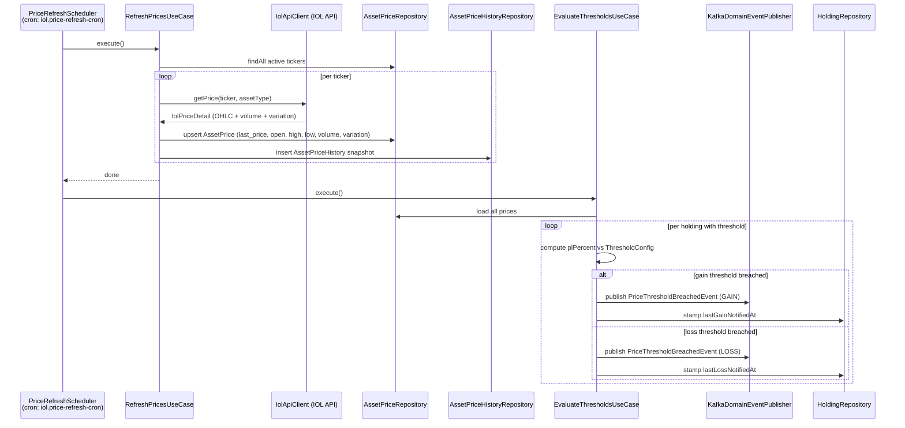
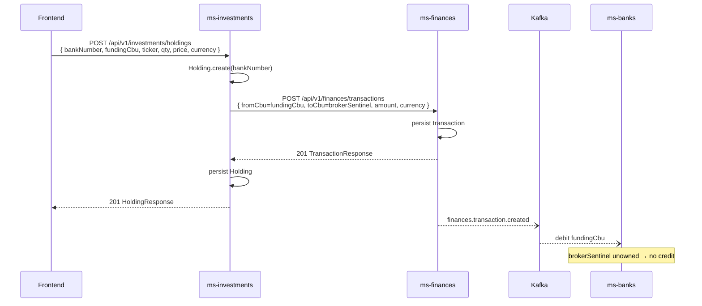

# ms-investments — Investments Service Spec

> Human-facing. Facts an implementer needs live in `back/ms-investments/.ai/` — this page holds the
> reasoning behind them and does not restate them. If the two disagree, the repo file wins.

## Summary

ms-investments tracks a user's investment portfolio. It stores holdings (what you own and at what cost), fetches live market prices from Invertir Online (IOL), computes unrealised P&L and allocation breakdowns, and checks notification thresholds after each price refresh. Buy/sell operations record a CBU-to-CBU transaction in ms-finances so that the funding account balance is updated correctly. A holding is keyed by `BankNumber`; there is no INVESTMENT account in ms-banks — the "investment account" is a derived read-model (Σ price×qty by bank+currency).

---

## Price Feed — IOL Integration

`IolApiClient` authenticates with IOL using OAuth2 password-grant (`/token`). The token is cached in-memory and refreshed 60 seconds before expiry. All calls are protected by Resilience4j `@Retry` + `@CircuitBreaker` (name `iolApi`). On a 401 the client re-authenticates and retries once.

`IolGatewayImpl.getHistoricalSeries` filters out any returned point whose `lastPrice` is null or ≤ 0 before persisting history. This removes no-trade sessions and pre-open candles (which IOL returns with a zero price), preventing the trailing drop-to-zero spike on price charts.

---

## Scheduled Price Refresh — Sequence Diagram

---

## Bank-Contract Integration (Buy / Sell Cash Flow)

There is no INVESTMENT account in ms-banks — it was removed. A holding belongs to a `BankNumber`, and the "investment account" is a derived read-model. Cash for buys and sells flows exclusively through ms-finances as CBU-to-CBU transactions.

