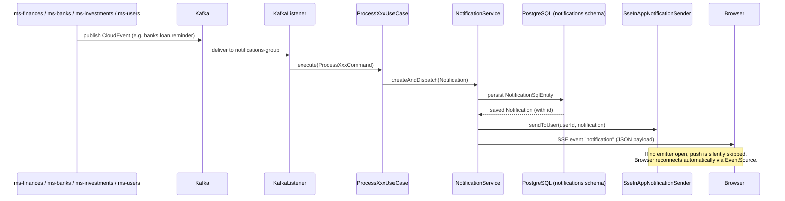

# ms-notifications

> Human-facing. Facts an implementer needs live in `back/ms-notifications/.ai/` — this page holds the
> reasoning behind them and does not restate them. If the two disagree, the repo file wins.

Centralized notification hub. Consumes domain events from Kafka (ms-users, ms-finances, ms-banks, ms-investments), persists each notification to Postgres, pushes it in real time to connected browsers via SSE, and sends email where configured. A scheduler fires monthly summary emails and a nightly cleanup purges stale records.

---

## Event → Persist → SSE Flow

---

## GOTCHA: UserRegisteredEvent Has No `timestamp` Field

`UserRegisteredEvent` intentionally carries **no `timestamp` field**. Earlier versions included a bare `Instant timestamp` at the top level. Because Jackson deserializes `Instant` via a custom converter (epoch seconds + nanoseconds object), any mismatch between the producer's serialization and the consumer's `ObjectMapper` configuration caused Jackson to throw, which triggered the `KafkaErrorHandlerConfig` seek-forward strategy — the message was skipped silently and the welcome notification was never created.

**Rule:** keep `UserRegisteredEvent` timestamp-free. If a timestamp is ever needed, add it inside the nested `Payload` class as a `String` (ISO-8601) and convert explicitly in the mapper.
