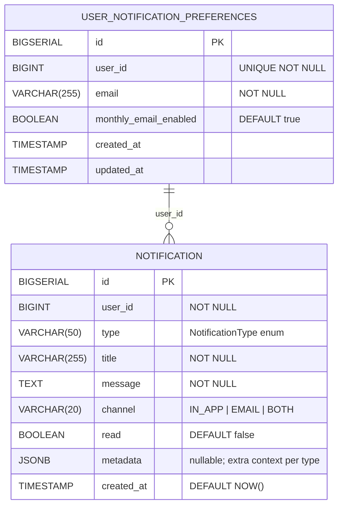
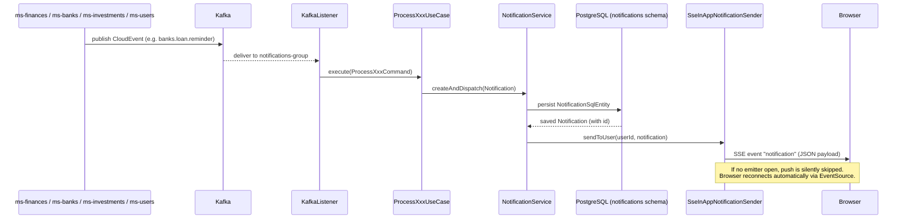

# ms-notifications

**Port:** 8084 | **Schema:** `notifications` | **Group ID:** `notifications-group`

Centralized notification hub. Consumes domain events from Kafka (ms-users, ms-finances, ms-banks, ms-investments), persists each notification to Postgres, pushes it in real time to connected browsers via SSE, and sends email where configured. A scheduler fires monthly summary emails and a nightly cleanup purges stale records.

---

## Folder Tree

```
ms-notifications/src/main/java/com/financialapp/notifications/
├── NotificationsApplication.java
│
├── domain/
│   ├── event/                          # Domain representations of inbound events
│   │   ├── BankAlert.java
│   │   ├── InstallmentReminder.java
│   │   ├── InvestmentThreshold.java
│   │   ├── LoanReminder.java
│   │   ├── PaymentDue.java
│   │   └── UserRegistered.java
│   ├── exception/
│   │   ├── BusinessException.java
│   │   ├── ResourceNotFoundException.java
│   │   └── UserNotFoundException.java
│   ├── gateway/
│   │   └── FinancesGateway.java        # Port: fetches category summaries for monthly email
│   ├── messaging/
│   │   ├── EmailSender.java            # Port
│   │   └── InAppNotificationSender.java # Port
│   ├── model/
│   │   ├── category/CategorySummary.java
│   │   ├── notification/
│   │   │   ├── Notification.java       # Domain record
│   │   │   ├── NotificationChannel.java # IN_APP | EMAIL | BOTH
│   │   │   ├── NotificationType.java   # Enum (10 values)
│   │   │   └── UserNotificationPreference.java
│   │   └── pagination/PageResult.java
│   ├── repository/
│   │   ├── NotificationRepository.java
│   │   └── UserNotificationPreferenceRepository.java
│   ├── service/NotificationService.java
│   └── usecase/
│       ├── event/           # ProcessBankEventUseCase, ProcessInstallmentReminderUseCase,
│       │                    # ProcessInvestmentThresholdUseCase, ProcessLoanReminderUseCase,
│       │                    # ProcessPaymentDueUseCase, ProcessUserRegisteredUseCase
│       ├── notification/    # AllAsReadUseCase, CleanupNotificationsUseCase,
│       │                    # GetLatestNotificationsByBankUseCase, GetLatestNotificationsUseCase,
│       │                    # GetNotificationUseCase, GetUnreadCountUseCase,
│       │                    # OneAsReadUsecase, SendMonthlySummariesUseCase
│       └── preference/      # CreatePreferenceIfAbsentUseCase, GetPreferenceUseCase,
│                            # UpdatePreferenceUseCase
│
├── application/
│   ├── service/NotificationServiceImpl.java
│   └── usecase/             # Implementations of every use case above
│       ├── event/impl/
│       ├── notification/impl/
│       ├── preference/impl/
│       └── scheduler/impl/
│
├── infrastructure/
│   ├── config/
│   │   ├── KafkaConfig.java            # NewTopic declarations for the 7 inbound topics
│   │   └── OpenApiConfig.java          # (CloudEvent consumer factory + DLQ come from commons-messaging)
│   ├── email/SmtpEmailSender.java      # Implements EmailSender (Thymeleaf + SMTP)
│   ├── gateway/
│   │   ├── ProcessedEventGatewayJpaAdapter.java # ce_id dedup (commons ProcessedEventGateway port)
│   │   └── impl/FinancesClient.java    # HTTP call to ms-finances for summaries
│   ├── messaging/
│   │   ├── listener/                   # @KafkaListener<CloudEvent> → commons IdempotentEventProcessor
│   │   │   ├── BankEventListener.java       # banks.account.low_balance, banks.account.balance_adjusted,
│   │   │   │                                #   banks.loan.reminder, banks.card.expiring, banks.card.installment_due
│   │   │   ├── InvestmentEventListener.java # investments.threshold.breached
│   │   │   └── UserEventListener.java       # users.user.registered
│   │   ├── mapper/                     # CloudEvent data → domain mappers (one per event type)
│   │   └── payload/                    # CloudEvent data records (one per event type)
│   ├── persistence/
│   │   ├── entity/
│   │   │   ├── NotificationSqlEntity.java
│   │   │   └── UserNotificationPreferenceSqlEntity.java
│   │   ├── mapper/
│   │   └── repository/
│   │       ├── NotificationSqlRepository.java
│   │       ├── SqlNotificationPersistence.java
│   │       ├── SqlUserNotificationPreferencePersistence.java
│   │       └── UserNotificationPreferenceSqlRepository.java
│   ├── scheduler/
│   │   ├── MonthlySummaryScheduler.java   # cron: 1st of month 09:00 (configurable)
│   │   └── NotificationCleanupScheduler.java # cron: midnight daily
│   └── sse/
│       ├── SseHeartbeatScheduler.java     # fixedRate: 30 s
│       ├── SseInAppNotificationSender.java # Implements InAppNotificationSender
│       ├── dto/SseNotificationEntity.java
│       └── mapper/SseNotificationMapper.java
│
└── web/controller/
    ├── config/InternalAuthFilter.java   # X-Internal-Auth header gate
    ├── dto/
    │   ├── request/NotificationPreferenceRequest.java
    │   └── response/
    │       ├── NotificationPreferenceResponse.java
    │       ├── NotificationResponse.java
    │       └── UnreadCountResponse.java
    ├── exception/GlobalExceptionHandler.java
    ├── mapper/
    │   ├── NotificationMapper.java
    │   └── PageResultMapper.java
    ├── NotificationController.java
    ├── NotificationStreamController.java
    └── PreferenceController.java
```

---

## Entities

### Notification



**NotificationType values:** `PAYMENT_DUE`, `LOAN_REMINDER`, `INSTALLMENT_REMINDER`, `INVESTMENT_THRESHOLD`, `USER_REGISTERED`, `MONTHLY_SUMMARY`, `CARD_EXPIRING`, `LOW_BALANCE`, `TRANSFER_SENT`, `TRANSFER_RECEIVED`

**NotificationChannel values:** `IN_APP`, `EMAIL`, `BOTH` — the `sendInApp()` / `sendEmail()` helpers on the enum drive dispatch logic.

### Flyway Migrations

| Version | Description |
|---------|-------------|
| V1      | Creates `notifications.notifications` and `notifications.user_notification_preferences` tables |
| V2      | Adds performance indexes: partial index on `read = false`, composite `(user_id, created_at DESC)` |

---

## Kafka Consumers

All listeners consume **`CloudEvent`** values (CloudEvents 1.0 Kafka binding, **binary mode**) on **group ID** `notifications-group`. The consumer factory, `CloudEventDeserializer`, dedup and DLQ all come from the shared **`commons-messaging`** module: each handler calls `IdempotentEventProcessor.process(event, <Data>.class, handler)`, which skips already-seen `ce_id`s (`ProcessedEventGateway` → `processed_event` table) and routes the JSON `data` to the use case. On failure the record retries then lands on `<topic>.DLT`.

| Listener | Topic (`= ce_type`) | `data` record | Use Case |
|----------|---------------------|---------------|----------|
| `UserEventListener` | `users.user.registered` | `UserRegisteredData` | `ProcessUserRegisteredUseCase` — welcome notification; creates `UserNotificationPreference` if absent |
| `BankEventListener` | `banks.account.low_balance` | `LowBalanceData` | `ProcessLowBalanceUseCase` |
| `BankEventListener` | `banks.account.balance_adjusted` | `BalanceAdjustedData` | `ProcessBalanceAdjustedUseCase` |
| `BankEventListener` | `banks.loan.reminder` | `LoanReminderData` | `ProcessLoanReminderUseCase` |
| `BankEventListener` | `banks.card.expiring` | `CardExpiringData` | `ProcessCardExpiringUseCase` |
| `BankEventListener` | `banks.card.installment_due` | `CardInstallmentDueData` | `ProcessPaymentDueUseCase` |
| `InvestmentEventListener` | `investments.threshold.breached` | `InvestmentThresholdData` | `ProcessInvestmentThresholdUseCase` — GAIN or LOSS |

> The old `bank-alerts` umbrella (type-string + stringified metadata) was split into the five typed `banks.*` events above. Reminders are now produced by **ms-banks** (it owns loans/cards post-DDD), not ms-finances — there is no longer a `FinancesEventListener`.

### Event `data` payloads (key fields)

CloudEvents envelope attributes (`ce_id`, `ce_source`, `ce_type`, `ce_time`, `ce_dataschema`) travel as Kafka headers; the fields below are the JSON **`data`** (the Kafka record value).

| `data` record | Fields |
|---------------|--------|
| `UserRegisteredData` | `userId`, `email`, `firstName`, `lastName` |
| `LowBalanceData` | `userId`, `accountName`, `accountCbu`, `bankNumber`, `balance`, `currency` |
| `BalanceAdjustedData` | `userId`, `accountName`, `accountCbu`, `bankNumber`, `amount`, `currency`, `credit` |
| `LoanReminderData` | `userId`, `loanId`, `installmentId`, `installmentNumber`, `loanName`, `dueDate` |
| `CardExpiringData` | `userId`, `cardNumber`, `bankNumber`, `expiringDate` |
| `CardInstallmentDueData` | `userId`, `cardNumber`, `installmentId`, `installmentNumber`, `totalInstallments`, `description`, `dueDate`, `amount`, `currency` |
| `InvestmentThresholdData` | `userId`, `holdingId`, `ticker`, `name`, `direction`, `thresholdPct`, `actualPct`, `currentPrice`, `avgPurchasePrice`, `currency` |

---

## SSE — Real-Time Stream

**Endpoint:** `GET /api/v1/notifications/stream`
Produces: `text/event-stream`
Auth: `X-User-Id` header (injected by the gateway JWT filter)

The gateway routes this path with `response-timeout: -1` so long-lived connections are not dropped by the proxy.

### SseInAppNotificationSender internals

- Maintains a `ConcurrentHashMap<Long, List<SseEmitter>>` (userId → emitters).
- **Emitter timeout:** 5 minutes (`300_000 ms`). Browser must reconnect automatically (EventSource does this by default).
- **Max emitters per user:** 3 (oldest evicted when the cap is exceeded — covers multi-tab use).
- **Heartbeat:** `SseHeartbeatScheduler` sends a comment-only event every 30 s to all open connections so proxies do not close idle streams.
- **Dead emitter cleanup:** handled on send error and on completion/timeout callbacks.

### Event format

```
event: notification
data: { id, userId, type, title, message, channel, read, metadata, createdAt }
```

---

## Endpoint Table

### NotificationController — `GET|PUT /api/v1/notifications`

| Method | Path | Purpose |
|--------|------|---------|
| `GET` | `/api/v1/notifications` | Paginated list (`page`, `size` params; default 0/20) |
| `GET` | `/api/v1/notifications/latest` | Latest notifications; optional `?bankId=` filter |
| `GET` | `/api/v1/notifications/unread-count` | Returns `{ count }` |
| `PUT` | `/api/v1/notifications/{id}/read` | Mark one notification as read |
| `PUT` | `/api/v1/notifications/read-all` | Mark all notifications as read |

### NotificationStreamController — `GET /api/v1/notifications`

| Method | Path | Purpose |
|--------|------|---------|
| `GET` | `/api/v1/notifications/stream` | Open SSE stream (text/event-stream) |

### PreferenceController — `GET|PUT /api/v1/notifications/preferences`

| Method | Path | Purpose |
|--------|------|---------|
| `GET` | `/api/v1/notifications/preferences` | Get current user's notification preferences |
| `PUT` | `/api/v1/notifications/preferences` | Update preferences (`monthlyEmailEnabled`) |

All controllers read `X-User-Id` from the request header. Responses use the shared envelope
`{ status, title, code, message, data }` from `commons-core`; `code` only on errors with the
`DomainError` slug (`resource_not_found`, `user_not_found`, `business_rule_violation`).
`GlobalExceptionHandler extends ApiExceptionHandler` (commons-web); endpoints declare throwable
codes with `@ApiErrorCodes`. The SSE stream endpoint is exempt (not a JSON envelope response).

---

## Schedulers

| Scheduler | Trigger | Action |
|-----------|---------|--------|
| `MonthlySummaryScheduler` | 1st of month 09:00 (env `NOTIFICATION_SCHEDULER_CRON`) | Calls `SendMonthlySummariesUseCase` — fetches category summaries from ms-finances via `FinancesClient`, sends Thymeleaf email to each opted-in user |
| `NotificationCleanupScheduler` | Midnight daily (`0 0 0 * * *`) | Purges old notifications via `CleanupNotificationsUseCase` |
| `SseHeartbeatScheduler` | Every 30 s (fixed rate) | Sends SSE comment event to all open emitters |

---

## Event → Persist → SSE Flow



---

## Email Dispatch

`SmtpEmailSender` implements the `EmailSender` port using Spring Mail + Thymeleaf templates.

Available templates (in `resources/templates/email/`):

| Template | Used by |
|----------|---------|
| `welcome.html` | `ProcessUserRegisteredUseCase` |
| `payment-due.html` | `ProcessPaymentDueUseCase` |
| `loan-reminder.html` | `ProcessLoanReminderUseCase` |
| `installment-reminder.html` | `ProcessInstallmentReminderUseCase` |
| `investment-threshold.html` | `ProcessInvestmentThresholdUseCase` |
| `monthly-summary.html` | `SendMonthlySummariesUseCase` |

Email is sent only when the notification `channel` is `EMAIL` or `BOTH` **and** the user's `monthlyEmailEnabled` preference allows it (for summaries).

---

## Configuration (env vars)

| Variable | Default | Purpose |
|----------|---------|---------|
| `SPRING_DATASOURCE_URL` | `jdbc:postgresql://localhost:5432/financialapp` | DB connection |
| `KAFKA_BOOTSTRAP_SERVERS` | `localhost:9093` | Kafka brokers |
| `MAIL_HOST` / `MAIL_PORT` | `localhost` / `587` | SMTP relay |
| `MAIL_USERNAME` / `MAIL_PASSWORD` | — | SMTP credentials |
| `NOTIFICATION_SCHEDULER_CRON` | `0 0 0 1 * *` | Monthly summary cron |
| `INTERNAL_AUTH_TOKEN` | `local-dev-token` | `X-Internal-Auth` gate for internal endpoints |

---

## GOTCHA: UserRegisteredEvent Has No `timestamp` Field

`UserRegisteredEvent` intentionally carries **no `timestamp` field**. Earlier versions included a bare `Instant timestamp` at the top level. Because Jackson deserializes `Instant` via a custom converter (epoch seconds + nanoseconds object), any mismatch between the producer's serialization and the consumer's `ObjectMapper` configuration caused Jackson to throw, which triggered the `KafkaErrorHandlerConfig` seek-forward strategy — the message was skipped silently and the welcome notification was never created.

**Rule:** keep `UserRegisteredEvent` timestamp-free. If a timestamp is ever needed, add it inside the nested `Payload` class as a `String` (ISO-8601) and convert explicitly in the mapper.

---

## CI/CD

Thin caller workflows (`.github/workflows/`) delegate to the shared workflows in the root repo:
`ci.yml` (PRs + develop/master pushes → `mvn verify` + Docker build; required check `ci / build`),
`docker-publish.yml` (master push / `v*` tag → GHCR `latest` + `sha-*` + semver),
`release.yml` (bump dropdown → semver release). Tests must pass without local infra — CI runs on a
bare runner; integration tests use H2 and `EmbeddedKafka` where needed. SMTP-dependent tests must
be excluded from the `verify` phase or use a fake sender.
See [../workflow.md](../workflow.md) § CI/CD.

---

[Master](../00-master.md) | [Architecture](../architecture.md) | [Rules](../rules.md) | [Workflow](../workflow.md)
