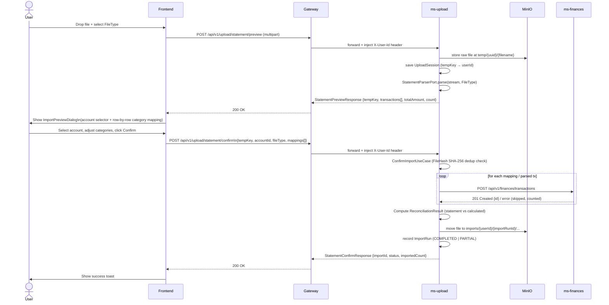

# ms-upload — Statement Upload & Bulk Import Service

> Human-facing. Facts an implementer needs live in `back/ms-upload/.ai/` — this page holds the
> reasoning behind them and does not restate them. If the two disagree, the repo file wins.

`ms-upload` is the ingestion gateway for bulk financial data. A user uploads a bank statement (PDF) or a generic CSV export; the service stores the raw file in MinIO under a `temp/` prefix, parses it into a list of candidate transactions, and returns a preview. The user then reviews and optionally re-categorises each row before confirming. On confirmation the service creates an `ImportRun` aggregate, dedupes against active imports via `FileHash` (SHA-256), forwards each transaction to `ms-finances` (or card installments to `ms-banks`), computes a `ReconciliationResult`, moves the file from `temp/` to `imports/{userId}/{importRunId}/...`, and persists the import run and created transaction IDs.

---

## Upload → Preview → Confirm Flow

