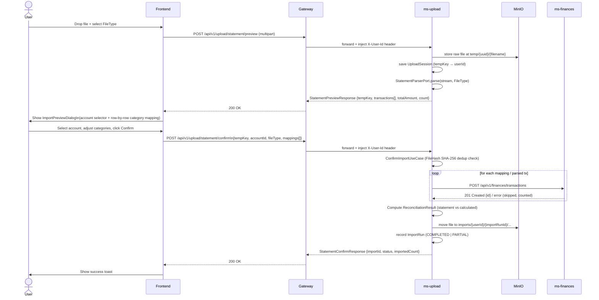
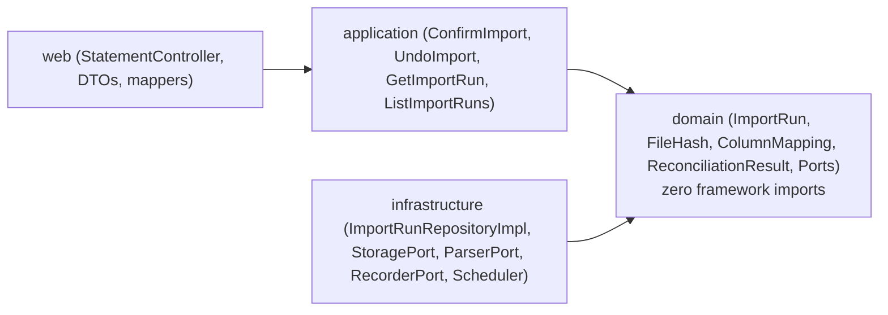

# ms-upload — Statement Upload & Bulk Import Service

**Port:** 8085
**DB schema:** `upload`
**Framework:** Spring MVC + Spring Boot 3.4.2 (Hexagonal Architecture)
**Storage:** MinIO (`statements` bucket, `receipts` bucket)
**Feign clients:** `ms-finances` (transactions), `ms-banks` (card installments)

---

## Summary

`ms-upload` is the ingestion gateway for bulk financial data. A user uploads a bank statement (PDF) or a generic CSV export; the service stores the raw file in MinIO under a `temp/` prefix, parses it into a list of candidate transactions, and returns a preview. The user then reviews and optionally re-categorises each row before confirming. On confirmation the service creates an `ImportRun` aggregate, dedupes against active imports via `FileHash` (SHA-256), forwards each transaction to `ms-finances` (or card installments to `ms-banks`), computes a `ReconciliationResult`, moves the file from `temp/` to `imports/{userId}/{importRunId}/...`, and persists the import run and created transaction IDs.

Three `FileType` variants are supported:

| `FileType` | Parser | Source |
|---|---|---|
| `BANK_PDF` | `ICBCBankMovementsPdfParser` | ICBC bank movements PDF (ARS debit/credit columns) |
| `VISA_PDF` | `ICBCVisaPdfParser` | ICBC VISA credit card statement PDF (ARS + USD) |
| `CSV` | `GenericCsvParser` | Generic CSV with configurable column mapping (`SeparateDebitCredit` or `SingleSignedColumn`), balance column extraction, and auto-detected date format |

---

## Upload → Preview → Confirm Flow



---

## Domain Architecture (Hexagonal)



---

## Endpoint Table

All paths are relative to the base `POST /api/v1/upload`. `X-User-Id` is always injected by the gateway — the frontend never sends it directly.

| Method | Path | Request | Response data |
|---|---|---|---|
| `POST` | `/statement/preview` | `multipart/form-data`: `file` (PDF/CSV), `fileType` (FileType enum) | `StatementPreviewResponse` — `tempKey`, `accountNumber`, `transactions[]`, `totalAmount`, `count` |
| `POST` | `/statement/confirm` | JSON `StatementConfirmRequest` — `tempKey`, `accountId`, `fileType`, `mappings[]` | `StatementConfirmResponse` — `importId`, `status`, `importedCount` |
| `POST` | `/csv/preview` | `multipart/form-data`: `file` (CSV) | `CsvPreviewResponse` — `tempKey`, `headers[]`, first 5 `rows[][]` |
| `POST` | `/csv/confirm` | JSON `CsvConfirmRequest` — `tempKey`, `accountId`, `dateCol`, `descCol`, `debitCol`, `creditCol`, `montoCol`, `balanceCol`, `dateFormat`, `mappings[]` | `CsvImportResponse` — `importId`, `status`, `importedCount` |
| `GET` | `/history` | — | `ImportRunResponse[]` for the authenticated user, newest first |
| `POST` | `/runs/{id}/undo` | — | `UndoResultResponse` — `deletedCount`, `skippedCount`, `skippedTransactionIds[]` |
| `GET` | `/runs/{id}` | — | `ImportRunResponse` for single run incl. reconciliation |
| `GET` | `/runs/by-transaction/{transactionId}` | — | `ImportRunResponse` for origin run of transaction (or 404) |

All responses are wrapped in the shared envelope `{ status, title, code, message, data }` from `commons-core` — `code` only on errors, carrying the service `DomainError` slug.

---

## Folder Tree

```
back/ms-upload/src/main/java/com/financialapp/upload/
├── UploadApplication.java
├── client/
│   ├── BanksClient.java          Feign → ms-banks card installments import + dup-check
│   └── FinancesClient.java       Feign → ms-finances transaction create/delete + dup-check
├── config/
│   ├── BucketInitializer.java    CommandLineRunner: creates MinIO buckets on startup
│   ├── FeignConfig.java
│   ├── InternalAuthFilter.java
│   ├── MinioConfig.java          MinioClient bean + bucket name properties
│   └── SwaggerConfig.java
├── controller/
│   └── StatementController.java  All upload endpoints (preview + confirm + undo + history + detail)
├── domain/
│   ├── common/model/             UserId, BankNumber, Cbu, DateRange, Money
│   ├── exception/                DomainException, FileHash, Undo & Not Found exceptions
│   ├── gateway/                  StatementParserPort, StatementStoragePort, TransactionRecorderPort
│   ├── model/
│   │   ├── importrun/            ImportRun, ImportRunId, FileHash, ImportRunStatus, ReconciliationResult
│   │   └── mapping/              ColumnMapping, AmountMapping, SingleSignedColumn, SeparateDebitCredit
│   ├── repository/               ImportRunRepository
│   └── usecase/importrun/        ConfirmImport, UndoImport, GetImportRun, ListImportRuns, FindImportRunByTransaction
├── application/importrun/impl/   ConfirmImportUseCaseImpl, UndoImportUseCaseImpl, GetImportRunUseCaseImpl, ListImportRunsUseCaseImpl, FindImportRunByTransactionUseCaseImpl
├── infrastructure/
│   ├── gateway/                  StatementParserPortImpl, StatementStoragePortImpl, TransactionRecorderPortImpl
│   ├── persistence/
│   │   ├── entity/               ImportRunJpaEntity
│   │   ├── mapper/               ImportRunPersistenceMapper
│   │   └── repository/           ImportRunJpaRepository, ImportRunRepositoryImpl
│   └── scheduler/                ImportRetentionScheduler (30-day MinIO sweep)
├── model/
│   ├── dto/                      ParsedTransaction, requests/responses
│   ├── entity/                   StatementImport, UploadSession
│   └── enums/                    FileType, ImportStatus, TransactionType
├── parser/                       StatementParser, ICBC parsers, GenericCsvParser
└── service/                      MinioStorageService, ParsingService, StatementService
```

---

## Retention & Automation

- `ImportRetentionScheduler`: Scheduled daily at `03:00 AM` (`cron = "0 0 3 * * *"`). Deletes MinIO statement objects under `imports/` older than 30 days.

---

## Database Schema (`upload`)

### Flyway migrations

| Version | Description |
|---|---|
| V1 | `statement_imports` table + `files` table |
| V2 | Redesign: drop unique constraint, add `original_name`, `file_hash`, `bank_id`, `account_id`, `card_id`; unique index on `(user_id, file_hash)` |
| V3 | `upload_sessions` table (keyed by `temp_key`) |
| V4 | `import_runs` table + partial unique index on active `(user_id, file_hash)` (`WHERE status <> 'UNDONE'`) |
| V5 | `import_run_transactions` table (normalized created transaction IDs) |
| V6 | Drop legacy `files` table and orphan `account_number`, `period_key` columns from `statement_imports` |

---

## External Service Calls

| Target | Feign client | Endpoint | When |
|---|---|---|---|
| `ms-finances` | `FinancesClient` | `POST /api/v1/finances/transactions` | One call per confirmed transaction row |
| `ms-finances` | `FinancesClient` | `DELETE /api/v1/finances/transactions/{id}` | Called per transaction ID during undo |
| `ms-finances` | `FinancesClient` | `POST /api/v1/finances/transactions/duplicates-check` | Optional dup-check before confirm |
| `ms-banks` | `BanksClient` | `POST /api/v1/banks/cards/{cardId}/installments/import` | Card expense bulk import path |

---

## Key Env Vars

| Variable | Default | Purpose |
|---|---|---|
| `MINIO_ENDPOINT` | `http://localhost:9000` | MinIO server URL |
| `MINIO_ACCESS_KEY` | `minioadmin` | MinIO credentials |
| `MINIO_SECRET_KEY` | `changeme` | MinIO credentials |
| `MINIO_BUCKET_STATEMENTS` | `statements` | Statements bucket name |
| `MINIO_BUCKET_RECEIPTS` | `receipts` | Receipts bucket name |
| `FINANCES_SERVICE_URL` | `http://localhost:8082` | ms-finances Feign target |
| `BANKS_SERVICE_URL` | `http://localhost:8083` | ms-banks Feign target |
| `SPRING_DATASOURCE_URL` | `jdbc:postgresql://localhost:5432/financialapp` | Postgres connection |

Max upload size: **20 MB** per file (configured in `spring.servlet.multipart`).

---

[Master](../00-master.md) · [Architecture](../architecture.md) · [Rules](../rules.md) · [Workflow](../workflow.md)
