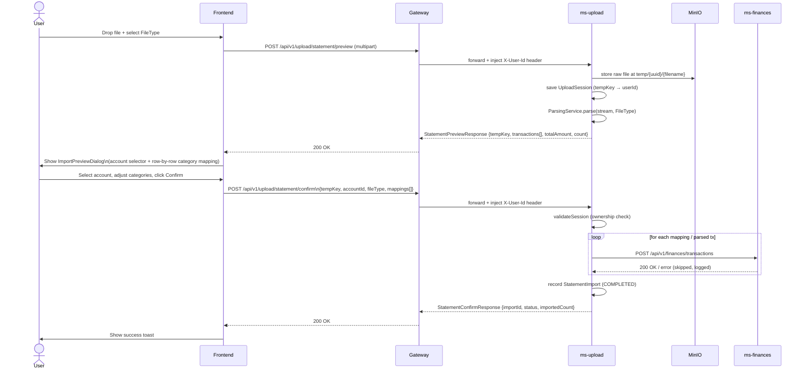
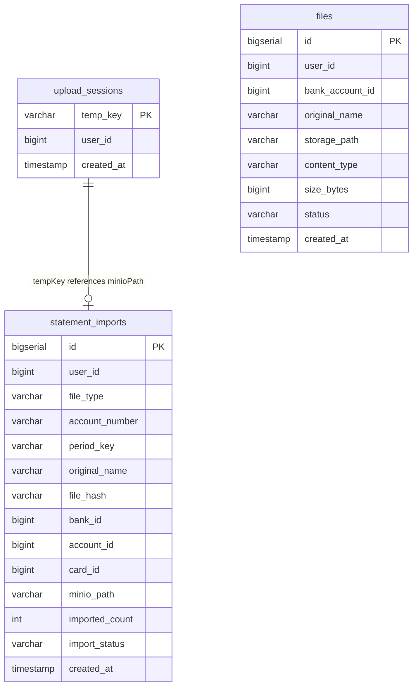

# ms-upload — Statement Upload & Bulk Import Service

**Port:** 8085
**DB schema:** `upload`
**Framework:** Spring MVC + Spring Boot 3.4.2
**Storage:** MinIO (`statements` bucket, `receipts` bucket)
**Feign clients:** `ms-finances` (transactions), `ms-banks` (card installments)

---

## Summary

`ms-upload` is the ingestion gateway for bulk financial data. A user uploads a bank statement (PDF) or a generic CSV export; the service stores the raw file in MinIO under a `temp/` prefix, parses it into a list of candidate transactions, and returns a preview. The user then reviews and optionally re-categorises each row before confirming. On confirmation the service forwards each transaction to `ms-finances` (or card installments to `ms-banks`) and records an audit row in the `upload.statement_imports` table.

Three `FileType` variants are supported:

| `FileType` | Parser | Source |
|---|---|---|
| `BANK_PDF` | `ICBCBankMovementsPdfParser` | ICBC bank movements PDF (ARS debit/credit columns) |
| `VISA_PDF` | `ICBCVisaPdfParser` | ICBC VISA credit card statement PDF (ARS + USD) |
| `CSV` | `GenericCsvParser` | Generic CSV with configurable column mapping and auto-detected date format |

---

## Upload → Preview → Confirm Flow



---

## Endpoint Table

All paths are relative to the base `POST /api/v1/upload`. `X-User-Id` is always injected by the gateway — the frontend never sends it directly.

| Method | Path | Request | Response data |
|---|---|---|---|
| `POST` | `/statement/preview` | `multipart/form-data`: `file` (PDF/CSV), `fileType` (FileType enum) | `StatementPreviewResponse` — `tempKey`, `accountNumber`, `transactions[]`, `totalAmount`, `count` |
| `POST` | `/statement/confirm` | JSON `StatementConfirmRequest` — `tempKey`, `accountId`, `fileType`, `mappings[]` | `StatementConfirmResponse` — `importId`, `status`, `importedCount` |
| `POST` | `/csv/preview` | `multipart/form-data`: `file` (CSV) | `CsvPreviewResponse` — `tempKey`, `headers[]`, first 5 `rows[][]` |
| `POST` | `/csv/confirm` | JSON `CsvConfirmRequest` — `tempKey`, `accountId`, `dateCol`, `descCol`, `debitCol`, `creditCol`, `dateFormat`, `mappings[]` | `CsvImportResponse` — `importId`, `status`, `importedCount` |
| `GET` | `/history` | — | `StatementImport[]` for the authenticated user, newest first |

All responses are wrapped in the shared envelope `{ status, title, code, message, data }` from `commons-core` — `code` only on errors, carrying the service `DomainError` slug.

---

## Folder Tree

```
back/ms-upload/src/main/java/com/financialapp/upload/
├── UploadApplication.java
├── client/
│   ├── BanksClient.java          Feign → ms-banks card installments import + dup-check
│   └── FinancesClient.java       Feign → ms-finances transaction create + dup-check
├── config/
│   ├── BucketInitializer.java    CommandLineRunner: creates MinIO buckets on startup
│   ├── FeignConfig.java
│   ├── InternalAuthFilter.java
│   ├── MinioConfig.java          MinioClient bean + bucket name properties
│   └── SwaggerConfig.java
├── controller/
│   └── StatementController.java  All upload endpoints (preview + confirm, PDF + CSV + history)
├── exception/
│   ├── BusinessException.java
│   ├── GlobalExceptionHandler.java
│   ├── InvalidFileException.java
│   ├── ParseException.java
│   └── ResourceNotFoundException.java
├── model/
│   ├── common/
│   │   └── Money.java
│   ├── dto/
│   │   ├── ParsedTransaction.java             date, description, amount, currency, type
│   │   ├── request/
│   │   │   ├── CardExpenseCreateRequest.java
│   │   │   ├── CardExpenseImportRequest.java
│   │   │   ├── ConfirmRequest.java
│   │   │   ├── CsvConfirmRequest.java         tempKey, accountId, col mappings, dateFormat, mappings[]
│   │   │   ├── ResolveRequest.java
│   │   │   ├── StatementConfirmRequest.java   tempKey, accountId, fileType, mappings[]
│   │   │   ├── TransactionMappingRequest.java date, description, amount, currency, type, categoryId
│   │   │   └── TransactionRequest.java        forwarded to ms-finances
│   │   └── response/
│   │       ├── ApiResponse.java
│   │       ├── BatchImportResponse.java
│   │       ├── ConfirmResponse.java
│   │       ├── CsvImportResponse.java         importId, status, importedCount
│   │       ├── CsvPreviewResponse.java        tempKey, headers[], rows[][]
│   │       ├── ImportHistoryRecord.java
│   │       ├── PreviewResponse.java
│   │       ├── ResolveResponse.java
│   │       ├── StatementConfirmResponse.java  importId, status, importedCount
│   │       └── StatementPreviewResponse.java  tempKey, accountNumber, transactions[], totalAmount, count
│   ├── entity/
│   │   ├── StatementImport.java   Audit record (schema: upload.statement_imports)
│   │   └── UploadSession.java     Temp session keyed by MinIO path (schema: upload.upload_sessions)
│   └── enums/
│       ├── FileType.java          VISA_PDF | BANK_PDF | CSV
│       ├── ImportStatus.java      PENDING | COMPLETED | FAILED | PARTIAL
│       └── TransactionType.java   INCOME | EXPENSE
├── parser/
│   ├── StatementParser.java            Interface: parse(InputStream, Map<String,String>)
│   ├── ICBCBankMovementsPdfParser.java PDFBox-based; regex on date + amount columns; infers year from PERIODO header
│   ├── ICBCVisaPdfParser.java          PDFBox-based; section-scoped parse (DETALLE DE TRANSACCION); ARS + USD
│   └── GenericCsvParser.java           OpenCSV-based; auto-detects date format from 7 patterns; configurable columns
├── repository/
│   ├── StatementImportRepository.java
│   └── UploadSessionRepository.java
└── service/
    ├── MinioStorageService.java    store / retrieve / move / delete against MinIO
    ├── ParsingService.java         Dispatches to correct StatementParser by FileType
    └── StatementService.java       Orchestrates: store → parse → confirm → forward → record
```

---

## Parse Pipeline

```mermaid
graph TD
    A[MultipartFile] --> B[MinioStorageService.store\ntemp/{uuid}/{filename}]
    B --> C[UploadSession saved\ntempKey → userId]
    C --> D{FileType?}
    D -->|BANK_PDF| E[ICBCBankMovementsPdfParser\nPDFBox · regex · PERIODO year inference]
    D -->|VISA_PDF| F[ICBCVisaPdfParser\nPDFBox · section-scoped · ARS+USD]
    D -->|CSV| G[GenericCsvParser\nOpenCSV · auto date-format · configurable cols]
    E --> H[List of ParsedTransaction\ndate · description · amount · currency · TransactionType]
    F --> H
    G --> H
    H --> I[StatementPreviewResponse\ntempKey · transactions · totalAmount · count]
    I --> J[Frontend: ImportPreviewDialog\nuser maps categories + selects account]
    J --> K{mappings present?}
    K -->|Yes — user-mapped| L[processMappings\nuse categoryId from UI]
    K -->|No — fallback| M[re-parse from MinIO\ngetDefaultCategoryId\n1104=EXPENSE, 1105=INCOME]
    L --> N[FinancesClient.createTransaction × N\nrow-by-row, errors logged not thrown]
    M --> N
    N --> O[StatementImport recorded\nIMPORTED_COUNT, COMPLETED]
```

---

## Database Schema (`upload`)

### Flyway migrations

| Version | Description |
|---|---|
| V1 | `statement_imports` table + `files` table |
| V2 | Redesign: drop unique constraint, add `original_name`, `file_hash`, `bank_id`, `account_id`, `card_id`; unique index on `(user_id, file_hash)` |
| V3 | `upload_sessions` table (keyed by `temp_key`) |

### Entity-Relationship



---

## MinIO Buckets

| Bucket env var | Default name | Purpose |
|---|---|---|
| `MINIO_BUCKET_STATEMENTS` | `statements` | All bank statement PDFs and CSV exports |
| `MINIO_BUCKET_RECEIPTS` | `receipts` | Receipt files (future use) |

Temporary uploads land at `temp/{uuid}/{originalFilename}` inside the `statements` bucket. `BucketInitializer` creates both buckets on startup if absent.

---

## External Service Calls

| Target | Feign client | Endpoint | When |
|---|---|---|---|
| `ms-finances` | `FinancesClient` | `POST /api/v1/finances/transactions` | One call per confirmed transaction row |
| `ms-finances` | `FinancesClient` | `POST /api/v1/finances/transactions/duplicates-check` | Optional dup-check before confirm |
| `ms-banks` | `BanksClient` | `POST /api/v1/banks/cards/{cardId}/installments/import` | Card expense bulk import path |
| `ms-banks` | `BanksClient` | `POST /api/v1/banks/cards/{cardId}/installments/duplicates-check` | Card expense dup-check |

---

## Key Env Vars

| Variable | Default | Purpose |
|---|---|---|
| `MINIO_ENDPOINT` | `http://localhost:9000` | MinIO server URL |
| `MINIO_ACCESS_KEY` | `minioadmin` | MinIO credentials |
| `MINIO_SECRET_KEY` | `changeme` | MinIO credentials |
| `MINIO_BUCKET_STATEMENTS` | `statements` | Statements bucket name |
| `MINIO_BUCKET_RECEIPTS` | `receipts` | Receipts bucket name |
| `FINANCES_SERVICE_URL` | `http://localhost:8082` | ms-finances Feign target |
| `BANKS_SERVICE_URL` | `http://localhost:8083` | ms-banks Feign target |
| `SPRING_DATASOURCE_URL` | `jdbc:postgresql://localhost:5432/financialapp` | Postgres connection |

Max upload size: **20 MB** per file (configured in `spring.servlet.multipart`).

---

[Master](../00-master.md) · [Architecture](../architecture.md) · [Rules](../rules.md) · [Workflow](../workflow.md)
