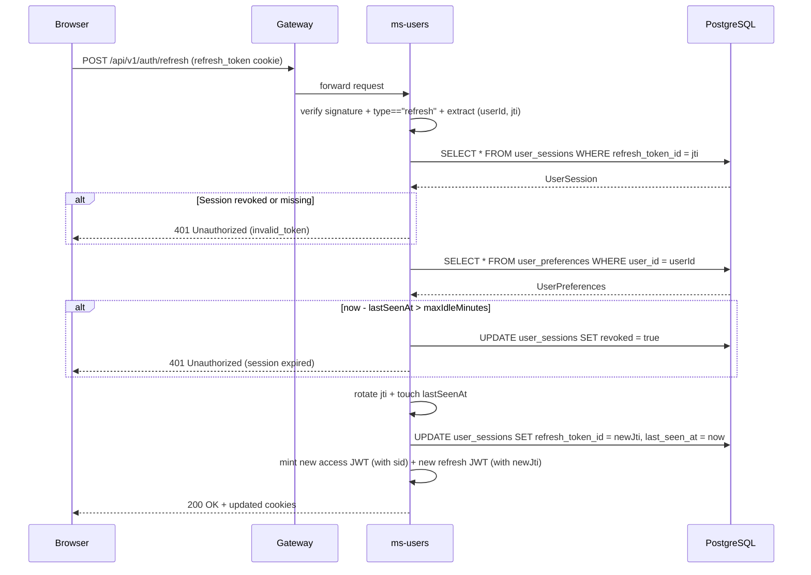

# ms-users — Auth & Users Service

**Port:** 8081  
**DB schema:** `users`  
**Framework:** Spring MVC + Spring Security (stateless)  
**Kafka:** publishes `users.user.registered` (CloudEvents 1.0, binary mode) via a transactional outbox on successful registration

---

## Summary

`ms-users` is the sole authentication authority for the platform. It handles user registration, login, session registry management (`UserSession`), session refresh (with rotation, refresh-time revocation, and inactivity policy enforcement), server-side logout, user profile editing, change password (with other-session revocation), display/currency-format preferences (`UserPreferences`), and per-user manual currency rates (`ManualCurrencyRate`).

All tokens live in HttpOnly cookies — the JavaScript layer never touches access or refresh tokens directly. CSRF protection is enforced via `CookieCsrfTokenRepository`; auth endpoints are exempt. Downstream services receive the authenticated user's identity through the `X-User-Id` header injected by the gateway's `JwtAuthFilter`.

### Session Revocation Trade-off

Revocation is enforced at **refresh time only**. The gateway's per-request HMAC verification remains fast and stateless. Revoking a session prevents future token refreshes; the active access token lives out its remaining ≤24h TTL.

---

## Folder Tree

```
back/ms-users/src/main/java/com/financialapp/users/
├── UsersApplication.java
├── application/
│   ├── AuthenticateUserUseCaseImp.java
│   ├── GetUserPreferencesUseCaseImpl.java
│   ├── ListManualCurrencyRatesUseCaseImpl.java
│   ├── ListUserSessionsUseCaseImpl.java
│   ├── RefreshSessionUseCaseImpl.java
│   ├── RegisterUserUseCaseImpl.java
│   ├── RevokeUserSessionUseCaseImpl.java
│   ├── SetManualCurrencyRateUseCaseImpl.java
│   ├── DeleteManualCurrencyRateUseCaseImpl.java
│   ├── UpdateUserPasswordUseCaseImpl.java
│   ├── UpdateUserProfileUseCaseImpl.java
│   └── UpdateUserPreferencesUseCaseImpl.java
├── domain/
│   ├── event/
│   │   ├── DomainEvent.java
│   │   ├── DomainEventPublisher.java
│   │   └── UserRegisteredEvent.java
│   ├── exception/
│   │   ├── DomainError.java
│   │   ├── DuplicateEmailException.java
│   │   ├── InvalidCredentialsException.java
│   │   ├── InvalidTokenException.java
│   │   ├── SessionExpiredException.java
│   │   ├── SessionNotFoundException.java
│   │   ├── UserNotFoundException.java
│   │   ├── WeakPasswordException.java
│   │   └── WrongCurrentPasswordException.java
│   ├── gateway/
│   │   ├── AuthenticationProviderGateway.java
│   │   └── PasswordHashGateway.java
│   ├── model/
│   │   ├── ManualCurrencyRate.java
│   │   ├── Session.java
│   │   ├── User.java
│   │   ├── UserPreferences.java
│   │   ├── UserSession.java
│   │   └── valueObject/
│   │       ├── DeviceLabel.java
│   │       ├── InactivityPolicy.java
│   │       ├── RefreshTokenClaims.java
│   │       ├── RefreshTokenId.java
│   │       ├── SessionId.java
│   │       └── UserId.java
│   ├── repository/
│   │   ├── ManualCurrencyRateRepository.java
│   │   ├── UserPreferencesRepository.java
│   │   ├── UserRepository.java
│   │   └── UserSessionRepository.java
│   └── usecase/
│       ├── AuthenticateUserUseCase.java
│       ├── DeleteManualCurrencyRateUseCase.java
│       ├── GetUserPreferencesUseCase.java
│       ├── ListManualCurrencyRatesUseCase.java
│       ├── ListUserSessionsUseCase.java
│       ├── RefreshSessionUseCase.java
│       ├── RegisterUserUseCase.java
│       ├── RevokeUserSessionUseCase.java
│       ├── SetManualCurrencyRateUseCase.java
│       ├── UpdateUserPasswordUseCase.java
│       ├── UpdateUserProfileUseCase.java
│       ├── UpdateUserPreferencesUseCase.java
│       └── command/
│           ├── AuthenticateUserCommand.java
│           ├── DeleteManualCurrencyRateCommand.java
│           ├── RefreshSessionCommand.java
│           ├── RegisterUserCommand.java
│           ├── SetManualCurrencyRateCommand.java
│           ├── UpdateUserPasswordCommand.java
│           ├── UpdateUserProfileCommand.java
│           └── UpdateUserPreferencesCommand.java
├── infrastructure/
│   ├── config/
│   │   ├── CsrfCookieFilter.java
│   │   ├── InternalAuthFilter.java
│   │   ├── JwtProperties.java
│   │   ├── KafkaConfig.java
│   │   └── SecurityConfig.java
│   ├── gateway/
│   │   ├── AuthenticationProviderGatewayImpl.java
│   │   └── PasswordHashGatewayImpl.java
│   ├── messaging/
│   │   ├── DomainEventPublisherImpl.java
│   │   ├── mapper/UserRegisteredEventMapper.java
│   │   └── payload/
│   │       └── UserRegisteredPayload.java
│   └── persistence/
│       ├── entity/
│       │   ├── ManualCurrencyRateJpaEntity.java
│       │   ├── UserJpaEntity.java
│       │   ├── UserPreferencesJpaEntity.java
│       │   └── UserSessionJpaEntity.java
│       ├── jpa/
│       │   ├── ManualCurrencyRateJpaRepository.java
│       │   ├── UserJpaRepository.java
│       │   ├── UserPreferencesJpaRepository.java
│       │   └── UserSessionJpaRepository.java
│       ├── mapper/
│       │   ├── ManualCurrencyRatePersistenceMapper.java
│       │   ├── UserPersistenceMapper.java
│       │   ├── UserPreferencesPersistenceMapper.java
│       │   └── UserSessionPersistenceMapper.java
│       └── repository/
│           ├── ManualCurrencyRateRepositoryImpl.java
│           ├── UserRepositoryImpl.java
│           ├── UserPreferencesRepositoryImpl.java
│           └── UserSessionRepositoryImpl.java
└── web/
    ├── CookieService.java
    ├── controller/
    │   ├── AuthController.java
    │   ├── CurrencyRateController.java
    │   ├── PreferenceController.java
    │   ├── ProfileController.java
    │   └── SessionController.java
    ├── dto/
    │   ├── request/
    │   │   ├── LoginRequest.java
    │   │   ├── RegisterRequest.java
    │   │   ├── SetManualCurrencyRateRequest.java
    │   │   ├── UpdateUserPasswordRequest.java
    │   │   ├── UpdateUserProfileRequest.java
    │   │   └── UpdateUserPreferencesRequest.java
    │   └── response/
    │       ├── AuthResponse.java
    │       ├── ManualCurrencyRateResponse.java
    │       ├── SessionResponse.java
    │       ├── UserProfileResponse.java
    │       └── UserPreferencesResponse.java
    └── error/
        └── GlobalExceptionHandler.java
```

---

## Endpoints

All public auth routes live under `/api/v1/auth`. All authenticated user settings and session management routes live under `/api/v1/users/me/**` and resolve the user identity via the `X-User-Id` header injected by ms-gateway.

All responses use the shared envelope `{ status, title, code, message, data }` from `commons-core`.

### Auth Endpoints (`/api/v1/auth`)

| Method | Path | Request body / Headers | Success response | HTTP status |
|--------|------|-----------------------|-----------------|------------|
| `POST` | `/api/v1/auth/register` | `{ email, password (≥8), firstName, lastName, rememberMe? }` + `User-Agent` | `ApiResponse<AuthResponse>` + 3 cookies set | `201 Created` |
| `POST` | `/api/v1/auth/login` | `{ email, password, rememberMe? }` + `User-Agent` | `ApiResponse<AuthResponse>` + 3 cookies set | `200 OK` |
| `POST` | `/api/v1/auth/refresh` | Reads `refresh_token` cookie + `User-Agent` | `ApiResponse<AuthResponse>` + 3 cookies refreshed | `200 OK` |
| `POST` | `/api/v1/auth/logout` | Reads `refresh_token` cookie (revokes server-side) | `ApiResponse<Void>` + 3 cookies zeroed | `200 OK` |

### User Settings & Session Endpoints (`/api/v1/users/me`)

| Method | Path | Headers / Body | Success response | HTTP status |
|--------|------|---------------|-----------------|------------|
| `GET` | `/api/v1/users/me/sessions` | `X-User-Id`, `access_token` cookie | `ApiResponse<List<SessionResponse>>` | `200 OK` |
| `DELETE` | `/api/v1/users/me/sessions/{id}` | `X-User-Id` | `ApiResponse<Void>` | `200 OK` |
| `GET` | `/api/v1/users/me/preferences` | `X-User-Id` | `ApiResponse<UserPreferencesResponse>` | `200 OK` |
| `PUT` | `/api/v1/users/me/preferences` | `X-User-Id`, `{ maxIdleMinutes, timezone, primaryCurrency, secondaryCurrency, numberFormat, decimals, colorForAmounts }` | `ApiResponse<UserPreferencesResponse>` | `200 OK` |
| `GET` | `/api/v1/users/me/currency-rates` | `X-User-Id` | `ApiResponse<List<ManualCurrencyRateResponse>>` | `200 OK` |
| `PUT` | `/api/v1/users/me/currency-rates/{currency}` | `X-User-Id`, `{ ratePerArs }` | `ApiResponse<ManualCurrencyRateResponse>` | `200 OK` |
| `DELETE` | `/api/v1/users/me/currency-rates/{currency}` | `X-User-Id` | `ApiResponse<Void>` | `200 OK` |
| `PUT` | `/api/v1/users/me/profile` | `X-User-Id`, `{ firstName, lastName }` | `ApiResponse<UserProfileResponse>` | `200 OK` |
| `PUT` | `/api/v1/users/me/password` | `X-User-Id`, `access_token` cookie, `{ currentPassword, newPassword (≥8) }` | `ApiResponse<Void>` | `200 OK` |

---

## JWT & Token Claims

| Property | Value |
|----------|-------|
| Algorithm | HMAC-SHA (`Keys.hmacShaKeyFor`) |
| Key source | `jwt.secret` env var |
| Access token TTL | `jwt.expiration` ms (default 24 h) |
| Refresh token TTL | `jwt.refresh-expiration` ms (default 7 d; 30 d when `rememberMe=true`) |
| Access token claims | `{ sub, email, firstName, type: "access", sid: <sessionId>, iat, exp }` |
| Refresh token claims | `{ sub, type: "refresh", jti: <uuid>, iat, exp }` |

Verification strictly enforces `type == "access"` on access-token paths and `type == "refresh"` + matching `jti` on refresh paths. Tokens lacking `type` are rejected on both paths.

---

## Domain Model & Schema

```mermaid
erDiagram
    USERS ||--o{ USER_SESSIONS : owns
    USERS ||--o| USER_PREFERENCES : has
    USERS ||--o{ MANUAL_CURRENCY_RATES : configures

    USERS {
        Long id PK
        String email
        String password
        String firstName
        String lastName
    }

    USER_SESSIONS {
        Long id PK
        Long user_id FK
        UUID refresh_token_id UK
        String device
        Boolean remember_me
        Boolean revoked
        LocalDateTime created_at
        LocalDateTime last_seen_at
    }

    USER_PREFERENCES {
        Long user_id PK_FK
        Int max_idle_minutes
        String timezone
        String primary_currency
        String secondary_currency
        String number_format
        Int decimals
        Boolean color_for_amounts
    }

    MANUAL_CURRENCY_RATES {
        Long id PK
        Long user_id FK
        String currency
        BigDecimal rate_per_ars
    }
```

### Manual Currency Rate Invariants

- Rates are stored for non-ARS and non-USD ISO currencies (ARS and USD use automatic exchange paths).
- `rate_per_ars` is strictly positive (`1 <currency> = rate_per_ars ARS`).
- Unique per `(user_id, currency)` pair with upsert semantics.

---

## Refresh Sequence with Session Validation



---

## Flyway Migrations

| Version | File | Description |
|---------|------|-------------|
| V1 | `V1__init.sql` | Creates `users.users` table with BIGSERIAL PK, UNIQUE email, bcrypt password, names, timestamps |
| V2 | `V2__create_outbox_event.sql` | Creates `users.outbox_event` table for transactional domain event publishing |
| V3 | `V3__create_user_sessions.sql` | Creates `users.user_sessions` table with UNIQUE `refresh_token_id` UUID, device, remember_me, last_seen_at, revoked |
| V4 | `V4__create_user_preferences.sql` | Creates `users.user_preferences` table storing max_idle_minutes, timezone, primary/secondary currency, number format, decimals, and color_for_amounts |
| V5 | `V5__create_manual_currency_rates.sql` | Creates `users.manual_currency_rates` table for per-user manual FX conversion rates (UNIQUE on `user_id, currency`) |

---

## CI/CD

Thin caller workflows (`.github/workflows/`) delegate to shared workflows in root repo:
`ci.yml` (`mvn verify` + Docker build), `docker-publish.yml`, `release.yml`. Tests pass without local infra — integration tests use H2 and `EmbeddedKafka` where needed.

---

[Master](../00-master.md) | [Architecture](../architecture.md) | [Rules](../rules.md) | [Workflow](../workflow.md)
