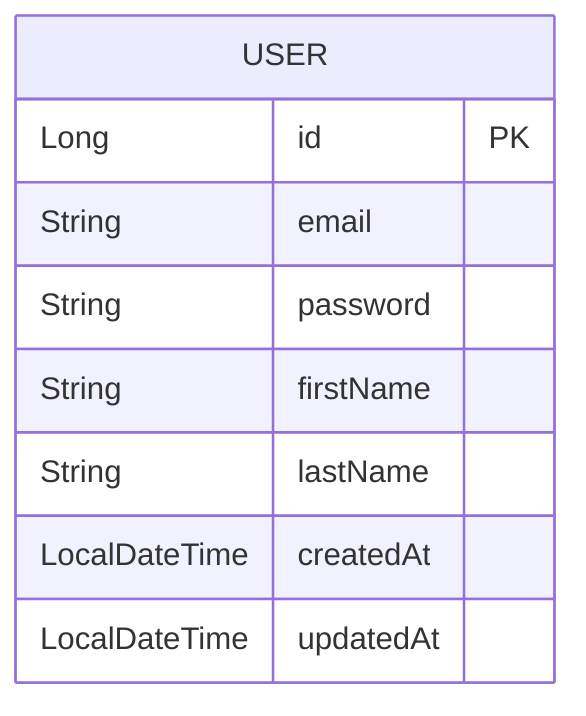
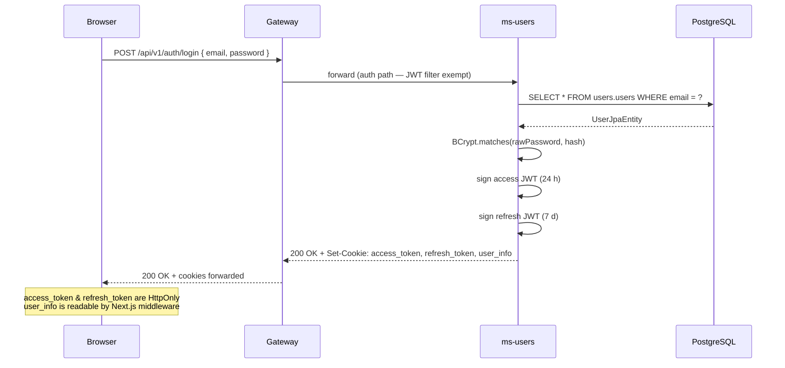
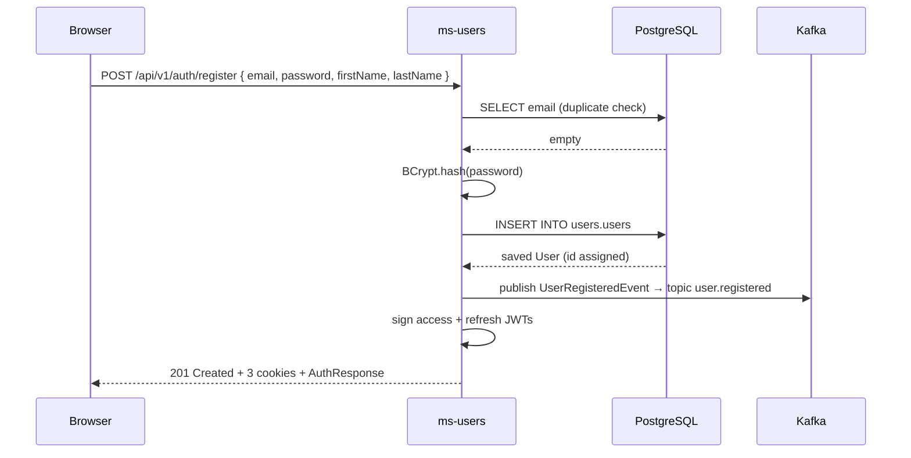
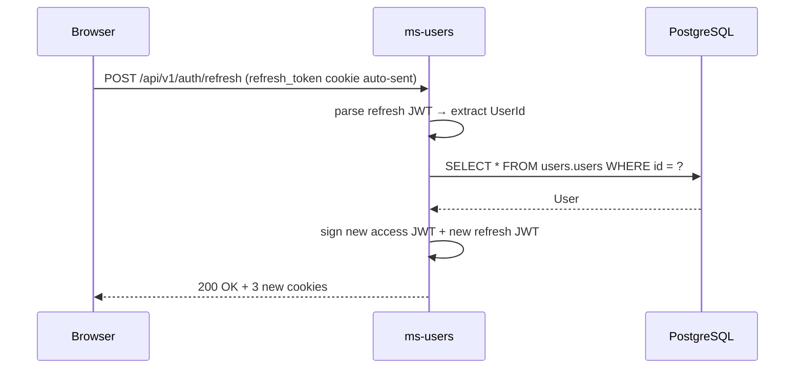

# ms-users — Auth & Users Service

**Port:** 8081  
**DB schema:** `users`  
**Framework:** Spring MVC + Spring Security (stateless)  
**Kafka:** publishes `user.registered` on successful registration

---

## Summary

`ms-users` is the sole authentication authority for the platform. It handles user registration, login, session refresh, and logout. All tokens live in HttpOnly cookies — the JavaScript layer never touches them directly. CSRF protection is enforced via `CookieCsrfTokenRepository`; auth endpoints are exempt. Downstream services receive the authenticated user's identity through the `X-User-Id` header injected by the gateway's `JwtAuthFilter`.

---

## Folder Tree

```
back/ms-users/src/main/java/com/financialapp/users/
├── UsersApplication.java
├── application/
│   ├── AuthenticateUserUseCaseImp.java
│   ├── RegisterUserUseCaseImpl.java
│   └── RefreshSessionUseCaseImpl.java
├── domain/
│   ├── event/
│   │   ├── DomainEvent.java
│   │   ├── DomainEventPublisher.java
│   │   └── UserRegisteredEvent.java
│   ├── exception/
│   │   ├── DuplicateEmailException.java
│   │   ├── InvalidCredentialsException.java
│   │   └── UserNotFoundException.java
│   ├── gateway/
│   │   ├── AuthenticationProviderGateway.java
│   │   └── PasswordHashGateway.java
│   ├── model/
│   │   ├── Session.java
│   │   ├── User.java
│   │   └── valueObject/
│   │       └── UserId.java
│   ├── repository/
│   │   └── UserRepository.java
│   └── usecase/
│       ├── AuthenticateUserUseCase.java
│       ├── RefreshSessionUseCase.java
│       ├── RegisterUserUseCase.java
│       └── command/
│           ├── AuthenticateUserCommand.java
│           ├── RefreshSessionCommand.java
│           └── RegisterUserCommand.java
├── infrastructure/
│   ├── config/
│   │   ├── CsrfCookieFilter.java
│   │   ├── InternalAuthFilter.java
│   │   ├── JwtProperties.java
│   │   ├── KafkaConfig.java
│   │   └── SecurityConfig.java
│   ├── gateway/
│   │   ├── AuthenticationProviderGatewayImpl.java
│   │   └── PasswordHashGatewayImpl.java
│   ├── messaging/
│   │   ├── DomainEventPublisherImpl.java
│   │   ├── TransactionalKafkaEvent.java
│   │   ├── TransactionalKafkaListener.java
│   │   └── payload/
│   │       └── UserRegisteredPayload.java
│   └── persistence/
│       ├── entity/
│       │   └── UserJpaEntity.java
│       ├── jpa/
│       │   └── UserJpaRepository.java
│       ├── mapper/
│       │   └── UserPersistenceMapper.java
│       └── repository/
│           └── UserRepositoryImpl.java
└── web/
    ├── CookieService.java
    ├── controller/
    │   └── AuthController.java
    ├── dto/
    │   ├── request/
    │   │   ├── LoginRequest.java
    │   │   └── RegisterRequest.java
    │   └── response/
    │       ├── ApiResponse.java
    │       └── AuthResponse.java
    └── error/
        └── GlobalExceptionHandler.java
```

---

## Endpoints

All routes under `/api/v1/auth`. The gateway's `JwtAuthFilter` marks this path prefix as exempt from JWT validation.

| Method | Path | Request body | Success response | HTTP status |
|--------|------|-------------|-----------------|------------|
| `POST` | `/api/v1/auth/register` | `{ email, password (≥8), firstName, lastName }` | `ApiResponse<AuthResponse>` + 3 cookies set | `201 Created` |
| `POST` | `/api/v1/auth/login` | `{ email, password }` | `ApiResponse<AuthResponse>` + 3 cookies set | `200 OK` |
| `POST` | `/api/v1/auth/refresh` | — (reads `refresh_token` cookie) | `ApiResponse<AuthResponse>` + 3 cookies refreshed | `200 OK` |
| `POST` | `/api/v1/auth/logout` | — | `ApiResponse<Void>` + 3 cookies zeroed (maxAge=0) | `200 OK` |

`AuthResponse` fields: `userId`, `email`, `firstName`, `lastName`.

### Error responses

| Scenario | HTTP status |
|----------|------------|
| Email already exists | `409 Conflict` |
| Wrong email or password | `401 Unauthorized` |
| Invalid / expired JWT | `401 Unauthorized` |
| Missing `refresh_token` cookie | `401 Unauthorized` |
| User not found during refresh | `404 Not Found` |
| Bean validation failure | `400 Bad Request` |

---

## JWT

| Property | Value |
|----------|-------|
| Algorithm | HMAC-SHA (key via `Keys.hmacShaKeyFor`) |
| Key source | `jwt.secret` env var — raw UTF-8 bytes |
| Access token TTL | `jwt.expiration` ms (default **86 400 000 ms = 24 h**) |
| Refresh token TTL | `jwt.refresh-expiration` ms (default **604 800 000 ms = 7 d**) |
| Access token claims | `sub` (userId), `email`, `firstName`, `iat`, `exp` |
| Refresh token claims | `sub` (userId), `type: "refresh"`, `iat`, `exp` |
| Library | `io.jsonwebtoken` (JJWT) |

`JwtProperties` is a `@ConfigurationProperties(prefix = "jwt")` bean. `AuthenticationProviderGatewayImpl` builds the `SecretKey` once at construction time.

---

## Cookies

All cookies use `SameSite=Lax`. `Secure` is driven by the `app.cookie.secure` property (false in local dev, true in production).

| Cookie | HttpOnly | Path | Max-Age | Value |
|--------|----------|------|---------|-------|
| `access_token` | Yes | `/api` | 24 h | Signed JWT (access) |
| `refresh_token` | Yes | `/api/v1/auth/refresh` | 7 d | Signed JWT (refresh) |
| `user_info` | **No** | `/` | 24 h | `id\|email\|firstName+lastName` URL-encoded |
| `XSRF-TOKEN` | **No** | `/` | session | CSRF token set by Spring Security |

`user_info` is the only cookie readable by JavaScript; the Next.js middleware uses it to gate dashboard routes without an extra network call.

On logout all three application cookies are reissued with `maxAge=0`, effectively deleting them.

---

## CSRF

Spring Security 6 defers CSRF token materialisation until the token is first read. `CsrfCookieFilter` (inserted after `BasicAuthenticationFilter`) forces `csrfToken.getToken()` on every request so the `XSRF-TOKEN` cookie is always written to the response.

Flow:

1. Spring sets `XSRF-TOKEN` cookie (readable by JS, `HttpOnly=false`).
2. Frontend reads the cookie and sends its value as the `X-XSRF-TOKEN` request header on every `POST`/`PUT`/`DELETE`.
3. Spring validates header vs stored token.
4. All `/api/v1/auth/**` paths are exempt via `csrf.ignoringRequestMatchers`.

---

## Password hashing

`BCryptPasswordEncoder` is the `PasswordEncoder` bean (default strength 10). `PasswordHashGatewayImpl` delegates to it. Passwords are hashed at registration time; plain-text passwords never persist.

---

## Internal auth

`InternalAuthFilter` requires an `X-Internal-Token` header on all non-public paths (actuator, swagger, and api-docs are excluded). This prevents direct HTTP calls to ms-users from bypassing the gateway.

---

## Domain model

### User entity



DB table: `users.users`. `email` has a `UNIQUE` constraint. All timestamp columns are `TIMESTAMPTZ DEFAULT now()`.

### Session value object

`Session` is a transient record (never persisted) returned by every use case and consumed by `AuthController` to build the cookie headers:

```
Session
  user               : User
  accessAuthentication  : String   (access JWT)
  refreshAuthentication : String   (refresh JWT)
```

---

## Login sequence



---

## Registration sequence



---

## Refresh sequence



---

## Flyway migrations

| Version | File | Description |
|---------|------|-------------|
| V1 | `V1__init.sql` | Creates `users.users` table with BIGSERIAL PK, UNIQUE email, bcrypt password, names, timestamps |

---

[Master](../00-master.md) | [Architecture](../architecture.md) | [Rules](../rules.md) | [Workflow](../workflow.md)
